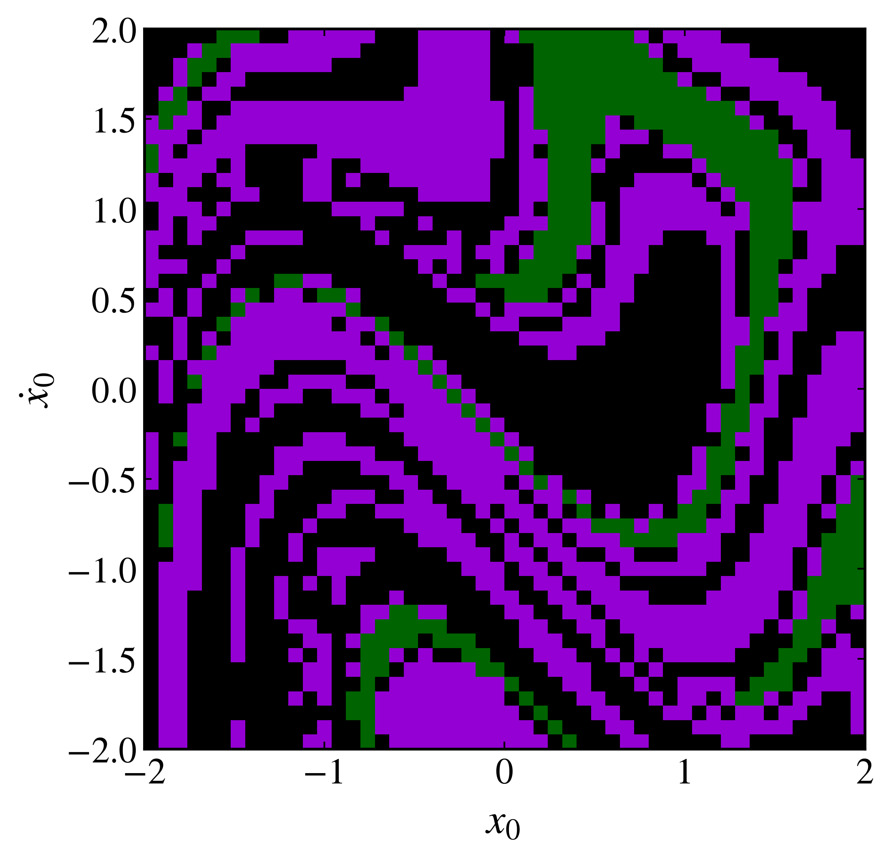

Basins of attraction
--------------------

When a dissipative system has more than one attractor, its basin of attraction is the set of initial states that approach a particular attractor. Basin diagrams reveal how these sets partition the initial-condition space and how sensitive the final state can be to the starting point.

The :py:meth:`basin_of_attraction <pynamicalsys.core.continuous_dynamical_systems.ContinuousDynamicalSystem.basin_of_attraction>` method evolves an ensemble of initial states, constructs a reduced map for every trajectory, computes the centroid of each reduced trajectory, and clusters those centroids. Equal integer labels identify initial states assigned to the same attractor.

Current implementation and memory use
~~~~~~~~~~~~~~~~~~~~~~~~~~~~~~~~~~~~~

The current implementation uses `DBSCAN from scikit-learn <https://scikit-learn.org/stable/modules/generated/sklearn.cluster.DBSCAN.html>`_ as its cluster finder. ``eps`` sets the maximum neighborhood distance used by DBSCAN, while ``min_samples`` sets the number of nearby samples required to form a core point. A label of ``-1`` denotes a centroid classified as noise.

.. warning::

    Large basin grids can require substantial memory. The reduced trajectories are stored for every initial condition before their centroids are clustered, and scikit-learn's DBSCAN implementation can have worst-case :math:`O(n^2)` memory complexity when ``eps`` is large and ``min_samples`` is small. Begin with a modest grid and increase its resolution carefully.

This method is planned for an update that reduces its memory requirements and improves its suitability for high-resolution basins. Contributions toward that implementation are welcome through the :doc:`contributing` guide. Basin calculations are also planned for discrete dynamical systems.

A basin diagram for the Duffing oscillator
~~~~~~~~~~~~~~~~~~~~~~~~~~~~~~~~~~~~~~~~~~~

Consider the periodically forced Duffing oscillator

.. math::

    \ddot{x}+\delta\dot{x}-\alpha x+\beta x^3=\gamma\cos(\omega t).

The parameters :math:`\delta=0.2`, :math:`\alpha=\beta=1`, :math:`\gamma=3`, and :math:`\omega=1.1` produce the three coexisting periodic attractors and basin structure reported by Rolim Sales et al. First construct the same :math:`500\times500` grid of initial states over :math:`(x,\dot{x})\in[-5,5]\times[-5,5]` used for Fig. 19(a) of that work:

.. code-block:: python

    import numpy as np
    import matplotlib.pyplot as plt
    from matplotlib.colors import BoundaryNorm, ListedColormap
    from pynamicalsys import ContinuousDynamicalSystem as cds, PlotStyler

    system = cds(model="duffing")
    delta, alpha, beta, gamma, omega = 0.2, 1.0, 1.0, 3.0, 1.1
    system.set_parameters([delta, alpha, beta, gamma, omega])
    system.integrator("rk4", time_step=0.01)

    num_grid_points = 500
    x = np.linspace(-5.0, 5.0, num_grid_points)
    x_dot = np.linspace(-5.0, 5.0, num_grid_points)
    x_grid, x_dot_grid = np.meshgrid(x, x_dot)
    initial_conditions = np.column_stack(
        [x_grid.ravel(), x_dot_grid.ravel()]
    )

The current method supports a stroboscopic map with ``map_type="SM"`` or a Poincaré section with ``map_type="PS"``. The map names are uppercase. For this periodically forced system, classify the trajectories using a stroboscopic map sampled once per forcing period:

.. code-block:: python

    forcing_period = 2.0 * np.pi / omega
    transient_time = 100.0 * forcing_period
    basin_labels = system.basin_of_attraction(
        initial_conditions,
        num_intersections=100,
        transient_time=transient_time,
        map_type="SM",
        sampling_time=forcing_period,
        eps=0.05,
        min_samples=1,
    )

The method returns one label for each row of ``initial_conditions``. The labels are cluster identifiers rather than fixed physical names, so their numerical values and colors should not be interpreted across independent calculations.

Plotting the basins
~~~~~~~~~~~~~~~~~~~

Create a discrete colormap and assign one color to each basin:

.. code-block:: python

    cmap = ListedColormap(["black", "darkviolet", "darkgreen"])
    norm = BoundaryNorm(np.arange(-0.5, cmap.N + 0.5), cmap.N)
    basin = basin_labels.reshape(x_grid.shape)

    ps = PlotStyler()
    ps.apply_style()
    fig, ax = plt.subplots(figsize=(7, 6))
    ax.imshow(
        basin,
        origin="lower",
        extent=[x.min(), x.max(), x_dot.min(), x_dot.max()],
        interpolation="nearest",
        aspect="equal",
        cmap=cmap,
        norm=norm,
    )

    ax.set_xlabel("$x_0$")
    ax.set_ylabel(r"$\dot{x}_0$")
    fig.tight_layout()
    plt.show()

    Basins of attraction in the Duffing oscillator, with each color identifying the initial conditions that converge to the same fixed point of the stroboscopic map.

Using a Poincaré section
~~~~~~~~~~~~~~~~~~~~~~~~

For an autonomous flow, set ``map_type="PS"`` and provide ``section_index``, ``section_value``, and ``crossing`` instead of ``sampling_time``. The section coordinate must exist in the selected system, and the ensemble must contain one complete state vector per initial condition. As with the stroboscopic calculation, inspect the resulting clusters and test the sensitivity to ``eps``, ``min_samples``, transient duration, and the number of recorded intersections before interpreting a basin boundary.

References
~~~~~~~~~~

- M. Rolim Sales et al., `pynamicalsys: A Python toolkit for the analysis of dynamical systems <https://doi.org/10.1016/j.chaos.2025.117269>`_, Chaos, Solitons and Fractals 201, 117269 (2025).
