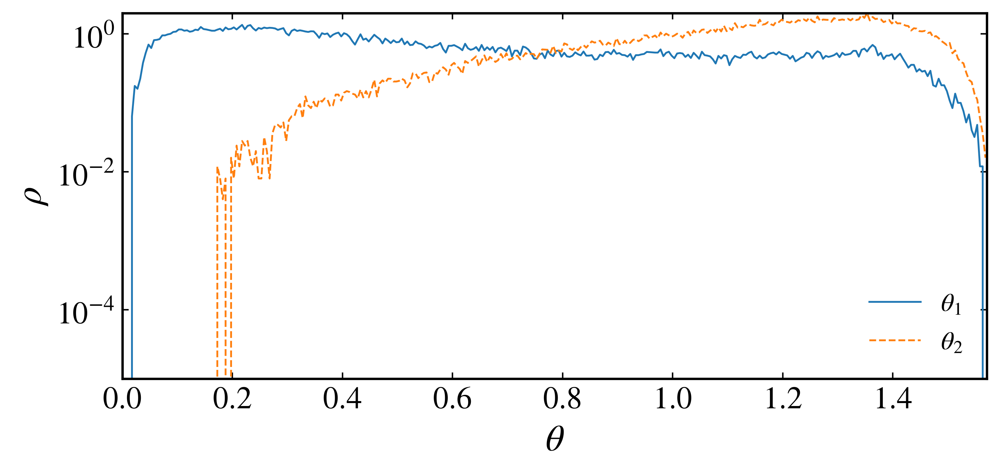
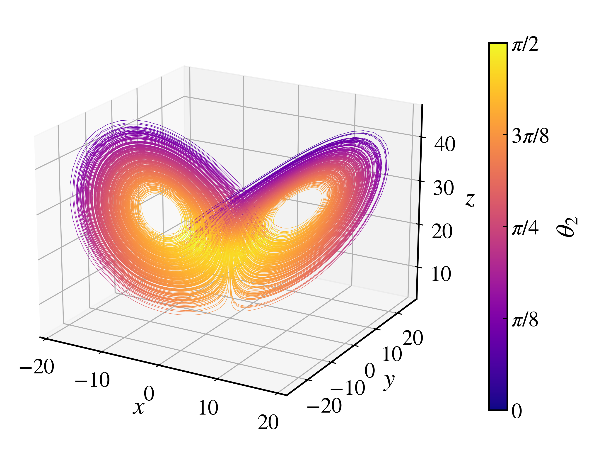

Covariant Lyapunov vectors
--------------------------

Lyapunov exponents quantify average rates of expansion and contraction, while covariant Lyapunov vectors identify the intrinsic local tangent directions associated with those rates. Unlike the orthonormal vectors generated during a QR calculation, covariant Lyapunov vectors are generally not orthogonal and transform covariantly with the tangent dynamics.

If :math:`\mathbf{M}(t_2,t_1)` is the tangent propagator from :math:`t_1` to :math:`t_2`, the :math:`i`-th covariant Lyapunov vector satisfies

.. math::

    \mathbf{M}(t_2,t_1)\mathbf{v}_i(t_1)=\alpha_i(t_2,t_1)\mathbf{v}_i(t_2),

where :math:`\alpha_i` is a scalar expansion or contraction factor. The vectors are ordered by their associated Lyapunov exponents, from :math:`\lambda_1` to the smallest exponent.

The :py:meth:`CLV <pynamicalsys.core.continuous_dynamical_systems.ContinuousDynamicalSystem.CLV>` method uses a Ginelli-style algorithm with a forward QR stage and a backward recursion. The calculation requires the system Jacobian.

Computing the CLVs of the Lorenz system
~~~~~~~~~~~~~~~~~~~~~~~~~~~~~~~~~~~~~~~~

Use the classical Lorenz parameters and sample the tangent dynamics every :math:`0.01` time units:

.. code-block:: python

    import numpy as np
    import matplotlib.pyplot as plt
    from matplotlib.colors import Normalize
    from mpl_toolkits.mplot3d.art3d import Line3DCollection
    from pynamicalsys import ContinuousDynamicalSystem as cds, PlotStyler

    system = cds(model="lorenz system")
    system.set_parameters([10.0, 28.0, 8.0 / 3.0])
    dt = 0.01
    system.integrator("rk4", time_step=dt)

    initial_state = [1.0, 1.0, 1.0]
    transient_time = 500.0
    total_time = 1_000.0
    tail_time = 100.0
    qr_time_step = dt

Calculate all three CLVs and the corresponding sampled trajectory:

.. code-block:: python

    clvs, clv_trajectory = system.CLV(
        initial_state,
        total_time,
        num_clvs=3,
        transient_time=transient_time,
        tail_time=tail_time,
        qr_time_step=qr_time_step,
    )

The array ``clvs`` has shape ``(num_samples, system_dimension, num_clvs)``. The vector ``clvs[n, :, i]`` is the :math:`i`-th CLV at sample :math:`n`. The matching row of ``clv_trajectory`` contains ``[time, x, y, z]``.

The time arguments control different parts of the two-pass algorithm. ``transient_time`` moves the state onto the invariant set before CLV sampling begins. ``warmup_time`` optionally advances the forward tangent basis before the stored QR stage. ``tail_time`` continues the forward stage beyond the stored interval and improves the initialization of the backward recursion. The vectors near the beginning and end of the stored interval should be checked by varying the warmup and tail durations.

Angles between CLV subspaces
~~~~~~~~~~~~~~~~~~~~~~~~~~~~

Angles between covariant directions can reveal near-tangencies in the tangent-space splitting. The :py:meth:`CLV_angles <pynamicalsys.core.continuous_dynamical_systems.ContinuousDynamicalSystem.CLV_angles>` method accepts ``subspaces`` for minimum principal angles between CLV subspaces and ``pairs`` for direct angles between individual CLVs. The following example reproduces the Lorenz-system analysis of `Kuptsov and Kuznetsov (2018) <https://doi.org/10.1134/S1560354718070079>`_.

For subspaces with orthonormal bases :math:`\mathbf{Q}_A` and :math:`\mathbf{Q}_B`, the minimum principal angle is

.. math::

    \theta_{A,B}(t)=\arccos\left[\sigma_{\max}\left(\mathbf{Q}_A^T\mathbf{Q}_B\right)\right].

For the Lorenz flow, request the angle :math:`\theta_1` between the unstable direction and the neutral-stable subspace and the angle :math:`\theta_2` between the unstable-neutral subspace and the stable direction:

.. math::

    \theta_1=\angle\left(\operatorname{span}(\mathbf{v}_1),\operatorname{span}(\mathbf{v}_2,\mathbf{v}_3)\right),

.. math::

    \theta_2=\angle\left(\operatorname{span}(\mathbf{v}_1,\mathbf{v}_2),\operatorname{span}(\mathbf{v}_3)\right).

.. code-block:: python

    subspaces = (
        ((0,), (1, 2)),
        ((0, 1), (2,)),
    )

    angles, angle_trajectory = system.CLV_angles(
        initial_state,
        total_time,
        subspaces=subspaces,
        transient_time=transient_time,
        tail_time=tail_time,
        qr_time_step=qr_time_step,
    )

CLV indices start at zero. The two output columns contain :math:`\theta_1` and :math:`\theta_2`, respectively. Vector orientation is ignored, so the returned values lie between zero and :math:`\pi/2`. The paper verified that the distributions were insensitive to the integration step by comparing :math:`\Delta t=0.01`, :math:`0.001`, and :math:`0.0001`. This example uses the :math:`\Delta t=0.01` calculation, with the QR factorization and angle sampling performed at each integration step.

Angle distributions
~~~~~~~~~~~~~~~~~~~

Reproduce Fig. 1 of Kuptsov and Kuznetsov by plotting the distributions on a logarithmic vertical scale:

.. code-block:: python

    bins = np.linspace(0.0, np.pi / 2, 315)
    angle_labels = [r"$\theta_1$", r"$\theta_2$"]
    linestyles = ["-", "--"]

    ps = PlotStyler()
    ps.apply_style()
    fig, ax = plt.subplots(figsize=(8, 4))
    for index, label in enumerate(angle_labels):
        density, edges = np.histogram(
            angles[:, index],
            bins=bins,
            density=True,
        )
        centers = 0.5 * (edges[:-1] + edges[1:])
        ax.semilogy(
            centers,
            density,
            linestyle=linestyles[index],
            label=label,
        )

    ax.set_xlim(0.0, np.pi / 2)
    ax.set_ylim(1e-5, 2.0)
    ax.set_xlabel(r"$\theta$")
    ax.set_ylabel(r"$\rho$")
    ax.legend(frameon=False)
    fig.tight_layout()
    plt.savefig(
        f"{path_figures}/continuous_lorenz_clv_angle_distribution.png",
        dpi=400,
        bbox_inches="tight",
    )

    Distributions of :math:`\theta_1` and :math:`\theta_2` for the Lorenz system, corresponding to Fig. 1 of Kuptsov and Kuznetsov (2018).

The distribution of :math:`\theta_2` remains separated from zero, which shows that the two-dimensional volume-expanding subspace and the one-dimensional contracting subspace do not become tangent. This nonvanishing angle is the main numerical signature of the pseudohyperbolicity of the Lorenz attractor. The distribution of :math:`\theta_1` approaches zero because the expanding direction is not uniformly separated from the neutral-stable subspace, so the attractor is not uniformly hyperbolic.

Angles along the attractor
~~~~~~~~~~~~~~~~~~~~~~~~~~

Reproduce Fig. 2 of the paper by coloring the continuous three-dimensional Lorenz trajectory with :math:`\theta_2`:

.. code-block:: python

    points = angle_trajectory[:, 1:]
    segments = np.stack([points[:-1], points[1:]], axis=1)
    theta_2 = 0.5 * (angles[:-1, 1] + angles[1:, 1])
    norm = Normalize(vmin=0.0, vmax=np.pi / 2)

    ps = PlotStyler()
    ps.apply_style()
    fig, ax = plt.subplots(
        figsize=(7, 6),
        subplot_kw={"projection": "3d"},
    )
    trajectory_lines = Line3DCollection(
        segments,
        array=theta_2,
        cmap="plasma",
        norm=norm,
        linewidth=0.3,
    )
    ax.add_collection3d(trajectory_lines)
    ax.auto_scale_xyz(points[:, 0], points[:, 1], points[:, 2])
    ax.set_xlabel("$x$")
    ax.set_ylabel("$y$")
    ax.set_zlabel("$z$")
    ax.view_init(elev=20, azim=-60)
    colorbar = fig.colorbar(
        trajectory_lines,
        ax=ax,
        shrink=0.75,
        pad=0.08,
        ticks=np.arange(0.0, np.pi / 2 + np.pi / 8, np.pi / 8),
    )
    colorbar.set_label(r"$\theta_2$")
    colorbar.set_ticklabels(
        ["$0$", r"$\pi/8$", r"$\pi/4$", r"$3\pi/8$", r"$\pi/2$"],
    )
    fig.tight_layout()
    plt.savefig(
        f"{path_figures}/continuous_lorenz_clv_angles.png",
        dpi=400,
        bbox_inches="tight",
    )

    Continuous Lorenz trajectory colored by :math:`\theta_2`, corresponding to Fig. 2 of Kuptsov and Kuznetsov (2018).

The smallest values of :math:`\theta_2` occur along the outer edges of the two lobes, while larger angles appear in their inner regions. A finite trajectory cannot establish the absence of tangencies by itself, so the minimum angles and their distributions should be checked over longer intervals and against changes in the integration, sampling, and convergence parameters.

References
~~~~~~~~~~

.. container:: references-list

    - F\. Ginelli, P\. Poggi, A\. Turchi, H\. Chaté, R\. Livi, and A\. Politi, `Characterizing dynamics with covariant Lyapunov vectors <https://doi.org/10.1103/PhysRevLett.99.130601>`_, Physical Review Letters 99, 130601 (2007).
    - C\. L\. Wolfe and R\. M\. Samelson, `An efficient method for recovering Lyapunov vectors from singular vectors <https://doi.org/10.1111/j.1600-0870.2007.00234.x>`_, Tellus A 59, 355-366 (2007).
    - P\. V\. Kuptsov and U\. Parlitz, `Theory and computation of covariant Lyapunov vectors <https://doi.org/10.1007/s00332-012-9126-5>`_, Journal of Nonlinear Science 22, 727-762 (2012).
    - P\. V\. Kuptsov and S\. P\. Kuznetsov, `Lyapunov analysis of strange pseudohyperbolic attractors: angles between tangent subspaces, local volume expansion and contraction <https://doi.org/10.1134/S1560354718070079>`_, Regular and Chaotic Dynamics 23, 908-932 (2018).
