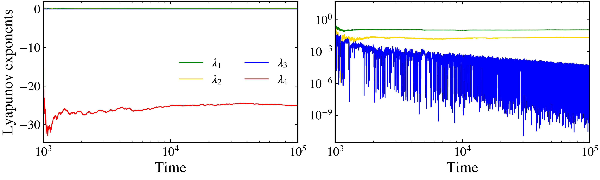
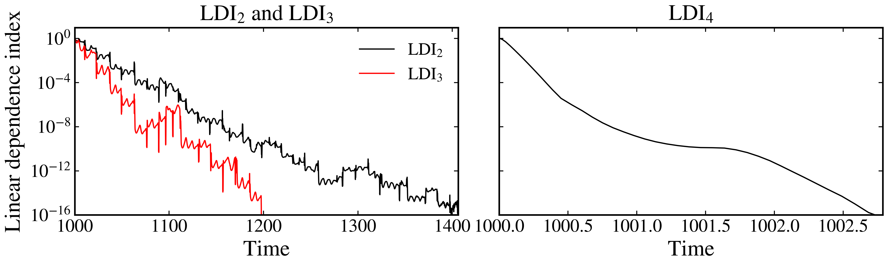

Linear dependence index
~~~~~~~~~~~~~~~~~~~~~~~

The linear dependence index (LDI) is a measure of the linear dependence of a set of vectors. It is defined as the product of the singular values of the matrix whose columns are the vectors in the set. The LDI provides a quantitative measure of whether a set of vectors is linearly independent or dependent.
 
Given a matrix :math:`A \in \mathbb{R}^{d \times k}`, where :math:`d` is the dimension of the vectors and :math:`k` is the number of vectors, we compute the singular value decomposition (SVD) of the matrix:

.. math::

    A = U \Sigma V^T

where :math:`U` is a :math:`d \times d` orthogonal matrix, :math:`\Sigma` is a :math:`d \times k` diagonal matrix with non-negative entries (the singular values, :math:`\sigma_i = \Sigma_{ii}`), and :math:`V` is a :math:`k \times k` orthogonal matrix. The linear dependence index is then defined as:

.. math::

    \text{LDI}_k = \prod_{i=1}^{\min(d, k)} \sigma_i

In our case, the matrix :math:`A` is the matrix whose columns are :math:`k` deviation vectors that evolve according to the linearized dynamics:

.. math::

   \frac{dA(t)}{dt} = J(\mathbf{x}(t), t)A(t).

To avoid the numerical instability that arises from the exponential divergence of the deviation vectors for chaotic trajectories, we normalize the columns of :math:`A` at each time step before computing its SVD.

To illustrate the calculation of the LDI, we are going to consider a 4-dimensional version of the Rössler system, given by:

.. math::
    
    \begin{align*}
        \dot{x} &= - y - z,\\
        \dot{y} &= x + ay + w, \\
        \dot{z} &= b + xz, \\
        \dot{w} &= -cz + dw,
    \end{align*}

with parameters :math:`a = 0.25`, :math:`b = 3.0`, :math:`c = 0.5`, and :math:`d = 0.05`. This set of parameters yield a hyperchaotic solution, i.e., a trajectory with more than one positive Lyapunov exponent. Let's visualize that:

.. code-block:: python

    from pynamicalsys import ContinuousDynamicalSystem as cds
    from pynamicalsys import PlotStyler

    ds = cds(model="4d rossler system")
    ds.integrator("rk45", atol=1e-15, rtol=1e-15)

    # Parameters of the system
    a, b, c, d = 0.25, 3.0, 0.5, 0.05
    parameters = [a, b, c, d]

    # Initial condition
    u = [-20, 0, 0, 15]

    # Total and transient times
    total_time = 100000
    transient_time = 1000

    # Calculate the Lyapunov exponents
    lyapunov_exponents = ds.lyapunov(
        u,
        total_time,
        parameters=parameters,
        transient_time=transient_time,
        return_history=True)
    
    # Set the plot style
    ps = PlotStyler(fontsize=18)
    ps.apply_style()

    # Create the figure and axes
    fig, ax = plt.subplots(1, 2, sharex=True, figsize=(10, 3))
    ps.set_tick_padding(ax[0], pad_x=6)
    ps.set_tick_padding(ax[1], pad_x=6)
    
    # Plot each Lyapunov exponent with a different color
    colors = ["green", "gold", "blue", "red"]
    for i in range(4):
        ax[0].plot(
            lyapunov_exponents[:, 0],
            lyapunov_exponents[:, i + 1],
            color=colors[i],
            label=rf"$\lambda_{i + 1}$")

    # Plot the first three in log scale to enphasize that :math:`\lambda_{1,2} > 0`
    # and that :math:`\lambda_3 \rightarrow 0`
    for i in range(3):
        ax[1].plot(
            lyapunov_exponents[:, 0],
            abs(lyapunov_exponents[:, i + 1]),
            color=colors[i],
            label=rf"$\lambda_{i + 1}$")

    # Set the legend, labels, and limits
    ax[0].legend(loc="center right", frameon=False, ncol=2)
    ax[0].set_ylabel("Lyapunov exponents")
    ax[0].set_xlabel("Time")
    ax[1].set_xlabel("Time")
    ax[0].set_xlim(transient_time, total_time)
    ax[1].set_yscale("log")
    ax[1].set_xscale("log")

    plt.show()

   The Lyapunov exponents for the 4D Rössler system.

Let's then compute the LDI's using 2, 3, and 4 deviation vectors for the 4-dimensional Rössler system. The LDI is computed using :py:meth:`LDI <pynamicalsys.core.continuous_dynamical_systems.ContinuousDynamicalSystem.LDI>` method from the :py:class:`ContinuousDynamicalSystem <pynamicalsys.core.continuous_dynamical_systems.ContinuousDynamicalSystem>` class:

.. code-block:: python

    from pynamicalsys import ContinuousDynamicalSystem as cds
   
    ds = cds(model="4d rossler system")
    ds.integrator("rk45", atol=1e-15, rtol=1e-15)

    # Parameters of the system
    a, b, c, d = 0.25, 3.0, 0.5, 0.05
    parameters = [a, b, c, d]

    # Initial condition
    u = [-20, 0, 0, 15]

    # Total and transient times
    total_time = 2000
    transient_time = 1000

    # Calculate the LDI's
    ldi = []
    for k in (2, 3, 4):
        ldi.append(ds.LDI(
            u,
            total_time,
            k,
            parameters=parameters,
            transient_time=transient_time,
            return_history=True))

The :py:meth:`LDI <pynamicalsys.core.continuous_dynamical_systems.ContinuousDynamicalSystem.LDI>` method returns a 2D array of shape (samples, 2), where the columns are the times samples where the LDI was calculated and the LDI value itself. We can visualize the behavior of each LDI by plotting it in a log-lin plot:

.. code-block:: python
    
    from pynamicalsys import PlotStyler
    import matplotlib.pyplot as plt

    # Set the style
    ps = PlotStyler(fontsize=18)
    ps.apply_style()

    # Create the figure and axes
    fig, ax = plt.subplots(1, 2, sharey=True, figsize=(10, 3))

    # Plot LDI_2 and LDI_3 in the same plot
    ax[0].plot(ldi[0][:, 0], ldi[0][:, 1], color="k", label="LDI$_2$")
    ax[0].plot(ldi[1][:, 0], ldi[1][:, 1], "r-", label="LDI$_3$")
    
    # Plot LDI_4 in the second plot
    ax[1].plot(ldi[2][:, 0], ldi[2][:, 1], "k-")
    
    # Set the labels, limits, legend and titles
    ax[0].set_yscale("log")
    ax[0].set_ylim(1e-16, 1e1)
    ax[0].set_xlabel("Time")
    ax[0].set_ylabel("Linear dependence index")
    ax[0].set_title("LDI$_2$ and LDI$_3$", fontsize=18)
    ax[0].set_xlim(transient_time, ldi[0][-1, 0])
    ax[0].legend(loc="upper right", frameon=False)
    ax[1].set_xlabel("Time")
    ax[1].set_title("LDI$_4$", fontsize=18)
    ax[1].set_xlim(transient_time, ldi[2][-1, 0])
    
    plt.show()

   The LDI for :math:`k = 2`, :math:`k = 3`, and :math:`k = 4`.
