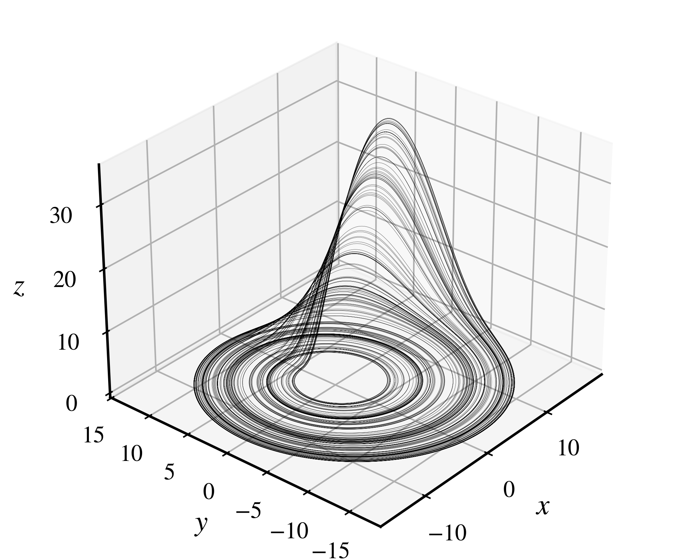
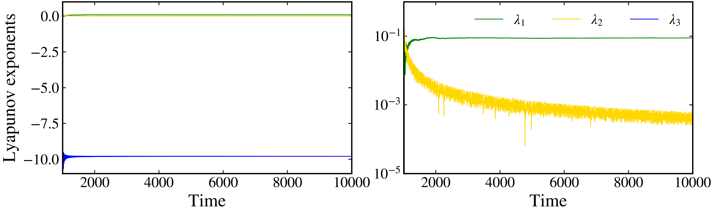

Lyapunov exponents
~~~~~~~~~~~~~~~~~~

For continuous-time dynamical systems, the Lyapunov exponents are computed by integrating simultaneaously the equations of motion and the variational equations. Given a :math:`d`-dimensional continuous-time dynamical system described by the following differential equation :math:`\dot{\mathbf{x}} = \mathbf{f}(\mathbf{x})`, where :math:`\mathbf{x}\in\mathbb{R}^d`, let :math:`\mathbf{J}(\mathbf{x}, t) = \mathbf{Df}(\mathbf{x}, t)` be the Jacobian matrix of the vector field :math:`\mathbf{f}` evaluated at the point :math:`\mathbf{x}` at the instant of time :math:`t`.

Let :math:`\mathbf{v}_0 \equiv \mathbf{v}(0)` be a deviation vector representing a small displacement from the initial condition :math:`\mathbf{x}_0 \equiv \mathbf{x}(0)`. The time evolution of :math:`\mathbf{v}_0` under the linearized dynamics is given by the variational equation

.. math::

    \frac{d\mathbf{v}(t)}{dt} = J(\mathbf{x}(t), t)\mathbf{v}(t).

Let :math:`A(t)\in\mathbb{R}^{d\times d}` be a matrix whose columns are the deviation vectors. We follow the evolution of the deviation vectors along the trajectory and reorthonormalize them using a QR decomposition: :math:`A(t) = Q(t) R(t)`, where :math:`Q(t)` is an orthogonal matrix and :math:`R(t)` is an upper triangular matrix. The Lyapunov exponents are then computed from the averages of the logarithm of the diagonal elements of the matrix :math:`R(t)`, :math:`|r_{ii}(t)|`:

.. math::

   \lambda_i = \lim_{t\rightarrow\infty}\frac{1}{t}\sum_{\tau = 0}^t\log|r_{ii}(\tau)|.

The Lyapunov exponents can be calculated using the :py:meth:`lyapunov <pynamicalsys.core.continuous_dynamical_systems.ContinuousDynamicalSystem.lyapunov>` method from the :py:class:`ContinuousDynamicalSystem <pynamicalsys.core.continuous_dynamical_systems.ContinuousDynamicalSystem>` class.

To illustrate the Lyapunov exponents calculation, let's consider the Rössler system:

.. math::

   \begin{align*}
        \dot{x} &= -y - z,\\
        \dot{y} &= x + ay,\\
        \dot{z} &= b + z(x - c),
   \end{align*}

where :math:`a`, :math:`b`, and :math:`c` are the parameters of the system. Let's first visualize the Rössler attractor:

.. code-block:: python

    from pynamicalsys import ContinuousDynamicalSystem as cds
    from pynamicalsys import PlotStyler
    import matplotlib.pyplot as plt

    ds = cds(model="rossler system")
    ds.integrator("rk45", atol=1e-15, rtol=1e-15)

    # Parameters of the system
    a, b, c = 0.15, 0.20, 10
    parameters = [a, b, c]

    # Initial conditions
    u = [0.1, 0.1, 0.1]

    # Total and transient time
    total_time = 2000
    transient_time = 1000

    # Calculate the trajectory
    trajectory = ds.trajectory(u, total_time, parameters=parameters, transient_time=transient_time)
    
    # Set the plot style
    ps = PlotStyler(fontsize=18, linewidth=0.1)
    ps.apply_style()

    # Create the 3D figure and axis
    fig, ax = plt.subplots(subplot_kw={'projection': '3d'}, figsize=(5, 4))
    
    # Plot the trajectory
    ax.plot(trajectory[:, 1], trajectory[:, 2], trajectory[:, 3], label='Trajectory', color="k")
    
    # Set the labels and view angle
    ax.set_xlabel("$x$")
    ax.set_ylabel("$y$")
    ax.set_zlabel("$z$")
    ax.view_init(elev=30, azim=-140)

    plt.show()

   The Rössler attractor for :math:`a = 0.15`, :math:`b = 0.20`, and :math:`c = 10`.

Now, for the Lyapunov exponents:

.. code-block:: python

    total_time = 10000
    lyapunov_exponents = ds.lyapunov(u, total_time, parameters=parameters, transient_time=transient_time, log_base=2)
    print(lyapunov_exponents)

.. code-block:: text 

    [ 1.27122925e-01  3.05263459e-04 -1.41384990e+01]

It is also possible to return the whole history of all Lyapunov exponents:

.. code-block:: python
    
    # Using return_history=True
    lyapunov_exponents = ds.lyapunov(u, total_time, parameters=parameters, transient_time=transient_time, return_history=True)
    
    # Set the plot style
    ps = PlotStyler(fontsize=18, linewidth=0.75)
    ps.apply_style()

    # Create the figure and axes
    fig, ax = plt.subplots(1, 2, figsize=(10, 3), sharex=True)
    
    # Plot each Lyapunov exponent with a different color
    colors = ["green", "gold", "blue"]
    for i in range(3):
        ax[0].plot(lyapunov_exponents[:, 0], lyapunov_exponents[:, i + 1], color=colors[i])
        ax[1].plot(lyapunov_exponents[:, 0], lyapunov_exponents[:, i + 1], color=colors[i], label=rf"$\lambda_{i + 1}$")
    
    # Set the legend, limits, and labels
    ax[1].legend(frameon=False, ncol=3)
    ax[0].set_ylim(-11, 1)
    ax[1].set_ylim(1e-5, 1e0)
    ax[0].set_xlim(transient_time, total_time)
    ax[1].set_yscale("log")

    ax[0].set_ylabel("Lyapunov exponents")
    ax[0].set_xlabel("Time")
    ax[1].set_xlabel("Time")

    plt.show()

   
   The Lyapunov exponents history for the Rössler system.
