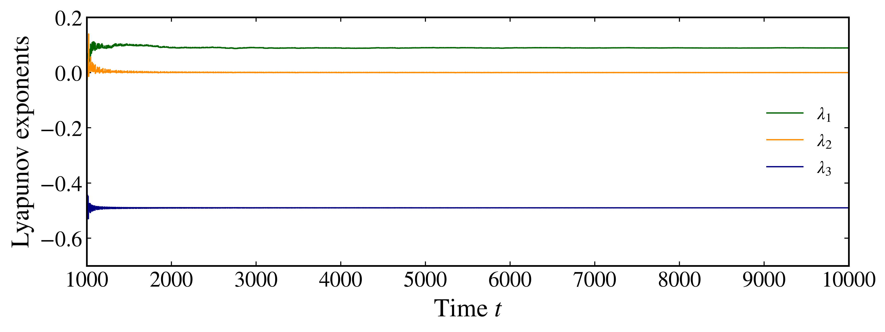

Lyapunov exponents
------------------

Lyapunov exponents quantify the average exponential growth or contraction of infinitesimal perturbations along a trajectory. For a continuous dynamical system :math:`\dot{\mathbf{x}}=\mathbf{f}(t,\mathbf{x})`, a deviation vector :math:`\mathbf{v}` evolves according to the variational equation

.. math::

    \dot{\mathbf{v}}=\mathbf{J}(t,\mathbf{x})\mathbf{v},

where :math:`\mathbf{J}` is the Jacobian of the vector field. A positive largest exponent indicates sensitive dependence on initial conditions, a negative exponent indicates contraction along its associated direction, and an exponent equal to zero corresponds to neutral evolution. A typical chaotic autonomous flow has one positive exponent, one zero exponent along the flow direction, and at least one negative exponent.

The :py:meth:`lyapunov <pynamicalsys.core.continuous_dynamical_systems.ContinuousDynamicalSystem.lyapunov>` method integrates the state and its deviation vectors together. The vectors are repeatedly orthonormalized, and the logarithmic growth factors are accumulated to estimate

.. math::

    \lambda_i=\lim_{t\rightarrow\infty}\frac{1}{t}\sum_j\log\left|R_{ii}^{(j)}\right|,

where :math:`R_{ii}^{(j)}` is a diagonal element of the triangular factor obtained at the :math:`j`-th QR decomposition. This is the standard algorithm introduced for numerical Lyapunov-spectrum calculations by Shimada and Nagashima and by Benettin et al.

The calculation requires the Jacobian. The built-in systems used here already provide one. A custom system must be created with a Jacobian whose signature is ``jacobian(time, state, parameters)``, as described in :doc:`cds_creating_ds`.

The Lyapunov spectrum of the Rössler system
~~~~~~~~~~~~~~~~~~~~~~~~~~~~~~~~~~~~~~~~~~~

Consider the Rössler system

.. math::

    \begin{aligned}
        \dot{x} &= -y-z,\\
        \dot{y} &= x+ay,\\
        \dot{z} &= b+z(x-c).
    \end{aligned}

Use :math:`a=0.15`, :math:`b=0.2`, and :math:`c=10`, which produce a chaotic attractor:

.. code-block:: python

    import numpy as np
    import matplotlib.pyplot as plt
    from pynamicalsys import ContinuousDynamicalSystem as cds, PlotStyler

    system = cds(model="rossler system")
    system.set_parameters([0.15, 0.2, 10.0])
    system.integrator("rk45", atol=1e-12, rtol=1e-10)

    initial_state = [0.1, 0.1, 0.1]
    transient_time = 1_000.0
    total_time = 10_000.0

Request the full three-dimensional spectrum and retain its convergence history:

.. code-block:: python

    lyapunov_history = system.lyapunov(
        initial_state,
        total_time,
        transient_time=transient_time,
        num_exponents=3,
        return_history=True,
    )

With ``return_history=True``, the first column contains time and the remaining columns contain :math:`\lambda_1`, :math:`\lambda_2`, and :math:`\lambda_3`. The averages begin after ``transient_time``. The ``total_time`` argument remains the final integration time, so the exponents in this example are accumulated from :math:`t=1000` to :math:`t=10000`.

The magnitude of :math:`\lambda_3` is much larger than the magnitudes of :math:`\lambda_1` and :math:`\lambda_2`, so plotting the three raw values on one linear axis would compress the two exponents near zero. The ``rescale`` array leaves :math:`\lambda_1` and :math:`\lambda_2` unchanged and multiplies :math:`\lambda_3` by :math:`0.05` only for visualization. This places the convergence of all three curves on a readable scale without modifying ``lyapunov_history`` or the reported numerical values:

.. code-block:: python

    time = lyapunov_history[:, 0]
    exponents = lyapunov_history[:, 1:]
    colors = ["darkgreen", "darkorange", "navy"]

    ps = PlotStyler()
    ps.apply_style()
    fig, ax = plt.subplots(figsize=(10, 4), sharex=True)
    rescale = np.array([1, 1, 0.05])
    for index, color in enumerate(colors):
        ax.plot(
            time,
            rescale[index] * exponents[:, index],
            color=color,
            label=rf"$\lambda_{index + 1}$",
        )

    ax.set_xlabel("Time $t$")
    ax.set_ylabel("Lyapunov exponents")
    ax.set_xlim(transient_time, total_time)
    ax.set_ylim(-0.7, 0.2)
    ax.legend(loc="center right", frameon=False)
    fig.tight_layout()
    plt.show()

    Convergence of the three Lyapunov exponents of the chaotic Rössler system, with :math:`\lambda_3` multiplied by :math:`0.05` in the plot.

Final values and the largest exponent
~~~~~~~~~~~~~~~~~~~~~~~~~~~~~~~~~~~~~

The final row of ``lyapunov_history`` provides the spectrum at the end of the calculation:

.. code-block:: python

    lyapunov_exponents = lyapunov_history[-1, 1:]
    lyapunov_exponents

.. code-block:: text

    array([ 8.93298015e-02, -3.20038186e-05, -9.79973203e+00])

When only the largest exponent is needed, set ``num_exponents=1`` and leave ``return_history=False``. This uses the dedicated single-vector calculation and returns a scalar:

.. code-block:: python

    largest_exponent = system.lyapunov(
        initial_state,
        total_time,
        transient_time=transient_time,
        num_exponents=1,
    )
    largest_exponent

.. code-block:: text

    np.float64(0.09039300684638307)

Set ``num_exponents`` between one and the dimension of the system. If it is omitted, the complete spectrum is calculated. Without a stored history, a request for more than one exponent returns a one-dimensional array.

Numerical options
~~~~~~~~~~~~~~~~~

``method``
    ``"QR"`` uses the package's modified Gram-Schmidt implementation and is the default. ``"QR_HH"`` uses ``numpy.linalg.qr`` with Householder reflections. This option applies when more than one exponent is calculated.

``log_base``
    The default value is :math:`e`, so the exponents are measured using natural logarithms. Set ``log_base=2`` to express the rates in bits per unit time. Changing the base rescales the numerical values but does not change their signs.

``seed``
    The seed initializes the deviation vectors. For a sufficiently converged calculation, the estimated exponents should not depend materially on this initial orientation.

``endpoint``
    The default ``True`` includes the endpoint of the requested interval. Set it to ``False`` when the integration must stop strictly before that endpoint.

Reliable estimates require a sufficiently long accumulation interval and appropriate integrator settings. Compare results obtained with longer integration times, smaller fixed steps, or tighter adaptive tolerances before drawing conclusions from small exponents.

References
~~~~~~~~~~

.. container:: references-list

    - I\. Shimada and T\. Nagashima, `A Numerical Approach to Ergodic Problem of Dissipative Dynamical Systems <https://doi.org/10.1143/PTP.61.1605>`_, Progress of Theoretical Physics 61, 1605-1616 (1979).
    - G\. Benettin, L\. Galgani, A\. Giorgilli, and J\.-M\. Strelcyn, `Lyapunov Characteristic Exponents for Smooth Dynamical Systems and for Hamiltonian Systems, Part 1: Theory <https://doi.org/10.1007/BF02128236>`_, Meccanica 15, 9-20 (1980).
