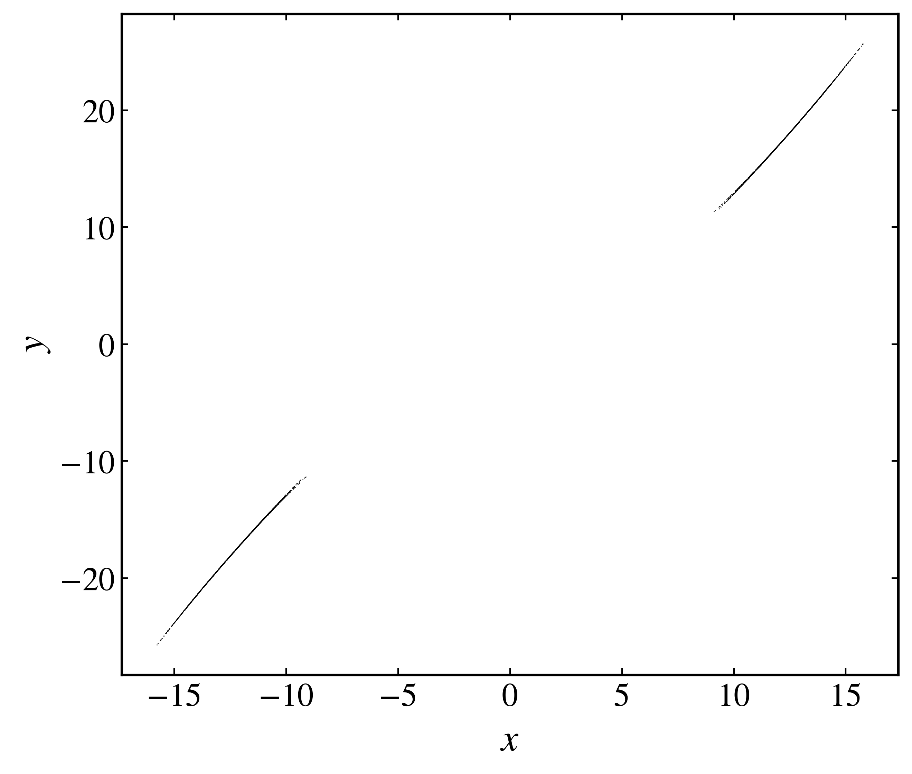
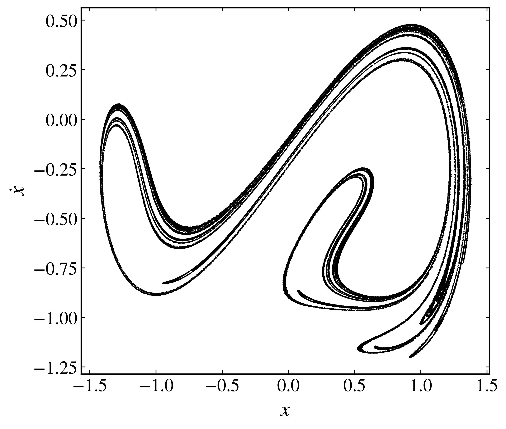
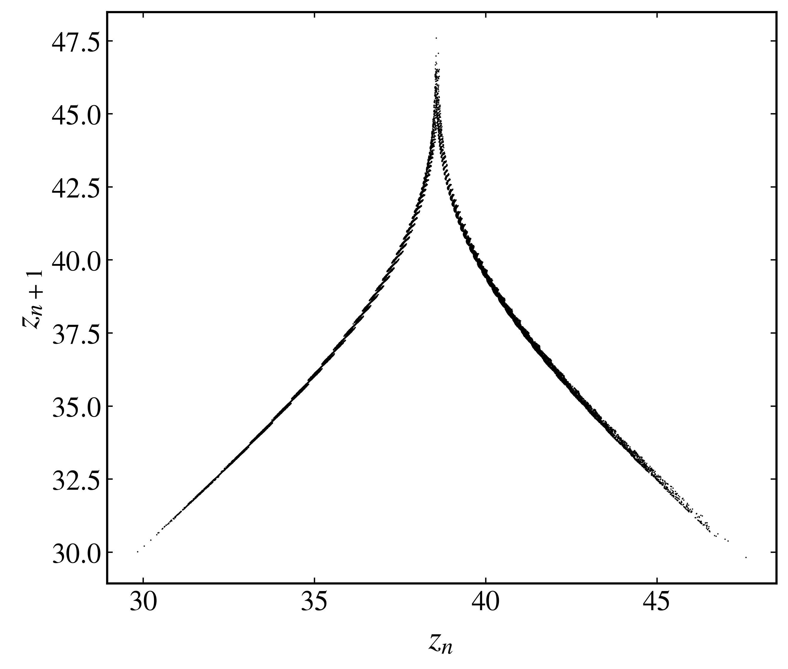

Reduced maps of continuous flows
--------------------------------

A continuous trajectory can contain more information than is needed to reveal its recurrent structure. Poincaré sections, stroboscopic maps, and maxima maps reduce a flow to a sequence of selected states while retaining the timing of every recorded point.

Poincaré sections
~~~~~~~~~~~~~~~~~

A Poincaré section records the intersections of a trajectory with a hypersurface transverse to the flow. This construction reduces a :math:`d`-dimensional continuous system to a map on a :math:`(d-1)`-dimensional section.

Use :py:meth:`poincare_section <pynamicalsys.core.continuous_dynamical_systems.ContinuousDynamicalSystem.poincare_section>` to define the section by a coordinate index and value. For the Lorenz system, choose :math:`z=25` and retain only crossings with :math:`\dot{z}>0`:

.. code-block:: python

    import matplotlib.pyplot as plt
    from pynamicalsys import ContinuousDynamicalSystem as cds, PlotStyler

    system = cds(model="lorenz system")
    system.set_parameters([10.0, 28.0, 8.0 / 3.0])
    system.integrator("rk4", time_step=0.01)

    initial_state = [0.1, 0.1, 0.1]
    poincare = system.poincare_section(
        initial_state,
        num_intersections=5_000,
        section_index=2,
        section_value=25.0,
        transient_time=100.0,
        crossing=1,
    )

State-coordinate indices start at zero, so ``section_index=2`` selects :math:`z`. Set ``crossing=1`` for positive crossings, ``crossing=-1`` for negative crossings, or ``crossing=0`` for both directions. The method locates a crossing between integration steps and linearly interpolates its time and state.

The result has shape ``(num_intersections, system_dimension + 1)``. Its first column contains crossing times and the remaining columns contain the interpolated state. Since :math:`z=25` is fixed on this section, plot the :math:`(x,y)` coordinates:

.. code-block:: python

    ps = PlotStyler(markersize=0.5, markeredgewidth=0)
    ps.apply_style()
    fig, ax = plt.subplots(figsize=(7, 6))
    ax.plot(poincare[:, 1], poincare[:, 2], "ko")
    ax.set_xlabel("$x$")
    ax.set_ylabel("$y$")
    fig.tight_layout()
    plt.show()

    Poincaré section of the Lorenz attractor at :math:`z=25`, retaining crossings with :math:`\dot{z}>0`.

Stroboscopic maps
~~~~~~~~~~~~~~~~~

A stroboscopic map samples a flow at equally spaced times. For a periodically forced system, sampling once per forcing period removes the forcing phase and produces a discrete map that can reveal periodic, quasiperiodic, and chaotic responses.

Consider the forced Duffing oscillator

.. math::

    \ddot{x}+\delta\dot{x}-\alpha x+\beta x^3=\gamma\cos(\omega t).

For a forcing period :math:`T=2\pi/\omega`, use :py:meth:`stroboscopic_map <pynamicalsys.core.continuous_dynamical_systems.ContinuousDynamicalSystem.stroboscopic_map>` with ``sampling_time=T``:

.. code-block:: python

    import numpy as np
    import matplotlib.pyplot as plt
    from pynamicalsys import ContinuousDynamicalSystem as cds, PlotStyler

    system = cds(model="duffing")
    delta, alpha, beta, gamma, omega = 0.2, 1.0, 1.0, 0.425, 1.1
    system.set_parameters([delta, alpha, beta, gamma, omega])
    system.integrator("rk4", time_step=0.01)

    initial_state = [1.0, 0.0]
    forcing_period = 2.0 * np.pi / omega
    stroboscopic = system.stroboscopic_map(
        initial_state,
        num_samples=200_000,
        sampling_time=forcing_period,
        transient_time=500.0,
    )

The ``num_samples`` argument counts the recorded stroboscopic points, while ``transient_time`` remains a duration in the system's time units. Sampling begins one ``sampling_time`` after the transient. When a target time lies between integration steps, the state is linearly interpolated at that time.

Each row contains ``[time, x, x_dot]`` for this two-dimensional first-order representation of the Duffing equation:

.. code-block:: python

    ps = PlotStyler(markersize=0.8, markeredgewidth=0)
    ps.apply_style()
    fig, ax = plt.subplots(figsize=(7, 6))
    ax.plot(stroboscopic[:, 1], stroboscopic[:, 2], "ko")
    ax.set_xlabel("$x$")
    ax.set_ylabel(r"$\dot{x}$")
    fig.tight_layout()
    plt.show()

    Stroboscopic map of the Duffing oscillator sampled once per forcing period after the transient.

Maxima maps
~~~~~~~~~~~

A maxima map records each local maximum of one state variable. Plotting a maximum against the next one produces a return map that exposes the relation between successive oscillations. Lorenz used this construction in his original analysis of deterministic nonperiodic flow.

Use :py:meth:`maxima_map <pynamicalsys.core.continuous_dynamical_systems.ContinuousDynamicalSystem.maxima_map>` to collect maxima of :math:`z` from the Lorenz system:

.. code-block:: python

    import matplotlib.pyplot as plt
    from pynamicalsys import ContinuousDynamicalSystem as cds, PlotStyler

    system = cds(model="lorenz system")
    system.set_parameters([10.0, 28.0, 8.0 / 3.0])
    system.integrator("rk4", time_step=0.01)

    initial_state = [0.1, 0.1, 0.1]
    maxima = system.maxima_map(
        initial_state,
        num_points=20_001,
        maxima_index=2,
        transient_time=100.0,
    )

The method detects discrete local maxima and refines their times by quadratic interpolation. As with the other reduced maps, the first output column contains time. For the Lorenz state ``[x, y, z]``, the maxima of :math:`z` are therefore in column 3.

Use 20,001 maxima to form 20,000 successive pairs :math:`(z_n,z_{n+1})`:

.. code-block:: python

    z_maxima = maxima[:, 3]

    ps = PlotStyler(markersize=0.8, markeredgewidth=0)
    ps.apply_style()
    fig, ax = plt.subplots(figsize=(7, 6))
    ax.plot(z_maxima[:-1], z_maxima[1:], "ko")
    ax.set_xlabel("$z_n$")
    ax.set_ylabel("$z_{n+1}$")
    fig.tight_layout()
    plt.show()

    Return map formed from successive maxima of :math:`z` in the Lorenz system.

All three methods also accept an ensemble of initial states with shape ``(num_initial_conditions, system_dimension)``. The result then has shape ``(num_initial_conditions, num_points, system_dimension + 1)``, where ``num_points`` is the requested number of intersections, samples, or maxima.

References
~~~~~~~~~~

- E. N. Lorenz, `Deterministic Nonperiodic Flow <https://journals.ametsoc.org/view/journals/atsc/20/2/1520-0469_1963_020_0130_dnf_2_0_co_2.xml>`_, Journal of the Atmospheric Sciences 20, 130-141 (1963).
