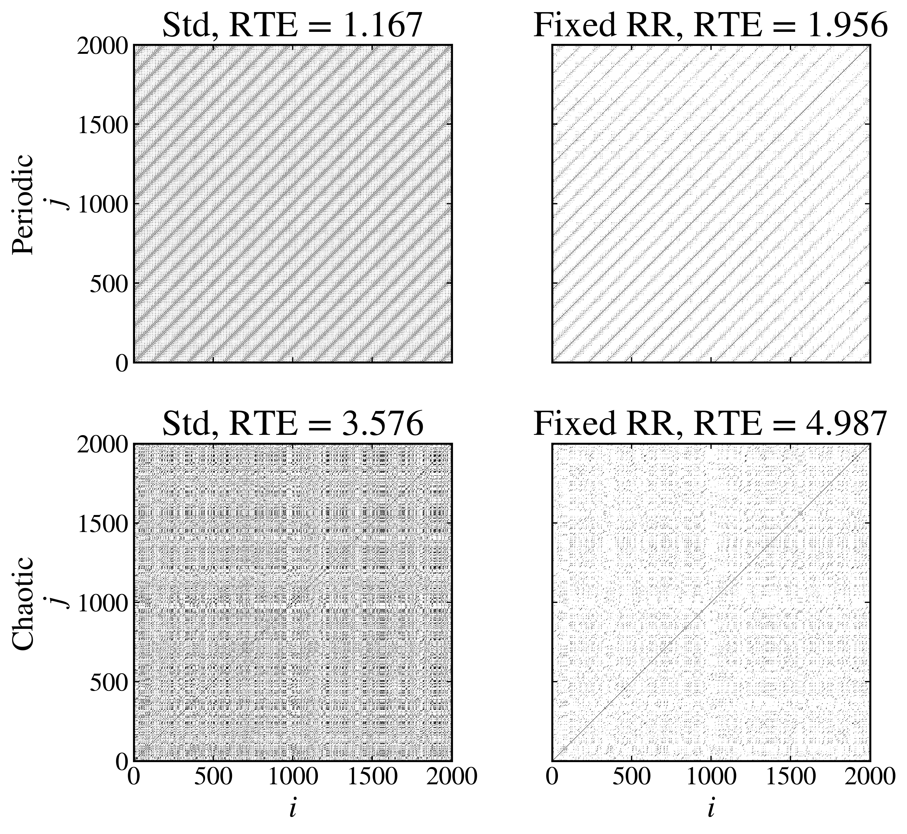

Recurrence time entropy
-----------------------

The :py:meth:`recurrence_time_entropy <pynamicalsys.core.continuous_dynamical_systems.ContinuousDynamicalSystem.recurrence_time_entropy>` method measures the diversity of recurrence times in a reduced map. It identifies nearby pairs of points using a distance threshold :math:`\varepsilon`, then calculates the Shannon entropy of white vertical-line lengths in the recurrence matrix. Recurrence plots were introduced by `Eckmann et al. (1987) <https://doi.org/10.1209/0295-5075/4/9/004>`_. The entropy of a recurrence-period distribution was introduced by `Little et al. (2007) <https://doi.org/10.1186/1475-925X-6-23>`_, and the white-line formulation was developed by `Sales et al. (2023) <https://doi.org/10.1063/5.0140613>`_.

This tutorial uses a periodic and a chaotic Rössler trajectory to show two practical ways to choose :math:`\varepsilon`. Each explicit call returns both the recurrence matrix and the RTE calculated from that matrix. All four calls use the same maxima-map definition and analysis settings.

Set up the two trajectories
~~~~~~~~~~~~~~~~~~~~~~~~~~~

Use the Rössler system introduced by `Rössler (1976) <https://doi.org/10.1016/0375-9601(76)90101-8>`_ with :math:`a=b=0.2`. The choice :math:`c=2.5` produces a periodic trajectory, while :math:`c=5.7` produces a chaotic trajectory:

.. code-block:: python

    import numpy as np
    import matplotlib.pyplot as plt
    from pynamicalsys import ContinuousDynamicalSystem as cds, PlotStyler

    system = cds(model="rossler system")
    system.integrator("rk4", time_step=0.01)

    initial_state = [0.0, 0.1, 0.0]
    periodic_parameters = [0.2, 0.2, 2.5]
    chaotic_parameters = [0.2, 0.2, 5.7]
    transient_time = 1_000.0
    num_intersections = 2_000

The maxima map records successive local maxima of :math:`z`. The same initial state, transient, number of maxima, and supremum distance metric are used for each calculation.

Standard-deviation threshold
~~~~~~~~~~~~~~~~~~~~~~~~~~~~

With ``threshold_mode="std"``, ``threshold=0.1`` sets :math:`\varepsilon` to ten percent of the largest coordinate standard deviation in each maxima map. Calculate the periodic and chaotic cases separately:

Periodic trajectory
^^^^^^^^^^^^^^^^^^^

.. code-block:: python

    rte_std_periodic, matrix_std_periodic = system.recurrence_time_entropy(
        u=initial_state,
        num_intersections=num_intersections,
        parameters=periodic_parameters,
        transient_time=transient_time,
        map_type="MM",
        maxima_index=2,
        threshold_mode="std",
        threshold=0.1,
        metric="supremum",
        std_metric="supremum",
        return_recmat=True,
    )

Chaotic trajectory
^^^^^^^^^^^^^^^^^^

.. code-block:: python

    rte_std_chaotic, matrix_std_chaotic = system.recurrence_time_entropy(
        u=initial_state,
        num_intersections=num_intersections,
        parameters=chaotic_parameters,
        transient_time=transient_time,
        map_type="MM",
        maxima_index=2,
        threshold_mode="std",
        threshold=0.1,
        metric="supremum",
        std_metric="supremum",
        return_recmat=True,
    )

Fixed recurrence rate
~~~~~~~~~~~~~~~~~~~~~

With ``threshold_mode="rr"``, ``threshold=0.05`` chooses :math:`\varepsilon` separately for each trajectory to target an off-diagonal recurrence rate of five percent. Calculate the periodic and chaotic cases separately:

Periodic trajectory
^^^^^^^^^^^^^^^^^^^

.. code-block:: python

    rte_rr_periodic, matrix_rr_periodic = system.recurrence_time_entropy(
        u=initial_state,
        num_intersections=num_intersections,
        parameters=periodic_parameters,
        transient_time=transient_time,
        map_type="MM",
        maxima_index=2,
        threshold_mode="rr",
        threshold=0.05,
        metric="supremum",
        return_recmat=True,
    )

Chaotic trajectory
^^^^^^^^^^^^^^^^^^

.. code-block:: python

    rte_rr_chaotic, matrix_rr_chaotic = system.recurrence_time_entropy(
        u=initial_state,
        num_intersections=num_intersections,
        parameters=chaotic_parameters,
        transient_time=transient_time,
        map_type="MM",
        maxima_index=2,
        threshold_mode="rr",
        threshold=0.05,
        metric="supremum",
        return_recmat=True,
    )

Compare each matrix with its RTE
~~~~~~~~~~~~~~~~~~~~~~~~~~~~~~~~

The top row shows the periodic trajectory and the bottom row shows the chaotic trajectory. The columns show the standard-deviation and fixed-RR thresholds. Plot only matrix entries with :math:`R_{ij}=1` as points. Each panel title reports the RTE of that matrix:

.. code-block:: python

    ps = PlotStyler()
    ps.apply_style()
    plt.close()

    fig, ax = plt.subplots(2, 2, figsize=(9, 8), sharex=True, sharey=True)
    j, i = np.where(matrix_std_periodic == 1)
    ax[0, 0].scatter(i, j, s=0.05, c="black", marker="s", linewidths=0)
    j, i = np.where(matrix_rr_periodic == 1)
    ax[0, 1].scatter(i, j, s=0.05, c="black", marker="s", linewidths=0)
    j, i = np.where(matrix_std_chaotic == 1)
    ax[1, 0].scatter(i, j, s=0.05, c="black", marker="s", linewidths=0)
    j, i = np.where(matrix_rr_chaotic == 1)
    ax[1, 1].scatter(i, j, s=0.05, c="black", marker="s", linewidths=0)
    ax[0, 0].set_xlim(0, num_intersections)
    ax[0, 0].set_ylim(0, num_intersections)
    ax[0, 0].set_aspect("equal")
    ax[0, 1].set_aspect("equal")
    ax[1, 0].set_aspect("equal")
    ax[1, 1].set_aspect("equal")
    ax[0, 0].set_title(f"Std, RTE = {rte_std_periodic:.3f}")
    ax[0, 1].set_title(f"Fixed RR, RTE = {rte_rr_periodic:.3f}")
    ax[1, 0].set_title(f"Std, RTE = {rte_std_chaotic:.3f}")
    ax[1, 1].set_title(f"Fixed RR, RTE = {rte_rr_chaotic:.3f}")
    ax[0, 0].set_ylabel("Periodic\n$j$")
    ax[1, 0].set_ylabel("Chaotic\n$j$")
    ax[1, 0].set_xlabel("$i$")
    ax[1, 1].set_xlabel("$i$")
    fig.tight_layout()
    plt.show()

    Recurrence matrices and corresponding RTE values for the periodic and chaotic Rössler trajectories. Rows identify the trajectories, while columns identify the threshold modes.

Compare the two trajectories within a column. The fixed-RR column is particularly useful for visual comparison because it targets the same recurrence density in both matrices. The standard-deviation threshold does not enforce a common recurrence rate, so recurrence density can also contribute to differences between those two panels.

Other map and output options
~~~~~~~~~~~~~~~~~~~~~~~~~~~~

This example uses ``map_type="MM"`` with ``maxima_index=2``. A Poincaré section is selected with ``map_type="PS"``, ``section_index``, ``section_value``, and ``crossing``. A stroboscopic map is selected with ``map_type="SM"`` and ``sampling_time``. Changing the map changes the sequence being analyzed, so compare RTE values only when the map and threshold settings match.

The method also accepts ``threshold_mode="direct"`` when an absolute distance threshold is specifically needed, but it is not recommended for this comparison because a fixed distance can produce very different recurrence densities in the two trajectories. The ``lmin`` argument controls the shortest accepted white-line length. Set ``return_final_state=True`` or ``return_p=True`` to additionally request the final reduced-map point or normalized white-line distribution. Requested outputs follow the RTE in the order final point, recurrence matrix, and distribution. The deprecated ``threshold_std`` argument should not be used in new code.

A recurrence matrix for :math:`N` reduced-map points contains :math:`N^2` entries. Request it only when the matrix itself is needed.

References
~~~~~~~~~~

.. container:: references-list

    - O\. E\. Rössler, `An equation for continuous chaos <https://doi.org/10.1016/0375-9601(76)90101-8>`_, Physics Letters A 57, 397-398 (1976).
    - J\.-P\. Eckmann, S\. O\. Kamphorst, and D\. Ruelle, `Recurrence plots of dynamical systems <https://doi.org/10.1209/0295-5075/4/9/004>`_, Europhysics Letters 4, 973-977 (1987).
    - M\. A\. Little, P\. E\. McSharry, S\. J\. Roberts, D\. A\. E\. Costello, and I\. M\. Moroz, `Exploiting nonlinear recurrence and fractal scaling properties for voice disorder detection <https://doi.org/10.1186/1475-925X-6-23>`_, BioMedical Engineering OnLine 6, 23 (2007).
    - M\. R\. Sales, M\. Mugnaine, J\. D\. Szezech Jr., R\. L\. Viana, I\. L\. Caldas, N\. Marwan, and J\. Kurths, `Stickiness and recurrence plots: An entropy-based approach <https://doi.org/10.1063/5.0140613>`_, Chaos 33, 033140 (2023).
