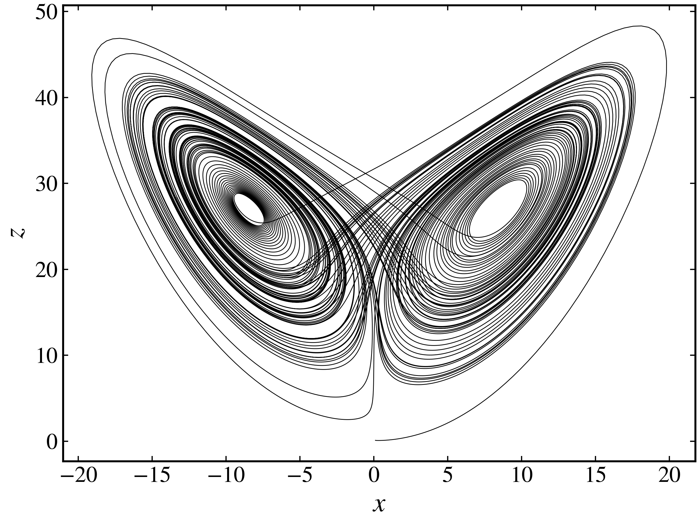
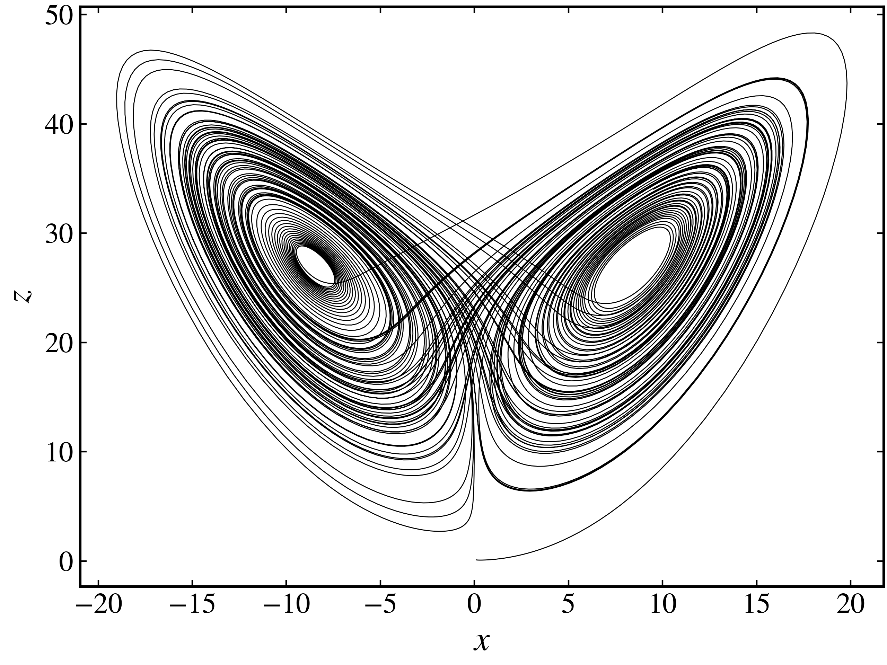
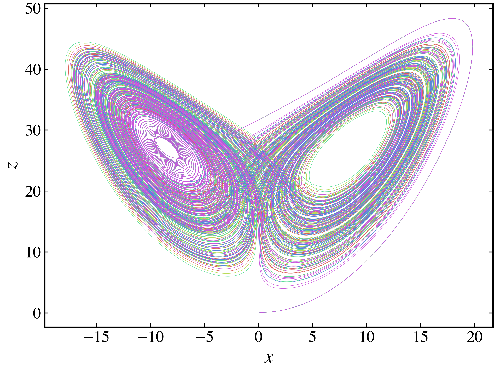
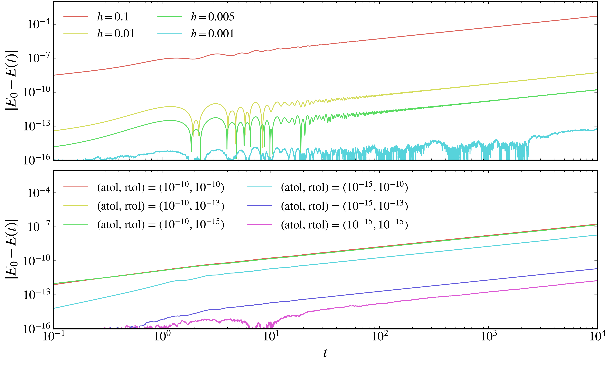

Generating trajectories
-----------------------

To generate trajectories for a continuous dynamical system, we use the :py:meth:`trajectory <pynamicalsys.core.continuous_dynamical_systems.ContinuousDynamicalSystem.trajectory>` method of the :py:class:`ContinuousDynamicalSystem <pynamicalsys.core.continuous_dynamical_systems.ContinuousDynamicalSystem>` class. This method allows us to specify the initial condition, parameter values, and total time for the simulation. Currently, it is only possible to choose between two different integrators: the traditional 4th order Runge-Kutta (RK4) method with fixed time step and the 4th/5th order Runge-Kutta (RK45) with adaptive time step.

Choosing the integrator
~~~~~~~~~~~~~~~~~~~~~~~

To choose the integrator, we use the :py:meth:`integrator <pynamicalsys.core.continuous_dynamical_systems.ContinuousDynamicalSystem.integrator>` method of the :py:class:`ContinuousDynamicalSystem <pynamicalsys.core.continuous_dynamical_systems.ContinuousDynamicalSystem>` class. To use the RK4 method, we need to specify the time step. By default, it is set to :math:`10^{-2}`:

.. code-block:: python

    from pynamicalsys import ContinuousDynamicalSystem as cds

    ds = cds(model="lorenz system")
    ds.integrator("rk4", time_step=0.005)

For the RK45 method, we need to specify the absolute and relative tolerance. The smaller their values, the more accurate is the solution. However, the CPU time is also increased. By default, `atol` and `rtol` are set to :math:`10^{-6}` and :math:`10^{-3}`, respectively.

.. code-block:: python

    ds.integrator("rk45", atol=1e-8, rtol=1e-6)

Single initial condition
~~~~~~~~~~~~~~~~~~~~~~~~

Let's now generate a trajectory for the Lorenz system using these two integrators. We first import all the necessary modules to simulate and visualize the trajectories and we instanciate the :py:class:`ContinuousDynamicalSystem <pynamicalsys.core.continuous_dynamical_systems.ContinuousDynamicalSystem>` class

.. code-block:: python

    from pynamicalsys import ContinuousDynamicalSystem as cds

    import numpy as np
    import matplotlib.pyplot as plt
    import seaborn as sns

    ds = cds(model="lorenz system")

Next, we can generate a trajectory by specifying the initial condition, parameters, and total time. The :py:meth:`trajectory <pynamicalsys.core.continuous_dynamical_systems.ContinuousDynamicalSystem.trajectory>` method returns a Numpy array with shape `(N, d + 1)`, where `N` is the number of iterations and `d` is the dimension of the system. The first column corresponds to the time samples at which the trajectory was calculated and the remaing columns correspond to a state variable. Using the RK4 method:

.. code-block:: python

    # Using the RK4 method
    ds.integrator("rk4", time_step=0.005)

    # The classical parameters that yield chaotic solutions
    parameters = [10, 28, 8/3]

    # The initial condition
    u = [0.1, 0.1, 0.1]

    # The total evolution time
    total_time = 100

    # Generate the trajectory
    trajectory = ds.trajectory(u, total_time, parameters=parameters)

    print(trajectory.shape)

.. code-block:: text

    (20001, 4)
    

To visualize the generated trajectory, we can use Matplotlib to plot 
attractor. But before, let's import the :py:class:`PlotStyler <pynamicalsys.core.plot_styler.PlotStyler>` class from pynamicalsys to set the plot style:

.. code-block:: python

    from pynamicalsys import PlotStyler

Then, we can apply the style and plot the trajectory:

.. code-block:: python

    # Apply the plot style
    ps = PlotStyler(linewidth=0.5)
    ps.apply_style()

    # Plot the x and z coordinates
    plt.plot(trajectory[:, 1], trajectory[:, 3], "k-")

    # Set the labels
    plt.xlabel("$x$")
    plt.ylabel("$z$")

    plt.show()

   
   The Lorenz attractor for :math:`\sigma = 10`, :math:`\rho = 28`, and :math:`\beta = 8/3` using the RK4 integrator.

And using the RK45 method:

.. code-block:: python

    # Using the RK45 method
    ds.integrator("rk45", atol=1e-8, rtol=1e-8)

    # The classical parameters that yield chaotic solutions
    parameters = [10, 28, 8/3]

    # The initial condition
    u = [0.1, 0.1, 0.1]

    # The total evolution time
    total_time = 100

    # Generate the trajectory
    trajectory = ds.trajectory(u, total_time, parameters=parameters)

    print(trajectory.shape)

.. code-block:: text

    (10319, 4)

The RK45 generates a trajectory with fewer points, however, it is extremely accurate:

.. code-block:: python

    # Apply the plot style
    ps = PlotStyler(linewidth=0.5)
    ps.apply_style()

    # Plot the x and z coordinates
    plt.plot(trajectory[:, 1], trajectory[:, 3], "k-")

    # Set the labels
    plt.xlabel("$x$")
    plt.ylabel("$z$")

    plt.show()

   
   The Lorenz attractor for :math:`\sigma = 10`, :math:`\rho = 28`, and :math:`\beta = 8/3` using the RK45 integrator.

Multiple initial conditions
~~~~~~~~~~~~~~~~~~~~~~~~~~~

To generate trajectories for multiple initial conditions, we can use the :py:meth:`trajectory <pynamicalsys.core.continuous_dynamical_systems.ContinuousDynamicalSystem.trajectory>` method and simply pass a list of initial conditions with shape `(M, d)`, where `M` is the number of initial conditions and `d` is the system's dimension. The method will return a list with `M` Numpy arrays of shape `(N, d + 1)`, where `N` is the number of iterations. In other words, each initial condition will generate its own trajectory.

Let's then generate trajectories for 5 randomly chosen initial conditions in the region :math:`(x, y, z) \in [0.1, 0.1 + 10^{-5}]^3`:

.. code-block:: python
    
    # Set the integrator
    ds.integrator("rk45", atol=1e-8, rtol=1e-8)

    # Set the random seed for reproducibility
    np.random.seed(13)

    # Generate the random initial conditions
    num_ic = 5
    u = np.random.uniform(0.1, 0.1 + 1e-5, (num_ic, 3))

    # Parameter values and total time    
    parameters = [10, 28, 8/3]
    total_time = 100
    
    # Generate trajectories for each initial condition
    trajectories = ds.trajectory(u, total_time, parameters=parameters)
    
    # Reshape the output to get a list of trajectories
    len(trajectories)

.. code-block:: text
    
    5

To visualize the results, we can plot each trajectory in a loop. We will use the :py:class:`PlotStyler <pynamicalsys.core.plot_styler.PlotStyler>` class to set the plot style and customize the appearance of the trajectories and we will use Seaborn to generate a color palette for the trajectories:

.. code-block:: python

    # Apply the plot style
    ps = PlotStyler(markersize=0.1, markeredgewidth=0)
    ps.apply_style()

    # Each trajectory is plotted with a different color
    colors = sns.color_palette("hls", num_ic)

    # Plot each trajectory
    for i in range(num_ic):
        plt.plot(trajectories[i][:, 1], trajectories[i][:, 3], "-", color=colors[i])

    # Set the labels
    plt.xlabel("$x$")
    plt.ylabel("$z$")

    plt.show()

   
   The Lorenz attractor for :math:`\sigma = 10`, :math:`\rho = 28`, and :math:`\beta = 8/3` using the RK45 integrator considering 5 different initial conditions.

This plot shows the trajectories of the system starting from a extremely close region and diverging over time.

Hamiltonian system example
~~~~~~~~~~~~~~~~~~~~~~~~~~

Now, let's consider a Hamiltonian system: the two degrees of freedom Hénon-Heiles system. The Hamiltonian function of this system is

.. math::

    H(p_x, p_y, x, y) = \frac{p_x^2 + p_y^2 + x^2 + y^2}{2} + x^2y - \frac{y^3}{3}

where :math:`x` and :math:`y` are the coordinates and :math:`p_x` and :math:`p_y` are the conjugated momenta. Since the Hamiltonian function does not explicitly depend on time, it is a constant of motion and it equals the total mechanical energy of the system. The equations of motion are given by Hamilton's equation:

.. math::

    \begin{align*}
        \dot{x} &= \frac{\partial H}{\partial p_x} = p_x,\\
        \dot{y} &= \frac{\partial H}{\partial p_y} = p_y,\\
        \dot{p}_x &= -\frac{\partial H}{\partial x} = -x - 2xy,\\
        \dot{p}_y &= -\frac{\partial H}{\partial y} = -y - x^2 + y^2.
    \end{align*}

Both integrators mentioned so far do not take into account the symplectic structure of phase space. Therefore, over long times, they lead to a drift in the total energy of the system. For short times, however, they provide a good approximation. Let's then calculate the energy as a function of time for the two integrators with different time steps and tolerances values:

.. code-block:: python

    from pynamicalsys import ContinuousDynamicalSystem as cds
    ds = cds(model="henon heiles")

    E = 1 / 8  # Total energy of the system
    x = 0  # Define the initial condition
    y = 0.1
    py = 0
    px = np.sqrt(2 * (E - x**2 * y + y**3/3) - x**2 - y**2 - py**2)
    u = [x, y, px, py]

    # Total evolution of the orbit
    total_time = 10000

    # Use four different time steps
    time_steps = [0.1, 0.01, 0.005, 0.001]
    energy_vs_time_rk45 = []
    times_rk45 = []

    # Calculate the energy as a function of time using the different time_steps
    for time_step in time_steps:
        
        ds.integrator("rk4", time_step=time_step)
        
        trajectory = ds.trajectory(u, total_time)
        
        times_rk45.append(trajectory[:, 0])
        energy_vs_time_rk45.append(compute_energy(trajectory))

    # Use four different absolute and relative tolerances
    atols = [1e-8, 1e-10, 1e-12, 1e-14]
    rtols = [1e-8, 1e-10, 1e-12, 1e-14]
    labels = ["$(10^{-8}, 10^{-8})$", "$(10^{-10}, 10^{-10})$", "$(10^{-12}, 10^{-12})$", "$(10^{-14}, 10^{-14})$"]
    energy_vs_time_rk45 = []
    times_rk45 = []

    # Calculate the energy as a function of time using the different tolerances
    for j in range(len(atols)):
        atol = atols[j]
        rtol = rtols[j]
        ds.integrator("rk45", rtol=rtol, atol=atol)
        trajectory = ds.trajectory(u, total_time)

        times_rk45.append(trajectory[:, 0])
        energy_vs_time_rk45.append(compute_energy(trajectory))

To check how much the energy is deviating form the initial value, we plot :math:`\left|E_0 - E(t)\right|` for the two integrators:

.. code-block:: python

    from pynamicalsys import PlotStyler

    # Apply the plot style
    ps = PlotStyler(fontsize=18, linewidth=1)
    ps.apply_style()
    colors = sns.color_palette("hls", len(atols))

    # Create the figure and axes
    fig, ax = plt.subplots(2, 1, sharex=True, sharey=True, figsize=(10, 6))
    
    # Plot the absolute value of the difference between the energies
    [ax[0].plot(times_rk4[i], abs(E - energy_vs_time_rk4[i]), label=f"$h = {time_steps[i]}$", color=colors[i]) for i in range(len(time_steps))]
    [ax[1].plot(times_rk45[i], abs(E - energy_vs_time_rk45[i]), color=colors[i], label=f"(atol, rtol) = {labels[i]}") for i in range(len(atols))]
    
    # Set the legend, scales, labels and limits
    ax[0].legend(loc="upper left", ncol=2, frameon=False)
    ax[1].legend(loc="upper left", ncol=2, frameon=False)
    ax[0].set_xscale("log")
    ax[0].set_yscale("log")
    ax[0].set_ylabel(r"$\left |E_0 - E(t) \right|$")
    ax[1].set_ylabel(r"$\left |E_0 - E(t)\right|$")
    ax[1].set_xlabel("$t$")
    ax[0].set_xlim(0.1, total_time)
    ax[1].set_ylim(1e-16, 1e-2)
    
    plt.show()

   
   The variation in the energy for the two integrations with different precisions.

For small times the deviation does remain small, however it grows over time. Additionally, the absolute tolerance seems to be more important in this case than the relative tolerance. Nevertheless, when working with Hamiltonian systems, one should consider the possibility of working with symplectic integrators. This type of numerical integrators will be included on future versions of **pynamicalsys**.
