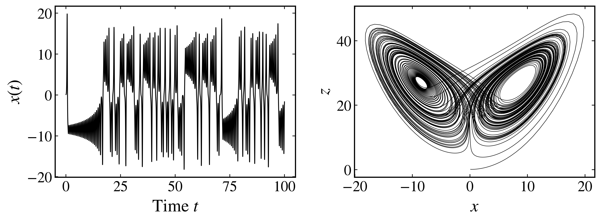
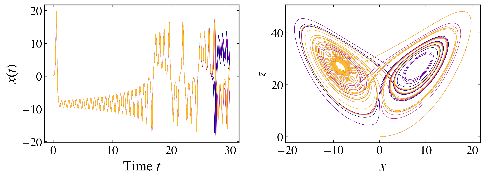

Generating trajectories
-----------------------

Use :py:meth:`trajectory <pynamicalsys.core.continuous_dynamical_systems.ContinuousDynamicalSystem.trajectory>` to integrate a continuous dynamical system from one initial state or an ensemble of initial states. The ``total_time`` argument is the final integration time in the system's time units.

Choosing the integrator
~~~~~~~~~~~~~~~~~~~~~~~

Call :py:meth:`available_integrators <pynamicalsys.core.continuous_dynamical_systems.ContinuousDynamicalSystem.available_integrators>` to list the implemented methods:

.. code-block:: python

    from pynamicalsys import ContinuousDynamicalSystem as cds

    for integrator in cds.available_integrators():
        print(integrator)

.. code-block:: text

    rk4
    rk45

The ``rk4`` integrator uses a fixed time step. A smaller step can improve accuracy, but it also increases the number of evaluations:

.. code-block:: python

    system = cds(model="lorenz system")
    system.integrator("rk4", time_step=0.01)

The ``rk45`` integrator adjusts its time step according to absolute and relative error tolerances. Smaller tolerances generally produce a more accurate solution at a greater computational cost:

.. code-block:: python

    system.integrator("rk45", atol=1e-8, rtol=1e-6)

The selected integrator remains active for subsequent method calls. Fixed-step output is sampled at regular times, while adaptive output generally is not. This distinction matters when a later calculation assumes uniformly spaced samples.

A single trajectory
~~~~~~~~~~~~~~~~~~~

Consider the Lorenz system with :math:`\sigma=10`, :math:`\rho=28`, and :math:`\beta=8/3`. Generate a trajectory from :math:`(x_0,y_0,z_0)=(0.1,0.1,0.1)` using RK4:

.. code-block:: python

    import matplotlib.pyplot as plt
    from pynamicalsys import ContinuousDynamicalSystem as cds, PlotStyler

    system = cds(model="lorenz system")
    system.set_parameters([10.0, 28.0, 8.0 / 3.0])
    system.integrator("rk4", time_step=0.01)

    initial_state = [0.1, 0.1, 0.1]
    total_time = 100.0
    trajectory = system.trajectory(initial_state, total_time)

For a system of dimension :math:`d`, the result has shape ``(num_samples, d + 1)``. The first column contains the integration times and the remaining columns contain the state variables. Each row is stored after an integration step, so the initial state at :math:`t=0` is not included.

Plot the time evolution of :math:`x` beside the projection of the trajectory onto the :math:`(x,z)` plane:

.. code-block:: python

    time = trajectory[:, 0]
    x = trajectory[:, 1]
    z = trajectory[:, 3]

    ps = PlotStyler()
    ps.apply_style()
    fig, ax = plt.subplots(1, 2, figsize=(10, 4))
    ax[0].plot(time, x, "k")
    ax[0].set_xlabel("Time $t$")
    ax[0].set_ylabel("$x(t)$")
    ax[1].plot(x, z, "k", lw=0.5)
    ax[1].set_xlabel("$x$")
    ax[1].set_ylabel("$z$")
    fig.tight_layout()
    plt.show()

    Time evolution and phase-space projection of the Lorenz trajectory for :math:`\sigma=10`, :math:`\rho=28`, and :math:`\beta=8/3`.

Discarding a transient
~~~~~~~~~~~~~~~~~~~~~~

Early evolution may describe the approach to an attractor rather than its long-term dynamics. Pass ``transient_time`` to integrate through that interval without storing it:

.. code-block:: python

    total_time = 100.0
    transient_time = 20.0
    trajectory = system.trajectory(
        initial_state,
        total_time,
        transient_time=transient_time,
    )

Here, ``total_time`` is still the final integration time. The stored trajectory therefore covers the interval after :math:`t=20` through :math:`t=100`, rather than adding 20 time units to a 100-unit recorded trajectory.

An ensemble of trajectories
~~~~~~~~~~~~~~~~~~~~~~~~~~~~

Pass an array of shape ``(num_initial_conditions, system_dimension)`` to integrate several initial states with the same parameters. The method returns a list containing one trajectory array for each initial state. This also accommodates adaptive trajectories with different numbers of accepted steps.

The following example follows five nearby initial states of the Lorenz system. RK4 is used so every trajectory is sampled at the same times:

.. code-block:: python

    import numpy as np
    import matplotlib.pyplot as plt
    from pynamicalsys import ContinuousDynamicalSystem as cds, PlotStyler

    system = cds(model="lorenz system")
    system.set_parameters([10.0, 28.0, 8.0 / 3.0])
    system.integrator("rk4", time_step=0.01)

    num_initial_conditions = 5
    initial_conditions = np.full((num_initial_conditions, 3), 0.1)
    initial_conditions[:, 0] += np.linspace(0.0, 4e-5, num_initial_conditions)

    trajectories = system.trajectory(initial_conditions, total_time=30.0)

Plotting :math:`x(t)` for each initial state shows how initially close solutions separate in the chaotic flow. The corresponding phase-space projections show the trajectories evolving on the same attractor:

.. code-block:: python

    colors = plt.cm.plasma(np.linspace(0.0, 0.85, num_initial_conditions))

    ps = PlotStyler()
    ps.apply_style()
    fig, ax = plt.subplots(1, 2, figsize=(10, 4))
    for trajectory, color in zip(trajectories, colors):
        ax[0].plot(trajectory[:, 0], trajectory[:, 1], color=color, lw=0.8)
        ax[1].plot(trajectory[:, 1], trajectory[:, 3], color=color, lw=0.5)

    ax[0].set_xlabel("Time $t$")
    ax[0].set_ylabel("$x(t)$")
    ax[1].set_xlabel("$x$")
    ax[1].set_ylabel("$z$")
    fig.tight_layout()
    plt.show()

    Time evolution and phase-space projections of five Lorenz trajectories whose initial states differ only in their :math:`x` coordinate.

The same ``parameters`` argument described in :doc:`cds_creating_ds` can be passed directly to ``trajectory`` to override the stored parameter values for one call.
