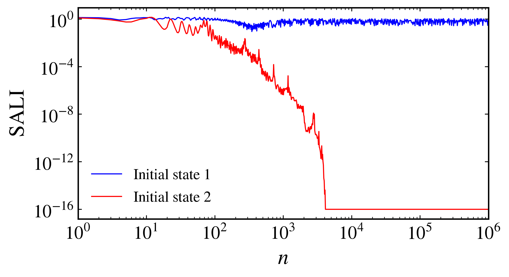
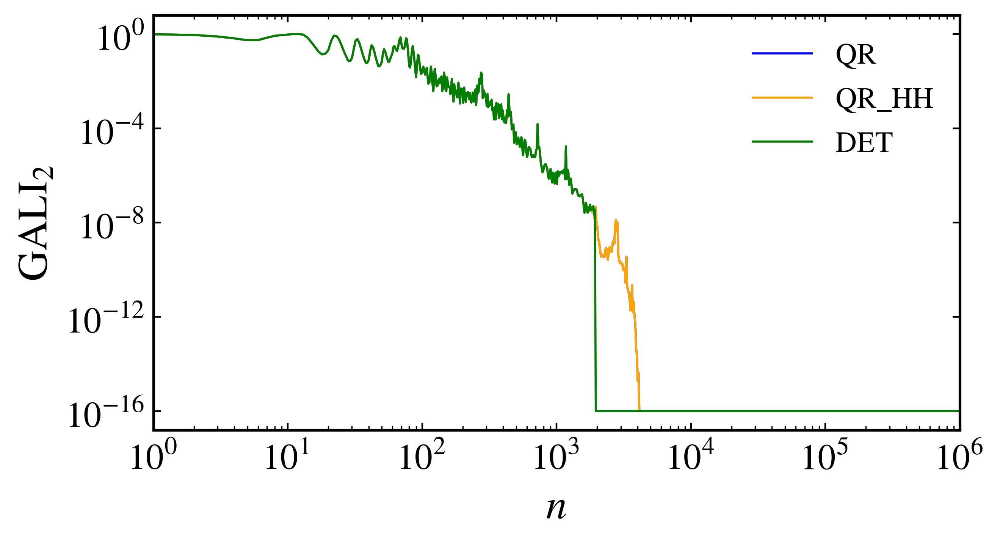
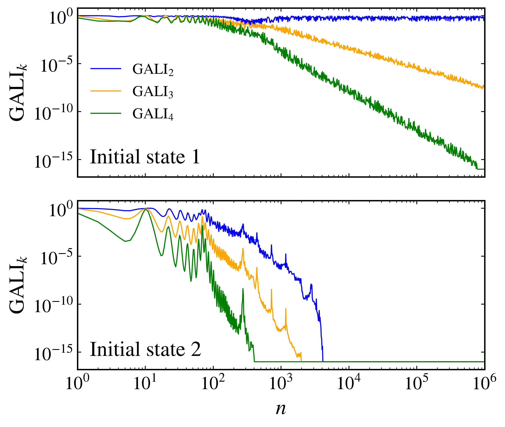
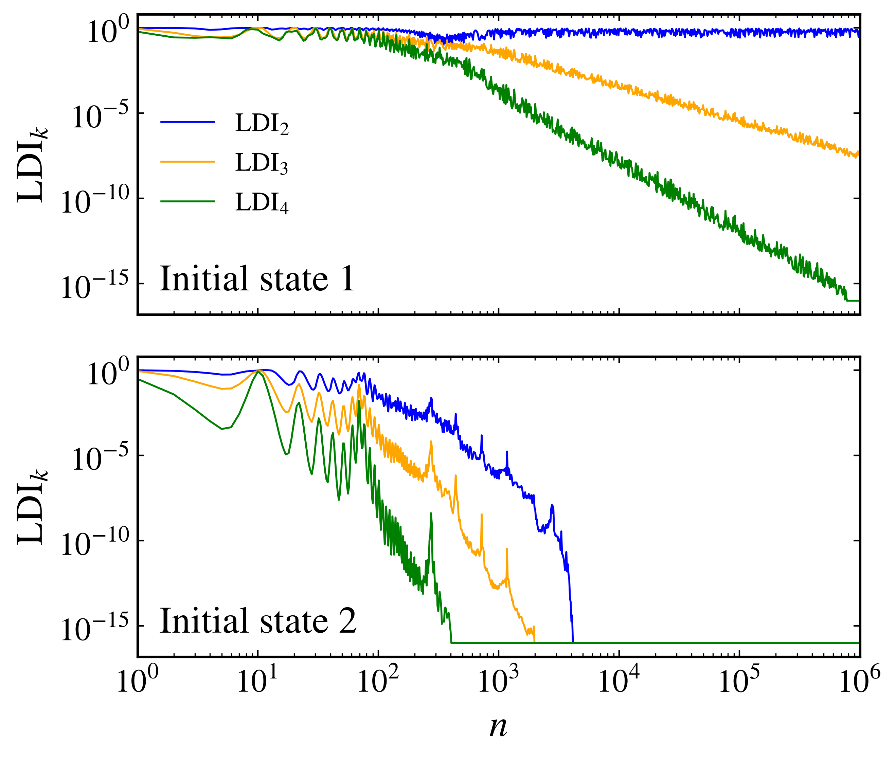
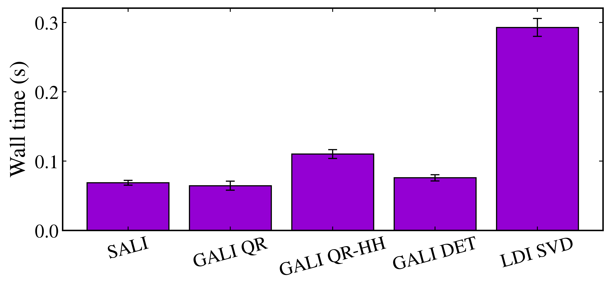

Alignment indices
~~~~~~~~~~~~~~~~~

The Smaller Alignment Index (SALI), Generalized Alignment Index (GALI), and Linear Dependence Index (LDI) follow the evolution of normalized deviation vectors under the tangent dynamics. They measure how these vectors become aligned and provide closely related ways to distinguish regular and chaotic motion. SALI was introduced by `Skokos (2001) <https://doi.org/10.1088/0305-4470/34/47/309>`_, GALI by `Skokos, Bountis, and Antonopoulos (2007) <https://doi.org/10.1016/j.physd.2007.04.004>`_, and LDI by `Antonopoulos and Bountis (2006) <https://arxiv.org/abs/0711.0360>`_.

Smaller Alignment Index
^^^^^^^^^^^^^^^^^^^^^^^

Let :math:`\hat{\mathbf{v}}_1(n)` and :math:`\hat{\mathbf{v}}_2(n)` be two normalized deviation vectors at iteration :math:`n`. SALI is defined as

.. math::

    \mathrm{SALI}(n)=\min\left\{\left\|\hat{\mathbf{v}}_1(n)+\hat{\mathbf{v}}_2(n)\right\|,\left\|\hat{\mathbf{v}}_1(n)-\hat{\mathbf{v}}_2(n)\right\|\right\}.

The two norms detect alignment in the same or opposite directions. Along a chaotic trajectory, both vectors approach the most unstable tangent direction and SALI decays exponentially. For a discrete system with Lyapunov exponents :math:`\lambda_1\geq\lambda_2\geq\cdots`, the asymptotic decay is

.. math::

    \mathrm{SALI}(n)\propto\exp\left[-(\lambda_1-\lambda_2)n\right].

The second exponent must be included whether it is positive, zero, or negative. This discrete-time result and its relation to the continuous-time expression are derived by `Sales, Leonel, and Antonopoulos (2026) <https://doi.org/10.1016/j.chaos.2026.117884>`_. For regular trajectories, SALI generally remains bounded away from zero when the tangent space of the invariant object has at least two independent directions. In two-dimensional maps it can also approach zero for regular trajectories, but algebraically rather than exponentially, so the decay law must be considered.

Compute SALI for two trajectories of the four-dimensional symplectic map with :py:meth:`SALI <pynamicalsys.core.discrete_dynamical_systems.DiscreteDynamicalSystem.SALI>`:

.. code-block:: python

    import numpy as np
    import matplotlib.pyplot as plt
    from pynamicalsys import DiscreteDynamicalSystem as dds, PlotStyler

    system = dds(model="4d symplectic map")
    system.set_parameters([0.5, 0.1, 0.001])

    initial_states = np.array(
        [
            [0.5, 0.0, 0.5, 0.0],
            [3.0, 0.0, 0.5, 0.0],
        ]
    )
    total_time = 1_000_000
    sample_times = np.unique(np.logspace(0, np.log10(total_time), 1_000).astype(int))
    tol = 1e-16
    seed = 1312

    sali_histories = np.empty((len(initial_states), len(sample_times)))
    for i, initial_state in enumerate(initial_states):
        sali_histories[i] = system.SALI(
            u=initial_state,
            total_time=total_time,
            return_history=True,
            sample_times=sample_times,
            tol=tol,
            seed=seed,
        )

The computation stops when SALI falls below ``tol``. Entries after an early stop remain zero in the returned history, so ``np.maximum`` is used only to place them at the tolerance floor on the logarithmic axis:

.. code-block:: python

    colors = ["blue", "red"]

    ps = PlotStyler()
    ps.apply_style()
    fig, ax = plt.subplots(figsize=(7, 4))
    for i in range(len(initial_states)):
        ax.loglog(
            sample_times,
            np.maximum(sali_histories[i], tol),
            color=colors[i],
            label=f"Initial state {i + 1}",
        )
    ax.set_xlim(1, total_time)
    ax.set_xlabel("$n$")
    ax.set_ylabel(r"$\mathrm{SALI}$")
    ax.legend(frameon=False)
    fig.tight_layout()
    plt.show()

    Evolution of SALI for two trajectories of the four-dimensional symplectic map.

Generalized Alignment Index
^^^^^^^^^^^^^^^^^^^^^^^^^^^

GALI extends the alignment idea to :math:`k` normalized deviation vectors. If :math:`\mathbf{V}_n\in\mathbb{R}^{d\times k}` contains these vectors as columns, the index is the volume of the :math:`k`-dimensional parallelepiped that they span:

.. math::

    \mathrm{GALI}_k(n)=\left\|\hat{\mathbf{v}}_1(n)\wedge\hat{\mathbf{v}}_2(n)\wedge\cdots\wedge\hat{\mathbf{v}}_k(n)\right\|,

where :math:`2\leq k\leq d`. For a chaotic trajectory, its decay is governed by the first :math:`k` Lyapunov exponents:

.. math::

    \mathrm{GALI}_k(n)\propto\exp\left\{-\left[(k-1)\lambda_1-\sum_{i=2}^{k}\lambda_i\right]n\right\}.

For regular trajectories, whether :math:`\mathrm{GALI}_k` remains nonzero or decays algebraically depends on :math:`k` and the dimension of the invariant torus. This geometric behavior and the decay laws were established in the original GALI paper by `Skokos, Bountis, and Antonopoulos (2007) <https://doi.org/10.1016/j.physd.2007.04.004>`_.

The :py:meth:`GALI <pynamicalsys.core.discrete_dynamical_systems.DiscreteDynamicalSystem.GALI>` method provides three equivalent ways to compute the spanned volume:

``method="DET"``
    Forms the Gram matrix :math:`\mathbf{G}_n=\mathbf{V}_n^T\mathbf{V}_n` and computes :math:`\mathrm{GALI}_k=\sqrt{\det(\mathbf{G}_n)}`. This is the most direct expression, but the determinant becomes sensitive to rounding when the vectors are nearly aligned.

``method="QR"``
    Uses the project's modified Gram-Schmidt decomposition :math:`\mathbf{V}_n=\mathbf{Q}_n\mathbf{R}_n` and computes :math:`\mathrm{GALI}_k=\prod_i|R_{ii}|`. This is the default method.

``method="QR_HH"``
    Uses a Householder QR decomposition and the same product :math:`\prod_i|R_{ii}|`. It is generally the most numerically stable GALI option, with a higher computational cost.

Compare all three methods for :math:`k=2` using identical initial deviation vectors:

.. code-block:: python

    colors = ["blue", "orange", "green"]
    gali_methods = ["QR", "QR_HH", "DET"]
    k = 2
    gali_method_histories = np.empty((len(gali_methods), len(sample_times)))
    for i, method in enumerate(gali_methods):
        gali_method_histories[i] = system.GALI(
            u=initial_states[1],
            total_time=total_time,
            k=k,
            return_history=True,
            sample_times=sample_times,
            method=method,
            tol=tol,
            seed=seed,
        )

    ps = PlotStyler()
    ps.apply_style()
    fig, ax = plt.subplots(figsize=(7, 4))
    for i, method in enumerate(gali_methods):
        ax.loglog(
            sample_times,
            np.maximum(gali_method_histories[i], tol),
            label=method,
            color=colors[i],
        )
    ax.set_xlim(1, total_time)
    ax.set_xlabel("$n$")
    ax.set_ylabel(fr"$\mathrm{{GALI}}_{k}$")
    ax.legend(frameon=False)
    fig.tight_layout()
    plt.show()

    Comparison of the modified Gram-Schmidt QR, Householder QR, and Gram determinant formulations of :math:`\mathrm{GALI}_2`.

The three curves initially overlap, but the determinant formulation drops abruptly to the tolerance floor when :math:`\mathrm{GALI}_2` is approximately :math:`10^{-8}`. At that point, :math:`\det(\mathbf{V}_n^T\mathbf{V}_n)=\mathrm{GALI}_2^2` is approximately :math:`10^{-16}`, so rounding errors dominate the Gram determinant. The QR formulations operate directly on the volume through the diagonal entries of :math:`\mathbf{R}_n` and continue resolving the decay for substantially longer. This illustrates why ``DET`` is the least reliable option when the deviation vectors become strongly aligned.

GALI for different values of k
^^^^^^^^^^^^^^^^^^^^^^^^^^^^^^

Compute GALI for :math:`k=2`, :math:`k=3`, and :math:`k=4` for the same two initial states:

.. code-block:: python

    k_values = np.array([2, 3, 4])
    gali_histories = np.empty((len(initial_states), len(sample_times), len(k_values)))
    for i, initial_state in enumerate(initial_states):
        for j, k in enumerate(k_values):
            gali_histories[i, :, j] = system.GALI(
                u=initial_state,
                total_time=total_time,
                k=k,
                return_history=True,
                sample_times=sample_times,
                method="QR_HH",
                tol=tol,
                seed=seed,
            )

    colors = ["blue", "orange", "green"]

    ps = PlotStyler()
    ps.apply_style()
    fig, ax = plt.subplots(2, 1, figsize=(7, 6), sharex=True, sharey=True)
    for i in range(len(initial_states)):
        for j, k in enumerate(k_values):
            ax[i].loglog(
                sample_times,
                np.maximum(gali_histories[i, :, j], tol),
                color=colors[j],
                label=rf"$\mathrm{{GALI}}_{k}$",
            )
        ax[i].set_ylabel(r"$\mathrm{GALI}_k$")
        ax[i].text(0.03, 0.08, f"Initial state {i + 1}", transform=ax[i].transAxes)
    ax[0].legend(frameon=False, ncol=1)
    ax[1].set_xlim(1, total_time)
    ax[1].set_xlabel("$n$")
    fig.tight_layout()
    plt.show()

    Evolution of :math:`\mathrm{GALI}_2`, :math:`\mathrm{GALI}_3`, and :math:`\mathrm{GALI}_4` for two trajectories of the four-dimensional symplectic map.

Linear Dependence Index
^^^^^^^^^^^^^^^^^^^^^^^

LDI computes the same volume from the singular values of the normalized deviation matrix. If

.. math::

    \mathbf{V}_n=\mathbf{U}_n\mathbf{\Sigma}_n\mathbf{W}_n^T,

then the definition introduced by `Antonopoulos and Bountis (2006) <https://arxiv.org/abs/0711.0360>`_ is

.. math::

    \mathrm{LDI}_k(n)=\prod_{i=1}^{k}\sigma_i(n).

Compute :math:`\mathrm{LDI}_2`, :math:`\mathrm{LDI}_3`, and :math:`\mathrm{LDI}_4` with :py:meth:`LDI <pynamicalsys.core.discrete_dynamical_systems.DiscreteDynamicalSystem.LDI>` for the same two initial states:

.. code-block:: python

    k_values = np.array([2, 3, 4])
    ldi_histories = np.empty((len(initial_states), len(sample_times), len(k_values)))
    for i, initial_state in enumerate(initial_states):
        for j, k in enumerate(k_values):
            ldi_histories[i, :, j] = system.LDI(
                u=initial_state,
                total_time=total_time,
                k=k,
                return_history=True,
                sample_times=sample_times,
                tol=tol,
                seed=seed,
            )

    colors = ["blue", "orange", "green"]

    ps = PlotStyler()
    ps.apply_style()
    fig, ax = plt.subplots(2, 1, figsize=(7, 6), sharex=True, sharey=True)
    for i in range(len(initial_states)):
        for j, k in enumerate(k_values):
            ax[i].loglog(
                sample_times,
                np.maximum(ldi_histories[i, :, j], tol),
                color=colors[j],
                label=rf"$\mathrm{{LDI}}_{k}$",
            )
        ax[i].set_ylabel(r"$\mathrm{LDI}_k$")
        ax[i].text(0.03, 0.08, f"Initial state {i + 1}", transform=ax[i].transAxes)
    ax[0].legend(frameon=False, ncol=1)
    ax[1].set_xlim(1, total_time)
    ax[1].set_xlabel("$n$")
    fig.tight_layout()
    plt.show()

    Evolution of :math:`\mathrm{LDI}_2`, :math:`\mathrm{LDI}_3`, and :math:`\mathrm{LDI}_4` for two trajectories of the four-dimensional symplectic map.

Correspondence between GALI and LDI
^^^^^^^^^^^^^^^^^^^^^^^^^^^^^^^^^^^

The two figures show the same behavior because GALI and LDI measure the same volume. The Gram matrix provides the direct correspondence. Since

.. math::

    \mathbf{V}_n^T\mathbf{V}_n=\mathbf{W}_n\mathbf{\Sigma}_n^T\mathbf{\Sigma}_n\mathbf{W}_n^T,

its determinant is :math:`\prod_{i=1}^{k}\sigma_i^2`. Therefore

.. math::

    \mathrm{GALI}_k(n)=\sqrt{\det\left(\mathbf{V}_n^T\mathbf{V}_n\right)}=\prod_{i=1}^{k}\sigma_i(n)=\mathrm{LDI}_k(n).

This exact identity and the common decay rate for discrete and continuous chaotic systems are derived in `Sales, Leonel, and Antonopoulos (2026) <https://doi.org/10.1016/j.chaos.2026.117884>`_. GALI and LDI are mathematically identical for the same normalized deviation vectors, while their numerical implementations differ. GALI uses a determinant or QR factorization, and LDI uses a singular value decomposition.

SALI is also closely connected to the two-vector case. If :math:`s=\mathrm{SALI}` for two unit deviation vectors, then

.. math::

    \mathrm{GALI}_2=s\sqrt{1-\frac{s^2}{4}},

so :math:`\mathrm{GALI}_2\sim\mathrm{SALI}` as the vectors align and :math:`s\to0`.

Benchmarking the formulations
^^^^^^^^^^^^^^^^^^^^^^^^^^^^^

The most useful benchmark compares SALI, the three formulations of :math:`\mathrm{GALI}_2`, and :math:`\mathrm{LDI}_2` along a regular trajectory over the same fixed number of iterations. The regular orbit avoids terminating the comparison through rapid chaotic alignment, and setting ``tol=0.0`` disables early stopping so every formulation performs the complete workload. A short preliminary call excludes just-in-time compilation from the measurements. Absolute times depend on the processor and software environment, so the benchmark should be run on the machine where the methods will be used:

.. code-block:: python

    from time import perf_counter

    benchmark_time = 100_000
    benchmark_repeats = 100
    benchmark_state = initial_states[0]
    benchmark_labels = ["SALI"] + [f"GALI {method.replace('_', '-')}" for method in gali_methods] + ["LDI SVD"]
    benchmark_times = np.empty((len(benchmark_labels), benchmark_repeats))

    system.SALI(u=benchmark_state, total_time=1, tol=0.0, seed=seed)
    for method in gali_methods:
        system.GALI(u=benchmark_state, total_time=1, k=2, method=method, tol=0.0, seed=seed)
    system.LDI(u=benchmark_state, total_time=1, k=2, tol=0.0, seed=seed)

    for repeat in range(benchmark_repeats):
        start = perf_counter()
        system.SALI(
            u=benchmark_state,
            total_time=benchmark_time,
            tol=0.0,
            seed=seed,
        )
        benchmark_times[0, repeat] = perf_counter() - start

        for i, method in enumerate(gali_methods):
            start = perf_counter()
            system.GALI(
                u=benchmark_state,
                total_time=benchmark_time,
                k=2,
                method=method,
                tol=0.0,
                seed=seed,
            )
            benchmark_times[i + 1, repeat] = perf_counter() - start

        start = perf_counter()
        system.LDI(
            u=benchmark_state,
            total_time=benchmark_time,
            k=2,
            tol=0.0,
            seed=seed,
        )
        benchmark_times[-1, repeat] = perf_counter() - start

    mean_times = np.mean(benchmark_times, axis=1)
    std_times = np.std(benchmark_times, axis=1, ddof=1)

    ps = PlotStyler()
    ps.apply_style()
    fig, ax = plt.subplots(figsize=(8, 4))
    ax.bar(
        benchmark_labels,
        mean_times,
        yerr=std_times,
        color="darkviolet",
        edgecolor="black",
        linewidth=1.0,
        capsize=4,
    )
    ax.set_ylabel("Wall time (s)")
    ax.tick_params(axis="x", labelrotation=15)
    fig.tight_layout()
    plt.show()

    Wall times for SALI, the three formulations of :math:`\mathrm{GALI}_2`, and SVD-based :math:`\mathrm{LDI}_2` along a regular trajectory. Bars show the mean of five fixed-workload runs and error bars show one standard deviation.

All three public methods return a scalar by default and a one-dimensional array with ``return_history=True``. The ``sample_times``, ``tol``, ``transient_time``, ``seed``, and ``return_last_state`` arguments follow the same pattern for SALI, GALI, and LDI.

References
^^^^^^^^^^

- C. Skokos, `Alignment indices: a new, simple method for determining the ordered or chaotic nature of orbits <https://doi.org/10.1088/0305-4470/34/47/309>`_, Journal of Physics A: Mathematical and General 34, 10029-10043 (2001).
- C. Skokos, T. C. Bountis, and C. Antonopoulos, `Geometrical properties of local dynamics in Hamiltonian systems: The Generalized Alignment Index (GALI) method <https://doi.org/10.1016/j.physd.2007.04.004>`_, Physica D 231, 30-54 (2007).
- C. Antonopoulos and T. Bountis, `Detecting order and chaos by the Linear Dependence Index (LDI) method <https://arxiv.org/abs/0711.0360>`_, ROMAI Journal 2, 1-13 (2006).
- M. R. Sales, E. D. Leonel, and C. G. Antonopoulos, `On the behavior of Linear Dependence, Smaller, and Generalized Alignment Indices in discrete and continuous chaotic systems <https://doi.org/10.1016/j.chaos.2026.117884>`_, Chaos, Solitons and Fractals 205, 117884 (2026).
