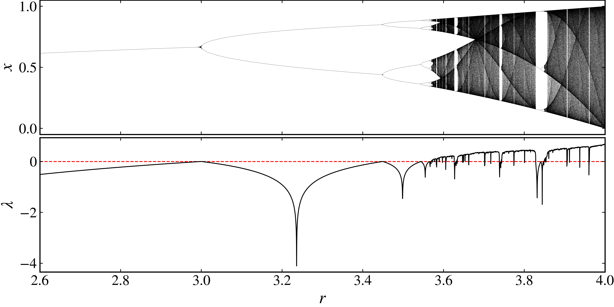
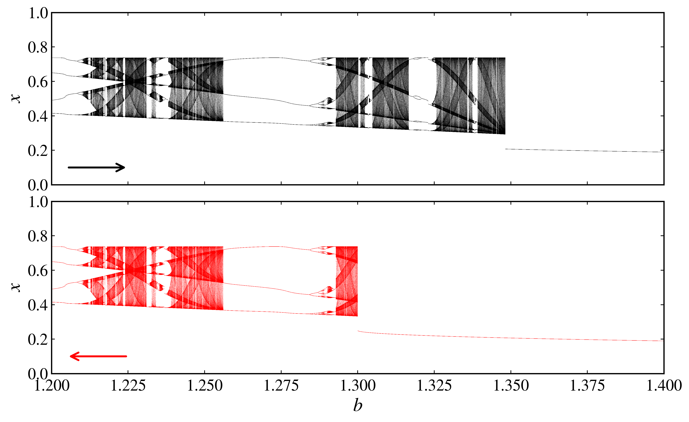

Bifurcation diagram
-------------------

Nonlinear dynamical systems often depend on a parameter, and the bifurcation diagram shows how the system's behavior changes as this parameter varies. 

Logistic map example
~~~~~~~~~~~~~~~~~~~~

As a first example, we will create a bifurcation diagram for the logistic map, which is defined as:

.. math::
    x_{n+1} = r x_n (1 - x_n),

where :math:`r` is the parameter that we will vary. The parameter :math:`r` typically ranges from 0 to 4, however, we will focus on the range from 2.5 to 4.0, which is where interesting bifurcations occur.

Just as in our previous examples, we start by importing the necessary libraries and creating the :py:class:`DiscreteDynamicalSystem <pycandy.core.discrete_dynamical_systems.DiscreteDynamicalSystem>` object for the logistic map.

.. code-block:: python

    from pycandy import DiscreteDynamicalSystem as dds
    import numpy as np
    import matplotlib.pyplot as plt
    import seaborn as sns

    ds = dds(model="logistic map")

We are going to use the :py:meth:`bifurcation_diagram <pycandy.core.discrete_dynamical_systems.DiscreteDynamicalSystem.bifurcation_diagram>` method from the :py:class:`DiscreteDynamicalSystem <pycandy.core.discrete_dynamical_systems.DiscreteDynamicalSystem>` class to create the bifurcation diagram. This method requires the following parameters:

- `u`: the initial condition for the system, which we will set to 0.2.
- `param_index`: the index of the parameter we are varying, which is 0 for the logistic map.
- `param_range`: a tuple defining the range of the parameter :math:`r`, i.e., (start, end, number of points), which we will set to (2.5, 4.0, 3000).
- `total_time`: the total number of iterations to run the system, which we will set to 4000.
- `transient_time`: the number of iterations to discard before plotting, which we will set to 1000.

The :py:meth:`bifurcation_diagram <pycandy.core.discrete_dynamical_systems.DiscreteDynamicalSystem.bifurcation_diagram>` method returns two Numpy arrays: `param_values` with shape `(len(param_range),)` which contain the parameter values, and `bifurcation_values`, with shape `(len(param_range), total_time - transient_time)`, which contain the coordinates of the bifurcation diagram at each parameter value.

.. code-block:: python

    u = 0.2
    param_index = 0
    param_range = (2.5, 4.0, 3000)
    total_time = 4000
    transient_time = 1000

    param_values, bifurcation_data = ds.bifurcation_diagram(
        u=u,
        param_index=param_index,
        param_range=param_range,
        total_time=total_time,
        transient_time=transient_time
    )

Since `param_values` is a 1D array and `bifurcation_data` is a 2D array, we need to transform both arrays into a format suitable for plotting. We will use the `np.repeat` function to repeat the `param_values` for each bifurcation value, and then flatten the `bifurcation_data` array to create a 1D array of bifurcation values.

.. code-block:: python

    param_mesh = np.repeat(param_values[:, np.newaxis], bifurcation_diagram.shape[1], axis=1)

    # Flatten both arrays
    param_values = param_mesh.flatten()
    bifurcation_data = bifurcation_data.flatten()

Now we can plot the bifurcation diagram using Matplotlib.

.. code-block:: python

    # Set the style for the plot
    ps = PlotStyler()
    ps.apply_style()

    # Create the figure and axis
    fig, ax = plt.subplots(figsize=(10, 3))
    ps.set_tick_padding(ax, pad_x = 6)

    # Plot the bifurcation diagram
    plt.scatter(param_values, bifurcation_data, color='black', s=0.01, edgecolor='none')

    # Set the labels and limits for the plot    
    plt.xlabel("$r$")
    plt.ylabel("$x$")
    plt.xlim(param_range[0], param_range[1])
    plt.ylim(0, 1)

    plt.show()

   
   Bifurcation diagram of the logistic map.

Hénon map example
~~~~~~~~~~~~~~~~~

As a second example, we will create a bifurcation diagram for the Hénon map, which is defined as:

.. math::
    \begin{align*}
        x_{n+1} &= 1 - a x_n^2 + y_n, \\
        y_{n+1} &= b x_n,
    \end{align*}

where :math:`a` and :math:`b` are parameters that we will vary. We will focus on the range of :math:`a` from 1.0 to 1.4 and set :math:`b = 0.3`. Now, our system has two parameters. Since we are interested in changing :math:`a`, we will set `param_index` to 0. However, if for instance we wanted to change :math:`b`, we would set `param_index` to 1. In this case, an additional parameter has to be passed to the :py:meth:`bifurcation_diagram <pycandy.core.discrete_dynamical_systems.DiscreteDynamicalSystem.bifurcation_diagram>` method, which is the value of :math:`b`.

.. code-block:: python

    # Create an instance of the Hénon map
    ds = dds(model="henon map")

    # Parameters for the Hénon map
    b = 0.3
    parameters = [b]
    total_time = 5000
    transient_time = 1000

    # Generate the bifurcation diagram for varying 'a'
    param_index = 0
    param_range = (1.0, 1.4, 3000)

    param_values, bifurcation_data = ds.bifurcation_diagram(
        u=[0.2, 0.2],
        parameters=parameters,
        param_index=param_index,
        param_range=param_range,
        total_time=total_time,
        transient_time=transient_time
    )
    # Repeat the parameter values for each bifurcation value
    param_mesh = np.repeat(param_values[:, np.newaxis], bifurcation_data.shape[1], axis=1)
    # Flatten both arrays
    param_values = param_mesh.flatten()
    bifurcation_data = bifurcation_data.flatten()

We plot the bifurcation diagram for the Hénon map in a similar way as we did for the logistic map.

.. code-block:: python

    # Set the style for the plot
    ps = PlotStyler()
    ps.apply_style()

    # Create the figure and axis
    fig, ax = plt.subplots(figsize=(10, 3))
    ps.set_tick_padding(ax, pad_x = 6)

    # Plot the bifurcation diagram
    plt.scatter(param_values, bifurcation_data, color='black', s=0.01, edgecolor='none')

    # Set the labels and limits for the plot    
    plt.xlabel("$a$")
    plt.ylabel("$x$")
    plt.xlim(param_range[0], param_range[1])

    plt.show()

.. figure:: images/henon_map_bifurcation_diagram.png 
   :align: center
   :width: 100%
   
   Bifurcation diagram of the Hénon map.

An additional parameter can be passed to the :py:meth:`bifurcation_diagram <pycandy.core.discrete_dynamical_systems.DiscreteDynamicalSystem.bifurcation_diagram>` method, which is which observable to use for the bifurcation diagram, i.e., which coordinate. By default, the first coordinate is used, which is :math:`x_n` for the Hénon map. If we wanted to use the second coordinate, we would set `observable_index=1`.

Nontwist sine circle map example
~~~~~~~~~~~~~~~~~~~~~~~~~~~~~~~~

As our final example, we will create a bifurcation diagram for the nontwist sine circle map to demonstrate the last two parameters the `bifurcation_method` takes. The nontwist sine circle map is defined as:

.. math::
    \begin{align*}
        x_{n+1} &= x_n + a\{1 - [\Omega - b\sin(2\pi x_n)]^2\} \bmod1,
    \end{align*}

where :math:`\Omega \in \mathbb{R}`, :math:`a \in [0, 1]`, and :math:`b \in \mathbb{R}`. We will vary the parameter :math:`b` in the range from 1.2 to 1.4, while keeping :math:`\Omega = 0.3` and :math:`a = 0.26`. This model is not built-in, so we need to create a custom model for it.

.. code-block:: python

    from numba import njit
    @njit
    def nontwist_sine_circle_map(u, parameters):
        x = u[0]
        a, b, omega = parameters

        x_new = (x + a * (1 - (omega - b * np.sin(2 * np.pi * x)) ** 2)) % 1

        return np.array([x_new])

And also create a :py:class:`DiscreteDynamicalSystem <pycandy.core.discrete_dynamical_systems.DiscreteDynamicalSystem>` object for it.

.. code-block:: python

    ds = dds(mapping=nontwist_sine_circle_map, system_dimension=1, number_of_parameters=3)

In both previous examples, the :py:meth:`bifurcation_diagram <pycandy.core.discrete_dynamical_systems.DiscreteDynamicalSystem.bifurcation_diagram>` method used a *fixed* initial condition, i.e., the initial condition was the same for all parameter values. However, in this case, we will use as the initial condition the last value of the previous parameter value, i.e., we will use a *continuation* method. To do this, we will set `continuation=True` in the :py:meth:`bifurcation_diagram <pycandy.core.discrete_dynamical_systems.DiscreteDynamicalSystem.bifurcation_diagram>` method. We can also set `return_last_state=True` to return the last state of the system, which will be used as the initial condition for the backward continuation, i.e., instead of changaing the parameter `b` in the forward direction, we will change it in the backward direction (decreasing).

Since we are changing the parameter `b`, and we have defined the parameter list as `parameters = [a, b, omega]`, we will set `param_index=1` to indicate that we are varying the second parameter in the list. For the forward continuation, we will set the initial condition `u` to `0.5`, and modify the optional parameters `continuation` and `return_last_state` as described above.

.. code-block:: python

    # Parameters for the map
    a = 0.26
    omega = 0.3
    parameters = [a, omega]
    # Iteration and transient times
    total_time = 5000
    transient_time = 1000

    # Generate the bifurcation diagram for varying 'b'
    param_index = 1
    param_range = (1.2, 1.4, 3000)

    param_values, bifurcation_data, u_new = ds.bifurcation_diagram(
        u=[0.5],
        parameters=parameters,
        param_index=param_index,
        param_range=param_range,
        total_time=total_time,
        transient_time=transient_time,
        continuation=True,
        return_last_state=True
    )

    param_mesh = np.repeat(param_values[:, np.newaxis], bifurcation_data.shape[1], axis=1)

    # Flatten both arrays
    param_values = param_mesh.flatten()
    bifurcation_data = bifurcation_data.flatten()

Now, for the backward continuation, we will use the last state `u_new` as the initial condition and set `continuation=True` again.

.. code-block:: python

    # Parameters for the map
    a = 0.26
    omega = 0.3
    parameters = [a, omega]
    # Iteration and transient times
    total_time = 5000
    transient_time = 1000

    # Generate the bifurcation diagram for varying 'b'
    param_index = 1
    param_range = (1.4, 1.2, 3000) # Note that we reverse the range for backward continuation

    param_values_back, bifurcation_data_back = ds.bifurcation_diagram(
        u=u_new,
        parameters=parameters,
        param_index=param_index,
        param_range=param_range,
        total_time=total_time,
        transient_time=transient_time,
        continuation=True
    )

    param_mesh_back = np.repeat(param_values_back[:, np.newaxis], bifurcation_data_back.shape[1], axis=1)

    # Flatten both arrays
    param_values_back = param_mesh_back.flatten()
    bifurcation_data_back = bifurcation_data_back.flatten()

Now we can plot the bifurcation diagram for the nontwist sine circle map, combining both forward and backward continuations.

.. code-block:: python

    # Set the style for the plot
    ps = PlotStyler()
    ps.apply_style()

    # Create the figure and axis
    fig, ax = plt.subplots(2, 1, figsize=(10, 6), sharex=True, sharey=True)
    ps.set_tick_padding(ax[1], pad_x = 6)

    # Plot the bifurcation diagram
    ax[0].scatter(param_values, bifurcation_data, color='black', s=0.01, edgecolor='none')
    ax[1].scatter(param_values_back, bifurcation_data_back, color='r', s=0.01, edgecolor='none')

    # Set the labels and limits for the plot
    ax[0].set_ylim(0, 1)
    ax[0].set_xlim(param_range[1], param_range[0])    
    ax[0].set_ylabel("$x$")
    ax[1].set_ylabel("$x$")
    ax[1].set_xlabel("$b$")

    # Add arrows to indicate the direction of the bifurcation
    x_arrow = (1.205, 1.225)
    y_arrow = 0.1
    ax[0].annotate("", xy=(x_arrow[1], y_arrow), xytext=(x_arrow[0], y_arrow),
                arrowprops=dict(arrowstyle="->", lw=2))

    ax[1].annotate("", xy=(x_arrow[0], 0.1), xytext=(x_arrow[1], 0.1),
                arrowprops=dict(arrowstyle="->", lw=2, color='r'))

    plt.tight_layout(pad=0.1)
    plt.show()

   
   Bifurcation diagram of the nontwist sine circle map for forward (top) and backward (bottom) continuations.
