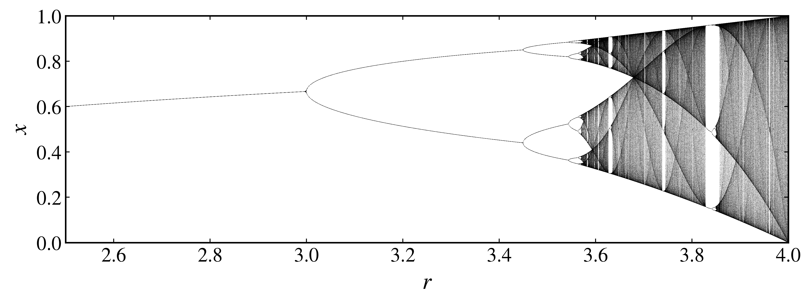
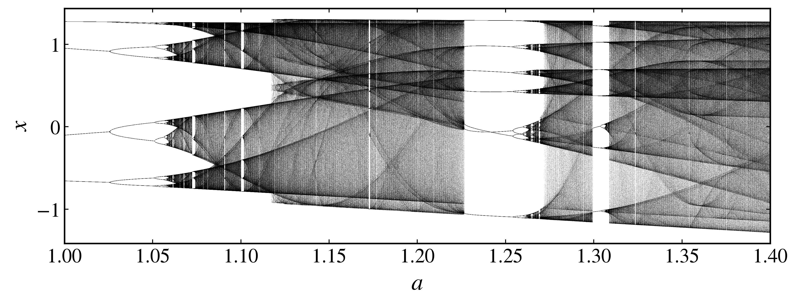

Bifurcation diagrams
--------------------

A bifurcation diagram shows how the long-term behavior of a dynamical system changes as a parameter varies. The :py:meth:`bifurcation_diagram <pynamicalsys.core.discrete_dynamical_systems.DiscreteDynamicalSystem.bifurcation_diagram>` method sweeps one parameter, discards an optional transient, and records one state coordinate at each remaining iteration.

Logistic map
~~~~~~~~~~~~

The logistic map is

.. math::

    x_{n+1}=rx_n(1-x_n),

where :math:`r` controls the transition between fixed, periodic, and chaotic behavior. Sweep 3000 evenly spaced values from :math:`r=2.5` to :math:`r=4`:

.. code-block:: python

    import numpy as np
    import matplotlib.pyplot as plt
    from pynamicalsys import DiscreteDynamicalSystem as dds, PlotStyler

    system = dds(model="logistic map")
    parameter_range = (2.5, 4.0, 3_000)
    total_time = 4_000
    transient_time = 1_000

    parameter_values, bifurcation_values = system.bifurcation_diagram(
        u=0.2,
        param_index=0,
        param_range=parameter_range,
        total_time=total_time,
        transient_time=transient_time,
    )

The tuple ``parameter_range`` contains ``(start, stop, num_points)``. Its third value requests 3000 parameter values, so ``parameter_values`` has shape ``(3000,)``. The method stores ``total_time - transient_time`` samples for every parameter value, giving ``bifurcation_values`` shape ``(3000, 3000)``.

Repeat each parameter value once for every stored sample, then flatten the observable values for plotting:

.. code-block:: python

    parameter_plot = np.repeat(
        parameter_values,
        bifurcation_values.shape[1],
    )
    observable_plot = bifurcation_values.ravel()

    ps = PlotStyler()
    ps.apply_style()
    fig, ax = plt.subplots(figsize=(10, 4))
    ax.scatter(parameter_plot, observable_plot, color="black", s=0.01, edgecolor="none")
    ax.set_xlim(parameter_range[0], parameter_range[1])
    ax.set_ylim(0.0, 1.0)
    ax.set_xlabel("$r$")
    ax.set_ylabel("$x$")
    fig.tight_layout()
    plt.show()

    Bifurcation diagram of the logistic map.

The logistic map has only one parameter, so ``param_index=0`` selects :math:`r`. For a system with several parameters, the index identifies which entry in the parameter array is varied.

Hénon map
~~~~~~~~~

The Hénon map is

.. math::

    \begin{aligned}
        x_{n+1} &= 1-ax_n^2+y_n, \\
        y_{n+1} &= bx_n.
    \end{aligned}

Its parameter order is ``[a, b]``. To vary :math:`a` while holding :math:`b=0.3`, store a placeholder in the first position. The sweep replaces that entry at every parameter value:

.. code-block:: python

    import numpy as np
    import matplotlib.pyplot as plt
    from pynamicalsys import DiscreteDynamicalSystem as dds, PlotStyler

    system = dds(model="henon map")
    system.set_parameters([0.0, 0.3])

    parameter_range = (1.0, 1.4, 3_000)
    total_time = 5_000
    transient_time = 1_000
    parameter_values, bifurcation_values = system.bifurcation_diagram(
        u=[0.2, 0.2],
        param_index=0,
        param_range=parameter_range,
        total_time=total_time,
        transient_time=transient_time,
    )

    parameter_plot = np.repeat(
        parameter_values,
        bifurcation_values.shape[1],
    )
    observable_plot = bifurcation_values.ravel()

    ps = PlotStyler()
    ps.apply_style()
    fig, ax = plt.subplots(figsize=(10, 4))
    ax.scatter(parameter_plot, observable_plot, color="black", s=0.01, edgecolor="none")
    ax.set_xlim(parameter_range[0], parameter_range[1])
    ax.set_xlabel("$a$")
    ax.set_ylabel("$x$")
    fig.tight_layout()
    plt.show()

    Bifurcation diagram of the Hénon map with :math:`b=0.3`.

By default, the recorded observable is the first state coordinate, selected by ``observable_index=0``. Pass ``observable_index=1`` to record :math:`y` instead. The observable index changes the plotted values but not the system trajectory.

Continuation sweeps
~~~~~~~~~~~~~~~~~~~

By default, every parameter value starts from the initial state supplied through ``u``. Set ``continuation=True`` to start each parameter value from the final state obtained at the preceding value instead. The order of ``start`` and ``stop`` in ``param_range`` determines the sweep direction. Set ``return_last_state=True`` when the final state of the entire sweep is also needed. The returned state has shape ``(system_dimension,)`` and can be used as the initial condition for another continuation sweep.
