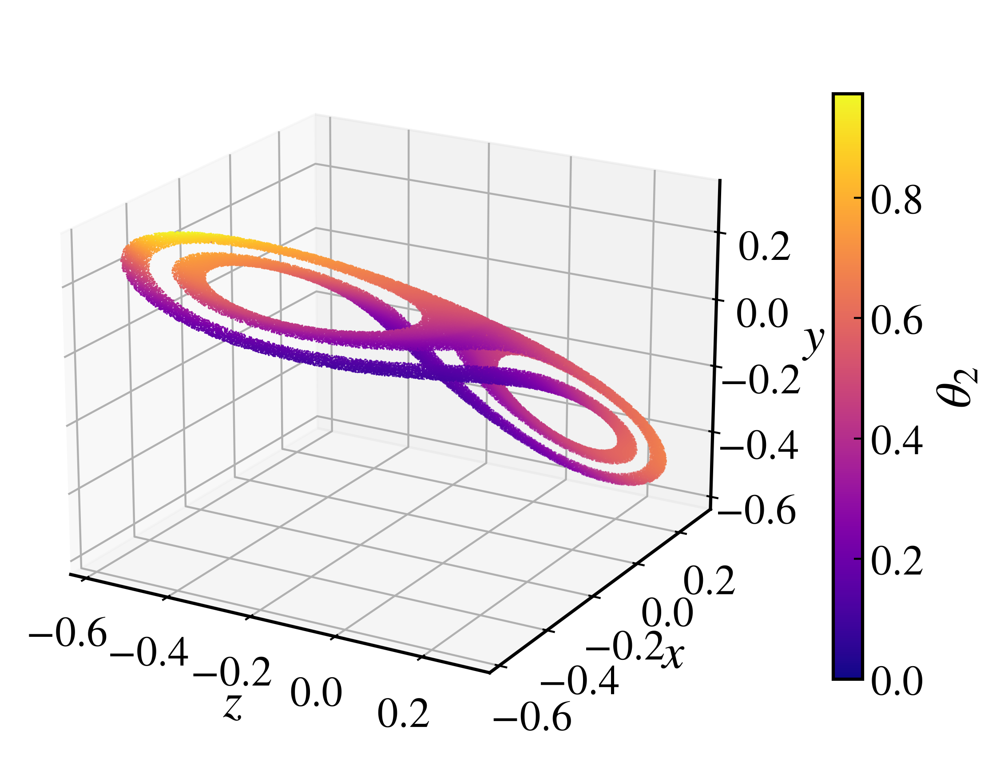
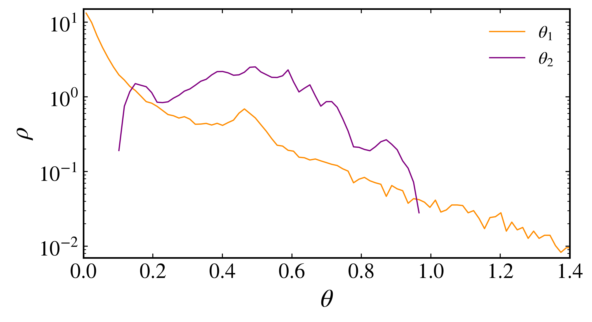

Covariant Lyapunov vectors
~~~~~~~~~~~~~~~~~~~~~~~~~~

Lyapunov exponents quantify average rates of expansion and contraction, but they do not identify the intrinsic tangent directions associated with those rates. Covariant Lyapunov vectors (CLVs) provide these local directions. Practical algorithms for computing them were introduced independently by `Ginelli et al. (2007) <https://doi.org/10.1103/PhysRevLett.99.130601>`_ and `Wolfe and Samelson (2007) <https://doi.org/10.1111/j.1600-0870.2007.00234.x>`_.

For a map :math:`\mathbf{x}_{n+1}=\mathbf{f}(\mathbf{x}_n)`, the :math:`i`-th CLV satisfies the covariance relation

.. math::

    D\mathbf{f}(\mathbf{x}_n)\mathbf{v}_i(\mathbf{x}_n)=\gamma_i(n)\mathbf{v}_i(\mathbf{x}_{n+1}),

where :math:`\gamma_i(n)` is the local expansion factor. The long-time average of :math:`\log|\gamma_i(n)|` gives the corresponding Lyapunov exponent :math:`\lambda_i`. Unlike the orthonormal vectors generated during the QR calculation of the Lyapunov spectrum, CLVs are generally not orthogonal and transform covariantly with the tangent dynamics. This makes them suitable for studying the geometry of stable, unstable, and center subspaces.

Computing the vectors
^^^^^^^^^^^^^^^^^^^^^

The :py:meth:`CLV <pynamicalsys.core.discrete_dynamical_systems.DiscreteDynamicalSystem.CLV>` method implements a Ginelli-style forward and backward algorithm. The following example uses the three-dimensional generalized Hénon map examined by `Kuptsov and Kuznetsov (2018) <https://doi.org/10.1134/S1560354718070079>`_,

.. math::

    x_{n+1}&=y_n,\\
    y_{n+1}&=z_n,\\
    z_{n+1}&=b x_n+c y_n+a z_n-z_n^2.

Define the map and its analytical Jacobian. The Jacobian carries the third ``mapping`` argument required by the common Jacobian signature, even though this analytical implementation does not use it:

.. code-block:: python

    import numpy as np
    import matplotlib.pyplot as plt
    from numba import njit
    from pynamicalsys import DiscreteDynamicalSystem as dds, PlotStyler

    @njit
    def henon_map_3d(u, parameters):
        a, b, c = parameters
        x, y, z = u
        x_new = y
        y_new = z
        z_new = b * x + c * y + a * z - z**2

        return np.array([x_new, y_new, z_new])

    @njit
    def henon_map_3d_jacobian(u, parameters, mapping):
        a, b, c = parameters
        x, y, z = u

        return np.array(
            [
                [0.0, 1.0, 0.0],
                [0.0, 0.0, 1.0],
                [b, c, a - 2.0 * z],
            ]
        )

    system = dds(
        mapping=henon_map_3d,
        jacobian=henon_map_3d_jacobian,
        system_dimension=3,
        parameters=[-1.11, 0.7, 0.77],
    )

Compute all three CLVs along the stored trajectory:

.. code-block:: python

    initial_state = [0.05, 0.05, 0.05]
    total_time = 100_000
    transient_time = 10_000
    warmup_time = 10_000
    tail_time = 10_000

    clvs, trajectory = system.CLV(
        u=initial_state,
        total_time=total_time,
        transient_time=transient_time,
        warmup_time=warmup_time,
        tail_time=tail_time,
    )
    print(clvs.shape)
    print(trajectory.shape)

.. code-block:: text

    (100001, 3, 3)
    (100001, 3)

The first axis contains the initial stored state and the following ``total_time`` iterations. At each stored state, ``clvs[n, :, i]`` is the :math:`i`-th CLV, ordered from the direction associated with the largest Lyapunov exponent to the direction associated with the smallest. Set ``num_clvs`` when only the leading vectors are needed.

The three time arguments serve different purposes. ``transient_time`` moves the initial condition onto the invariant set before the tangent-space calculation, ``warmup_time`` lets the forward orthonormal basis converge before storage begins, and ``tail_time`` advances beyond the stored interval to improve the initialization of the backward recursion. The reliability of the vectors near the ends of the stored interval should be checked by increasing ``warmup_time`` and ``tail_time``. The ``seed`` argument controls the random upper-triangular matrix used to initialize the backward stage.

Angles between tangent subspaces
^^^^^^^^^^^^^^^^^^^^^^^^^^^^^^^^

The :py:meth:`CLV_angles <pynamicalsys.core.discrete_dynamical_systems.DiscreteDynamicalSystem.CLV_angles>` method computes minimum principal angles between subspaces spanned by selected CLVs. Following `Kuptsov and Kuznetsov (2018) <https://doi.org/10.1134/S1560354718070079>`_, define :math:`\theta_j` as the angle between the subspace spanned by the first :math:`j` CLVs and the subspace spanned by the remaining CLVs.

For subspaces with orthonormal bases :math:`Q_A` and :math:`Q_B`, the minimum principal angle is

.. math::

    \theta_{A,B}(n)=\arccos\left[\sigma_{\max}\left(Q_A^TQ_B\right)\right].

For the three-dimensional generalized Hénon map, the two angles shown in Fig. 19(a) of Kuptsov and Kuznetsov are

.. math::

    \theta_1 = \angle\left(\operatorname{span}(\mathbf{v}_1),\operatorname{span}(\mathbf{v}_2,\mathbf{v}_3)\right),

.. math::

    \theta_2 = \angle\left(\operatorname{span}(\mathbf{v}_1,\mathbf{v}_2),\operatorname{span}(\mathbf{v}_3)\right).

The second angle separates the two-dimensional center-unstable subspace :math:`E^{cu}` from the one-dimensional strongly stable subspace :math:`E^s`. Request both subspace angles in the same order as the paper:

.. code-block:: python

    angles, angle_trajectory = system.CLV_angles(
        u=initial_state,
        total_time=total_time,
        subspaces=(
            ([0], [1, 2]),
            ([0, 1], [2]),
        ),
        transient_time=transient_time,
        warmup_time=warmup_time,
        tail_time=tail_time,
    )
    print(angles.shape)
    print(angle_trajectory.shape)

.. code-block:: text

    (100001, 2)
    (100001, 3)

The columns contain :math:`\theta_1` and :math:`\theta_2`, respectively. With the default ``use_abs=True``, vector orientation is ignored and the angles lie between 0 and :math:`\pi/2`.

Plot a subset of the computed points to keep the three-dimensional figure responsive. The CLVs and angles are still calculated at every iteration:

.. code-block:: python

    plot_step = 5
    points = angle_trajectory[::plot_step]
    theta_2 = angles[::plot_step, 1]

    ps = PlotStyler()
    ps.apply_style()
    fig, ax = plt.subplots(
        figsize=(6, 5),
        subplot_kw={"projection": "3d"},
    )
    points_plot = ax.scatter(
        points[:, 2],
        points[:, 0],
        points[:, 1],
        c=theta_2,
        cmap="plasma",
        vmin=0.0,
        vmax=np.pi / 2,
        s=0.5,
        edgecolor="none",
    )
    ax.set_xlabel("$z$")
    ax.set_ylabel("$x$")
    ax.set_zlabel("$y$")
    ax.view_init(elev=20, azim=-60)
    colorbar = fig.colorbar(points_plot, ax=ax, shrink=0.75, pad=0.08)
    colorbar.set_label(r"$\theta_2$")
    plt.savefig(
        f"{path_figures}/generalized_henon_map_clv_angles.png",
        dpi=400,
        bbox_inches="tight",
    )

    Generalized Hénon attractor colored by :math:`\theta_2`, corresponding to Fig. 20 of Kuptsov and Kuznetsov (2018).

Angles approaching zero indicate near-tangencies between the selected directions or subspaces. A distribution bounded away from zero supports a transversal splitting along the sampled trajectory, while values accumulating near zero reveal violations of uniform transversality. A finite trajectory cannot by itself prove uniform hyperbolicity, so the minimum angles and their distributions should be checked over longer trajectories and against changes in ``warmup_time`` and ``tail_time``. The use of CLV angles as a hyperbolicity diagnostic is discussed by `Ginelli et al. (2007) <https://doi.org/10.1103/PhysRevLett.99.130601>`_ and developed in detail by `Kuptsov and Parlitz (2012) <https://doi.org/10.1007/s00332-012-9126-5>`_.

Angle distributions
^^^^^^^^^^^^^^^^^^^

Reproduce Fig. 19(a) of `Kuptsov and Kuznetsov (2018) <https://doi.org/10.1134/S1560354718070079>`_ by estimating the distributions of :math:`\theta_1` and :math:`\theta_2` from their full histories. A distribution that remains separated from zero indicates that the corresponding tangent subspaces stay transversal along the sampled trajectory:

.. code-block:: python

    bins = np.linspace(0.0, np.pi / 2, 101)
    angle_labels = [
        r"$\theta_1$",
        r"$\theta_2$",
    ]
    colors = ["darkorange", "purple"]

    ps = PlotStyler()
    ps.apply_style()
    fig, ax = plt.subplots(figsize=(7, 4))
    for i, label in enumerate(angle_labels):
        density, edges = np.histogram(angles[:, i], bins=bins, density=True)
        centers = 0.5 * (edges[:-1] + edges[1:])
        ax.plot(centers, density, color=colors[i], label=label)
    ax.set_xlim(0.0, 1.4)
    ax.set_xticks(np.arange(0.0, 1.41, 0.2))
    ax.set_xlabel(r"$\theta$")
    ax.set_ylabel(r"$\rho$")
    ax.legend(frameon=False)
    fig.tight_layout()
    plt.savefig(
        f"{path_figures}/generalized_henon_map_clv_angle_distribution.png",
        dpi=400,
        bbox_inches="tight",
    )

    Distributions of :math:`\theta_1` and :math:`\theta_2` for the generalized Hénon map with the parameters of Fig. 19(a) in Kuptsov and Kuznetsov (2018).

The optional ``window_time`` argument can instead return window-averaged angles and the initial state of each window when a compact time-resolved summary is needed. Since averaging can hide isolated near-tangencies, the full angle histories are used here.

References
^^^^^^^^^^

.. container:: references-list

    - F\. Ginelli, P\. Poggi, A\. Turchi, H\. Chaté, R\. Livi, and A\. Politi, `Characterizing dynamics with covariant Lyapunov vectors <https://doi.org/10.1103/PhysRevLett.99.130601>`_, Physical Review Letters 99, 130601 (2007).
    - C\. L\. Wolfe and R\. M\. Samelson, `An efficient method for recovering Lyapunov vectors from singular vectors <https://doi.org/10.1111/j.1600-0870.2007.00234.x>`_, Tellus A 59, 355-366 (2007).
    - P\. V\. Kuptsov and U\. Parlitz, `Theory and computation of covariant Lyapunov vectors <https://doi.org/10.1007/s00332-012-9126-5>`_, Journal of Nonlinear Science 22, 727-762 (2012).
    - P\. V\. Kuptsov and S\. P\. Kuznetsov, `Lyapunov analysis of strange pseudohyperbolic attractors: angles between tangent subspaces, local volume expansion and contraction <https://doi.org/10.1134/S1560354718070079>`_, Regular and Chaotic Dynamics 23, 908-932 (2018).
