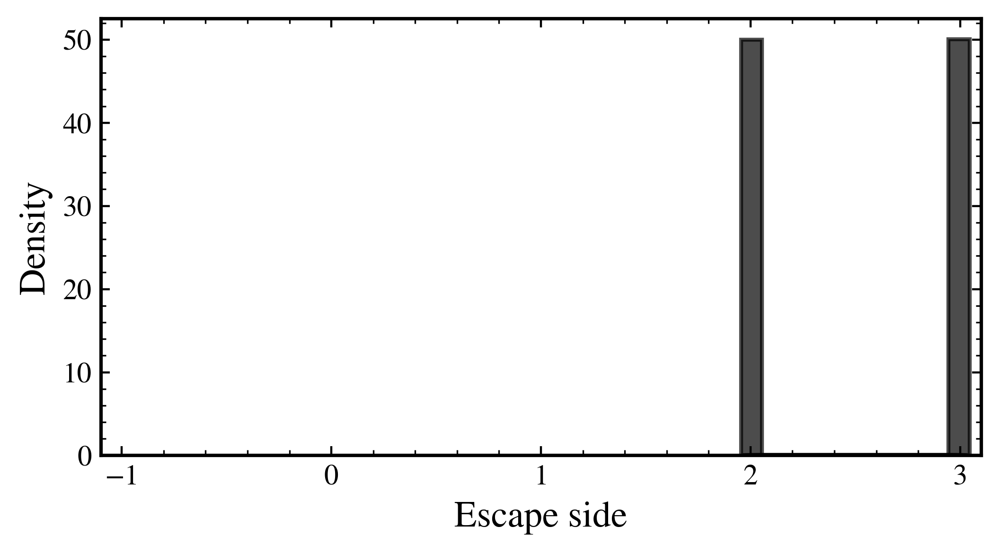
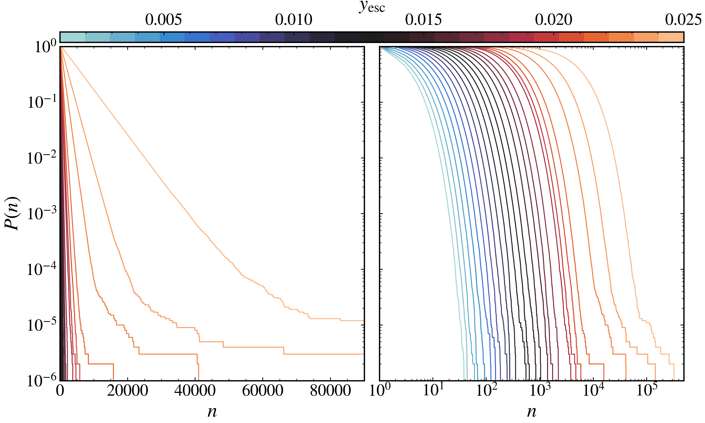

Escape analysis in dynamical systems
------------------------------------

This section discusses the analysis of escape dynamics in discrete dynamical systems using pynamicalsys. Escape dynamics refers to the behavior of trajectories that leave a bounded region in the phase space or escape thorough a hole in the system. Escape analysis is crucial for understanding the long-term behavior of dynamical systems, especially in chaotic regimes. pynamicalsys provides tools to analyze escape dynamics, including the computation of escape basin, escape rates and quantification of basins of attraction.

The escape analysis is performed using the :py:meth:`escape_analysis <pynamicalsys.core.discrete_dynamical_systems.DiscreteDynamicalSystem.escape_analysis>` method of the :py:class:`DiscreteDynamicalSystem <pynamicalsys.core.discrete_dynamical_systems.DiscreteDynamicalSystem>` class. In general, the escape analysis can be in two forms:

1. The ensemble of particles, i.e., the set of initial conditions, is initialized within a bounded region in phase space, and the escape dynamics is analyzed by tracking when the particles leave this region.
2. Or the ensemble of particles is initialized within a region that contains a hole, and the escape dynamics is analyzed by tracking when the particles leave through this hole.

Escaping from a bounded region in phase space
~~~~~~~~~~~~~~~~~~~~~~~~~~~~~~~~~~~~~~~~~~~~~

Let's consider the first case, where we analyze the escape dynamics of a discrete dynamical system by tracking when particles leave a bounded region in phase space. We are going to use the Leonel map as an example, which is defined as follows:

.. math::

    \begin{align*}
    y_{n + 1} &= y_n + \epsilon \sin(x_n),\\
    x_{n + 1} &= x_n + \frac{1}{|y_{n + 1}|^\gamma}\bmod2\pi,
    \end{align*}

where :math:`\epsilon` is a parameter that controls the strength of the nonlinearity, and :math:`\gamma \geq 0` controls the speed of the divergence of the :math:`x` variable in the limit :math:`y\rightarrow0`. Due to the divergent behavior of the second term in the :math:`y` equation, for :math:`y` sufficiently small, the variables :math:`x_{n + 1}` and :math:`x_n` become uncorrelated and chaotic behavior appears for extremelly small, but nonzero, values of the perturbation :math:`\epsilon`.

Before performing the escape analysis, let's take a look at the phase space of the Leonel map for a few different perturbation parameters.

.. code-block:: python

    from pynamicalsys import DiscreteDynamicalSystem as dds
    import numpy as np

    ds = dds(model="leonel map")

    # Define the perturbation parameters and the divergence parameter
    eps = [1e-4, 1e-3, 1e-2]
    gamma = 1 
    
    # Define the total time for the trajectories
    total_time = 7000000

    # Define the initial conditions for the trajectories
    u = [np.pi, 1e-10]

    # Compute the trajectories for different perturbation parameters
    trajectories = [ds.trajectory(u, total_time, parameters=[eps[i], gamma]) for i in range(len(eps))]

We then plot the trajectories in the phase space:

.. code-block:: python

    from pynamicalsys import PlotStyler
    import matplotlib.pyplot as plt

    # Set the style for the plots
    ps = PlotStyler(fontsize=20, markersize=0.1, markeredgewidth=0, minor_ticks_visible=True)
    ps.apply_style()

    # Create the figure and axes for the plots
    fig, ax = plt.subplots(1, 3, sharex=True, figsize=(12, 8))
    
    # Plot the trajectories in the phase space
    for i in range(len(eps)):
        ax[i].plot(trajectories[i][:, 0], trajectories[i][:, 1], "ko")
        ax[i].set_xlabel("$x$")
        ax[i].set_title(fr"$\epsilon = {eps[i]}$", fontsize=20)
    
    # Set the y-axis limits and labels
    ax[0].set_xlim(0, 2 * np.pi)
    ax[0].set_ylabel("$y$")
    plt.xticks([0, np.pi / 2, np.pi, 3 * np.pi / 2, 2 * np.pi],
            [r"$0$", r"$\pi/2$", r"$\pi$", r"$3\pi/2$", r"$2\pi$"])
    
    plt.tight_layout(pad=0.)
    plt.show()

.. figure:: images/leonel_map_trajectory.png
   :align: center
   :width: 100%
   
   The phase space of the Leonel map for different perturbation parameters, namely, :math:`\epsilon = 0.0001`, :math:`\epsilon = 0.001`, and :math:`\epsilon = 0.01`.

Now, since this is a closed system, we can define a bounded region in phase space and consider that the particle has escaped when it leaves this region. For the Leonel map, we define the bounded region as a rectangle in phase space defined by :math:`(x, y) \in [0, 2\pi] \times [-y_{\mathrm{esc}}, y_{\mathrm{esc}}]`, where :math:`y_{\mathrm{esc}}` is the escape threshold in the :math:`y` variable. The escape threshold can then be changed to analyze the escape dynamics for different values of :math:`y_{\mathrm{esc}}`.

To perform the escape analysis, we can use the following code snippet:

.. code-block:: python

    # Define the total time for the trajectories
    total_time = int(1e6)

    # Define the number of initial conditions
    num_ic = int(1e5)

    # Set the seed for reproducibility
    np.random.seed(13)

    # Define and generate the initial conditions the initial conditions
    x_range = (0, 2 * np.pi, num_ic)
    y_range = (-1e-14, 1e-14, num_ic)
    x = np.random.uniform(*x_range)
    y = np.random.uniform(*y_range)
    
    # Define the escape regions
    y_esc = np.logspace(np.log10(1e-3), np.log10(0.025), 25)
    x_esc = (0, 2 * np.pi)

    # Perform the escape analysis
    escapes = np.zeros((len(y_esc), num_ic, 2))
    for i in range(len(y_esc)):
        
        # Define the exit region for the escape analysis
        exit = np.array([[x_esc[0], x_esc[1]], [-y_esc[i], y_esc[i]]])
        
        # Perform the escape analysis for each initial condition
        escapes[i] = [ds.escape_analysis(np.array([x[j], y[j]]), total_time, exit, parameters=parameters, escape="exiting") for j in range(num_ic)]
    
    escapes = np.array(escapes, dtype=np.int32)

First, let's understand the output of the :py:meth:`escape_analysis <pynamicalsys.core.discrete_dynamical_systems.DiscreteDynamicalSystem.escape_analysis>` method. The method returns a 2D array of shape `(num_ic, 2)`, where each row corresponds to an initial condition and contains the following information:

- The first column contains the exit point of the particle, which is either the exit region or the hole through which the particle escapes. In our case that we have a two-dimensional box, the exit point represents whether the particle has escaped through the left (0) or right (1) side of the box, or through the bottom (2) or top (3) side. If the particle does not escape, the exit point is set to -1.
- The second column contains the time step at which the particle escapes the bounded region.

Since we have defined the box covering the hole :math:`x` variable and :math:`x` is cyclic, the particle never escapes through the left or right side of the box, so the first column will always be either 2 or 3, indicating that the particle escapes through the bottom or top side of the box. We can visualize the distribution of escape and check whether more particles escape through the bottom or top side of the box for different values of :math:`y_{\mathrm{esc}}`.

.. code-block:: python

    # Create a histogram of the escape times using numpy for all values of y_esc
    escape_basin = escapes[:, :, 0].flatten()
    escape_basin = escape_basin[escape_basin != 0]  # Remove zeros (no escape)
    escape_hist, escape_bins = np.histogram(escape_basin, density=True, bins=100)
    escape_bins = (escape_bins[:-1] + escape_bins[1:]) / 2  # Get the bin centers

    # Set the style for the plot
    ps = PlotStyler(fontsize=14, minor_ticks_visible=True, linewidth=1.5)
    ps.apply_style()

    # Create the figure and axes for the plot
    fig, ax = plt.subplots(figsize=(6, 3))

    # Plot the histogram of escape times
    ax.bar(escape_bins, escape_hist, color='black', linewidth=1.5, width=.1, align='center', edgecolor='black', alpha=0.7)

    # Set the x and y labels and limits
    ax.set_xlabel("Escape side")
    ax.set_ylabel("Density")
    ax.set_xlim(-1.1, 3.1)
    ax.set_xticks([-1, 0, 1, 2, 3])

    plt.show()

   
   The escape basin of the Leonel map for different values of :math:`y_{\mathrm{esc}}`. The x-axis represents the escape side, where -1 indicates no escape, 0 indicates escape through the left side, 1 indicates escape through the right side, 2 indicates escape through the bottom side, and 3 indicates escape through the top side. The y-axis represents the density of particles that escaped through each side.

Indeed, no particles escape through the left or right side of the box, and they escape evenly through the bottom and top sides of the box. This is expected since there is no preferential direction for the escape of particles for this system. Additionally, *all* particles escape the bounded region.

Now, what about the escape times? To understand the escape times, we compute the survival probability, which is the probability that a particle has not escaped the bounded region at a given time step. The survival probability can be computed as follows:

.. math::

    P(n) = \frac{N(n)}{N_0}

where :math:`N(n)` is the number of particles that have not escaped at time :math:`t`, and :math:`N_0` is the total number of particles. The survival probability can be computed using the :py:meth:`survival_probability <pynamicalsys.core.discrete_dynamical_systems.DiscreteDynamicalSystem.survival_probability>`. The following code snippet demonstrates how to compute the survival probability for the escape analysis we performed above:

.. code-block:: python

    sp = []
    times = []
    for i in range(len(y_esc)):
        time, survival_probability = ds.survival_probability(escapes[i, :, 1], escapes[i, :, 1].max())
        sp.append(survival_probability)
        times.append(time)

The method returns the time steps and the survival probability for each time step. For strongly chaotic systems, the survival probability decays exponentially, and we can visualize this decay using a semi-logarithmic plot. The following code snippet demonstrates how to plot the survival probability for the escape analysis we performed above:

.. code-block:: python

    from pynamicalsys import PlotStyler
    import matplotlib.pyplot as plt
    import matplotlib as mpl
    import seaborn as sns
    from matplotlib.colors import ListedColormap

    # Create the list of colors for the color map
    colors = sns.color_palette("icefire", len(y_esc))
    
    # Create a colormap from the list of colors
    cmap = ListedColormap(colors)
    norm = mpl.colors.Normalize(vmin=min(y_esc), vmax=max(y_esc))
    # Create the ScalarMappable
    sm = mpl.cm.ScalarMappable(cmap=cmap, norm=norm)

    # Calculate the maximum time step across all escape analyses
    max_val = max(array.max() for array in times)

    # Set the style for the plot
    ps = PlotStyler(minor_ticks_visible=True)
    ps.apply_style()

    # Create the figure and axes for the plot
    fig, ax = plt.subplots(1, 2, sharey=True, figsize=(10, 6))

    # Plot the survival probability for each escape analysis
    for i in range(len(y_esc)):
        ax[0].plot(times[i], sp[i], color=colors[i])
        ax[1].plot(times[i], sp[i], color=colors[i])

    # Define the limits and labels for the axes
    ax[0].set_xlim(0, 9e4)
    ax[0].set_yscale("log")
    ax[0].set_ylabel(r"$P(n)$")
    ax[0].set_xlabel(r"$n$")
    ax[0].set_ylim(1 / num_ic, 1)
    ax[1].set_xscale("log")
    ax[1].set_xlim(1, max_val)
    ax[1].set_xlabel(r"$n$")

    # Create the colorbar for the escape threshold
    cbar = fig.colorbar(sm, ax=ax, aspect=60, location="top", pad=1)
    cbar.set_label(r"$y_\mathrm{esc}$")
    left, right, top, bottom, wspace = 0.085, 0.97, 0.89, 0.1, 0.05
    plt.subplots_adjust(left=left, right=right, top=top, bottom=bottom, wspace=wspace)
    pos = [left, top + 0.01, right - left, 0.1]  # Raise it by 0.02
    cbar.ax.set_position(pos)

    plt.show()

   
   The survival probability for the escape analysis of the Leonel map for different values of :math:`y_{\mathrm{esc}}`. The left plot shows the survival probability as a function of time in a semi-logarithmic scale, while the right plot shows the same data in a logarithmic scale for both axes. The color of the lines represents the escape threshold :math:`y_{\mathrm{esc}}`.

Escaping through a hole in the system
~~~~~~~~~~~~~~~~~~~~~~~~~~~~~~~~~~~~~

In this case, we analyze the escape dynamics of a discrete dynamical system by tracking when particles leave through a hole in the system. We are going to use the Weiss map as an example, which is defined as follows:

.. math::

    \begin{align*}
    y_{n + 1} &= y_n - k \sin(x_n),\\
    x_{n + 1} &= x_n + k (y_{n + 1}^2 - 1)\bmod2\pi,
    \end{align*}

where :math:`k` is a parameter that controls the strength of the nonlinearity. The Weiss map is a nontwist, area-preserving map, which means that the twist condition, :math:`\partial x_{n + 1} / \partial y_n \neq 0`, is not satisfied.

This system is not built-in in pynamicalsys, so we first need to define it as a custom discrete dynamical system. The following code snippet demonstrates how to define the Weiss map in pynamicalsys:

.. code-block:: python

    from pynamicalsys import DiscreteDynamicalSystem as dds
    import numpy as np
    from numba import njit

    @njit
    def weiss_map(u, parameters):
        k = parameters[0]
        x, y = u
        y_new = y - k * np.sin(x)
        x_new = (x + k * (y_new ** 2 - 1) + np.pi) % (2 * np.pi) - np.pi

        return np.array([x_new, y_new])

With the Weiss map defined, we can proceed with the escape analysis. We are going to consider two holes in phase space, with width 0.2 and centered at :math:`(x, y) = (0.0, -1.1)` and :math:`(x, y) = (\pi - 0.1, 1.0)`. The correspoding exit basins are denoted as :math:`\mathcal{B}_1` and :math:`\mathcal{B_2}` and we color the points black and red, respectively. If the initial condition does not escape, we denote it as :math:`\mathcal{B}_\infty` and we color the point white. The following code snippet demonstrates how to perform the escape analysis for the Weiss map:

.. code-block:: python

    # Define the Weiss map as a discrete dynamical system
    ds = dds(mapping=weiss_map, system_dimension=2, number_of_parameters=1)

    # Define the centers of the holes and the hole size
    centers = np.array([[0.0, -1.1],
                    [np.pi - 0.1, 1.0]], dtype=np.float64)
    hole_size = 0.2

    # Define the maximum time for the trajectories
    total_time = 10000

    # Define the parameters for the Weiss map
    ks = [0.5, 0.55, 0.60, 0.70]

    # Define the phase space region for the escape analysis
    grid_size = 1000
    x_range = (-np.pi, np.pi, grid_size)
    y_range = (-np.pi, np.pi, grid_size)
    X = np.linspace(*x_range)
    Y = np.linspace(*y_range)

    # We are going to parallelize the escape analysys
    from joblib import Parallel, delayed
    import itertools

    # Define the array to store the escape results
    escapes = np.zeros((len(ks), grid_size, grid_size, 2))

    # Perform the escape analysis for each value of k
    for i, k in enumerate(ks):
        escape = Parallel(n_jobs=-1)(
            delayed(ds.escape_analysis)([x, y], total_time, centers, parameters=k, hole_size=size_exit)
            for x, y in itertools.product(X, Y)
        )
        escape = np.array(escape).reshape(grid_size, grid_size, 2)

        escapes[i, :, :, :] = escape
    
We then plot the escape basins together with the escape times. The following code snippet demonstrates how to plot the escape basins and escape times for the Weiss map:

.. code-block:: python

    import matplotlib.pyplot as plt
    from pynamicalsys import PlotStyler
    from matplotlib.colors import ListedColormap
    import matplotlib as mpl

    # Set the plot style
    ps = PlotStyler()
    ps.apply_style()

    # Create the figure and axes for the plots
    fig, ax = plt.subplots(2, 4, sharex=True, sharey=True, figsize=(10, 5))
    plt.tight_layout(pad=0)

    # Create a colormap for the escape basins
    colors = ["#FFFFFF", "#000000", "#DC143C"]
    cmap = ListedColormap(colors)
    bounds = [-1.5, -0.5, 0.5, 1.5]
    norm = BoundaryNorm(boundaries=bounds, ncolors=len(colors))

    # Plot the escape basins and escape times for each value of k
    x_grid, y_grid = np.meshgrid(X, Y, indexing='ij')
    for i, k in enumerate(ks):
        hm1 = ax[0, i].pcolormesh(x_grid, y_grid, escapes[i, :, :, 0], cmap=cmap, norm=norm)
        hm2 = ax[1, i].pcolormesh(x_grid, y_grid, escapes[i, :, :, 1], cmap="nipy_spectral", norm=mpl.colors.LogNorm(vmin=1e0, vmax=total_time))
        ax[1, i].set_xlabel(r"$x$")

    # Define the labels
    ax[0, 0].set_ylabel(r"$y$")
    ax[1, 0].set_ylabel(r"$y$")
    ax[0, 0].set_xticks([-np.pi, -np.pi / 2, 0, np.pi / 2, np.pi])
    ax[0, 0].set_xticklabels([r"$-\pi$", r"$-\pi/2$", r"$0$", r"$\pi/2$", r"$\pi$"])
    ax[0, 0].set_yticks([-np.pi, -np.pi / 2, 0, np.pi / 2, np.pi])
    ax[0, 0].set_yticklabels([r"$-\pi$", r"$-\pi/2$", r"$0$", r"$\pi/2$", r"$\pi$"])

    # Create the colorbars for the escape basins and escape times
    cbar1 = fig.colorbar(hm1, ax=ax[0, :], aspect=20, pad=0.005, fraction=0.02)
    cbar1.set_label(r"Escape basin")
    cbar1.set_ticks([-1, 0, 1])
    cbar1.set_ticklabels([r"$\mathcal{B}_\infty$", r"$\mathcal{B}_0$", r"$\mathcal{B}_1$"])

    cbar2 = fig.colorbar(hm2, ax=ax[1, :], aspect=20, pad=0.005, fraction=0.02)
    cbar2.set_label(r"$T_\mathrm{esc}$")

    plt.show()

.. figure:: images/weiss_map_escape_analysis.png
   :align: center
   :width: 100%

   The escape basins (top row) and escape times (bottom row) for the Weiss map for different values of :math:`k`, namely, :math:`k = 0.5`, :math:`k = 0.55`, :math:`k = 0.6`, and :math:`k = 0.7`.

We can quantify the complexity of the escape basins by computing the basin entropy. We use the :py:meth:`basin_entropy <pynamicalsys.core.basin_metrics.BasinMetrics.basin_entropy>` method from the :py:class:`BasinMetrics <pynamicalsys.core.basin_metrics.BasinMetrics>` class in pynamicalsys to compute the basin entropy for each escape basin. The basin entropy is defined as follows: Given a region in phase space :math:`\mathcal{R}` which contains :math:`N_A` distinguishable assymptotic state. We divide the region :math:`\mathcal{R}` into a mesh of :math:`N_T \times N_T` boxes of linear size :math:`\delta`. Each box has a large number of initial conditions and each one leads to one of the :math:`N_A` assymptotic states. For each box :math:`i`, we associate a probability :math:`p_{ij}` of a assymptotic state :math:`j` to be present in the box and define the Shanon entropy of the :math:`i`-th box as:

.. math::

    S_i = -\sum_{j=1}^{n_i} p_{ij} \log(p_{ij}),

where :math:`n_i \in [1, N_A]` is the number of assymptotic states present in the box. The total entropy of the basin is defined as the sum of the entropies of all boxes:

.. math::

    S = \sum_{i=1}^{N_T^2} S_i.

The basin entropy is then defined as the average entropy of the basin over all boxes:

.. math::

    S_\mathrm{b} = \frac{S}{N_T^2}.

This quantity is a measure of the complexity of the escape basin, with higher values indicating more complex basins. The basin boundary entropy, on the other hand, is a measure of the complexity of the boundary of the basin. It is defined as the total entropy divided by the number of boxes that contain more than one assymptotic state, i.e, the boxes that are on the boundary of the basin:

.. math::

    S_\mathrm{bb} = \frac{S}{N_b},

where :math:`N_b` is the number of boxes that contain more than one assymptotic state.

Numerically, instead of defining directly :math:`N_T`, we define the number of initial conditions per box, :math:`n`, which means that each one of the :math:`N_T^2` boxes contains :math:`n^2` initial conditions. The number of boxes is then defined as :math:`N_T = N / n`, where :math:`N` is the size of the grid in phase space, i.e., :math:`N \times N`. The size of the grid should then be divisible by :math:`n`. In our previous example, we have used a grid of size 1000, which means that :math:`N = 1000`, and we can choose :math:`n` to be any divisor of 1000. For example, we can choose :math:`n = 5`, which means that each box contains 25 initial conditions. The number of boxes is then :math:`N_T = 1000 / 5 = 200`.

The following code snippet demonstrates how to compute the basin entropy and basin boundary entropy for the escape analysis we performed above:

.. code-block:: python

    from pynamicalsys import BasinMetrics

    n = 5
    for i, k in enumerate(ks):
        # Initalize the BasinMetrics object with the escape basin
        bm = BasinMetrics(escapes[i, :, :, 0])

        # Compute the basin entropy and basin boundary entropy
        be = bm.basin_entropy(n, log_base=2)

        # Print the basin entropy and basin boundary entropy
        print(f"Sb: {be[0]}, Sbb: {be[1]}")

.. code-block:: text

    Sb: 0.2810428008488598, Sbb: 0.576261637992331
    Sb: 0.49217462289428604, Sbb: 0.7052727991606879
    Sb: 0.9369599277786193, Sbb: 1.218770027353412
    Sb: 1.2079996025359803, Sbb: 1.466864518425039
