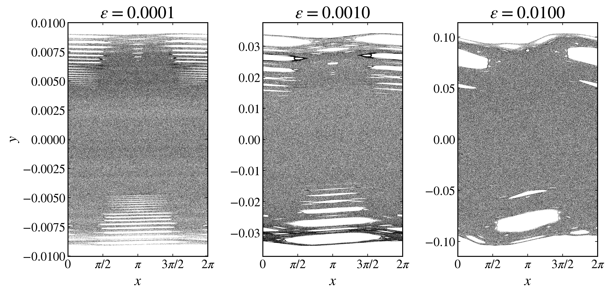
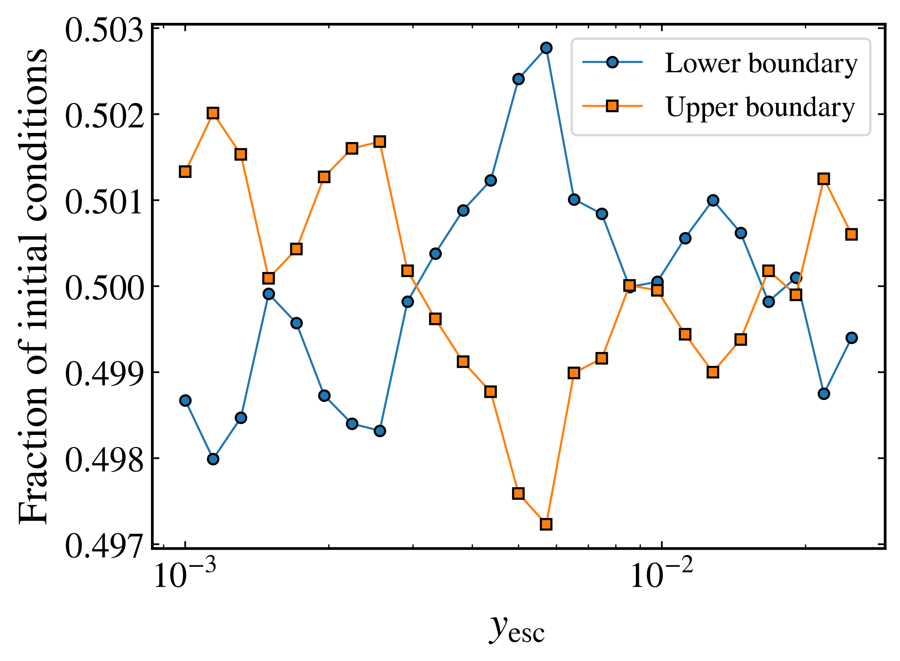
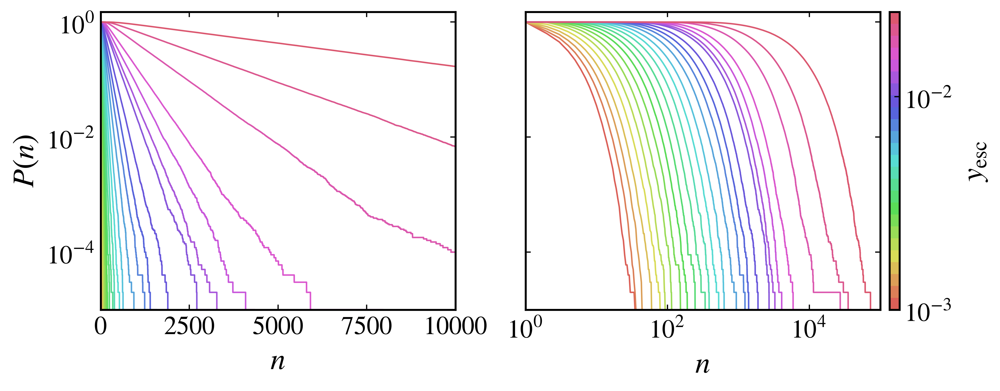
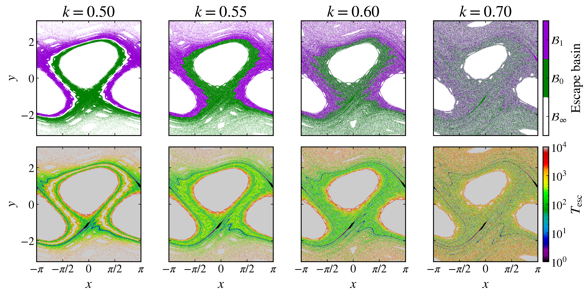

Escape dynamics
---------------

An open dynamical system removes a trajectory when it satisfies a prescribed escape condition. The escape condition may be leaving a bounded region or entering one of several holes. For an ensemble of initial conditions, the resulting escape indices define escape basins, while the escape times describe how quickly trajectories leave the system.

The :py:meth:`escape_analysis <pynamicalsys.core.discrete_dynamical_systems.DiscreteDynamicalSystem.escape_analysis>` method follows one initial condition for at most ``max_time`` iterations and returns ``(escape_index, escape_time)``. The meaning of ``escape_index`` is controlled by ``escape``:

``escape="exiting"``
    ``exits`` defines a bounded region with shape ``(system_dimension, 2)``. Each row contains the lower and upper limits of one coordinate. The returned index identifies the first boundary crossed, with ``2 * i`` for the lower boundary of coordinate ``i`` and ``2 * i + 1`` for its upper boundary.

``escape="entering"``
    ``exits`` contains the centers of one or more holes. The scalar ``hole_size`` is the side length of the hyperrectangular holes constructed around those centers. The returned index identifies the first hole entered.

In both modes, a trajectory that does not escape within ``max_time`` returns ``(-1, max_time)``. This is a right-censored observation rather than evidence that the trajectory can never escape.

Leaving a bounded region
~~~~~~~~~~~~~~~~~~~~~~~~

Consider the family of discrete Hamiltonian maps studied by `Borin et al. (2023) <https://doi.org/10.1016/j.chaos.2023.113965>`_, which is available as the built-in Leonel map:

.. math::

    \begin{aligned}
        y_{n+1} &= y_n+\varepsilon\sin(x_n), \\
        x_{n+1} &= x_n+\frac{1}{|y_{n+1}|^\gamma}\pmod{2\pi},
    \end{aligned}

where :math:`\varepsilon` controls the perturbation and :math:`\gamma\geq0` controls the divergence of the angular increment as :math:`y_{n+1}` approaches zero. The built-in model expects the parameters in the order ``[epsilon, gamma]``.

The following example compares trajectories for three values of :math:`\varepsilon` while keeping :math:`\gamma=1`:

.. code-block:: python

    import numpy as np
    import matplotlib.pyplot as plt
    import matplotlib as mpl
    import seaborn as sns
    from pynamicalsys import DiscreteDynamicalSystem as dds, PlotStyler

    system = dds(model="leonel map")

    epsilon_values = [1e-4, 1e-3, 1e-2]
    gamma = 1.0
    total_time = 1_000_000
    initial_state = [np.pi, 1e-10]

    trajectories = [
        system.trajectory(
            u=initial_state,
            total_time=total_time,
            parameters=[epsilon, gamma],
        )
        for epsilon in epsilon_values
    ]

The trajectories are plotted in phase space as follows:

.. code-block:: python

    ps = PlotStyler()
    ps.apply_style()
    fig, ax = plt.subplots(1, 3, figsize=(12, 6), sharex=True)
    for i, epsilon in enumerate(epsilon_values):
        ax[i].plot(
            trajectories[i][:, 0],
            trajectories[i][:, 1],
            "ko",
            markersize=0.2,
            markeredgewidth=0.0,
        )
        ax[i].set_title(rf"$\varepsilon={epsilon:.4f}$")
        ax[i].set_xlabel("$x$")
        ax[i].set_xlim(0.0, 2.0 * np.pi)
    ax[0].set_ylabel("$y$")
    ax[0].set_xticks(
        [0.0, np.pi / 2.0, np.pi, 3.0 * np.pi / 2.0, 2.0 * np.pi],
        [r"$0$", r"$\pi/2$", r"$\pi$", r"$3\pi/2$", r"$2\pi$"],
    )
    fig.tight_layout()
    plt.show()

    Phase space of the Leonel map for three perturbation strengths.

For escape analysis, define the bounded region :math:`(x,y)\in[0,2\pi]\times[-y_{\mathrm{esc}},y_{\mathrm{esc}}]`. Because :math:`x` is represented modulo :math:`2\pi`, trajectories can leave only through the lower or upper :math:`y` boundary, whose face indices are 2 and 3.

.. code-block:: python

    system.set_parameters([1e-3, 1.0])

    max_time = 1_000_000
    num_initial_conditions = 100_000
    np.random.seed(13)
    x_initial = np.random.uniform(
        0.0,
        2.0 * np.pi,
        num_initial_conditions,
    )
    y_initial = np.random.uniform(
        -1e-14,
        1e-14,
        num_initial_conditions,
    )
    initial_states = np.column_stack((x_initial, y_initial))
    escape_thresholds = np.logspace(np.log10(1e-3), np.log10(0.025), 25)

    escape_results = np.empty(
        (len(escape_thresholds), num_initial_conditions, 2),
        dtype=np.int64,
    )
    for i, escape_threshold in enumerate(escape_thresholds):
        bounded_region = np.array(
            [
                [0.0, 2.0 * np.pi],
                [-escape_threshold, escape_threshold],
            ]
        )
        escape_results[i] = np.array(
            [
                system.escape_analysis(
                    u=initial_state,
                    max_time=max_time,
                    exits=bounded_region,
                    escape="exiting",
                )
                for initial_state in initial_states
            ],
            dtype=np.int64,
        )

The fraction assigned to each face includes only trajectories that actually crossed that face. Any remaining fraction corresponds to the censored index :math:`-1`:

.. code-block:: python

    lower_fraction = np.mean(escape_results[:, :, 0] == 2, axis=1)
    upper_fraction = np.mean(escape_results[:, :, 0] == 3, axis=1)

    ps = PlotStyler()
    ps.apply_style()
    fig, ax = plt.subplots()
    ax.plot(escape_thresholds, lower_fraction, "o-", label="Lower boundary")
    ax.plot(escape_thresholds, upper_fraction, "s-", label="Upper boundary")
    ax.set_xscale("log")
    ax.set_xlabel(r"$y_{\mathrm{esc}}$")
    ax.set_ylabel("Fraction of initial conditions")
    ax.legend()
    fig.tight_layout()
    plt.show()

    Fractions of Leonel-map initial conditions escaping through the lower and upper boundaries for each escape threshold.

Survival probability
~~~~~~~~~~~~~~~~~~~~

If :math:`T` is the escape time, the survival probability is

.. math::

    P(n)=\Pr(T>n)=\frac{N(n)}{N_0},

where :math:`N_0` is the initial ensemble size and :math:`N(n)` is the number of trajectories whose escape time is strictly greater than :math:`n`. The :py:meth:`survival_probability <pynamicalsys.core.discrete_dynamical_systems.DiscreteDynamicalSystem.survival_probability>` method evaluates this empirical probability from a one-dimensional array of escape times. ``min_time`` and ``time_step`` control the sampled iteration values.

.. code-block:: python

    survival_times = []
    survival_probabilities = []
    for i in range(len(escape_thresholds)):
        times, probability = system.survival_probability(
            escape_times=escape_results[i, :, 1],
            max_time=max_time,
            min_time=1,
            time_step=1,
        )
        survival_times.append(times)
        survival_probabilities.append(probability)

Plotting the same curves on semilogarithmic and logarithmic axes helps distinguish an exponential decay from a slower tail. A straight segment on the semilogarithmic plot is consistent with exponential escape, while a straight segment on the logarithmic plot is consistent with a power law. `Borin et al. (2023) <https://doi.org/10.1016/j.chaos.2023.113965>`_ found exponential survival in a fully chaotic region of this map and a slower late-time decay when the survival region included stability islands, identifying the change as a signature of stickiness. These interpretations require a resolved scaling interval and should not be inferred from a short visual segment.

.. code-block:: python

    colors = sns.color_palette("hls", len(escape_thresholds))

    norm = mpl.colors.LogNorm(
        vmin=escape_thresholds.min(),
        vmax=escape_thresholds.max(),
    )

    cmap = mpl.colors.ListedColormap(colors)
    scalar_map = mpl.cm.ScalarMappable(norm=norm, cmap=cmap)

    ps = PlotStyler()
    ps.apply_style()
    fig, ax = plt.subplots(1, 2, figsize=(10, 4), sharey=True)
    for i, color in enumerate(colors):
        positive = survival_probabilities[i] > 0.0
        ax[0].plot(
            survival_times[i][positive],
            survival_probabilities[i][positive],
            color=color,
        )
        ax[1].plot(
            survival_times[i][positive],
            survival_probabilities[i][positive],
            color=color,
        )
    ax[0].set_ylim(1 / num_initial_conditions, 1.5e0)
    ax[0].set_xlim(0, 10000)
    ax[0].set_yscale("log")
    ax[0].set_xlabel("$n$")
    ax[0].set_ylabel("$P(n)$")
    ax[1].set_xlim(1e0, 1e5)
    ax[1].set_xscale("log")
    ax[1].set_yscale("log")
    ax[1].set_xlabel("$n$")

    fig.tight_layout()
    colorbar = fig.colorbar(
        scalar_map,
        ax=ax,
        label=r"$y_{\mathrm{esc}}$",
        aspect=30,
        pad=0.01,
    )
    colorbar.ax.minorticks_off()

    plt.show()

    Survival probabilities for the Leonel map on semilogarithmic and logarithmic axes.

Entering holes
~~~~~~~~~~~~~~

For ``escape="entering"``, every row of ``exits`` is the center of a hole and ``hole_size`` gives its side length in every coordinate. The method returns the zero-based index of the first hole entered. The map was introduced by `Weiss (1991) <https://doi.org/10.1063/1.858068>`_, while the following hole configuration reproduces the setup studied by `Souza et al. (2023) <https://doi.org/10.3390/e25081142>`_:

.. math::

    \begin{aligned}
        y_{n+1} &= y_n-k\sin(x_n), \\
        x_{n+1} &= x_n+k\left(y_{n+1}^2-1\right)\pmod{2\pi}.
    \end{aligned}

.. code-block:: python

    from joblib import Parallel, delayed
    from matplotlib.colors import BoundaryNorm, ListedColormap
    from numba import njit

    @njit
    def weiss_map(state, parameters):
        x, y = state
        k = parameters[0]
        y_new = y - k * np.sin(x)
        x_new = (
            x + k * (y_new**2 - 1.0) + np.pi
        ) % (2.0 * np.pi) - np.pi
        return np.array([x_new, y_new])

    system = dds(
        mapping=weiss_map,
        system_dimension=2,
        number_of_parameters=1,
    )

    hole_centers = np.array(
        [
            [0.0, -1.1],
            [np.pi - 0.1, 1.0],
        ]
    )
    hole_size = 0.2
    parameter_values = [0.5, 0.55, 0.60, 0.70]
    max_time = 10_000

    grid_size = 750
    x_values = np.linspace(-np.pi, np.pi, grid_size)
    y_values = np.linspace(-np.pi, np.pi, grid_size)
    x_grid, y_grid = np.meshgrid(
        x_values,
        y_values,
        indexing="ij",
    )
    initial_states = np.column_stack((x_grid.ravel(), y_grid.ravel()))

    escape_results = np.empty(
        (len(parameter_values), grid_size, grid_size, 2),
        dtype=np.int64,
    )
    for i, k in enumerate(parameter_values):
        result = Parallel(n_jobs=-1)(
            delayed(system.escape_analysis)(
                u=initial_state,
                max_time=max_time,
                exits=hole_centers,
                parameters=[k],
                escape="entering",
                hole_size=hole_size,
            )
            for initial_state in initial_states
        )
        escape_results[i] = np.asarray(
            result,
            dtype=np.int64,
        ).reshape(grid_size, grid_size, 2)

The first result channel contains :math:`-1` for a trajectory that did not enter either hole, 0 for the first hole, and 1 for the second. The second channel contains its escape time, with ``max_time`` assigned to censored trajectories. In this non-twist map, increasing :math:`k` breaks the shearless transport barrier that initially separates the two chaotic regions, so the two escape basins become increasingly mixed, as discussed by `Souza et al. (2023) <https://doi.org/10.3390/e25081142>`_:

.. code-block:: python

    basin_colors = ["white", "green", "darkviolet"]
    basin_cmap = ListedColormap(basin_colors)
    basin_norm = BoundaryNorm(
        boundaries=[-1.5, -0.5, 0.5, 1.5],
        ncolors=len(basin_colors),
    )

    ps = PlotStyler()
    ps.apply_style()
    fig, ax = plt.subplots(
        2,
        len(parameter_values),
        figsize=(12, 6),
        sharex=True,
        sharey=True,
    )
    fig.tight_layout(h_pad=0)
    for i, k in enumerate(parameter_values):
        basin_plot = ax[0, i].pcolormesh(
            x_grid,
            y_grid,
            escape_results[i, :, :, 0],
            cmap=basin_cmap,
            norm=basin_norm,
            shading="auto",
        )
        time_plot = ax[1, i].pcolormesh(
            x_grid,
            y_grid,
            escape_results[i, :, :, 1],
            cmap="nipy_spectral",
            norm=mpl.colors.LogNorm(vmin=1, vmax=max_time),
            shading="auto",
        )
        ax[0, i].set_title(rf"$k={k:.2f}$")
        ax[1, i].set_xlabel("$x$")
    ax[0, 0].set_ylabel("$y$")
    ax[1, 0].set_ylabel("$y$")
    ax[1, 0].set_xticks(
        [-np.pi, -np.pi / 2.0, 0.0, np.pi / 2.0, np.pi],
        [r"$-\pi$", r"$-\pi/2$", r"$0$", r"$\pi/2$", r"$\pi$"],
    )
    basin_colorbar = fig.colorbar(
        basin_plot,
        ax=ax[0, :],
        ticks=[-1, 0, 1],
        fraction=0.02,
        pad=0.01,
    )
    basin_colorbar.set_label("Escape basin")
    basin_colorbar.set_ticklabels(
        [r"$\mathcal{B}_{\infty}$", r"$\mathcal{B}_0$", r"$\mathcal{B}_1$"]
    )

    fig.colorbar(
        time_plot,
        ax=ax[1, :],
        label=r"$T_{\mathrm{esc}}$",
        fraction=0.02,
        pad=0.01,
    )

    plt.show()

    Escape basins and escape times for the Weiss map with two holes and four values of :math:`k`.

Basin entropy
~~~~~~~~~~~~~

The escape index assigns every sampled initial condition to an outcome, so an escape basin can be analyzed like a basin of attraction. The basin entropy introduced by `Daza et al. (2016) <https://doi.org/10.1038/srep31416>`_ measures the uncertainty of these outcomes at a chosen spatial resolution. `Souza et al. (2023) <https://doi.org/10.3390/e25081142>`_ applied it to the Weiss-map escape basins and identified the shearless-barrier breakup from the onset of nonzero basin entropy.

Divide the basin into :math:`N_T` boxes. If box :math:`i` contains outcome :math:`j` with probability :math:`p_{ij}`, its Gibbs entropy is

.. math::

    S_i=-\sum_{j=1}^{n_i}p_{ij}\log p_{ij}.

The basin entropy averages over every box,

.. math::

    S_b=\frac{1}{N_T}\sum_{i=1}^{N_T}S_i,

while the boundary basin entropy averages only over the :math:`N_b` boxes containing more than one outcome,

.. math::

    S_{bb}=\frac{1}{N_b}\sum_{i=1}^{N_b}S_i.

The :py:class:`BasinMetrics <pynamicalsys.core.basin_metrics.BasinMetrics>` class accepts a two-dimensional array of outcome labels. Its ``basin_entropy`` method partitions the array into blocks containing ``n`` grid points along each direction. The grid dimensions must therefore be divisible by ``n``.

.. code-block:: python

    from pynamicalsys import BasinMetrics

    points_per_box = 5
    entropy_values = np.empty((len(parameter_values), 2))
    for i in range(len(parameter_values)):
        basin = escape_results[i, :, :, 0]
        metrics = BasinMetrics(basin)
        entropy_values[i] = metrics.basin_entropy(
            n=points_per_box,
            log_base=2,
        )
        print(entropy_values[i])

.. code-block:: text

    [0.29369034 0.58467817]
    [0.50049351 0.71142232]
    [0.94166822 1.21774441]
    [1.21077098 1.46661358]

The first column of ``entropy_values`` contains :math:`S_b` and the second contains :math:`S_{bb}`. Both depend on the spatial partition, integration time, hole definition, and treatment of censored trajectories. The label :math:`\mathcal{B}_{\infty}` is included as a distinct outcome here, so changing ``max_time`` can change the measured basin entropies.

References
~~~~~~~~~~

.. container:: references-list

    - D\. Borin, A\. L\. P\. Livorati, and E\. D\. Leonel, `An investigation of the survival probability for chaotic diffusion in a family of discrete Hamiltonian mappings <https://doi.org/10.1016/j.chaos.2023.113965>`_, Chaos, Solitons and Fractals 175, 113965 (2023).
    - J\. B\. Weiss, `Transport and mixing in traveling waves <https://doi.org/10.1063/1.858068>`_, Physics of Fluids A 3, 1379-1384 (1991).
    - L\. C\. Souza, A\. C\. Mathias, P\. Haerter, and R\. L\. Viana, `Basin entropy and shearless barrier breakup in open non-twist Hamiltonian systems <https://doi.org/10.3390/e25081142>`_, Entropy 25, 1142 (2023).
    - A\. Daza, A\. Wagemakers, B\. Georgeot, D\. Guéry-Odelin, and M\. A\. F\. Sanjuán, `Basin entropy: a new tool to analyze uncertainty in dynamical systems <https://doi.org/10.1038/srep31416>`_, Scientific Reports 6, 31416 (2016).
