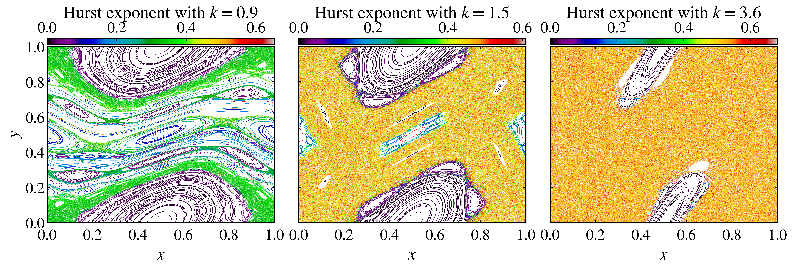

Hurst exponent
~~~~~~~~~~~~~~

The Hurst exponent was introduced by `Hurst (1951) <https://doi.org/10.1061/TACEAT.0006518>`_ to quantify long-term dependence in time series. The classical rescaled-range analysis estimates an exponent :math:`H` from the scaling of the rescaled range with the observation length. Its use for characterizing dynamical traps and the hierarchical structure of mixed phase spaces was proposed by `Borin (2024) <https://doi.org/10.1103/PhysRevE.110.064227>`_.

Rescaled-range analysis
^^^^^^^^^^^^^^^^^^^^^^^

Consider a scalar time series :math:`\{x_i\}_{i=1}^{N}` and divide it into non-overlapping blocks of length :math:`\ell`. For one block, first calculate its mean :math:`\bar{x}_{\ell}` and standard deviation :math:`S_{\ell}`. The cumulative deviations from the block mean are

.. math::

    Z_j=\sum_{i=1}^{j}\left(x_i-\bar{x}_{\ell}\right), \qquad j=1,\ldots,\ell.

The range of these cumulative deviations is

.. math::

    R_{\ell}=\max_{1\leq j\leq\ell}Z_j-\min_{1\leq j\leq\ell}Z_j.

After :math:`R_{\ell}/S_{\ell}` is averaged over the complete blocks of the same length, the calculation is repeated for different values of :math:`\ell`. The Hurst exponent is the slope of the linear fit in logarithmic coordinates,

.. math::

    \left\langle\frac{R}{S}\right\rangle_{\ell}=C\ell^H,

or equivalently

.. math::

    \ln\left\langle\frac{R}{S}\right\rangle_{\ell}=\ln C+H\ln\ell.

The implementation uses every integer block length from ``wmin`` through one less than half the effective trajectory length. For each length, any samples that do not fill a complete block are ignored, and blocks with zero standard deviation do not enter the average. The default is ``wmin=2``. Increasing ``wmin`` suppresses the shortest scales but also leaves fewer scales for the fit.

Interpreting the exponent
^^^^^^^^^^^^^^^^^^^^^^^^^

In the classical stochastic interpretation, :math:`H=0.5` indicates an uncorrelated process, :math:`H>0.5` indicates persistent correlations, and :math:`H<0.5` indicates antipersistent correlations. For a deterministic trajectory, these labels should be used as descriptions of the measured scaling rather than as proof that the dynamics is stochastic.

In mixed phase spaces, regular islands, sticky layers, and the chaotic sea can produce different finite-time values of :math:`H`. `Borin (2024) <https://doi.org/10.1103/PhysRevE.110.064227>`_ showed that the resulting spatial patterns and multimodal distributions can expose the hierarchy of dynamical traps. The numerical value still depends on the coordinate representation, trajectory length, fitted block lengths, and transient removal. Modulo discontinuities are particularly relevant for angular coordinates, so comparisons should use the same representation and be checked for convergence.

The fitted finite-sample estimate is not clipped to the nominal interval :math:`[0,1]`. Values outside that interval can therefore occur when the scaling range is short or poorly resolved.

Coordinate-wise exponents
^^^^^^^^^^^^^^^^^^^^^^^^^

The :py:meth:`hurst_exponent <pynamicalsys.core.discrete_dynamical_systems.DiscreteDynamicalSystem.hurst_exponent>` method accepts one initial state and returns one exponent for each coordinate. A one-dimensional system returns a scalar, while a system of dimension :math:`d>1` returns an array of shape ``(d,)``. If ``transient_time`` is provided, those initial iterations are discarded before the rescaled-range analysis.

This coordinate-wise calculation differs from the two-dimensional adaptation used by `Borin (2024) <https://doi.org/10.1103/PhysRevE.110.064227>`_, where the two coordinates in each subperiod are combined into a single sequence. Here, :math:`H_x` and :math:`H_y` are estimated independently, which makes their coordinate dependence explicit.

Comparing parameter values
^^^^^^^^^^^^^^^^^^^^^^^^^^

The following example keeps the same ensemble of random initial conditions and compares the standard map at :math:`k=0.9`, :math:`k=1.5`, and :math:`k=3.6`. The Hurst exponent is computed independently for both coordinates, while the figure colors each trajectory by :math:`H_x`:

.. code-block:: python

    import numpy as np
    import matplotlib.pyplot as plt
    from pynamicalsys import DiscreteDynamicalSystem as dds, PlotStyler

    system = dds(model="standard map")

    num_initial_conditions = 250
    np.random.seed(0)
    x_initial = np.random.uniform(0.0, 1.0, num_initial_conditions)
    y_initial = np.random.uniform(0.0, 1.0, num_initial_conditions)
    initial_states = np.column_stack((x_initial, y_initial))
    parameter_values = [0.9, 1.5, 3.6]
    total_time = 10_000
    wmin = 2

    hurst_values = np.empty(
        (len(parameter_values), num_initial_conditions, 2)
    )
    trajectories = np.empty(
        (len(parameter_values), num_initial_conditions, total_time, 2)
    )
    for i, k in enumerate(parameter_values):
        for j, initial_state in enumerate(initial_states):
            hurst_values[i, j] = system.hurst_exponent(
                u=initial_state,
                total_time=total_time,
                parameters=[k],
                wmin=wmin,
            )

        trajectories[i] = system.trajectory(
            u=initial_states,
            total_time=total_time,
            parameters=[k],
        ).reshape(num_initial_conditions, total_time, 2)

Plot every trajectory in color because the ensemble is small enough to preserve the phase-space structures without subsampling:

.. code-block:: python

    ps = PlotStyler(fontsize=24)
    ps.apply_style()
    fig, ax = plt.subplots(1, 3, figsize=(15, 5), sharex=True, sharey=True)
    for axis in ax:
        ps.set_tick_padding(axis, pad_x=8)
    for i, k in enumerate(parameter_values):
        trajectory_hurst = np.repeat(hurst_values[i, :, 0], total_time)
        points = ax[i].scatter(
            trajectories[i, :, :, 0].ravel(),
            trajectories[i, :, :, 1].ravel(),
            c=trajectory_hurst,
            s=0.05,
            edgecolor="none",
            cmap="nipy_spectral",
            vmin=0.0,
            vmax=hurst_values[i, :, 0].max(),
        )
        fig.colorbar(
            points,
            ax=ax[i],
            label=rf"Hurst exponent with $k = {k:.1f}$",
            location="top",
            aspect=40,
            pad=0.01,
        )
        ax[i].set_xlim(0.0, 1.0)
        ax[i].set_ylim(0.0, 1.0)
        ax[i].set_xlabel("$x$")
    ax[0].set_ylabel("$y$")
    ax[0].set_xticks([0.0, 0.2, 0.4, 0.6, 0.8, 1.0])
    fig.tight_layout(pad=0.05)
    plt.show()

    Standard-map trajectories colored by the Hurst exponent :math:`H_x` for three values of :math:`k`.

At :math:`k=0.9`, invariant curves and regular islands occupy much of the phase space. At :math:`k=1.5`, the chaotic sea coexists with prominent regular islands and sticky layers. At :math:`k=3.6`, the chaotic component is larger while smaller regular structures remain. The color should be interpreted comparatively within each panel because the color scale adapts to its largest computed value.

Finite-time Hurst exponent
^^^^^^^^^^^^^^^^^^^^^^^^^^

Use :py:meth:`finite_time_hurst_exponent <pynamicalsys.core.discrete_dynamical_systems.DiscreteDynamicalSystem.finite_time_hurst_exponent>` to follow the scaling estimate along one trajectory. The method divides ``total_time`` into consecutive non-overlapping windows of length ``finite_time`` and returns an array of shape ``(num_windows, d)``. Any remainder shorter than ``finite_time`` is not used.

.. code-block:: python

    finite_hurst, phase_space_points = system.finite_time_hurst_exponent(
        u=[0.05, 0.05],
        total_time=100_000,
        finite_time=1_000,
        parameters=[1.5],
        wmin=2,
        return_points=True,
    )

When ``return_points=True``, ``phase_space_points[i]`` is the final state of the window that produced ``finite_hurst[i]``. Each row of ``finite_hurst`` contains the coordinate-wise estimates for that window. A multimodal finite-time distribution can reveal visits to dynamically distinct regions, but the locations and separation of its modes depend on the window length and fitted range.

References
^^^^^^^^^^

.. container:: references-list

    - H\. E\. Hurst, `Long-term storage capacity of reservoirs <https://doi.org/10.1061/TACEAT.0006518>`_, Transactions of the American Society of Civil Engineers 116, 770-799 (1951).
    - D\. Borin, `Hurst exponent: a method for characterizing dynamical traps <https://doi.org/10.1103/PhysRevE.110.064227>`_, Physical Review E 110, 064227 (2024).
