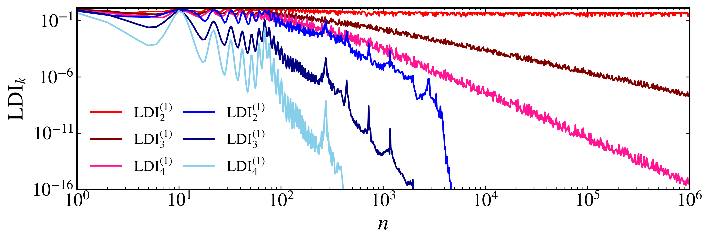

Linear dependence index
~~~~~~~~~~~~~~~~~~~~~~~

The linear dependence index (LDI) is a measure of the linear dependence of a set of vectors. It is defined as the product of the singular values of the matrix whose columns are the vectors in the set. The LDI provides a quantitative measure of whether a set of vectors is linearly independent or dependent.

Given a matrix :math:`A \in \mathbb{R}^{d \times k}`, where :math:`d` is the dimension of the vectors and :math:`k` is the number of vectors, we compute the singular value decomposition (SVD) of the matrix:

.. math::

    A = U \Sigma V^T

where :math:`U` is a :math:`d \times d` orthogonal matrix, :math:`\Sigma` is a :math:`d \times k` diagonal matrix with non-negative entries (the singular values, :math:`\sigma_i = \Sigma_{ii}`), and :math:`V` is a :math:`k \times k` orthogonal matrix. The linear dependence index is then defined as:

.. math::

    \text{LDI}_k = \prod_{i=1}^{\min(d, k)} \sigma_i

where :math:`\sigma_i` are the singular values of :math:`A`.

To illustrate the concept, we will consider the 4-dimensional symplectic map, given by:

.. math::

    \begin{align*}
        x_{n+1}^{(1)} &= x_{n}^{(1)} + x_{n}^{(2)}\bmod{2\pi},\\
        x_{n+1}^{(2)} &= x_{n}^{(2)} - \epsilon_1\sin(x_{n}^{(1)} + x_{n}^{(2)}) - \xi[1 - \cos(x_{n}^{(1)} + x_{n}^{(2)} + x_{n}^{(3)} + x_{n}^{(4)})] \bmod{2\pi},\\
        x_{n+1}^{(3)} &= x_{n}^{(3)} + x_{n}^{(4)} \bmod{2\pi},\\
        x_{n+1}^{(4)} &= x_{n}^{(4)} - \epsilon_2\sin(x_{n}^{(3)} + x_{n}^{(4)}) - \xi[1 - \cos(x_{n}^{(1)} + x_{n}^{(2)} + x_{n}^{(3)} + x_{n}^{(4)})] \bmod{2\pi}.
    \end{align*}

The LDI is computed using :py:meth:`LDI <pycandy.core.discrete_dynamical_systems.DiscreteDynamicalSystem.LDI>` method from the :py:class:`DiscreteDynamicalSystem <pycandy.core.discrete_dynamical_systems.DiscreteDynamicalSystem>` class. Let's compute the LDI for :math:`k = 2`, :math:`k = 3`, and :math:`k = 4` for this map. First, we need to import the necessary modules and define the dynamical system:

.. code-block:: python

    from pycandy import DiscreteDynamicalSystem as dds

    # Define the symplectic map
    ds = dds(model="4d symplectic map")

To make sure the order at which order the parameters should be passed, we can use the :py:meth:`info <pycandy.core.discrete_dynamical_systems.DiscreteDynamicalSystem.info>` property:

.. code-block:: python

    print(ds.info["parameters"])

.. code-block:: text

    ['epsilon_1', 'epsilon_2', 'xi']

With this information, let's compute the LDI for two different initial conditions, one regular and one chaotic. The :py:meth:`LDI <pycandy.core.discrete_dynamical_systems.DiscreteDynamicalSystem.LDI>` method is similar to the :py:meth:`lyapunov <pycandy.core.discrete_dynamical_systems.DiscreteDynamicalSystem.lyapunov>` method. It computes the linear dependence index for a given initial condition, parameters, total time, and number of deviation vectors :math:`k`. The `return_history` argument allows us to return the history of the LDI values at specified sample times:

.. code-block:: python

    import numpy as np

    # Initial conditions
    u = [[0.5, 0, 0.5, 0], # Initial condition 1
         [3.0, 0, 0.5, 0]] # Initial condition 2

    # Parameters for the symplectic map
    eps1 = 0.5
    eps2 = 0.1
    xi = 0.001
    parameters = [eps1, eps2, xi]

    # Number of deviation vectors
    k = [2, 3, 4]
    
    # Total time for the simulation
    total_time = 1000000

    # Sample times for the LDI computation
    sample_times = np.unique(np.logspace(np.log10(1), np.log10(total_time), 1000).astype(int))

    # Compute the LDI for each initial condition and each k
    LDIs = np.zeros((len(u), len(sample_times), len(k)))
    for i in range(len(u)):
        for j in range(len(k)):
            ldi = ds.LDI(u[i], total_time, k[j], parameters=parameters, return_history=True, sample_times=sample_times)
            LDIs[i, :, j] = ldi

Now we can visualize the results

.. code-block:: python

    from pycandy import PlotStyler
    import matplotlib.pyplot as plt

    # Create a plot styler
    ps = PlotStyler(linewidth=1.5)
    ps.apply_style()

    # Create the figure and axis for the plot
    fig, ax = plt.subplots(figsize=(10, 3))

    # Plot the LDI for each initial condition and k
    colors = [["red", "maroon", "deeppink"], ["blue", "navy", "skyblue"]]
    for i in range(len(u)):
        for j in range(len(k)):
            ax.plot(sample_times, LDIs[i, :, j], label=rf"$\mathrm{{LDI}}_{k[j]}^{{(1)}}$", color=colors[i][j])
    
    # Add a legend and set the limits and labels
    ax.legend(ncol=2, frameon=False, columnspacing=0.75)
    ax.set_ylim(1e-16, np.sqrt(2))
    ax.set_xlim(1, total_time)
    ax.set_xlabel("$n$")
    ax.set_ylabel(r"$\mathrm{LDI}_k$")
    ax.set_xscale('log')
    ax.set_yscale("log")

    plt.show()

   
   LDI for the 4-dimensional symplectic map with different initial conditions and values of k.
