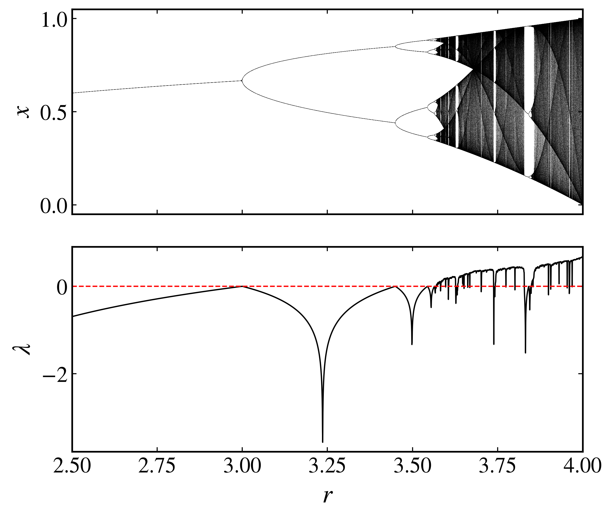
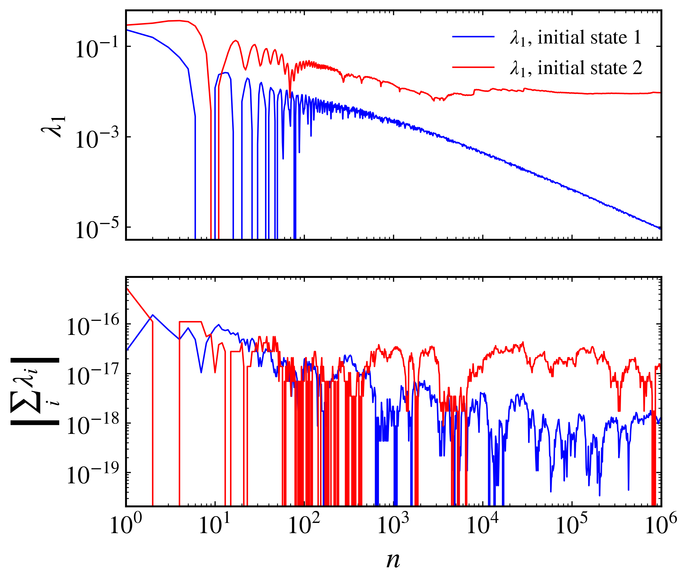
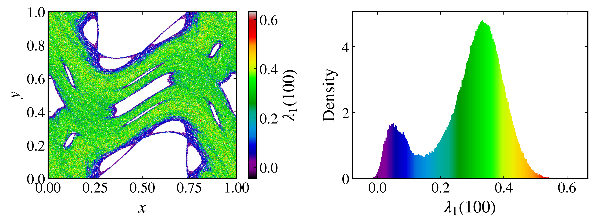

Lyapunov exponents
~~~~~~~~~~~~~~~~~~

Lyapunov exponents measure the average exponential growth or decay of infinitesimal perturbations along a trajectory. A positive largest exponent indicates sensitive dependence on initial conditions, while a negative largest exponent indicates contraction toward an attracting orbit. An exponent close to zero can occur for neutral or quasiperiodic dynamics, near a bifurcation, or before a finite-time estimate has converged, so it should be interpreted with care.

One-dimensional maps
^^^^^^^^^^^^^^^^^^^^

For a one-dimensional map :math:`x_{n+1}=f(x_n)`, the Lyapunov exponent is

.. math::

    \lambda=\lim_{N\to\infty}\frac{1}{N}\sum_{n=0}^{N-1}\log\left|f'(x_n)\right|.

The :py:meth:`lyapunov <pynamicalsys.core.discrete_dynamical_systems.DiscreteDynamicalSystem.lyapunov>` method evaluates this average from the map and its Jacobian. The following example compares the logistic map bifurcation diagram with its Lyapunov exponent across the same parameter interval:

.. code-block:: python

    import numpy as np
    import matplotlib.pyplot as plt
    from pynamicalsys import DiscreteDynamicalSystem as dds, PlotStyler

    system = dds(model="logistic map")
    parameter_range = (2.5, 4.0, 3_000)
    total_time = 5_000
    transient_time = 1_000

    parameter_values, bifurcation_values = system.bifurcation_diagram(
        u=0.2,
        param_index=0,
        param_range=parameter_range,
        total_time=total_time,
        transient_time=transient_time,
    )

    lyapunov_exponents = np.array(
        [
            system.lyapunov(
                u=0.2,
                total_time=total_time,
                parameters=r,
                transient_time=transient_time,
            )
            for r in parameter_values
        ]
    )

Prepare the bifurcation data and plot both quantities:

.. code-block:: python

    parameter_plot = np.repeat(
        parameter_values,
        bifurcation_values.shape[1],
    )
    observable_plot = bifurcation_values.ravel()

    ps = PlotStyler()
    ps.apply_style()
    fig, ax = plt.subplots(2, 1, figsize=(7, 6), sharex=True)
    ax[0].scatter(parameter_plot, observable_plot, color="black", s=0.01, edgecolor="none")
    ax[0].set_xlim(parameter_range[0], parameter_range[1])
    ax[0].set_ylabel("$x$")
    ax[1].plot(parameter_values, lyapunov_exponents, color="black")
    ax[1].axhline(0.0, color="red", linestyle="--")
    ax[1].set_xlabel("$r$")
    ax[1].set_ylabel(r"$\lambda$")
    fig.tight_layout()
    plt.show()

    Bifurcation diagram and Lyapunov exponent of the logistic map.

Intervals with a positive exponent correspond to chaotic parameter regions. Negative values occur on attracting periodic branches, including fixed points and higher-period cycles. Values near zero require longer computations or additional diagnostics before they can be classified reliably.

Higher-dimensional maps
^^^^^^^^^^^^^^^^^^^^^^^

For a :math:`d`-dimensional map :math:`\mathbf{x}_{n+1}=\mathbf{f}(\mathbf{x}_n)`, the Jacobian matrices propagate a basis of deviation vectors through the tangent dynamics. Numerically, the basis is reorthonormalized repeatedly with a QR decomposition. If :math:`R_n` is the upper triangular factor obtained at iteration :math:`n`, the exponents are estimated from

.. math::

    \lambda_i=\lim_{N\to\infty}\frac{1}{N}\sum_{n=0}^{N-1}\log\left|\left(R_n\right)_{ii}\right|.

The returned spectrum contains one exponent for each state-space dimension. For the Hénon map, the two exponents can be computed as follows:

.. code-block:: python

    import numpy as np
    from pynamicalsys import DiscreteDynamicalSystem as dds

    system = dds(model="henon map")
    system.set_parameters([1.4, 0.3])

    lyapunov_exponents = system.lyapunov(
        u=[0.1, 0.1],
        total_time=100_000,
        transient_time=1_000,
    )

    largest_exponent = system.lyapunov(
        u=[0.1, 0.1],
        total_time=100_000,
        transient_time=1_000,
        num_exponents=1,
    )

    spectrum_sum = np.sum(lyapunov_exponents)
    expected_sum = np.log(0.3)
    print(f"Spectrum: {lyapunov_exponents}")
    print(f"Spectrum sum: {spectrum_sum:.6f}")
    print(f"Expected sum: {expected_sum:.6f}")

.. code-block:: text

    Spectrum: [ 0.41928213 -1.62325493]
    Spectrum sum: -1.203973
    Expected sum: -1.203973

The full result has shape ``(2,)``, while ``num_exponents=1`` returns the largest exponent as a scalar. At the classical Hénon parameters, the positive largest exponent identifies the chaotic attractor. Since the Jacobian determinant is constant and equal to :math:`-b`, the sum of the spectrum approaches :math:`\log|b|=\log(0.3)\approx-1.204`. The negative sum shows that the map is dissipative and contracts phase-space area on average.

The default ``method="QR"`` uses a modified Gram-Schmidt decomposition. Set ``method="QR_HH"`` to use a Householder QR decomposition, which can be more stable. The ``method="ER"`` option uses the Eckmann-Ruelle algorithm and is available only for two-dimensional maps.

Convergence history
^^^^^^^^^^^^^^^^^^^

Set ``return_history=True`` to inspect how the estimates converge. Without ``sample_times``, the method returns the estimate at every iteration after the transient. Supplying selected sample times reduces the returned data and is particularly useful for long calculations.

The four-dimensional symplectic map preserves phase-space volume. Its Lyapunov spectrum therefore approaches a zero sum and, after convergence, the exponents occur in positive and negative pairs. Compare the convergence for two initial conditions:

.. code-block:: python

    import numpy as np
    import matplotlib.pyplot as plt
    from pynamicalsys import DiscreteDynamicalSystem as dds, PlotStyler

    system = dds(model="4d symplectic map")
    system.set_parameters([0.5, 0.1, 0.001])

    initial_states = np.array(
        [
            [0.5, 0.0, 0.5, 0.0],
            [3.0, 0.0, 0.5, 0.0],
        ]
    )
    total_time = 1_000_000
    sample_times = np.unique(np.logspace(0, np.log10(total_time), 1_000).astype(int))

    histories = np.empty((len(initial_states), len(sample_times), 4))
    for i, initial_state in enumerate(initial_states):
        histories[i] = system.lyapunov(
            u=initial_state,
            total_time=total_time,
            return_history=True,
            sample_times=sample_times,
        )

    spectra = histories[:, -1, :]
    spectrum_sums = np.sum(spectra, axis=1)
    print(f"Final spectra:\n{spectra}")
    print(f"Spectrum sums: {spectrum_sums}")

.. code-block:: text

    Final spectra:
    [[ 8.98676229e-06  9.24920790e-06 -8.69827987e-06 -9.53769033e-06]
     [ 9.46539591e-03  2.71437710e-04 -2.70617113e-04 -9.46621651e-03]]
    Spectrum sums: [-1.23327997e-18  8.67361738e-18]

Plot the histories of the largest exponent and the sum of the full spectrum:

.. code-block:: python

    ps = PlotStyler()
    ps.apply_style()
    fig, ax = plt.subplots(2, 1, figsize=(7, 6), sharex=True)
    ax[0].plot(sample_times, histories[0, :, 0], color="blue", label=r"$\lambda_1$, initial state 1")
    ax[0].plot(sample_times, histories[1, :, 0], color="red", label=r"$\lambda_1$, initial state 2")
    ax[0].set_yscale("log")
    ax[0].set_ylabel(r"$\lambda_1$")
    ax[0].legend(frameon=False)
    ax[1].loglog(sample_times, abs(np.sum(histories[0], axis=1)), color="blue")
    ax[1].loglog(sample_times, abs(np.sum(histories[1], axis=1)), color="red")
    ax[1].axhline(0.0, color="black", linestyle="--")
    ax[1].set_xlim(1, total_time)
    ax[1].set_xlabel("$n$")
    ax[1].set_ylabel(r"$\left|\sum_i\lambda_i\right|$")
    fig.tight_layout()
    plt.show()

    Convergence of the largest Lyapunov exponent and the sum of the full spectrum for two trajectories of the four-dimensional symplectic map.

The lower panel makes the zero spectrum sum of the symplectic map visible. This contrasts with the negative sum of the dissipative Hénon map. With all four exponents, ``histories`` has shape ``(2, len(sample_times), 4)``. If ``num_exponents=1`` is also supplied, each history is one-dimensional with shape ``(len(sample_times),)``. Sample times are sorted and duplicate values are removed internally.

Finite-time exponents
^^^^^^^^^^^^^^^^^^^^^

The :py:meth:`finite_time_lyapunov <pynamicalsys.core.discrete_dynamical_systems.DiscreteDynamicalSystem.finite_time_lyapunov>` method divides a trajectory into consecutive non-overlapping windows and computes an independent spectrum in each window. This exposes variations in local stretching that are hidden by a single long-time average. Consider a chaotic trajectory of the standard map that undergoes sticky episodes near stability islands:

.. code-block:: python

    system = dds(model="standard map")
    system.set_parameters([1.5])

    initial_state = [0.05, 0.05]
    total_time = 50_000_000
    finite_time = 100
    finite_time_exponents, phase_space_points = system.finite_time_lyapunov(
        u=initial_state,
        total_time=total_time,
        finite_time=finite_time,
        num_exponents=1,
        return_points=True,
    )

There are 500,000 complete windows, so ``finite_time_exponents`` has shape ``(500000, 1)`` and ``phase_space_points`` has shape ``(500000, 2)``. Each row of ``phase_space_points`` is the state at the beginning of the corresponding window. Plot these representative states beside the distribution of all window values. This avoids drawing every point from the fifty-million-iteration trajectory while preserving the connection between phase-space location and finite-time exponent:

.. code-block:: python

    exponent_values = finite_time_exponents[:, 0]
    normalization = plt.Normalize(exponent_values.min(), exponent_values.max())
    colormap = plt.get_cmap("nipy_spectral")

    ps = PlotStyler()
    ps.apply_style()
    fig, ax = plt.subplots(1, 2, figsize=(10, 4))
    points_plot = ax[0].scatter(
        phase_space_points[:, 0],
        phase_space_points[:, 1],
        c=exponent_values,
        s=0.2,
        edgecolor="none",
        cmap=colormap,
        norm=normalization,
    )
    ax[0].set_xlim(0.0, 1.0)
    ax[0].set_ylim(0.0, 1.0)
    ax[0].set_xlabel("$x$")
    ax[0].set_ylabel("$y$")
    fig.colorbar(points_plot, ax=ax[0], label=rf"$\lambda_1({finite_time})$")

    density, bin_edges, patches = ax[1].hist(exponent_values, bins=200, density=True)
    bin_centers = 0.5 * (bin_edges[:-1] + bin_edges[1:])
    for center, patch in zip(bin_centers, patches):
        patch.set_facecolor(colormap(normalization(center)))
    ax[1].set_xlabel(rf"$\lambda_1({finite_time})$")
    ax[1].set_ylabel("Density")
    fig.tight_layout()
    plt.show()

    Phase-space locations and distribution of the finite-time largest Lyapunov exponent for the standard map.

The distribution is multimodal. For these parameters, its large high-exponent mode is associated with motion in the bulk of the chaotic sea, while the smaller low-exponent mode is associated with sticky intervals near stability islands. If a transient is supplied, the number of complete windows is ``(total_time - transient_time) // finite_time``.

By default, logarithms use base :math:`e`, so the exponents are measured per iteration in natural-logarithm units. Use ``log_base=2`` or ``log_base=10`` when another logarithm base is required. Set ``return_last_state=True`` in ``lyapunov`` when the state reached after the calculation is also needed.
