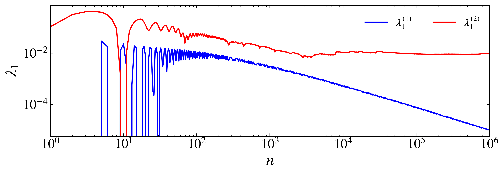

Lyapunov exponents
~~~~~~~~~~~~~~~~~~

One-dimensional maps
^^^^^^^^^^^^^^^^^^^^

The Lyapunov exponents are a measure of the average rate at which nearby trajectories in a dynamical system diverge or converge. For an 1-dimensional map, :math:`x_{n + 1} = f(x_n)`, the Lyapunov exponent is defined as:

.. math::
    \lambda = \lim_{n \to \infty} \frac{1}{n} \sum_{i = 0}^{n - 1}\log |f'(x_i)|

where :math:`f'(x_i)` is the derivative of the map evaluated at the point :math:`x_i`. The Lyapunov exponent can be interpreted as follows:

- If :math:`\lambda < 0`, the dynamics is stable and trajectories converge to a fixed point.
- If :math:`\lambda = 0`, the dynamics is quasiperiodic and trajectories neither converge nor diverge.
- If :math:`\lambda > 0`, the dynamics is chaotic and trajectories diverge exponentially.

The calculation of the Lyapunov exponent can be done using the :py:meth:`lyapunov <pycandy.core.discrete_dynamical_systems.DiscreteDynamicalSystem.lyapunov>` method from the :py:class:`DiscreteDynamicalSystem <pycandy.core.discrete_dynamical_systems.DiscreteDynamicalSystem>` class. Let's use the logistic map as an example:

.. code-block:: python

    from pycandy import DiscreteDynamicalSystem as dds

    # Define the logistic map
    ds = dds(model="logistic map")

We are going to use four different parameters values for the logistic map to illustrate the different behaviors:

.. code-block:: python

    # Initial condition
    x0 = 0.2

    # Parameters for the logistic map
    r = [2.6, 3.1, 3.5, 3.8]

    # Total time and transient time
    total_time = 10000
    transient_time = 5000

    lyapunovs_exponents = [ds.lyapunov(x0, total_time, parameters=r_i, transient_time=transient_time) for r_i in r]

.. code-block:: text

    [-0.5108256237660053, -0.2638163710411688, -0.8725073457794915, 0.44047142185628363]

The first three values are negative, indicating that the dynamics is stable for those parameter values. The last value is positive, indicating that the dynamics is chaotic for that parameter value. To visualize how the Lyapunov exponent changes with the parameter, let's plot it as a function of :math:`r` together with the bifurcation diagram:

.. code-block:: python

    import numpy as np

    # Define the parameter range and index for the bifurcation
    param_range = (2.5, 4.0, 3000)
    param_index = 0
    r = np.linspace(param_range[0], param_range[1], param_range[2])

    # Initial condition
    x0 = 0.2
    
    # Total time and transient time
    total_time = 5000
    transient_time = 1000

    # Calculate the bifurcation diagram
    param_values, bifurcation_diagram = ds.bifurcation_diagram(x0, param_index, r, total_time, transient_time=transient_time)
    
    # Prepare the data for plotting
    param_mesh = np.repeat(param_values[:, np.newaxis], bifurcation_diagram.shape[1], axis=1)

    # Flatten both arrays
    param_values = param_mesh.flatten()
    bifurcation_diagram = bifurcation_diagram.flatten()

    # Calculate the Lyapunov exponent for each parameter value
    lyapunovs_exponents = [ds.lyapunov(x0, total_time, parameters=r_i, transient_time=transient_time) for r_i in r]

We can now plot the bifurcation diagram and the Lyapunov exponent:

.. code-block:: python

    from pycandy import PlotStyler
    import matplotlib.pyplot as plt

    # Style the plot
    ps = PlotStyler(linewidth=1)
    ps.apply_style()

    # Create the figure and axes
    fig, ax = plt.subplots(2, 1, sharex=True, figsize=(10, 5))

    # Plot the bifurcation diagram
    ax[0].scatter(param_values, bifurcation_diagram, color='black', s=0.01, edgecolor='none')

    # Set the labels and limits for the bifurcation diagram plot
    ax[0].set_xlim(param_range[0], param_range[1])
    ax[0].set_ylabel("$x$")

    # Plot the Lyapunov exponent
    ax[1].plot(r, lyapunovs_exponents, 'k-')
    ax[1].axhline(0, color='red', linestyle='--', linewidth=0.5)

    # Set the labels for the Lyapunov exponent plot
    ax[1].set_xlabel("$r$")
    ax[1].set_ylabel(r"$\lambda$")

    plt.tight_layout(pad=0.1)
    plt.show()

   
   Bifurcation diagram and Lyapunov exponents for the logistic map.

Higher-dimensional maps
^^^^^^^^^^^^^^^^^^^^^^^

For higher-dimensional maps, the Lyapunov exponents can be computed similarly, but the definition involves the Jacobian matrix of the system. Given a :math:`d`-dimensional map :math:`\mathbf{x}_{n + 1} = \mathbf{f}(\mathbf{x}_n)`, let :math:`\mathbf{J}_n` be the Jacobian matrix evaluated at the point :math:`\mathbf{x}_n`. The matrix

.. math::

    J_n(\mathbf{x}_0) = J(\mathbf{x}_{n-1}) J(\mathbf{x}_{n-2}) \ldots J(\mathbf{x}_0)

describes the evolution of the tangent vectors under the linearized dynamics. The Lyapunov exponents are then related to the eigenvalues of this matrix as:

.. math::

    \lambda_i = \lim_{n \to \infty} \frac{1}{n} \log \|J_n(\mathbf{x}_0)\mathbf{v}_i\|.

Numerically, we perform a QR decomposition of the Jacobian matrix at each time step to ensure numerical stability: :math:`J_n = Q_n R_n`, where :math:`Q_n` is an orthogonal matrix and :math:`R_n` is an upper triangular matrix. The Lyapunov exponents are then computed from the averages of the logarithm of diagonal elements of the matrix :math:`R_n`, :math:`|r_{ii}^{(n)}|`:

.. math::

    \lambda_i = \lim_{n \to \infty} \frac{1}{n} \sum_{j = 0}^{n - 1} \log |r_{ii}^{(j)}|.

The Lyapunov exponents can be interpreted similarly to the one-dimensional case, indicating stability, quasiperiodicity, or chaos in the dynamics.

- If at least one Lyapunov exponent is positive, the trajectory is chaotic
- If all Lyapunov exponents are negative, the trajectory is periodic.
- If all Lyapunov exponents are zero, the trajectory is quasiperiodic.

The calculation of the Lyapunov exponents for higher-dimensional maps can be done using the :py:meth:`lyapunov <pycandy.core.discrete_dynamical_systems.DiscreteDynamicalSystem.lyapunov>` method from the :py:class:`DiscreteDynamicalSystem <pycandy.core.discrete_dynamical_systems.DiscreteDynamicalSystem>` class. Let's use the Hénon map as an example:

.. code-block:: python

    from pycandy import DiscreteDynamicalSystem as dds
    import numpy as np
    import matplotlib.pyplot as plt

    # Define the Henon map
    ds = dds(model="henon map")

    # Initial condition
    u = [0.2, 0.2]

    # Parameters for the Henon map
    a = 1.4 
    b = 0.3
    parameters = [a, b]

    # Total time and transient time
    total_time = 50000
    transient_time = 10000
    
    # Calculate the Lyapunov exponents
    lyapunovs_exponents = ds.lyapunov(u, total_time, parameters=parameters, transient_time=transient_time)
    print(lyapunovs_exponents)

.. code-block:: text

    [ 0.4182113  -1.62218411]

The Hénon map is a two-dimensional map, and there exist two Lyapunov exponents. The first one is positive, indicating that this trajectory is chaotic. By default, the :py:meth:`lyapunov <pycandy.core.discrete_dynamical_systems.DiscreteDynamicalSystem.lyapunov>` method uses the modified Gram-Schmidt algorithm to perform the QR decomposition. If you need a more stable algorithm, you can set `method="QR_HH"` to use Householder reflections for the QR decomposition:

.. code-block:: python

    lyapunovs_exponents = ds.lyapunov(u, total_time, parameters=parameters, transient_time=transient_time, method="QR_HH")
    print(lyapunovs_exponents)

.. code-block:: text

    [ 0.4182113  -1.62218411]

Let's consider now a four-dimensional, symplectic map, defined as follows:

.. math::

    \begin{align*}
        x_{n+1}^{(1)} &= x_{n}^{(1)} + x_{n}^{(2)}\bmod{2\pi},\\
        x_{n+1}^{(2)} &= x_{n}^{(2)} - \epsilon_1\sin(x_{n}^{(1)} + x_{n}^{(2)}) - \xi[1 - \cos(x_{n}^{(1)} + x_{n}^{(2)} + x_{n}^{(3)} + x_{n}^{(4)})] \bmod{2\pi},\\
        x_{n+1}^{(3)} &= x_{n}^{(3)} + x_{n}^{(4)} \bmod{2\pi},\\
        x_{n+1}^{(4)} &= x_{n}^{(4)} - \epsilon_2\sin(x_{n}^{(3)} + x_{n}^{(4)}) - \xi[1 - \cos(x_{n}^{(1)} + x_{n}^{(2)} + x_{n}^{(3)} + x_{n}^{(4)})] \bmod{2\pi}.
    \end{align*}

This map is composed of two coupled standard maps with parameters :math:`\epsilon_1` and :math:`\epsilon_2`, and an additional coupling term controlled by the parameter :math:`\xi`. The parameter :math:`\xi` can be used to tune the strength of the coupling between the two standard maps. The map is symplectic, meaning that is preservers the volume in phase space. In this case, the sum of the Lyapunov exponents must be zero. 

Let's compute the Lyapunov exponents for this map:

.. code-block:: python

    from pycandy import DiscreteDynamicalSystem as dds

    # Define the symplectic map
    ds = dds(model="4d symplectic map")

To make sure the order at which order the parameters should be passed, we can use the `.info` property:

.. code-block:: python

    print(ds.info["parameters"])

.. code-block:: text

    ['epsilon_1', 'epsilon_2', 'xi']

With this information, let's compute the Lyapunov exponents for two different initial conditions:

.. code-block:: python

    # Initial conditions
    u = [[0.5, 0, 0.5, 0], # Initial condition 1
         [3.0, 0, 0.5, 0]] # Initial condition 2

    # Parameters for the symplectic map
    eps1 = 0.5
    eps2 = 0.1
    xi = 0.001
    parameters = [eps1, eps2, xi]

    # Total time
    total_time = 1000000

    # Calculate the Lyapunov exponents
    lyapunov_exponents = [ds.lyapunov(u[i], total_time, parameters=parameters) for i in range(len(u))]

    print(lyapunov_exponents)

.. code-block:: text

    [array([ 9.79366628e-06,  6.43341772e-07, -1.62300788e-06, -8.81400017e-06]),
    array([ 0.00946666,  0.00026615, -0.0002705 , -0.00946231])]

The first array corresponds to the first initial condition, and the second array corresponds to the second initial condition. Let's check the sum of the Lyapunov exponents for both initial conditions:

.. code-block:: python

    print([np.sum(lyapunov_exponents[i]) for i in range(len(u))])

.. code-block:: text

    [-9.0801931945661e-19, -2.0816681711721685e-17]

Both sums are very close to zero, as expected. Now, regarding the trajectories. The first initial condition yield largest Lyapunov exponent close to zero, indicating a quasiperiodic trajectory, while the second initial condition yield a positive Lyapunov exponent, indicating a chaotic trajectory.

It is also possible to return the history of the Lyapunov exponents and not only their final values. This can be done by setting the `return_history` parameter to `True`. Additionally, you can specify at which time steps you want to return the Lyapunov exponent by setting the `sample_times` parameter:

.. code-block:: python

    # Initial conditions
    u = [[0.5, 0, 0.5, 0], # Initial condition 1
         [3.0, 0, 0.5, 0]] # Initial condition 2

    # Parameters for the symplectic map
    eps1 = 0.5
    eps2 = 0.1
    xi = 0.001
    parameters = [eps1, eps2, xi]

    # Total time
    total_time = 1000000

    # Sample times for the Lyapunov exponent
    sample_times = np.unique(np.logspace(np.log10(1), np.log10(total_time), 1000).astype(int))

    # Calculate the Lyapunov exponents
    LEs = np.zeros((len(u), len(sample_times), 4))
    for i in range(len(u)):
        lyapunov_exponents = ds.lyapunov(u[i], total_time, parameters=parameters, return_history=True, sample_times=sample_times)
        LEs[i, :, :] = lyapunov_exponents

We can now plot the history of the Lyapunov exponents for both initial conditions:

.. code-block:: python

    from pycandy import PlotStyler

    # Style the plot
    ps = PlotStyler(linewidth=1.5)
    ps.apply_style()

    # Create the figure and axes
    fig, ax = plt.subplots(figsize=(10, 3))

    # Plot the Lyapunov exponents
    ax.plot(sample_times, LEs[0, :, 0], label=r"$\lambda_1^{(1)}$", color='b')
    ax.plot(sample_times, LEs[1, :, 0], label=r"$\lambda_1^{(2)}$", color='r')

    # Set the labels, limits, axis scales, and legend
    ax.set_xscale('log')
    ax.set_yscale("log")
    ax.legend(ncol=2, frameon=False)
    ax.set_xlim(1, total_time)
    ax.set_xlabel("$n$")
    ax.set_ylabel(r"$\lambda_1$")

    plt.show()

   
   Largest Lyapunov exponents for the 4D symplectic map.
