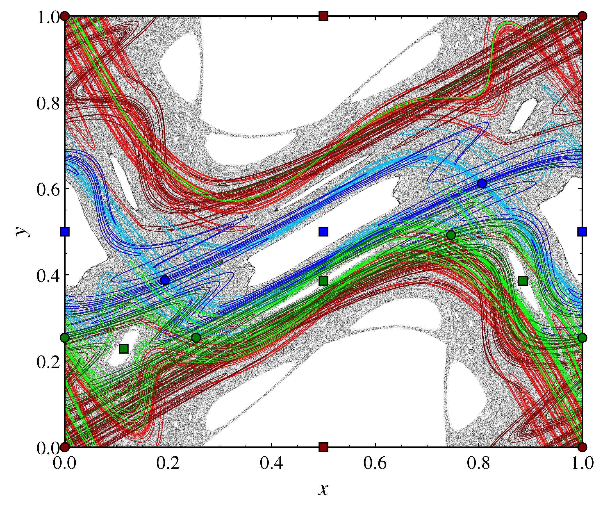

Periodic orbits and their manifolds
-----------------------------------

A fixed point of a map :math:`\mathbf{x}_{n+1} = \mathbf{f}(\mathbf{x}_n)` is a
point :math:`\mathbf{x}^*` with :math:`\mathbf{f}(\mathbf{x}^*) = \mathbf{x}^*`.
A periodic orbit of period :math:`p` is a set of :math:`p` distinct points that
map into one another and return to the start after :math:`p` iterations, so
that :math:`\mathbf{f}^p(\mathbf{x}^*) = \mathbf{x}^*` for each point
:math:`\mathbf{x}^*` in the orbit. A fixed point is the case :math:`p = 1`.

The stability of an orbit follows from the eigenvalues of the monodromy matrix,
the product of the Jacobian along the orbit. For a saddle, one eigenvalue lies
inside the unit circle and one outside. The stable manifold is the set of points
that approach the saddle under forward iteration, tangent to the eigenvector of
the eigenvalue with magnitude below one; the unstable manifold is the set that
approaches under backward iteration, tangent to the eigenvector of the
eigenvalue with magnitude above one. These manifolds organize the surrounding
dynamics, and their intersections are the origin of chaotic motion.

This page uses the standard map with :math:`k = 1.5` throughout:

.. code-block:: python

    import numpy as np
    import matplotlib.pyplot as plt
    from pynamicalsys import DiscreteDynamicalSystem as dds, PlotStyler

    system = dds(model="standard map")
    system.set_parameters([1.5])

Fixed points
~~~~~~~~~~~~~

The standard map has two fixed points, at :math:`(0, 0)` and :math:`(0.5, 0)`.
Use :py:meth:`classify_stability <pynamicalsys.core.discrete_dynamical_systems.DiscreteDynamicalSystem.classify_stability>`
to determine their type. It returns a dictionary with the ``"classification"``
label and the ``"eigenvalues"`` and ``"eigenvectors"`` of the monodromy matrix.
This method is restricted to two-dimensional systems; in higher dimensions, use
:py:meth:`eigenvalues_and_eigenvectors <pynamicalsys.core.discrete_dynamical_systems.DiscreteDynamicalSystem.eigenvalues_and_eigenvectors>`
and classify the multipliers yourself.

.. code-block:: python

    saddle = [0.0, 0.0]
    center = [0.5, 0.0]

    for point in (saddle, center):
        info = system.classify_stability(point, 1)
        print(point, info["classification"])
        print("eigenvalues:", info["eigenvalues"])

.. code-block:: text

    [0.0, 0.0] saddle
    eigenvalues: [3.18614066+0.j 0.31385934+0.j]
    [0.5, 0.0] elliptic (quasi-periodic)
    eigenvalues: [0.25-0.96824584j 0.25+0.96824584j]

The point at :math:`(0, 0)` is a saddle: its multipliers are real, one larger
than one and one smaller. The point at :math:`(0.5, 0)` is elliptic, with
multipliers on the unit circle. Only the saddle has stable and unstable
manifolds.

Compute them with
:py:meth:`manifold <pynamicalsys.core.discrete_dynamical_systems.DiscreteDynamicalSystem.manifold>`,
which seeds points along the relevant eigendirection and iterates them:

.. code-block:: python

    unstable = system.manifold(saddle, 1, n_points=50000, iter_time=17, stability="unstable")
    stable = system.manifold(saddle, 1, n_points=50000, iter_time=17, stability="stable")

Each call returns a tuple of two arrays, one for each branch of the manifold,
seeded along the eigenvector and along its negative. ``n_points`` sets how many
seed points are used and ``iter_time`` how many iterations evolve them; pass a
tuple of two values to use different settings on the two branches. Computing the
stable manifold iterates the map backward, so it requires a system with a
backward mapping, as the built-in standard map has. The
:py:meth:`manifold <pynamicalsys.core.discrete_dynamical_systems.DiscreteDynamicalSystem.manifold>`
method is implemented for two-dimensional maps only.

Locating periodic orbits
~~~~~~~~~~~~~~~~~~~~~~~~~~

Higher-period orbits are rarely known in closed form and must be located
numerically.
:py:meth:`find_periodic_orbit <pynamicalsys.core.discrete_dynamical_systems.DiscreteDynamicalSystem.find_periodic_orbit>`
provides three solvers, selected by the shape of the first argument:

- A **grid refinement** search: pass a 3D array of shape ``(grid_size_x, grid_size_y, 2)``.
  It scans a rectangular region for near-periodic points and contracts around
  them. It needs no initial guess but is restricted to two-dimensional systems.
- A **symmetry-line** search: pass a 1D array of coordinates together with a
  ``symmetry_line`` function. This is the same refinement restricted to a curve,
  also two-dimensional only.
- **Newton's method**: pass a 1D initial guess. It refines a single point, works
  in any dimension, and converges quadratically, but only from a guess already
  close to an orbit.

The searches are global and slow; Newton is local and fast. A common pattern in
two dimensions is to locate an orbit roughly with a search and then refine it
with Newton. Two related methods help along the way:
:py:meth:`period <pynamicalsys.core.discrete_dynamical_systems.DiscreteDynamicalSystem.period>`
estimates the period of an orbit from its recurrences, and
:py:meth:`is_periodic <pynamicalsys.core.discrete_dynamical_systems.DiscreteDynamicalSystem.is_periodic>`
tests whether a point belongs to an orbit of a given period.

Period-2 orbits
~~~~~~~~~~~~~~~~

The standard map has an elliptic and a hyperbolic orbit of period 2. The
elliptic orbit lies on the symmetry line :math:`x = 0`, so it can be found with
the symmetry-line search. Define the line as a function of the coordinate along
it, sample a range that brackets the orbit, and search:

.. code-block:: python

    def symmetry_line(y, parameters):
        return 0.0 * np.ones_like(y)

    points = np.linspace(0.4, 0.6, 10000)
    elliptic_p2 = system.find_periodic_orbit(
        points,
        2,
        tolerance=2 / 10000,
        symmetry_line=symmetry_line,
        axis=1,
        verbose=True,
    )

Setting ``verbose=True`` prints the refinement history. At each step the search
reports the change in the candidate orbit, the size of the search bounds, and
the current tolerance, stopping when the orbit displacement falls below the
convergence threshold:

.. code-block:: text

    Iter 0: Δorbit=[0.         0.50007001], Δbounds=[0.0004     0.00027999], tol=2.00e-04
    Iter 1: Δorbit=[0.00000000e+00 3.66680953e-05], Δbounds=[0.0002     0.00013336], tol=1.00e-04
    Iter 2: Δorbit=[0.00000000e+00 1.66711911e-05], Δbounds=[1.00000000e-04 6.66709547e-05], tol=5.00e-05
    ...
    Iter 38: Δorbit=[0.00000000e+00 2.22044605e-16], Δbounds=[1.45519152e-15 7.21644966e-16], tol=7.28e-16
    Iter 39: Δorbit=[0.00000000e+00 1.11022302e-16], Δbounds=[7.27595761e-16 3.88578059e-16], tol=3.64e-16
    Converged at iteration 39

The remaining examples use ``verbose=False`` (the default). The ``axis``
argument states which coordinate parametrizes the symmetry line; here the line
is traced by :math:`y`, so ``axis=1``. Confirm the result:

.. code-block:: python

    print(elliptic_p2, system.classify_stability(elliptic_p2, 2)["classification"])

.. code-block:: text

    [0.  0.5] elliptic (quasi-periodic)

The hyperbolic orbit sits between the two period-2 islands. Its location is not
known in advance, so search a rectangle that encloses it with the grid
refinement, then refine the result with Newton:

.. code-block:: python

    x = np.linspace(0.1, 0.3, 1000)
    y = np.linspace(0.3, 0.55, 1000)
    grid = np.stack(np.meshgrid(x, y, indexing="ij"), axis=-1)

    saddle_p2 = system.find_periodic_orbit(grid, 2, tolerance=3 / 1000)
    saddle_p2 = system.find_periodic_orbit(saddle_p2, 2, periods=[1.0, 1.0])

    info = system.classify_stability(saddle_p2, 2)
    print(saddle_p2, info["classification"])
    print("eigenvalues:", info["eigenvalues"])

.. code-block:: text

    [0.19397649 0.38795298] saddle
    eigenvalues: [4.09176343+0.j 0.24439341+0.j]

The ``periods=[1.0, 1.0]`` argument tells Newton that both coordinates of the
standard map wrap with period 1. On such a torus, an orbit winding across the
domain would otherwise look like a large residual; the wrapping periods let
Newton measure the true distance. Use ``np.inf`` for any coordinate that does
not wrap.

With the saddle located, compute its manifolds as before:

.. code-block:: python

    unstable_p2 = system.manifold(saddle_p2, 2, n_points=50000, iter_time=20, stability="unstable")
    stable_p2 = system.manifold(saddle_p2, 2, n_points=50000, iter_time=20, stability="stable")

Period-3 orbits
~~~~~~~~~~~~~~~

Around the central island, the Poincaré-Birkhoff theorem guarantees a chain of
period-3 orbits, alternating elliptic and hyperbolic. Locate the hyperbolic
orbit by scanning the whole unit square and refining with Newton:

.. code-block:: python

    x = np.linspace(0.0, 1.0, 400)
    y = np.linspace(-0.5, 0.5, 400)
    grid = np.stack(np.meshgrid(x, y, indexing="ij"), axis=-1)

    saddle_p3 = system.find_periodic_orbit(grid, 3, tolerance=5e-3)
    saddle_p3 = system.find_periodic_orbit(saddle_p3, 3, periods=[1.0, 1.0], prime_period=True)

    info = system.classify_stability(saddle_p3, 3)
    print(saddle_p3, info["classification"])
    print("eigenvalues:", info["eigenvalues"])

.. code-block:: text

    [0.25377828 0.25377828] saddle
    eigenvalues: [5.90789859+0.j 0.16926492+0.j]

The equation :math:`\mathbf{f}^p(\mathbf{x}) = \mathbf{x}` is also satisfied by
points of any period dividing :math:`p`, so a period-3 search can converge onto
a fixed point. Setting ``prime_period=True`` makes Newton raise an error instead
of returning such a point, so the result is guaranteed to have prime period 3.
Verify it explicitly:

.. code-block:: python

    print("period:", system.period(saddle_p3, 20000))
    print("is period 3:", system.is_periodic(saddle_p3, 3))
    print("is period 1:", system.is_periodic(saddle_p3, 1))

.. code-block:: text

    period: 3
    is period 3: True
    is period 1: False

The elliptic orbit sits at the center of one of the period-3 islands. A guess
near a visible island is enough for Newton:

.. code-block:: python

    elliptic_p3 = system.find_periodic_orbit([0.5, 0.38], 3, periods=[1.0, 1.0], prime_period=True)
    print(elliptic_p3, system.classify_stability(elliptic_p3, 3)["classification"])

.. code-block:: text

    [0.5        0.38569696] elliptic (quasi-periodic)

Finally, compute the manifolds of the period-3 saddle:

.. code-block:: python

    unstable_p3 = system.manifold(saddle_p3, 3, n_points=50000, iter_time=22, stability="unstable")
    stable_p3 = system.manifold(saddle_p3, 3, n_points=50000, iter_time=22, stability="stable")

Visualizing the orbits and manifolds
~~~~~~~~~~~~~~~~~~~~~~~~~~~~~~~~~~~~~~

The figure below collects the three orbit families over a chaotic trajectory
that fills the surrounding stochastic layer. Saddles are drawn as circles and
elliptic points as squares, colored by period, with each saddle's stable and
unstable manifolds in matching shades. To place every point of an orbit, iterate
its representative point with :py:meth:`trajectory <pynamicalsys.core.discrete_dynamical_systems.DiscreteDynamicalSystem.trajectory>`.
Because the map lives on a torus, a point on one edge of the unit square is drawn
again on the opposite edge, so the saddle at the origin appears at all four
corners.

.. code-block:: python

    chaotic = system.trajectory([0.05, 0.05], 2_000_000)

    def plot_manifold(ax, branches, color):
        for branch in branches:
            ax.plot(branch[:, 0], branch[:, 1], "o", markersize=0.4, color=color)

    def plot_orbit(ax, point, period, marker, color, tol=1e-9):
        orbit = system.trajectory(point, period)
        images = []
        for x, y in orbit:
            xs = {0.0, 1.0} if (abs(x) < tol or abs(x - 1.0) < tol) else {x}
            ys = {0.0, 1.0} if (abs(y) < tol or abs(y - 1.0) < tol) else {y}
            for xi in xs:
                for yi in ys:
                    images.append((xi, yi))
        images = np.array(images)
        ax.plot(
            images[:, 0], images[:, 1], marker, color=color, markersize=7,
            markeredgewidth=1, markeredgecolor="black", clip_on=False, zorder=10,
        )

    ps = PlotStyler(fontsize=18, markersize=0.1, markeredgewidth=0, minor_ticks_visible=True)
    ps.apply_style()
    fig, ax = plt.subplots(figsize=(7, 6))
    ps.set_tick_padding(ax, pad_x=6)

    ax.plot(chaotic[:, 0], chaotic[:, 1], "ko")

    plot_manifold(ax, stable, "red")
    plot_manifold(ax, unstable, "maroon")
    plot_manifold(ax, stable_p2, "deepskyblue")
    plot_manifold(ax, unstable_p2, "blue")
    plot_manifold(ax, stable_p3, "lime")
    plot_manifold(ax, unstable_p3, "darkgreen")

    plot_orbit(ax, saddle, 1, "o", "maroon")
    plot_orbit(ax, center, 1, "s", "maroon")
    plot_orbit(ax, saddle_p2, 2, "o", "blue")
    plot_orbit(ax, elliptic_p2, 2, "s", "blue")
    plot_orbit(ax, saddle_p3, 3, "o", "green")
    plot_orbit(ax, elliptic_p3, 3, "s", "green")

    ax.set_xlim(0.0, 1.0)
    ax.set_ylim(0.0, 1.0)
    ax.set_xlabel("$x$")
    ax.set_ylabel("$y$")
    fig.tight_layout()
    plt.show()

    Fixed points (maroon), period-2 orbits (blue), and period-3 orbits (green)
    of the standard map with :math:`k = 1.5`, over a chaotic trajectory (black).
    Saddles are marked with circles and elliptic points with squares. Each
    saddle's stable and unstable manifolds are shown in matching shades.

.. note::

   The :py:meth:`manifold <pynamicalsys.core.discrete_dynamical_systems.DiscreteDynamicalSystem.manifold>`
   method and the grid-refinement and symmetry-line searches of
   :py:meth:`find_periodic_orbit <pynamicalsys.core.discrete_dynamical_systems.DiscreteDynamicalSystem.find_periodic_orbit>`
   are implemented for two-dimensional maps only. Newton's method in
   :py:meth:`find_periodic_orbit <pynamicalsys.core.discrete_dynamical_systems.DiscreteDynamicalSystem.find_periodic_orbit>`
   works in any dimension.

   Generalizing the manifold calculation to higher-dimensional maps is planned.
   We also plan to implement the planar-map manifold tracing of `Ciro et al. (2018) <https://doi.org/10.1063/1.5027698>`_,
   which decomposes the manifold into primary segments traced with an adaptive
   mapping-refinement scheme, together with a normal-displacement approximation
   whose cost decreases with manifold length.

References
~~~~~~~~~~

.. container:: references-list

    - D\. Ciro, I\. L\. Caldas, R\. L\. Viana, and T\. E\. Evans, `Efficient manifolds tracing for planar maps <https://doi.org/10.1063/1.5027698>`_, Chaos 28, 093106 (2018).
