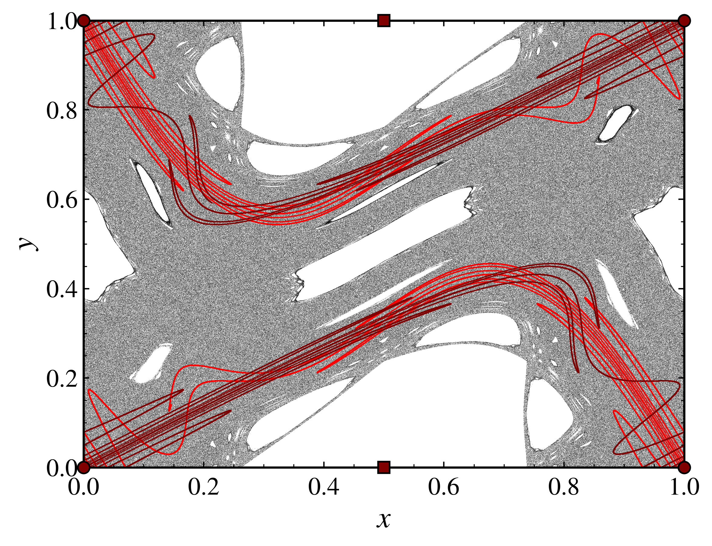

Periodic orbits and their manifolds
-----------------------------------

This section covers the analysis of periodic orbits and their stable and unstable manifolds in discrete dynamical systems using **PyCandy**. It includes methods for identifying periodic orbits, calculating their manifolds, and visualizing the results.

Given a discrete dynamical system :math:`\mathbf{x}_{n + 1} = \mathbf{f}(\mathbf{x}_n)`, a fixed point is a point :math:`\mathbf{x}^*` such that :math:`\mathbf{f}(\mathbf{x}^*) = \mathbf{x}^*`. A periodic orbit of period :math:`p`, on the other hand, is a sequence of points :math:`\mathcal{O} = (\mathbf{x}^*, \mathbf{f}(\mathbf{x}^*), \ldots, \mathbf{f}^{p-1}(\mathbf{x}^*))` such that :math:`\mathbf{f}^p(\mathbf{x}^*) = \mathbf{x}^*`, where :math:`\mathbf{x}^*` is a point in the orbit.

The stable manifold of a hyperbolic fixed point (or hyperbolic periodic orbit) is the set of points that converge to the fixed point (or periodic orbit) under iteration of the map, while the unstable manifold is the set of points that converge to the fixed point (or periodic orbit) under backward iteration of the map.

The stable and unstable manifolds can be computed using the eigenvectors of the Jacobian matrix at the fixed point or periodic orbit. To compute the stable manifold, we need to find the eigenvectors corresponding to eigenvalues with absolute value less than one, :math:`\mathbf{v}_s` ,and for the unstable manifold, we look for eigenvectors corresponding to eigenvalues with absolute value greater than one, :math:`\mathbf{v}_u`.

Once the eigenvectors are computed, we select a large number of points along the unstable eigenvector, :math:`\mathbf{v}_u`, and iterate them forward to obtain points on the unstable manifold. We also select a large number of points along the negative counterpart of :math:`\mathbf{v}_u`, :math:`-\mathbf{v}_u`, and iterate them forward to obtain the complete unstable manifold. Similarly, we select points along the stable eigenvector and its negative counterpart, :math:`\mathbf{v}_s` and :math:`-\mathbf{v}_s`, and iterate them backward to obtain points on the stable manifold.

We are going to illustrate this process using the standard map. As usual, we start by importing the necessary libraries and setting up the discrete dynamical system.

.. code-block:: python

    from pycandy import DiscreteDynamicalSystem
    import numpy as np
    import matplotlib.pyplot as plt
    
    # Create the discrete dynamical system
    dds = dds(model="standard map")

Then, we can compute the fixed points of the system and identify periodic orbits. The standard map has two well-known fixed points at :math:`(0, 0)` and at :math:`(0.5, 0)`. Let's compute their stability using the :py:meth:`classify_stability <pycandy.core.discrete_dynamical_systems.DiscreteDynamicalSystem.classify_stability>` method, which returns a dictionary containing the stability information, the eigenvalues, and the eigenvectors of the fixed points. Note that this method only works for two-dimensional systems. If you wish to compute the eigenvalues and eigenvectors of a fixed point or periodic orbit in a higher-dimensional system, you can use the :py:meth:`eigenvalues_and_eigenvectors <pycandy.core.discrete_dynamical_systems.DiscreteDynamicalSystem.eigenvalues_and_eigenvectors>` method.

.. code-block:: python

    # Define the period
    period = 1

    # Define the parameter
    k = 1.5

    # Define the fixed points
    fixed_points = [[0.0, 0.0], [0.5, 0.0]]
    
    # Classify the stability of the fixed points
    stability_info = ds.classify_stability(fixed_points[0], period, parameters=k)
    print("Stability of fixed point (0, 0):", stability_info["classification"])
    print("Eigenvalues:", stability_info["eigenvalues"])
    print("Eigenvectors:", stability_info["eigenvectors"])

    stability_info = ds.classify_stability(fixed_points[1], period, parameters=k)
    print("Stability of fixed point (0.5, 0):", stability_info["classification"])
    print("Eigenvalues:", stability_info["eigenvalues"])
    print("Eigenvectors:", stability_info["eigenvectors"])

.. code-block:: text

    Stability of fixed point (0, 0): saddle
    Eigenvalues: [3.18614066+0.j 0.31385934+0.j]
    Eigenvectors: [[ 0.82456484+0.j -0.41597356+0.j]
    [ 0.56576746-0.j  0.90937671+0.j]]
    Stability of fixed point (0.5, 0): elliptic (quasi-periodic)
    Eigenvalues: [0.25-0.96824584j 0.25+0.96824584j]
    Eigenvectors: [[0.38729833+0.5j 0.38729833-0.5j]
    [0.77459667+0.j  0.77459667+0.j ]]

Once we have the stability information, we can compute the stable and unstable manifolds of the hyperbolic fixed point, i.e., the saddle point at :math:`(0, 0)`. We use the :py:meth:`manifold <pycandy.core.discrete_dynamical_systems.DiscreteDynamicalSystem.manifold>` method.

.. code-block:: python

    w_unstable = ds.manifold(fixed_points[0], period, parameters=k, n_points=10000, iter_time=13, stability="unstable")
    w_stable = ds.manifold(fixed_points[0], period, parameters=k, n_points=10000, iter_time=13, stability="stable")

This method returns a list containing two arrays: the first array contains the manifold along the eigenvector while the second array contains the manifold along its negative conterpart. The `n_points` parameter specifies the number of points to sample along the eigenvectors, and `iter_time` specifies how many iterations to perform to obtain the manifold points. In the example above, we sample 10,000 points along the eigenvectors and iterate them 13 times to obtain the manifolds. However, we could have chosen different number of points or iterations for :math:`\mathbf{v}` and :math:`-\mathbf{v}` by passing the `n_points` and `iter_time` parameters as lists, e.g., `n_points=[10000, 30000]` and `iter_time=[13, 20]`.

Finally, we can visualize the periodic orbit and its stable and unstable manifolds.

.. code-block:: python

    # We plot a chaotic trajectory to visualize the periodic orbit and its manifolds
    trajectory = ds.trajectory([0.05, 0.05], 2500000, parameters=k)

    from pycandy import PlotStyler
    import matplotlib.pyplot as plt

    # Set the plot style
    ps = PlotStyler(fontsize=18, markersize=0.1, markeredgewidth=0, minor_ticks_visible=True)
    ps.apply_style()

    # Create the plot
    fig, ax = plt.subplots()
    ps.set_tick_padding(ax, pad_x = 6)

    # Plot the chaotic trajectory
    plt.plot(trajectory[:, 0], trajectory[:, 1], "ko")

    # Plot the fixed points: circle for saddle point, square for elliptic point
    for x in (0, 1):
        for y in (0, 1):
            plt.plot(x, y, "o", color="maroon",
                    markersize=7, markeredgewidth=1, markeredgecolor="black",
                    clip_on=False, zorder=10)
    for y in (0, 1):
        plt.plot(0.5, y, "s", color="maroon",
                    markersize=7, markeredgewidth=1, markeredgecolor="black",
                    clip_on=False, zorder=10)

    # Plot the manifolds: red for stable, maroon for unstable
    plt.plot(w_stable[0][:, 0], w_stable[0][:, 1], "o", markersize=0.75, color="red")
    plt.plot(w_stable[1][:, 0], w_stable[1][:, 1], "o", markersize=0.75, color="red")
    plt.plot(w_unstable[0][:, 0], w_unstable[0][:, 1], "o", markersize=0.75, color="maroon")
    plt.plot(w_unstable[1][:, 0], w_unstable[1][:, 1], "o", markersize=0.75, color="maroon")

    # Set the plot limits and labels
    plt.xlim(0, 1)
    plt.ylim(0, 1)
    plt.xlabel("$x$")
    plt.ylabel("$y$")

    plt.show()

   
   Fixed points and stable (red) and unstable (maroon) manifolds of the standard map with :math:`k = 1.5`. The chaotic trajectory is shown in black. The saddle point is marked with a circle, while the elliptic point is marked with a square.

We can also compute the stability of periodic orbits of higher periods. For example, we can compute the stability of the periodic orbit of period 2. We know that the elliptic orbit of period 2 is at :math:`(0.0, 0.5)` and :math:`(0.5, 0.5)`. However, let's assume we do not know that. We know, however, that the periodic orbit is along a symmetry line of the standard map. One of these symmetry lines is the line :math:`x = 0.0`. We can use the :py:meth:`find_periodic_orbit <pycandy.core.discrete_dynamical_systems.DiscreteDynamicalSystem.find_periodic_orbit>` method to compute the periodic orbit of period 2 along this line. This method returns an 1D array cointaining a point on the periodic orbit.

First, we need to define the symmetry line. The symmetry line we are going to use is the line :math:`x = 0.0`. We can define it as a function that returns a list of points along the line given a parameter :math:`y` and the parameters of the system (even though, in this case, the line does not depend on any parameter.

.. code-block:: python

    # Symmetry line function: x = g(y)
    def symmetry_line(y, parameters):
        return 0.0 * np.ones_like(y)

Next, we can use the `find_periodic_orbit` method to compute the periodic orbit of period 2 along this line.

.. code-block:: python

    # Period of the periodic orbit
    period = 2

    # Define the range of y values for the symmetry line
    y_range = (0.4, 0.6)

    # Define the number of points to sample along the symmetry line
    num_points = 10000
    
    # Generate points along the symmetry line
    points = np.linspace(y_range[0], y_range[1], num_points)

    # Initial tolerance for convergence
    tolerance = 2 / num_points

    # Find the periodic orbit along the symmetry line
    periodic_orbit = ds.find_periodic_orbit(points, period, parameters=k,
                     tolerance=tolerance, verbose=True, symmetry_line=symmetry_line, axis=1)

.. code-block:: text

    Iter 0: Δorbit=[0.         0.50007001], Δbounds=[0.0004     0.00027999], tol=2.00e-04
    Iter 1: Δorbit=[0.00000000e+00 3.66680953e-05], Δbounds=[0.0002     0.00013336], tol=1.00e-04
    Iter 2: Δorbit=[0.00000000e+00 1.66711911e-05], Δbounds=[1.00000000e-04 6.66709547e-05], tol=5.00e-05
    Iter 3: Δorbit=[0.00000000e+00 8.33470281e-06], Δbounds=[5.00000000e-05 3.33372621e-05], tol=2.50e-05
    Iter 4: Δorbit=[0.00000000e+00 4.16590749e-06], Δbounds=[2.50000000e-05 1.66715191e-05], tol=1.25e-05
    Iter 5: Δorbit=[0.00000000e+00 2.08331464e-06], Δbounds=[1.25000000e-05 8.33503804e-06], tol=6.25e-06
    Iter 6: Δorbit=[0.00000000e+00 1.04240075e-06], Δbounds=[6.25000000e-06 4.16769927e-06], tol=3.13e-06
    Iter 7: Δorbit=[0.00000000e+00 5.20389292e-07], Δbounds=[3.1250000e-06 2.0838046e-06], tol=1.56e-06
    Iter 8: Δorbit=[0.00000000e+00 2.60605826e-07], Δbounds=[1.56250000e-06 1.04191355e-06], tol=7.81e-07
    Iter 9: Δorbit=[0.00000000e+00 1.30200118e-07], Δbounds=[7.81250000e-07 5.20953965e-07], tol=3.91e-07
    Iter 10: Δorbit=[0.0000000e+00 6.5099708e-08], Δbounds=[3.90625000e-07 2.60477685e-07], tol=1.95e-07
    Iter 11: Δorbit=[0.00000000e+00 3.25499417e-08], Δbounds=[1.95312500e-07 1.30238667e-07], tol=9.77e-08
    Iter 12: Δorbit=[0.00000000e+00 1.62684362e-08], Δbounds=[9.76562500e-08 6.51063521e-08], tol=4.88e-08
    Iter 13: Δorbit=[0.00000000e+00 8.13910805e-09], Δbounds=[4.88281250e-08 3.25564205e-08], tol=2.44e-08
    Iter 14: Δorbit=[0.00000000e+00 4.06670353e-09], Δbounds=[2.44140625e-08 1.62773994e-08], tol=1.22e-08
    Iter 15: Δorbit=[0.00000000e+00 2.03487838e-09], Δbounds=[1.22070313e-08 8.13890227e-09], tol=6.10e-09
    Iter 16: Δorbit=[0.00000000e+00 1.01746456e-09], Δbounds=[6.10351563e-09 4.06940054e-09], tol=3.05e-09
    Iter 17: Δorbit=[0.00000000e+00 5.08522446e-10], Δbounds=[3.05175781e-09 2.03511991e-09], tol=1.53e-09
    Iter 18: Δorbit=[0.00000000e+00 2.54313681e-10], Δbounds=[1.52587891e-09 1.01745518e-09], tol=7.63e-10
    Iter 19: Δorbit=[0.0000000e+00 1.2714374e-10], Δbounds=[7.62939453e-10 5.08753817e-10], tol=3.81e-10
    Iter 20: Δorbit=[0.00000000e+00 6.36259934e-11], Δbounds=[3.81469727e-10 2.54370303e-10], tol=1.91e-10
    Iter 21: Δorbit=[0.00000000e+00 3.17740279e-11], Δbounds=[1.90734863e-10 1.27161226e-10], tol=9.54e-11
    Iter 22: Δorbit=[0.00000000e+00 1.58967284e-11], Δbounds=[9.53674316e-11 6.35867470e-11], tol=4.77e-11
    Iter 23: Δorbit=[0.00000000e+00 7.94597721e-12], Δbounds=[4.76837158e-11 3.17981752e-11], tol=2.38e-11
    Iter 24: Δorbit=[0.00000000e+00 3.97348821e-12], Δbounds=[2.38418579e-11 1.58978386e-11], tol=1.19e-11
    Iter 25: Δorbit=[0.0000000e+00 1.9867441e-12], Δbounds=[1.19209290e-11 7.94930788e-12], tol=5.96e-12
    Iter 26: Δorbit=[0.00000000e+00 9.93427562e-13], Δbounds=[5.96046448e-12 3.97454292e-12], tol=2.98e-12
    Iter 27: Δorbit=[0.00000000e+00 4.96602759e-13], Δbounds=[2.98023224e-12 1.98652206e-12], tol=1.49e-12
    Iter 28: Δorbit=[0.00000000e+00 2.48356891e-13], Δbounds=[1.49011612e-12 9.93427562e-13], tol=7.45e-13
    Iter 29: Δorbit=[0.00000000e+00 1.24233956e-13], Δbounds=[7.45058060e-13 4.96547248e-13], tol=3.73e-13
    Iter 30: Δorbit=[0.00000000e+00 6.20614671e-14], Δbounds=[3.72529030e-13 2.48079335e-13], tol=1.86e-13
    Iter 31: Δorbit=[0.00000000e+00 3.09752224e-14], Δbounds=[1.86264515e-13 1.23900890e-13], tol=9.31e-14
    Iter 32: Δorbit=[0.00000e+00 1.54321e-14], Δbounds=[9.31322575e-14 6.18949336e-14], tol=4.66e-14
    Iter 33: Δorbit=[0.00000000e+00 7.99360578e-15], Δbounds=[4.65661287e-14 3.08086889e-14], tol=2.33e-14
    Iter 34: Δorbit=[0.00000000e+00 3.88578059e-15], Δbounds=[2.32830644e-14 1.53210777e-14], tol=1.16e-14
    Iter 35: Δorbit=[0.00000000e+00 1.77635684e-15], Δbounds=[1.16415322e-14 7.60502772e-15], tol=5.82e-15
    Iter 36: Δorbit=[0.00000000e+00 9.99200722e-16], Δbounds=[5.82076609e-15 3.66373598e-15], tol=2.91e-15
    Iter 37: Δorbit=[0.00000000e+00 5.55111512e-16], Δbounds=[2.91038305e-15 1.66533454e-15], tol=1.46e-15
    Iter 38: Δorbit=[0.00000000e+00 2.22044605e-16], Δbounds=[1.45519152e-15 7.21644966e-16], tol=7.28e-16
    Iter 39: Δorbit=[0.00000000e+00 1.11022302e-16], Δbounds=[7.27595761e-16 3.88578059e-16], tol=3.64e-16
    Converged at iteration 39
    
This huge output was printed because we set the `verbose` parameter to `True`. If you do not want to see the output, you can set it to `False`. At each iteration, the method computes the difference between the current periodic orbit and the previous one, as well as the bounds of the phase space region we are searching for the periodic orbit. The method stops when the difference is smaller than the tolerance specified by the `tolerance` parameter (default is :math:`10^{-15}`). Another important parameter is the `axis` parameter, which specifies the axis along which the symmetry line is defined. In this case, we set it to 1, meaning that the symmetry line is defined along the y-axis. If you want to define the symmetry line along the x-axis, you can set the `axis` parameter to 0.

Now that we have the periodic orbit, we can compute its stability using the :py:meth:`classify_stability <pycandy.core.discrete_dynamical_systems.DiscreteDynamicalSystem.classify_stability>` method as before:

.. code-block:: python

    stability_info = ds.classify_stability(periodic_orbit, period, parameters=k)
    print("Periodic orbit:", periodic_orbit)
    print("Stability of elliptic orbit:", stability_info["classification"])
    print("Eigenvalues:", stability_info["eigenvalues"])
    print("Eigenvectors:", stability_info["eigenvectors"])
    elliptic_period2 = periodic_orbit

.. code-block:: text    

    Periodic orbit: [0.  0.5]
    Stability of elliptic orbit: elliptic (quasi-periodic)
    Eigenvalues: [-0.125-0.99215674j -0.125+0.99215674j]
    Eigenvectors: [[0.7801895 +0.j         0.7801895 +0.j        ]
    [0.58514212-0.22116293j 0.58514212+0.22116293j]]

We confirm what we already knew: the periodic orbit is elliptic. Now for the hyperbolic periodic orbit of period 2. We know that it is on some symmetry line as well, but we do not know whick one. We do know, however, that it is in between the two period 2 islands (Poincaré-Birkhoff theorem). We can then use the :py:meth:`find_periodic_orbit <pycandy.core.discrete_dynamical_systems.DiscreteDynamicalSystem.find_periodic_orbit>` to perform a two-dimensional search for the periodic orbit within a rectangular region: :math:`(x, y) \in [0.1, 0.3] \times [0.3, 0.55]`. We then define a 3D array containing the points in the rectangular region, and we can use the `find_periodic_orbit` method to compute the periodic orbit of period 2.

.. code-block:: python

    # Define the rectangular region for the periodic orbit search
    x_range = (0.1, 0.3)
    y_range = (0.3, 0.55)

    # Define the grid size
    grid_size = 1000

    # Generate a grid of points in the rectangular region
    x = np.linspace(x_range[0], x_range[1], grid_size)
    y = np.linspace(y_range[0], y_range[1], grid_size)
    
    # Create a meshgrid of points in the rectangular region
    X, Y = np.meshgrid(x, y)
    
    # Create a 3D array of points in the rectangular region
    grid_points = np.empty((grid_size, grid_size, 2), dtype=np.float64)
    grid_points[:, :, 0] = X
    grid_points[:, :, 1] = Y

    # Define the period of the periodic orbit
    period = 2
    
    # Define the initial tolerance for convergence
    # (in some cases, you may need to change this value)
    tolerance = 3 / grid_size

    periodic_orbit = ds.find_periodic_orbit(grid_points, period, parameters=k,
                     tolerance=tolerance, verbose=True)
    

.. code-block:: text

    Iter 0: Δorbit=[0.19396929 0.3879654 ], Δbounds=[0.00140741 0.00150751], tol=3.00e-03
    Iter 1: Δorbit=[1.88727501e-05 4.57703655e-05], Δbounds=[0.00159259 0.00149249], tol=1.50e-03
    Iter 2: Δorbit=[5.40849523e-06 2.42798032e-05], Δbounds=[9.25925926e-05 2.69293317e-05], tol=7.50e-04
    Iter 3: Δorbit=[3.42814636e-05 9.01217361e-05], Δbounds=[0.00067011 0.00072307], tol=3.75e-04
    Iter 4: Δorbit=[3.10735983e-06 1.23677792e-04], Δbounds=[0.00010528 0.00011067], tol=1.88e-04
    Iter 5: Δorbit=[3.70667586e-06 3.53102790e-06], Δbounds=[8.22243364e-05 7.68339155e-05], tol=9.38e-05
    Iter 6: Δorbit=[3.01361357e-08 3.36872777e-07], Δbounds=[1.15256636e-05 1.69160845e-05], tol=4.69e-05
    Iter 7: Δorbit=[7.66014634e-07 1.37900647e-06], Δbounds=[3.53493364e-05 2.99589155e-05], tol=2.34e-05
    Iter 8: Δorbit=[1.82281275e-06 3.55314025e-06], Δbounds=[4.02104356e-06 4.63656818e-07], tol=1.17e-05
    Iter 9: Δorbit=[1.25530740e-06 2.27551499e-06], Δbounds=[9.79879227e-06 1.12550932e-05], tol=5.86e-06
    Iter 10: Δorbit=[2.14193806e-06 3.19915124e-06], Δbounds=[3.39660748e-07 8.68038141e-10], tol=2.93e-06
    Iter 11: Δorbit=[1.97703725e-07 5.16354188e-07], Δbounds=[2.60022677e-06 2.92881946e-06], tol=1.46e-06
    Iter 12: Δorbit=[5.75869364e-07 8.57255568e-07], Δbounds=[8.38398644e-08 3.96360783e-09], tol=7.32e-07
    Iter 13: Δorbit=[4.97583285e-08 1.27249785e-07], Δbounds=[6.48582011e-07 7.28458267e-07], tol=3.66e-07
    Iter 14: Δorbit=[1.43672075e-07 2.11641069e-07], Δbounds=[2.07308826e-08 2.75791462e-09], tol=1.83e-07
    Iter 15: Δorbit=[1.28826301e-08 3.18926935e-08], Δbounds=[1.62374586e-07 1.80347554e-07], tol=9.16e-08
    Iter 16: Δorbit=[3.60314427e-08 5.25999979e-08], Δbounds=[4.83177967e-09 2.05524764e-10], tol=4.58e-08
    Iter 17: Δorbit=[3.02014533e-09 8.10305822e-09], Δbounds=[4.09445875e-08 4.55708424e-08], tol=2.29e-08
    Iter 18: Δorbit=[9.08160588e-09 1.35196191e-08], Δbounds=[1.33429012e-09 2.16803520e-10], tol=1.14e-08
    Iter 19: Δorbit=[7.97706290e-10 2.06558343e-09], Δbounds=[1.01498704e-08 1.12272883e-08], tol=5.72e-09
    Iter 20: Δorbit=[2.26935704e-09 3.39282485e-09], Δbounds=[3.13012199e-10 1.92690752e-10], tol=2.86e-09
    Iter 21: Δorbit=[1.90345684e-10 5.24847998e-10], Δbounds=[2.54801077e-09 2.66833222e-09], tol=1.43e-09
    Iter 22: Δorbit=[5.51595242e-10 8.49383619e-10], Δbounds=[8.19713741e-11 1.91165972e-10], tol=7.15e-10
    Iter 23: Δorbit=[1.23726029e-12 8.18859980e-11], Δbounds=[6.36894731e-10 6.58613997e-10], tol=3.58e-10
    Iter 24: Δorbit=[1.35123968e-10 2.09790907e-10], Δbounds=[1.91537064e-11 5.76584891e-11], tol=1.79e-10
    Iter 25: Δorbit=[5.07419107e-12 1.59750546e-11], Δbounds=[1.59660202e-10 1.64269487e-10], tol=8.94e-11
    Iter 26: Δorbit=[3.35392270e-11 5.21385157e-11], Δbounds=[4.88684093e-12 1.42606482e-11], tol=4.47e-11
    Iter 27: Δorbit=[1.23340227e-12 4.05592226e-12], Δbounds=[3.98166222e-11 4.11490286e-11], tol=2.24e-11
    Iter 28: Δorbit=[8.37085956e-12 1.30578326e-11], Δbounds=[1.32302502e-12 3.48665541e-12], tol=1.12e-11
    Iter 29: Δorbit=[2.48523424e-13 1.06231690e-12], Δbounds=[9.95351024e-12 1.02928222e-11], tol=5.59e-12
    Iter 30: Δorbit=[2.10351181e-12 3.27327054e-12], Δbounds=[3.20410365e-13 8.79463169e-13], tol=2.79e-12
    Iter 31: Δorbit=[6.44484466e-14 2.62956323e-13], Δbounds=[2.48703835e-12 2.57299737e-12], tol=1.40e-12
    Iter 32: Δorbit=[5.28632693e-13 8.19844193e-13], Δbounds=[7.18314297e-14 2.25097718e-13], tol=6.98e-13
    Iter 33: Δorbit=[2.08999484e-14 6.20059559e-14], Δbounds=[6.26665386e-13 6.43263220e-13], tol=3.49e-13
    Iter 34: Δorbit=[1.31034072e-13 2.04170014e-13], Δbounds=[2.15105711e-14 5.37347944e-14], tol=1.75e-13
    Iter 35: Δorbit=[3.13638004e-15 1.72084569e-14], Δbounds=[1.55542246e-13 1.60871316e-13], tol=8.73e-14
    Iter 36: Δorbit=[3.31401573e-14 5.12923037e-14], Δbounds=[4.38538095e-15 1.41553436e-14], tol=4.37e-14
    Iter 37: Δorbit=[1.30451205e-15 3.77475828e-15], Δbounds=[3.92463839e-14 4.01900735e-14], tol=2.18e-14
    Iter 38: Δorbit=[8.27116153e-15 1.27675648e-14], Δbounds=[1.27675648e-15 3.44169138e-15], tol=1.09e-14
    Iter 39: Δorbit=[2.22044605e-16 1.11022302e-15], Δbounds=[9.68669589e-15 9.99200722e-15], tol=5.46e-15
    Iter 40: Δorbit=[2.05391260e-15 3.21964677e-15], Δbounds=[4.16333634e-16 8.88178420e-16], tol=2.73e-15
    Iter 41: Δorbit=[2.77555756e-17 2.77555756e-16], Δbounds=[2.30371278e-15 2.44249065e-15], tol=1.36e-15
    Iter 42: Δorbit=[5.27355937e-16 8.32667268e-16], Δbounds=[2.77555756e-17 2.77555756e-16], tol=6.82e-16
    Converged after 42 iterations

Now we can classify the stability of the periodic orbit as before:

.. code-block:: python

    stability_info = ds.classify_stability(periodic_orbit, period, parameters=k)
    print("Periodic orbit:", periodic_orbit)
    print("Stability of hyperbolic periodic orbit:", stability_info["classification"])
    print("Eigenvalues:", stability_info["eigenvalues"])
    print("Eigenvectors:", stability_info["eigenvectors"])
    saddle_period2 = periodic_orbit

.. code-block:: text

    Periodic orbit: [0.19397649 0.38795298]
    Stability of elliptic orbit: saddle
    Eigenvalues: [4.09176343+0.j 0.24439341+0.j]
    Eigenvectors: [[ 0.89240544+0.j -0.69908845+0.j]
    [ 0.45123445-0.j  0.7150352 +0.j]]

Great! This periodic orbit is a saddle point, as expected. We can now compute its stable and unstable manifolds as before:

.. code-block:: python

    w_unstable_period2 = ds.manifold(periodic_orbit, period, parameters=k, n_points=10000, iter_time=18, stability="unstable")
    w_stable_period2 = ds.manifold(periodic_orbit, period, parameters=k, n_points=10000, iter_time=18, stability="stable")

Finally, we can visualize the periodic orbit and its stable and unstable manifolds:

.. code-block:: python

    # Set the plot style
    ps = PlotStyler(fontsize=18, markersize=0.1, markeredgewidth=0, minor_ticks_visible=True)
    ps.apply_style()

    # Create the plot
    fig, ax = plt.subplots()
    ps.set_tick_padding(ax, pad_x = 6)

    # Plot the chaotic trajectory
    plt.plot(trajectory[:, 0], trajectory[:, 1], "ko")

    # Plot the fixed points: circle for saddle point, square for elliptic point
    for x in (0, 1):
        for y in (0, 1):
            plt.plot(x, y, "o", color="maroon",
                    markersize=7, markeredgewidth=1, markeredgecolor="black",
                    clip_on=False, zorder=10)
    for y in (0, 1):
        plt.plot(0.5, y, "s", color="maroon",
                markersize=7, markeredgewidth=1, markeredgecolor="black",
                clip_on=False, zorder=10)

    # Plot the manifolds for the fixed point: red for stable, maroon for unstable
    plt.plot(w_stable[0][:, 0], w_stable[0][:, 1], "o", markersize=0.75, color="red")
    plt.plot(w_stable[1][:, 0], w_stable[1][:, 1], "o", markersize=0.75, color="red")
    plt.plot(w_unstable[0][:, 0], w_unstable[0][:, 1], "o", markersize=0.75, color="maroon")
    plt.plot(w_unstable[1][:, 0], w_unstable[1][:, 1], "o", markersize=0.75, color="maroon")

    # Plot the periodic orbit of period 2
    p2 = ds.trajectory(elliptic_period2, 4, parameters=k)
    for i in range(p2.shape[0]):
        if p2[i, 0] == 0:
            plt.plot(1, p2[i, 1], "s", color="blue",
                markersize=7, markeredgewidth=1, markeredgecolor="black",
                clip_on=False, zorder=10)
        plt.plot(p2[i, 0], p2[i, 1], "s", color="blue",
                markersize=7, markeredgewidth=1, markeredgecolor="black",
                clip_on=False, zorder=10)
    p2 = ds.trajectory(saddle_period2, 4, parameters=k)
    for i in range(p2.shape[0]):
        plt.plot(p2[i, 0], p2[i, 1], "o", color="blue",
                markersize=7, markeredgewidth=1, markeredgecolor="black",
                clip_on=False, zorder=10)

    # Plot the stable and unstable manifolds of the periodic orbit of period 2
    plt.plot(w_stable_period2[0][:, 0], w_stable_period2[0][:, 1], "o", markersize=0.75, color="deepskyblue")
    plt.plot(w_stable_period2[1][:, 0], w_stable_period2[1][:, 1], "o", markersize=0.75, color="deepskyblue")
    plt.plot(w_unstable_period2[0][:, 0], w_unstable_period2[0][:, 1], "o", markersize=0.75, color="blue")
    plt.plot(w_unstable_period2[1][:, 0], w_unstable_period2[1][:, 1], "o", markersize=0.75, color="blue")

    # Set the plot limits and labels
    plt.xlim(0, 1)
    plt.ylim(0, 1)
    plt.xlabel("$x$")
    plt.ylabel("$y$")
    
    plt.show()

.. figure:: images/standard_map_manifolds2.png
   :align: center
   :width: 100%
   
   Fixed points (maroon) and periodic orbit of period 2 (blue) and stable (red, lightblue) and unstable (maroon, blue) manifolds of the standard map with :math:`k = 1.5`. The chaotic trajectory is shown in black. The saddle points are marked with a circle, while the elliptic points are marked with a square.
