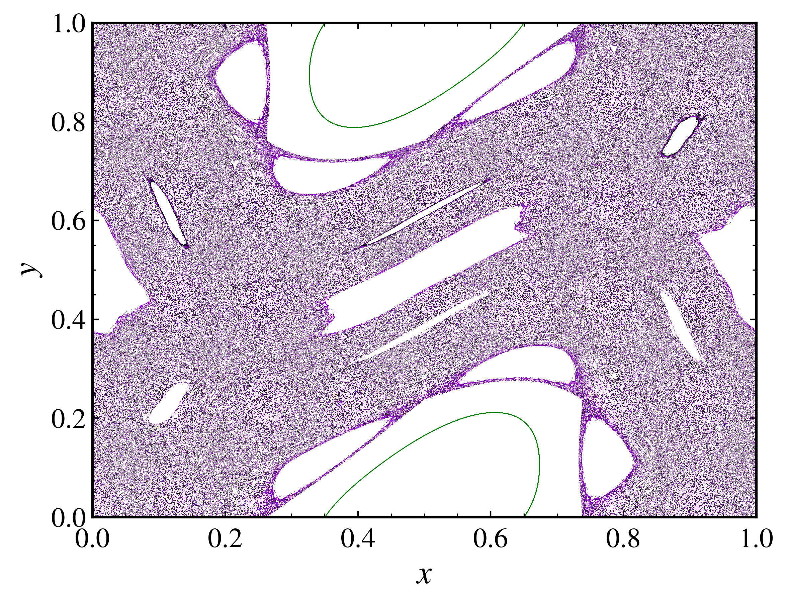
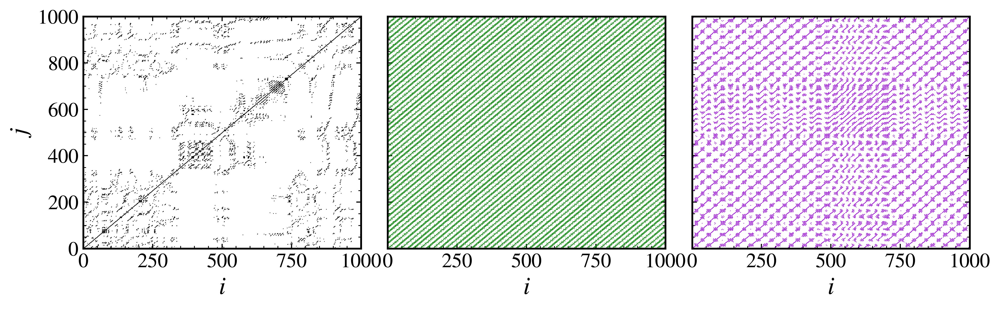
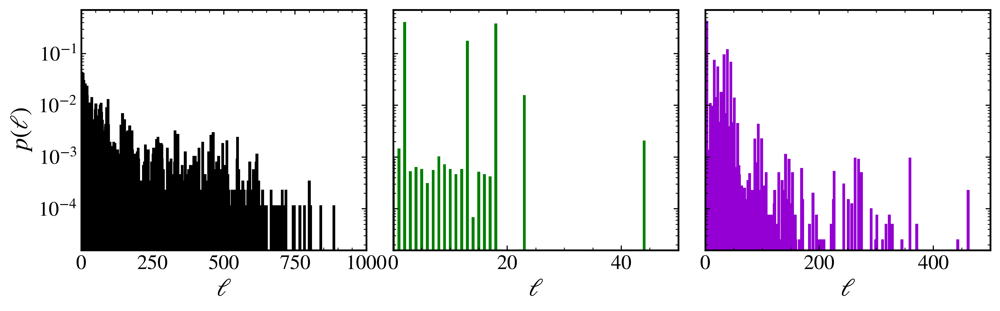

Recurrence time entropy
~~~~~~~~~~~~~~~~~~~~~~~

The recurrence plot (RP) is a graphical representation of the times at which a dynamical system revisits the same state. It is a powerful tool for analyzing complex systems, revealing patterns and structures that may not be immediately apparent in the raw data. The recurrence time entropy (RTE) is a measure derived from the recurrence plot that quantifies the complexity recurrence times of a trajectory. The recurrence matrix is a square matrix that represents the recurrence of states in a dynamical system, where each element indicates whether the system's state at one time point is close to its state at another time point. It is defined as:

.. math::
   
   \begin{equation}
        R_{ij} = H\left(\epsilon - \|\mathbf{x}_i - \mathbf{x}_j\|\right),
   \end{equation}

where :math:`R_{ij}` is the element of the recurrence matrix at row :math:`i` and column :math:`j`, :math:`\mathbf{x}_i` and :math:`\mathbf{x}_j` are the state vectors at time points :math:`i` and :math:`j`, respectively, and :math:`H` is the Heaviside step function. The parameter :math:`\epsilon` is a threshold that determines whether two states are considered close enough to be recurrent.

The recurrence time entropy is defined as the Shannon entropy of the distribution of recurrence times. The recurrence times are obtained from the RP via the distribution of white vertical lines, i.e., the distribution of the gaps between two consecutive diagonal lines in the RP. This distribution captures the time intervals between successive recurrences of the system's state, providing a statistical measure of how often and how regularly the system revisits its states.

The recurrence time entropy is computed as follows:

.. math::

   \begin{equation}
        \mathrm{RTE} = -\sum_{\ell = \ell_{\text{min}}}^{\ell_\text{max}}p(\ell)\ln p(\ell),
    \end{equation}

where :math:`p(\ell)` is the probability of recurrence time :math:`\ell`, and :math:`\ell_{\text{min}}` and :math:`\ell_{\text{max}}` are the minimum and maximum recurrence times, respectively. The RTE provides a measure of the complexity of the recurrence times, with higher values indicating chaotic dynamics and lower values indicating more regular behavior.

We are going to illustrate the concept of recurrence time entropy using three different initial conditions for the standard map with :math:`k = 1.5`. First, let's visualize the trajectories of the standard map for these initial conditions:

.. code-block:: python

   from pynamicalsys import DiscreteDynamicalSystem as dds
   from pynamicalsys import PlotStyler
   import numpy as np
   import matplotlib.pyplot as plt

   # Create a discrete dynamical system for the standard map
   ds = dds(model="standard map")

   # Define the initial conditions and parameters
   u = [[0.05, 0.05],
     [0.35, 0.0],
     [0.43, 0.2]]
   k = 1.5

   # Generate trajectories for the standard map
   total_time = 500000
   trajectories = ds.trajectory(u, total_time, parameters=k).reshape(len(u), total_time, 2)

   # Set the plot style
   ps = PlotStyler(fontsize=18, markersize=0.2, markeredgewidth=0, minor_ticks_visible=True)
   ps.apply_style()

   
   # Define the figure and axis for plotting
   fig, ax = plt.subplots()
   ps.set_tick_padding(ax, pad_x = 6)

   # Plot the trajectories
   colors = ["black", "green", "darkviolet"]
   for i in range(len(u)):
      plt.plot(trajectories[i, :, 0], trajectories[i, :, 1], "o", c=colors[i])

   # Set the axis limits and labels
   plt.xlim(0, 1)
   plt.ylim(0, 1)
   plt.xlabel("$x$")
   plt.ylabel("$y$")
   plt.show()

   
   Three trajectories of the standard map with different initial conditions.

Next, we will compute the recurrence matrices for these trajectories using the :py:meth:`recurrence_matrix <pynamicalsys.core.time_series_metrics.TimeSeriesMetrics.recurrence_matrix>` method from the :py:class:`TimeSeriesMetrics <pynamicalsys.core.time_series_metrics.TimeSeriesMetrics>` class. The recurrence matrix is computed using a threshold of 10% of the standard deviation of the trajectory. To change that, use the parameters `threshold` and `threshold_std`. The recurrence matrices, given a trajectory, are calculated as shown below:

.. code-block:: python

   from pynamicalsys import TimeSeriesMetrics

   # Empty lists to store recurrence matrices and white vertical line distributions
   recmats = []
   Ps = []

   # Compute the recurrence matrices and white vertical line distributions
   for i in range(len(u)):
      # Create a TimeSeriesMetrics object for the trajectory
      tsm = TimeSeriesMetrics(trajectories[i, :1000, :])
      # Compute the recurrence matrix and white vertical line distribution
      recmat, P = tsm.recurrence_matrix(compute_white_vert_distr=True)
      # Store the recurrence matrix and white vertical line distribution
      recmats.append(recmat)
      Ps.append(P)
   
   # Set the plot style for recurrence matrices
   ps = PlotStyler(fontsize=18, markersize=0.5, markeredgewidth=0, minor_ticks_visible=True)
   ps.apply_style()

   # Create the figure and axis for plotting the recurrence matrices
   fig, ax = plt.subplots(1, 3, figsize=(10, 3), sharey=True, sharex=True)

   # Plot the recurrence matrices
   for i in range(len(u)):
      # Find the indices of the non-zero elements in the recurrence matrix
      non_zero_indices = np.nonzero(recmats[i])
      # Plot the non-zero elements
      ax[i].plot(non_zero_indices[0], non_zero_indices[1], "o", c=colors[i])
   
   # Set the axis limits and labels for the recurrence matrices
   ax[0].set_xlim(0, 1000)
   ax[0].set_ylim(0, 1000)
   ax[0].set_xlabel("$i$")
   ax[0].set_ylabel("$j$")
   ax[1].set_xlabel("$i$")
   ax[2].set_xlabel("$i$")

   plt.tight_layout(pad=0.05)
   plt.show()

   
   Recurrence matrices for the standard map with three different initial conditions.

The recurrence matrices for the three trajectories exhibit different patterns, reflecting the underlying dynamics of the system. The first trajectory shows a complex structure, while the second exhibits a more regular pattern. The third trajectory shows a mix of both regular and chaotic behavior.

To calculate the recurrence time entropy from the trajectory data, we use the :py:meth:`recurrence_time_entropy <pynamicalsys.core.time_series_metrics.TimeSeriesMetrics.recurrence_time_entropy>` method from the :py:class:`TimeSeriesMetrics <pynamicalsys.core.time_series_metrics.TimeSeriesMetrics>` class

.. code-block:: python

   rtes = []
   for i in range(len(u)):
      tsm = TimeSeriesMetrics(trajectories[i, :1000, :])
      rte = tsm.recurrence_time_entropy()
      rtes.append(rte)
   print(rtes)

.. code-block:: text

   [4.961395761597473, 1.190112332533454, 2.1694882785487892]

The recurrence time entropy values reflect the complexity of the RPs we have discussed above. The first trajectory has a high RTE value, indicating a complex and chaotic behavior, while the second trajectory has a low RTE value, suggesting more regular dynamics. The third trajectory has an intermediate RTE value, indicating a mix of both regular and chaotic behavior.

Finally, we can visualize the white vertical line distributions for the recurrence matrices. The white vertical lines in the recurrence plot represent the gaps between successive diagonal lines, which correspond to the recurrence times:

.. code-block:: python

   # Set the plot style
   ps = PlotStyler(fontsize=18, markersize=0.5, markeredgewidth=0, minor_ticks_visible=True)
   ps.apply_style()

   # Create the figure and axis for plotting the white vertical line distributions
   fig, ax = plt.subplots(1, 3, figsize=(10, 3), sharey=True)

   # Plot the white vertical line distributions
   width = [10, .5, 5]
   for i in range(len(u)):
      Ns = np.arange(Ps[i].shape[0])
      P_norm = Ps[i] / Ps[i].sum()
      ax[i].bar(Ns, P_norm, color=colors[i], width=width[i])

   # Set the axis limits and labels for the white vertical line distributions
   ax[0].set_yscale("log")
   ax[0].set_xlim(0, 1000)
   ax[1].set_xlim(0, 50)
   ax[2].set_xlim(0, 500)
   ax[0].set_ylabel(r"$p(\ell)$")
   ax[0].set_xlabel(r"$\ell$")
   ax[1].set_xlabel(r"$\ell$")
   ax[2].set_xlabel(r"$\ell$")

   plt.tight_layout(pad=0.05)
   plt.show()

   
   White vertical line distribution for the above recurrence matrices.

The recurrence time entropy can also be computed using the :py:class:`DiscreteDynamicalSystem <pynamicalsys.core.discrete_dynamical_systems.DiscreteDynamicalSystem>` class directly, which simplifies the process:

.. code-block:: python

   from pynamicalsys import DiscreteDynamicalSystem as dds

   # Create a discrete dynamical system for the standard map
   ds = dds(model="standard map")

   u = [[0.05, 0.05],
     [0.35, 0.0],
     [0.43, 0.2]]
   k = 1.5
   total_time = 1000
   rtes = [ds.recurrence_time_entropy(u[i], total_time, parameters=k) for i in range(len(u))]
   print(rtes)

.. code-block:: text

   [4.961395761597473, 1.190112332533454, 2.1694882785487892]

The `DiscreteDynamicalSystem.recurrence_time_entropy` method can also return the recurrence matrix, the white vertical line distribution, and the final state of the initial condition. See :py:meth:`DiscreteDynamicalSystem.recurrence_time_entropy <pynamicalsys.core.discrete_dynamical_systems.DiscreteDynamicalSystem.recurrence_time_entropy>` for more details.

As a final example. let's compute the recurrence time entropy for the standard map for three different parameter values, :math:`k = 0.9`, :math:`k = 1.5`, and :math:`k = 3.6`, using random initial conditions:

.. code-block:: python

   from pynamicalsys import DiscreteDynamicalSystem as dds
   import numpy as np
   from pynamicalsys import PlotStyler
   import matplotlib.pyplot as plt

   # Create a discrete dynamical system for the standard map
   ds = dds(model="standard map")

   # Define the initial conditions and parameters
   num_ic = 250
   x_range = (0, 1)  # x range for initial conditions
   y_range = (0, 1)  # y range for initial conditions
   np.random.seed(0)  # Set the seed for reproducibility
   x_ic = np.random.uniform(x_range[0], x_range[1], num_ic)
   y_ic = np.random.uniform(y_range[0], y_range[1], num_ic)
   u = np.column_stack((x_ic, y_ic))  # Initial conditions array with shape (num_ic, d)
   k = [0.9, 1.5, 3.6]  # Parameter values
   total_time = 10000  # Total time for the simulation

   # Compute the recurrence time entropy for each parameter value
   rte = [ds.recurrence_time_entropy(u[i], total_time, parameters=k[j]) for i in range(num_ic) for j in range(len(k))]
   rte = np.array(rte).reshape(num_ic, len(k))

   # We also compute the trajectories for visualization
   trajectories = [ds.trajectory(u, total_time, parameters=k[i]) for i in range(len(k))]
   trajectories_reshaped = []
   for trajectory in trajectories:
      trajectory_reshaped = trajectory.reshape(num_ic, total_time, 2)
      trajectories_reshaped.append(trajectory_reshaped)

   # Set the plot style
   ps = PlotStyler(fontsize=24)
   ps.apply_style()

   # Create the figure and axis for plotting the recurrence time entropy
   fig, ax = plt.subplots(1, 3, figsize=(15, 5), sharey=True, sharex=True)
   [ps.set_tick_padding(ax[i], pad_x = 8) for i in range(3)]

   # Plot the trajectories and recurrence time entropy
   # Create scatter plots for each parameter value
   # and color them according to the recurrence time entropy
   hms = [0, 0, 0]
   for j in range(len(k)):
      for i in range(num_ic):
         hm = ax[j].scatter(trajectories_reshaped[j][i, :, 0],
                           trajectories_reshaped[j][i, :, 1],
                           c=rte[i, j] * np.ones(total_time),
                           s=0.05,
                           edgecolor='none',
                           cmap="nipy_spectral",
                           vmin=0,
                           vmax=rte[:, j].max())
         hms[j] = hm

   [plt.colorbar(hms[i], ax=ax[i], label=rf"RTE with $k = {k[i]:.1f}$", location="top", aspect=40, pad=0.01) for i in range(len(k))]
   ax[0].set_xlim(0, 1)
   ax[0].set_ylim(0, 1)
   ax[0].set_ylabel("$y$")
   [ax[i].set_xlabel("$x$") for i in range(len(k))]

   plt.tight_layout(pad=0.05)
   plt.show()

.. figure:: images/standard_map_rte.png
   :align: center
   :width: 100%
   
   Recurrence time entropy for the standard map with three different parameter values
