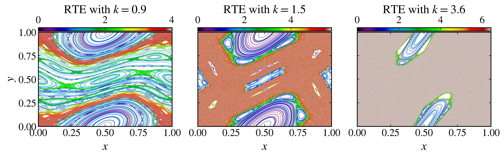

Recurrence time entropy
~~~~~~~~~~~~~~~~~~~~~~~

A recurrence plot records when a trajectory returns close to a state that it visited previously. This representation was introduced by `Eckmann, Kamphorst, and Ruelle (1987) <https://doi.org/10.1209/0295-5075/4/9/004>`_. For a trajectory :math:`\{\mathbf{x}_i\}_{i=1}^{N}`, the recurrence matrix is

.. math::

    R_{ij}=\Theta\!\left(\varepsilon-\left\|\mathbf{x}_i-\mathbf{x}_j\right\|\right),

where :math:`\Theta` is the Heaviside function, :math:`\varepsilon` is the recurrence threshold, and the norm determines the distance between states. A recurrence is recorded when :math:`R_{ij}=1`.

The zeros between consecutive recurrence points in a column form white vertical lines. Their lengths estimate the recurrence times of the trajectory. If :math:`P_w(v)` is the number of white vertical lines of length :math:`v`, the normalized distribution is

.. math::

    p_w(v)=\frac{P_w(v)}{\displaystyle\sum_{v=v_{\min}}^{v_{\max}}P_w(v)}.

The recurrence time entropy (RTE) is the Shannon entropy of this distribution:

.. math::

    \mathrm{RTE}=-\sum_{v=v_{\min}}^{v_{\max}}p_w(v)\ln p_w(v).

The entropy of a recurrence-period distribution was introduced by `Little et al. (2007) <https://doi.org/10.1186/1475-925X-6-23>`_. Its formulation from the white vertical lines of recurrence plots and its use for detecting stickiness were developed by `Sales et al. (2023) <https://doi.org/10.1063/5.0140613>`_.

Interpreting RTE
^^^^^^^^^^^^^^^^

The interpretation is motivated by `Slater's theorem <https://doi.org/10.1017/S0305004100026086>`_. An irrational rotation on a circle has at most three return times to a connected interval, with the third equal to the sum of the other two. Consequently, periodic motion has a single recurrence time and :math:`\mathrm{RTE}=0`, while quasiperiodic motion generally produces a small number of recurrence times and a low RTE. Chaotic motion has a broader recurrence-time distribution and typically produces a larger RTE.

For mixed phase spaces, sticky chaotic trajectories temporarily resemble quasiperiodic motion near regular islands. Their RTE can therefore be lower than that of trajectories moving through the chaotic sea but higher than that of regular trajectories. `Sales et al. (2023) <https://doi.org/10.1063/5.0140613>`_ showed that RTE is strongly positively correlated with the largest Lyapunov exponent for the standard map and that the finite-time RTE distribution can resolve different hierarchical levels of islands around islands.

These statements describe the relative behavior of RTE for a fixed analysis procedure. RTE values depend on the trajectory length, recurrence threshold, distance metric, minimum line length, and scaling of the state variables. They should not be compared across calculations that use incompatible settings.

Choosing the recurrence threshold
^^^^^^^^^^^^^^^^^^^^^^^^^^^^^^^^^

The threshold :math:`\varepsilon` must be large enough to produce a useful number of recurrences but small enough to preserve local phase-space structure. The :py:meth:`recurrence_time_entropy <pynamicalsys.core.discrete_dynamical_systems.DiscreteDynamicalSystem.recurrence_time_entropy>` method provides three threshold strategies through ``threshold_mode``:

``threshold_mode="std"``
    Interprets ``threshold`` as a scale multiplying the norm of the componentwise standard-deviation vector. With ``threshold=0.1`` and ``std_metric="supremum"``, the threshold is :math:`\varepsilon=0.1\max_j\sigma_j`. This reproduces the choice used by `Sales et al. (2023) <https://doi.org/10.1063/5.0140613>`_ for the standard map.

``threshold_mode="direct"``
    Uses ``threshold`` directly in the units of the state-space distance. This is useful when a physically meaningful neighborhood size is known.

``threshold_mode="rr"``
    Chooses :math:`\varepsilon` from the quantile of the off-diagonal pairwise distances so that ``threshold`` specifies a target recurrence rate. In this mode, ``threshold`` must lie strictly between zero and one.

For ``"std"`` and ``"direct"``, ``threshold`` must be positive. The deprecated ``threshold_std`` option should not be used in new code. Its replacements are ``threshold_mode="std"`` and ``threshold_mode="direct"``.

The ``metric`` option controls distances between trajectory states and accepts ``"supremum"``, ``"euclidean"``, ``"manhattan"``, or a callable. The ``std_metric`` option independently controls how the componentwise standard deviations are combined in ``"std"`` mode and accepts the same named norms or a callable. The defaults are the supremum norm for both. If the state variables have very different physical scales, normalize them first or choose a metric that accounts for those scales.

For example, the three threshold modes can be selected as follows:

.. code-block:: python

    initial_state = [0.05, 0.05]

    rte_std = system.recurrence_time_entropy(
        u=initial_state,
        total_time=5_000,
        parameters=[1.5],
        threshold_mode="std",
        threshold=0.1,
        metric="supremum",
        std_metric="supremum",
    )

    rte_direct = system.recurrence_time_entropy(
        u=initial_state,
        total_time=5_000,
        parameters=[1.5],
        threshold_mode="direct",
        threshold=0.02,
    )

    rte_rr = system.recurrence_time_entropy(
        u=initial_state,
        total_time=5_000,
        parameters=[1.5],
        threshold_mode="rr",
        threshold=0.05,
    )

The minimum accepted white-line length is controlled by ``lmin`` and defaults to one. Increasing it removes the shortest recurrence times before the probability distribution and entropy are calculated.

Optional outputs
^^^^^^^^^^^^^^^^

By default, ``recurrence_time_entropy`` returns only the scalar RTE. The method can also return the final state, recurrence matrix, and normalized nonzero white-line distribution. Requested outputs always follow the RTE in that order:

.. code-block:: python

    rte, final_state, recurrence_matrix, distribution = system.recurrence_time_entropy(
        u=initial_state,
        total_time=5_000,
        parameters=[1.5],
        threshold_mode="std",
        threshold=0.1,
        return_final_state=True,
        return_recmat=True,
        return_p=True,
    )

The recurrence matrix contains :math:`N^2` entries, so both its construction and storage become expensive for long trajectories. Use only the trajectory length needed to resolve the recurrence-time distribution, and request ``return_recmat=True`` only when the matrix itself is needed.

Comparing parameter values
^^^^^^^^^^^^^^^^^^^^^^^^^^

The following example keeps the same ensemble of random initial conditions and compares the standard map at :math:`k=0.9`, :math:`k=1.5`, and :math:`k=3.6`. For each trajectory, the recurrence threshold is ten percent of the supremum norm of its standard-deviation vector:

.. code-block:: python

    import numpy as np
    import matplotlib.pyplot as plt
    from pynamicalsys import DiscreteDynamicalSystem as dds, PlotStyler

    system = dds(model="standard map")

    num_initial_conditions = 250
    np.random.seed(0)
    x_initial = np.random.uniform(0.0, 1.0, num_initial_conditions)
    y_initial = np.random.uniform(0.0, 1.0, num_initial_conditions)
    initial_states = np.column_stack((x_initial, y_initial))
    parameter_values = [0.9, 1.5, 3.6]
    total_time = 10_000

    rte_values = np.empty((len(parameter_values), num_initial_conditions))
    trajectories = np.empty(
        (len(parameter_values), num_initial_conditions, total_time, 2)
    )
    for i, k in enumerate(parameter_values):
        for j, initial_state in enumerate(initial_states):
            rte_values[i, j] = system.recurrence_time_entropy(
                u=initial_state,
                total_time=total_time,
                parameters=[k],
                threshold_mode="std",
                threshold=0.1,
                metric="supremum",
                std_metric="supremum",
            )

        trajectories[i] = system.trajectory(
            u=initial_states,
            total_time=total_time,
            parameters=[k],
        ).reshape(num_initial_conditions, total_time, 2)

Plot the trajectories and assign every point the RTE of the initial condition that generated it:

.. code-block:: python

    ps = PlotStyler()
    ps.apply_style()
    fig, ax = plt.subplots(1, 3, figsize=(12, 4), sharex=True, sharey=True)
    for i, k in enumerate(parameter_values):
        trajectory_rte = np.repeat(rte_values[i], total_time)
        points = ax[i].scatter(
            trajectories[i, :, :, 0].ravel(),
            trajectories[i, :, :, 1].ravel(),
            c=trajectory_rte,
            s=0.05,
            edgecolor="none",
            cmap="nipy_spectral",
            vmin=0.0,
            vmax=rte_values[i].max(),
        )
        fig.colorbar(
            points,
            ax=ax[i],
            label=rf"RTE with $k={k:.1f}$",
            location="top",
            aspect=40,
            pad=0.01,
        )
        ax[i].set_xlim(0.0, 1.0)
        ax[i].set_ylim(0.0, 1.0)
        ax[i].set_xlabel("$x$")
    ax[0].set_ylabel("$y$")
    fig.tight_layout()
    plt.show()

    Standard-map trajectories colored by their recurrence time entropy for three values of :math:`k`.

At :math:`k=0.9`, invariant curves occupy much of the phase space. At :math:`k=1.5`, the chaotic sea coexists with prominent regular islands and sticky layers. At :math:`k=3.6`, the chaotic component is larger while smaller regular structures remain. Within each panel, low RTE values identify trajectories with a narrow recurrence-time distribution and high values identify trajectories with a broader distribution.

Finite-time RTE
^^^^^^^^^^^^^^^

Use :py:meth:`finite_time_recurrence_time_entropy <pynamicalsys.core.discrete_dynamical_systems.DiscreteDynamicalSystem.finite_time_recurrence_time_entropy>` to follow changes along one trajectory. The method divides ``total_time`` into consecutive non-overlapping windows of length ``finite_time`` and returns one RTE value per complete window. Any remainder shorter than ``finite_time`` is not used.

.. code-block:: python

    finite_rte, phase_space_points = system.finite_time_recurrence_time_entropy(
        u=[0.05, 0.05],
        total_time=100_000,
        finite_time=200,
        parameters=[1.5],
        return_points=True,
        threshold_mode="std",
        threshold=0.1,
    )

When ``return_points=True``, ``phase_space_points[i]`` is the state at the beginning of the window that produced ``finite_rte[i]``. A multimodal finite-time RTE distribution can reveal transitions between the chaotic sea and sticky layers, but the locations of its modes depend on the window length and threshold settings.
