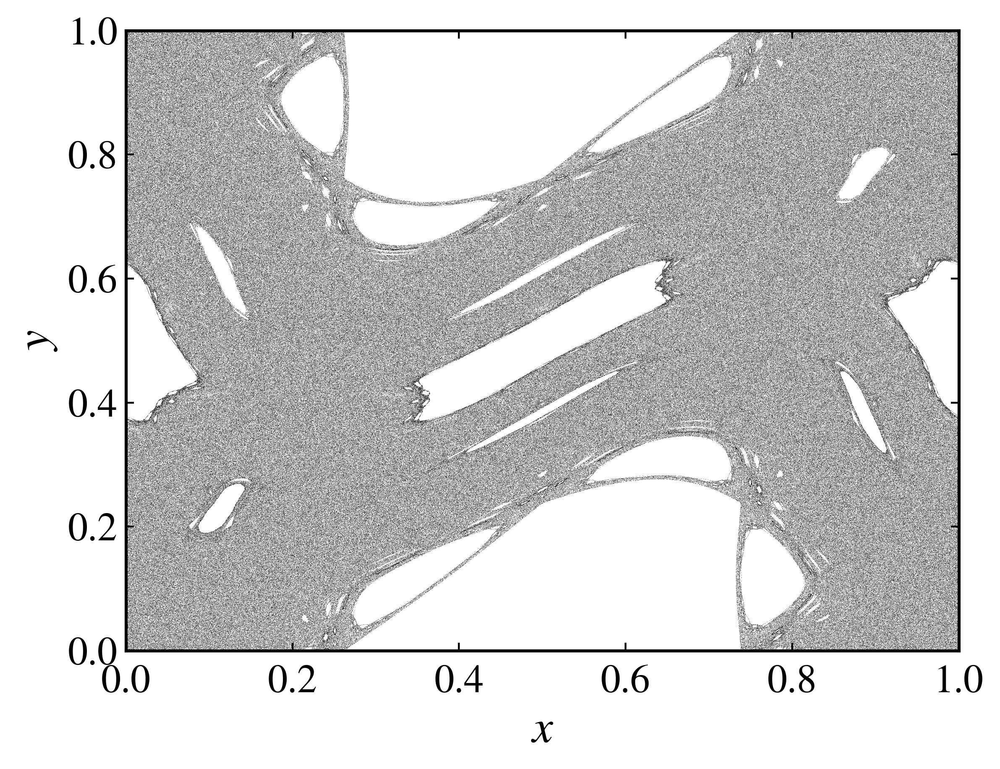
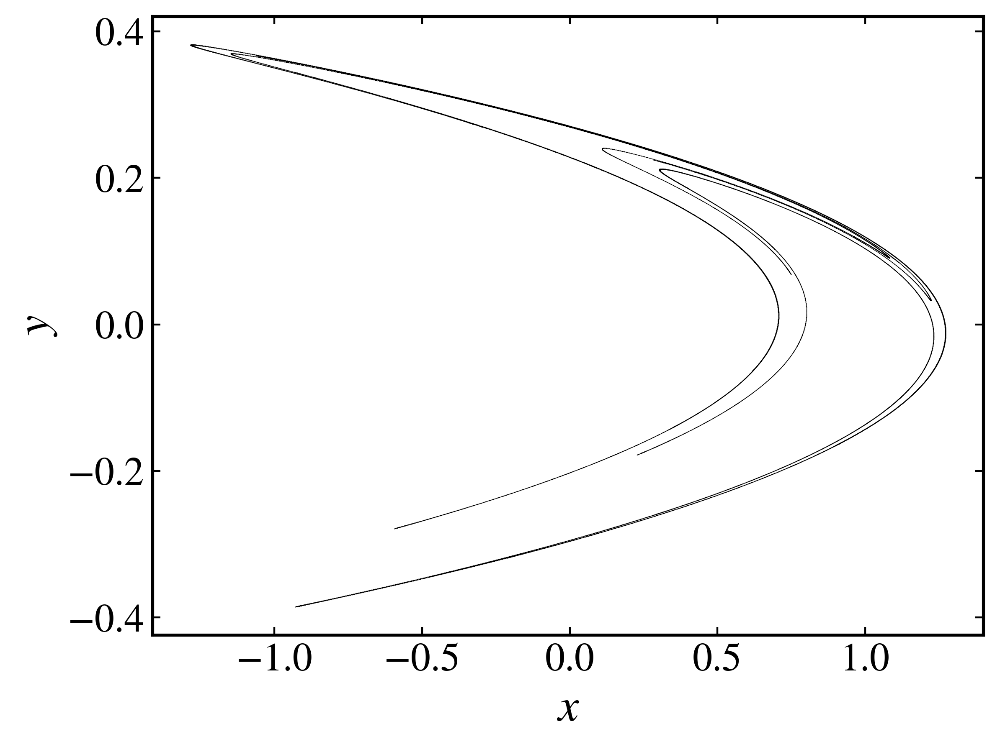

Generating trajectories
-----------------------

To generate trajectories for a discrete dynamical system, we can use the :py:meth:`trajectory <pycandy.core.discrete_dynamical_systems.DiscreteDynamicalSystem.trajectory>` method of the :py:class:`DiscreteDynamicalSystem <pycandy.core.discrete_dynamical_systems.DiscreteDynamicalSystem>` class. This method allows us to specify the initial condition, parameter values, and total time for the simulation.

Single initial condition
~~~~~~~~~~~~~~~~~~~~~~~~

As a first example, let's consider the standard map. We first create an instance of the :py:class:`DiscreteDynamicalSystem <pycandy.core.discrete_dynamical_systems.DiscreteDynamicalSystem>` class:

.. code-block:: python

    from pycandy import DiscreteDynamicalSystem

    import numpy as np
    import matplotlib.pyplot as plt
    import seaborn as sns

    # Create an instance of the standard map
    ds = DiscreteDynamicalSystem(model="standard_map")

Next, we can generate a trajectory by specifying the initial condition, parameters, and total time. The :py:meth:`trajectory <pycandy.core.discrete_dynamical_systems.DiscreteDynamicalSystem.trajectory>` method returns a Numpy array with shape `(N, d)`, where `N` is the number of iterations and `d` is the dimension of the system. Each row of the array corresponds to a time step, and each column corresponds to a state variable. 

.. code-block:: python

    # Generate a trajectory with initial condition (x, y) = (0.2, 0.5), k = 1.5, and total_time = 100000
    u = [0.2, 0.5]
    k = 1.5
    total_time = 100000

    trajectory = ds.trajectory(u, total_time, parameters=k)

To visualize the generated trajectory, we can use Matplotlib to plot the time series of the system's state. But before, let's import the :py:class:`PlotStyler <pycandy.core.plot_styler.PlotStyler>` class from PyCandy to set the plot style:

.. code-block:: python

    from pycandy import PlotStyler

Then, we can apply the style and plot the trajectory:

.. code-block:: python

    # Apply the plot style
    ps = PlotStyler(markersize=0.1, markeredgewidth=0)
    ps.apply_style()

    # Create a figure and axis
    fig, ax = plt.subplots()

    # Set the tick padding for the x-axis
    ps.set_tick_padding(ax, pad_x = 6)

    # Plot the trajectory
    plt.plot(trajectory[:, 0], trajectory[:, 1], "ko")

    # Set the axis limits and labels
    plt.xlim(0, 1)
    plt.ylim(0, 1)
    plt.xlabel("$x$")
    plt.ylabel("$y$")

    plt.show()

   
   Standard map trajectory for :math:`k = 1.5`.

Multiple initial conditions
~~~~~~~~~~~~~~~~~~~~~~~~~~~

To generate trajectories for multiple initial conditions, we can use the :py:meth:`trajectory <pycandy.core.discrete_dynamical_systems.DiscreteDynamicalSystem.trajectory>` method and simply pass a list of initial conditions with shape `(M, d)`, where `M` is the number of initial conditions and `d` is the system's dimension. The method will return a Numpy array with shape `(N * M, d)`, where `N` is the number of iterations. In other words, each initial condition will generate its own trajectory, and the results will be concatenated into a single array. It is, however, possible to reshape the output to get a list of trajectories, each with shape `(N, d)`.

Let's then generate trajectories for 200 randomly chosen initial conditions in the unit square, with a fixed parameter value and total time:

.. code-block:: python
    
    # Set the random seed for reproducibility
    np.random.seed(13)
    
    # Range for initial conditions 
    x_range = (0, 1)
    y_range = (0, 1)

    # Number of initial conditions
    num_ic = 200

    # Generate random initial conditions in the unit square
    x_ic = np.random.uniform(x_range[0], x_range[1], num_ic)
    y_ic = np.random.uniform(y_range[0], y_range[1], num_ic)
    u = np.column_stack((x_ic, y_ic)) # Initial conditions array with shape (num_ic, 2)
    
    # Parameter value and total time
    k = 1.5
    total_time = 10000
    
    # Generate trajectories for each initial condition
    trajectories = ds.trajectory(u, total_time, parameters=k)
    
    # Reshape the output to get a list of trajectories
    trajectories_reshaped = trajectory.reshape(num_ic, total_time, 2)

To visualize the results, we can plot each trajectory in a loop. We will use the :py:class:`PlotStyler <pycandy.core.plot_styler.PlotStyler>` class to set the plot style and customize the appearance of the trajectories and we will use Seaborn to generate a color palette for the trajectories:

.. code-block:: python

    # Apply the plot style
    ps = PlotStyler(markersize=0.1, markeredgewidth=0)
    ps.apply_style()

    # Create a figure and axis
    fig, ax = plt.subplots()

    # Set the tick padding for the x-axis
    ps.set_tick_padding(ax, pad_x = 6)
    
    # Plot each trajectory with a different color
    colors = sns.color_palette("husl", num_ic)
    for i in range(trajectories_reshaped.shape[0]):
        plt.plot(trajectories_reshaped[i, :, 0], trajectories_reshaped[i, :, 1], 'o', c=colors[i])
    
    # Set the axis limits and labels
    plt.xlim(0, 1)
    plt.ylim(0, 1)
    plt.xlabel(r'$x$')
    plt.ylabel(r'$y$')

    plt.show()

.. figure:: images/standard_map_rand_trajectories.png
   :align: center
   :width: 100%
   
   Standard map trajectories for :math:`k = 1.5`.

This plot shows the trajectories of the system starting from different initial conditions in the unit square. Each trajectory is represented by a different color, allowing us to visualize the system's behavior over time.

Dissipative system example
~~~~~~~~~~~~~~~~~~~~~~~~~~

As a final example, let's consider a dissipative system, the Hénon map. The Hénon map is defined as:

.. math::

    \begin{align*}
        x_{n+1} &= 1 - a x_n^2 + y_n, \\
        y_{n+1} &= b x_n,
    \end{align*}

where :math:`a` and :math:`b` are parameters of the system. We can create an instance of the :py:class:`DiscreteDynamicalSystem <pycandy.core.discrete_dynamical_systems.DiscreteDynamicalSystem>` class for the Hénon map and generate trajectories in a similar way as before. However, in the case of dissipative systems, we often discard the initial transient period and focus on the long-term behavior of the system.

.. code-block:: python

    # Create an instance of the Hénon map
    ds = dds(model="henon map")

    # Parameters for the Hénon map
    a = 1.4
    b = 0.3
    parameters = [a, b]
    total_time = 500000
    transient_time = 50000

    # Generate a trajectory with initial condition (x, y) = (0.2, 0.2)
    u = [0.2, 0.2]
    tracjectory = ds.trajectory(u, total_time, parameters=parameters, transient_time=transient_time)

We can then visualize the Hénon map trajectory:

.. code-block:: python

    ps = PlotStyler(markersize=0.2, markeredgewidth=0)
    ps.apply_style()

    plt.plot(tracjectory[:, 0], tracjectory[:, 1], "ko")
    
    plt.xlabel("$x$")
    plt.ylabel("$y$")

    plt.show()

   
   Hénon map trajectory for :math:`a = 1.4` and :math:`b = 0.3`.
