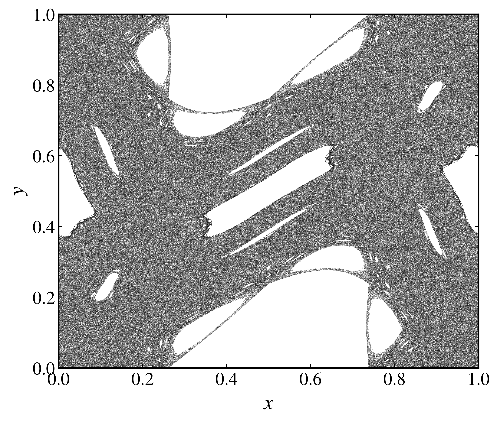
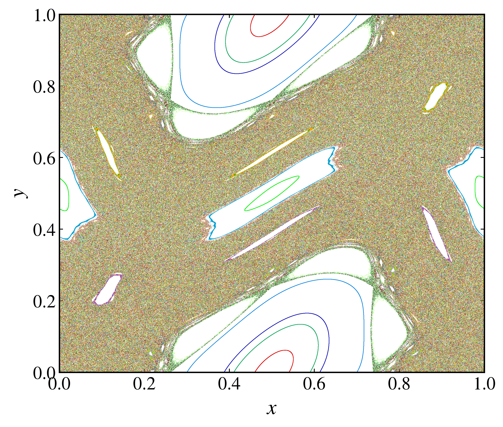
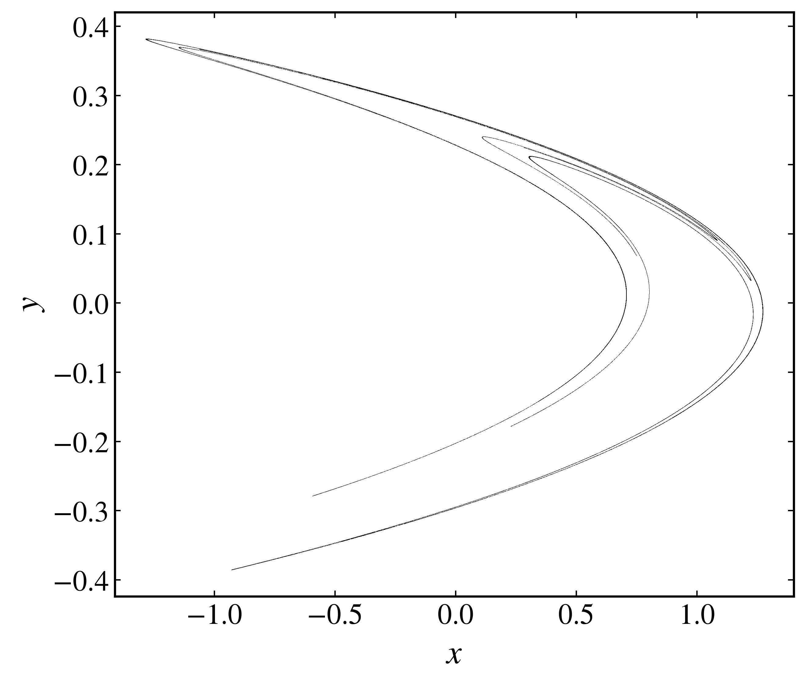

Generating trajectories
-----------------------

Use :py:meth:`trajectory <pynamicalsys.core.discrete_dynamical_systems.DiscreteDynamicalSystem.trajectory>` to iterate a discrete map from one initial condition or an ensemble of initial conditions. The ``total_time`` argument is the total number of iterations, not a physical duration.

A single trajectory
~~~~~~~~~~~~~~~~~~~

Consider the standard map with :math:`k=1.5` and initial state :math:`(x_0,y_0)=(0.2,0.5)`:

.. code-block:: python

    import matplotlib.pyplot as plt
    from pynamicalsys import DiscreteDynamicalSystem as dds, PlotStyler

    system = dds(model="standard map")
    system.set_parameters([1.5])

    initial_state = [0.2, 0.5]
    total_time = 5_000_000
    trajectory = system.trajectory(initial_state, total_time)

For a two-dimensional map, the result has shape ``(total_time, 2)``. Each row contains ``[x, y]`` at one iteration. The initial state is not included, so the first row is :math:`(x_1,y_1)` and the last row is :math:`(x_{5000000},y_{5000000})`.

Plot the trajectory in phase space:

.. code-block:: python

    ps = PlotStyler(markersize=0.1, markeredgewidth=0)
    ps.apply_style()
    fig, ax = plt.subplots(figsize=(7, 6))
    ax.plot(trajectory[:, 0], trajectory[:, 1], "ko")
    ax.set_xlim(0.0, 1.0)
    ax.set_ylim(0.0, 1.0)
    ax.set_xlabel("$x$")
    ax.set_ylabel("$y$")
    fig.tight_layout()
    plt.show()

    A standard-map trajectory for :math:`k=1.5`.

Passing ``parameters=[4.0]`` directly to ``trajectory`` would temporarily override the stored value of :math:`k` for that call. Parameter storage and temporary overrides are described in :doc:`dds_creating_ds`.

An ensemble of trajectories
~~~~~~~~~~~~~~~~~~~~~~~~~~~

Pass an array of shape ``(num_initial_conditions, system_dimension)`` to evolve several initial conditions with the same parameters. The trajectories are returned in one concatenated array rather than as a three-dimensional array.

The following example samples 20 initial conditions in the unit square:

.. code-block:: python

    import numpy as np
    import matplotlib.pyplot as plt
    from pynamicalsys import DiscreteDynamicalSystem as dds, PlotStyler

    system = dds(model="standard map")
    system.set_parameters([1.5])

    rng = np.random.default_rng(13)
    num_initial_conditions = 20
    total_time = 100_000
    initial_conditions = rng.uniform(
        0.0,
        1.0,
        size=(num_initial_conditions, 2),
    )

    trajectories = system.trajectory(initial_conditions, total_time)
    trajectories = trajectories.reshape(
        num_initial_conditions,
        total_time,
        2,
    )

Before reshaping, the output has shape ``(num_initial_conditions * total_time, 2)``. After reshaping, it has shape ``(20, 100000, 2)``, so ``trajectories[i]`` contains the orbit generated from ``initial_conditions[i]``.

Plot each orbit with a different color:

.. code-block:: python

    colors = plt.cm.nipy_spectral(np.linspace(0.0, 1.0, num_initial_conditions))

    ps = PlotStyler(markersize=0.3, markeredgewidth=0)
    ps.apply_style()
    fig, ax = plt.subplots(figsize=(7, 6))
    for trajectory, color in zip(trajectories, colors):
        ax.plot(trajectory[:, 0], trajectory[:, 1], "o", color=color)

    ax.set_xlim(0.0, 1.0)
    ax.set_ylim(0.0, 1.0)
    ax.set_xlabel("$x$")
    ax.set_ylabel("$y$")
    fig.tight_layout()
    plt.show()

    Standard-map trajectories generated from an ensemble of initial conditions for :math:`k=1.5`.

Discarding a transient
~~~~~~~~~~~~~~~~~~~~~~

For a dissipative system, early iterations may describe the approach to an attractor rather than its long-term dynamics. Use ``transient_time`` to discard those iterations before storing the trajectory.

The Hénon map is

.. math::

    \begin{aligned}
        x_{n+1} &= 1-ax_n^2+y_n, \\
        y_{n+1} &= bx_n.
    \end{aligned}

Generate :math:`100000` iterations and discard the first :math:`10000`:

.. code-block:: python

    import matplotlib.pyplot as plt
    from pynamicalsys import DiscreteDynamicalSystem as dds, PlotStyler

    system = dds(model="henon map")
    system.set_parameters([1.4, 0.3])

    initial_state = [0.2, 0.2]
    total_time = 100_000
    transient_time = 10_000
    trajectory = system.trajectory(
        initial_state,
        total_time,
        transient_time=transient_time,
    )

The result has shape ``(90000, 2)`` because ``total_time`` includes the discarded transient. The first stored row is the state after iteration :math:`10001`, and the last is the state after iteration :math:`100000`.

.. code-block:: python

    ps = PlotStyler(markersize=0.2, markeredgewidth=0)
    ps.apply_style()
    fig, ax = plt.subplots(figsize=(7, 6))
    ax.plot(trajectory[:, 0], trajectory[:, 1], "ko")
    ax.set_xlabel("$x$")
    ax.set_ylabel("$y$")
    fig.tight_layout()
    plt.show()

    The Hénon attractor for :math:`a=1.4` and :math:`b=0.3` after discarding the transient.

For a one-dimensional map and one initial condition, ``trajectory`` returns a one-dimensional array with shape ``(sample_size,)``. For higher-dimensional maps, the final axis always follows the state-variable order documented by the model's ``info`` property.
