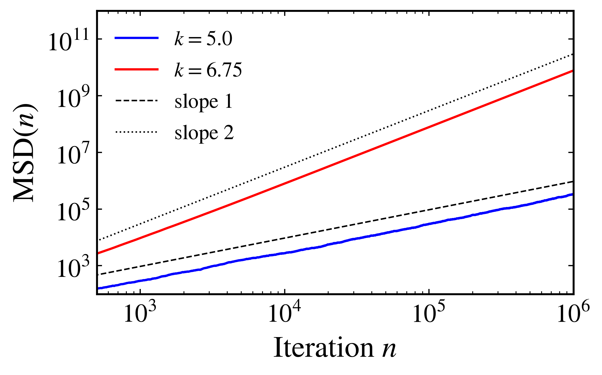
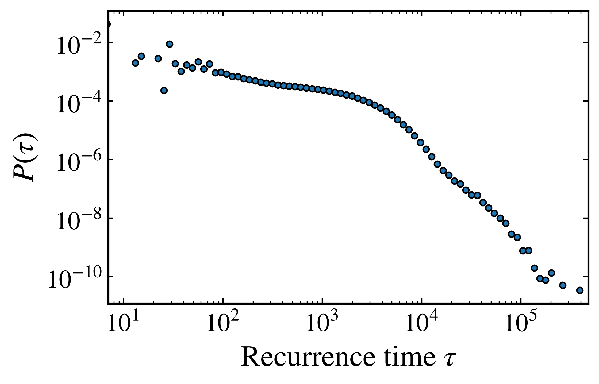

Transport and diffusion
-----------------------

Transport describes how trajectories move through phase space and how an ensemble of initial conditions spreads. In an area-preserving map, invariant curves can block global motion and chaotic trajectories can remain trapped near regular islands for long intervals. The resulting spreading need not follow the linear growth expected for normal diffusion. The standard map has long served as a fundamental model for studying these mechanisms, as reviewed by `Chirikov (1979) <https://doi.org/10.1016/0370-1573(79)90023-1>`_.

Two versions of the standard map are used on this page. The bounded ``standard map`` is used to examine recurrence times. The ``unbounded standard map`` keeps the angle modulo one but allows the action to grow without bounds, making it suitable for measuring diffusion.

.. code-block:: python

    import numpy as np
    import matplotlib.pyplot as plt
    from pynamicalsys import DiscreteDynamicalSystem as dds, PlotStyler

Diffusion of an ensemble
~~~~~~~~~~~~~~~~~~~~~~~~

When the action is unbounded, an ensemble of initial conditions can spread indefinitely. The central quantity is the mean squared displacement of the action,

.. math::

    \mathrm{MSD}(n)=\left\langle\left(y_n-y_0\right)^2\right\rangle,

where the average is taken over the ensemble. Normal diffusion satisfies :math:`\mathrm{MSD}(n)\sim 2Dn`, while anomalous diffusion follows :math:`\mathrm{MSD}(n)\sim n^\gamma` with :math:`\gamma\neq1`. Accelerator modes can produce ballistic motion with :math:`\gamma=2` and strongly influence the surrounding chaotic transport, as discussed by `Karney, Rechester, and White (1982) <https://doi.org/10.1016/0167-2789(82)90045-8>`_ and `Karney (1983) <https://doi.org/10.1016/0167-2789(83)90232-4>`_.

The :py:meth:`mean_squared_displacement <pynamicalsys.core.discrete_dynamical_systems.DiscreteDynamicalSystem.mean_squared_displacement>` method follows an ensemble and measures the displacement along the coordinate selected by ``axis``. Here, 900 initial conditions are distributed across the unit square and the action is measured with ``axis=1``:

.. code-block:: python

    system = dds(model="unbounded standard map")

    rng = np.random.default_rng(0)
    num_ic = 30 * 30
    x0 = np.random.uniform(0, 1, num_ic)
    y0 = np.random.uniform(0, 1, num_ic)
    initial_conditions = np.column_stack([x0, y0])
    total_time = int(1e6)

    k1 = 5.0
    system.set_parameters([k1])
    msd_normal = system.mean_squared_displacement(initial_conditions, total_time, axis=1)

    k2 = 6.75
    system.set_parameters([k2])
    msd_anomalous = system.mean_squared_displacement(initial_conditions, total_time, axis=1)

Each call returns a one-dimensional array of length ``total_time``, containing the mean squared displacement from iteration 1 through ``total_time``. At :math:`k=5.0`, the growth is approximately linear. At :math:`k=6.75`, an accelerator mode produces nearly ballistic spreading.

.. code-block:: python

    time = np.arange(1, total_time + 1)
    ps = PlotStyler()
    ps.apply_style()
    fig, ax = plt.subplots(figsize=(6, 4))
    ax.loglog(time, msd_normal, "b", label=f"$k = {k1}$", lw=1.5)
    ax.loglog(time, msd_anomalous, "r", label=f"$k = {k2}$", lw=1.5)
    ax.loglog(time, 3 * msd_normal[0] * time, "k--", lw=1, label=r"slope $1$")
    ax.loglog(time, 0.03 * time**2, "k:", lw=1, label=r"slope $2$")
    ax.set_xlabel("Iteration $n$")
    ax.set_ylabel(r"$\mathrm{MSD}(n)$")
    ax.set_ylim(1e2, 1e12)
    ax.set_xlim(5e2, total_time)
    ax.legend(frameon=False)
    fig.tight_layout()
    plt.savefig(
        f"{path_figures}/standard_map_diffusion_msd.png", dpi=400, bbox_inches="tight"
    )

    Mean squared displacement of the action for the unbounded standard map. The curve for :math:`k=5.0` follows the slope-one reference for normal diffusion, while the curve for :math:`k=6.75` approaches the slope-two reference for ballistic transport.

Diffusion coefficient
^^^^^^^^^^^^^^^^^^^^^

For normal diffusion, the :py:meth:`diffusion_coefficient <pynamicalsys.core.discrete_dynamical_systems.DiscreteDynamicalSystem.diffusion_coefficient>` method estimates :math:`D` from the final ensemble displacement through the Einstein relation :math:`D\approx\mathrm{MSD}(N)/(2N)`. Analytical corrections to the random-phase approximation for the Chirikov-Taylor map were developed by `Rechester, Rosenbluth, and White (1981) <https://doi.org/10.1103/PhysRevA.23.2664>`_.

For the normalization used by **pynamicalsys**, uncorrelated angle kicks have variance :math:`k^2/(8\pi^2)`, giving the random-phase estimate

.. math::

    D_{\mathrm{QL}}=\frac{k^2}{16\pi^2}.

The measured coefficient at :math:`k=5.0` is close to this estimate:

.. code-block:: python

    system.set_parameters([5.0])
    D = system.diffusion_coefficient(initial_conditions, total_time, axis=1)
    print("measured D:", float(D))
    print("random-phase D:", 5.0**2 / (16 * np.pi**2))

.. code-block:: text

    measured D: 0.1575283354658878
    random-phase D: 0.15831434944115277

A single diffusion coefficient is meaningful only when the mean squared displacement is asymptotically linear. For anomalous transport, :math:`\mathrm{MSD}(N)/(2N)` depends on the observation time and the spreading must instead be characterized by the exponent :math:`\gamma`.

Summaries of the ensemble
^^^^^^^^^^^^^^^^^^^^^^^^^

Several methods summarize the same ensemble along the selected ``axis`` and can optionally record only chosen ``sample_times``. The :py:meth:`average_in_time <pynamicalsys.core.discrete_dynamical_systems.DiscreteDynamicalSystem.average_in_time>` method returns the ensemble mean of the coordinate at each sampled time. The :py:meth:`cumulative_average <pynamicalsys.core.discrete_dynamical_systems.DiscreteDynamicalSystem.cumulative_average>` method returns its cumulative time average. The :py:meth:`root_mean_squared <pynamicalsys.core.discrete_dynamical_systems.DiscreteDynamicalSystem.root_mean_squared>` method gives the root mean square accumulated over time, which measures the typical width of the ensemble.

.. code-block:: python

    system.set_parameters([5.0])
    mean = system.average_in_time(initial_conditions, total_time, axis=1)
    rms = system.root_mean_squared(initial_conditions, total_time, axis=1)

The :py:meth:`ensemble_time_average <pynamicalsys.core.discrete_dynamical_systems.DiscreteDynamicalSystem.ensemble_time_average>` method returns one centered time average per trajectory. Each trajectory average has the ensemble mean subtracted, so the returned values quantify trajectory-to-trajectory fluctuations around the ensemble average.

.. code-block:: python

    eta = system.ensemble_time_average(initial_conditions, total_time, axis=1)
    print(eta.shape, round(float(eta.mean()), 3), round(float(eta.std()), 3))

.. code-block:: text

    (5000,) 0.0 10.292

Recurrence times and stickiness
~~~~~~~~~~~~~~~~~~~~~~~~~~~~~~~

For a measure-preserving map on a bounded phase space, the Poincaré recurrence theorem guarantees that almost every initial condition eventually returns arbitrarily close to its starting point. In a mixed phase space, trajectories can remain close to regular islands for long intervals before returning. These trapping episodes generate long-time correlations and heavy recurrence-time tails, as studied for the standard map by `Chirikov and Shepelyansky (1999) <https://doi.org/10.1103/PhysRevLett.82.528>`_.

The :py:meth:`recurrence_times <pynamicalsys.core.discrete_dynamical_systems.DiscreteDynamicalSystem.recurrence_times>` method records the number of iterations between successive entries into a hypercube centered on the initial state. The argument ``eps`` gives the side length of this recurrence neighborhood. An optional ``transient_time`` can be used to evolve the initial condition before defining its center.

.. code-block:: python

    system = dds(model="standard map")
    system.set_parameters([1.5])
    times = system.recurrence_times([0.2, 0.02], 1_000_000_000, eps=0.02)
    print(times.size, times.min(), times.max(), times.mean())

.. code-block:: text

    561463 7.0 475852.0 1781.0521405684792

The observed return times range from 7 iterations to more than 475,000 iterations. Their mean is much smaller than their maximum, indicating a broad distribution generated by long trapping episodes.

.. code-block:: python

    counts, edges = np.histogram(
        times, bins=np.logspace(0, np.log10(times.max()), 100), density=True
    )
    centers = np.sqrt(edges[:-1] * edges[1:])

    ps = PlotStyler()
    ps.apply_style()
    fig, ax = plt.subplots(figsize=(6, 4))
    ax.loglog(centers, counts, "o", markersize=4)
    ax.set_xlabel(r"Recurrence time $\tau$")
    ax.set_ylabel(r"$P(\tau)$")
    ax.set_xlim(times.min(), times.max())
    fig.tight_layout()
    plt.savefig(
        f"{path_figures}/standard_map_recurrence_times.png", dpi=400, bbox_inches="tight"
    )

    Recurrence-time distribution for the standard map with :math:`k=1.5`. The long tail reflects trapping near regular structures in the mixed phase space.

Recurrence times measure the intervals between visits to a neighborhood. The :doc:`recurrence time entropy <dds_rte>` instead measures the diversity of recurrence periods obtained from a recurrence plot, so the two quantities provide complementary descriptions of recurrent dynamics.

References
~~~~~~~~~~

.. container:: references-list

    - B\. V\. Chirikov, `A universal instability of many-dimensional oscillator systems <https://doi.org/10.1016/0370-1573(79)90023-1>`_, Physics Reports 52, 263-379 (1979).
    - A\. B\. Rechester, M\. N\. Rosenbluth, and R\. B\. White, `Fourier-space paths applied to the calculation of diffusion for the Chirikov-Taylor model <https://doi.org/10.1103/PhysRevA.23.2664>`_, Physical Review A 23, 2664-2672 (1981).
    - C\. F\. F\. Karney, A\. B\. Rechester, and R\. B\. White, `Effect of noise on the standard mapping <https://doi.org/10.1016/0167-2789(82)90045-8>`_, Physica D 4, 425-438 (1982).
    - C\. F\. F\. Karney, `Long-time correlations in the stochastic regime <https://doi.org/10.1016/0167-2789(83)90232-4>`_, Physica D 8, 360-380 (1983).
    - B\. V\. Chirikov and D\. L\. Shepelyansky, `Asymptotic statistics of Poincaré recurrences in Hamiltonian systems with divided phase space <https://doi.org/10.1103/PhysRevLett.82.528>`_, Physical Review Letters 82, 528-531 (1999).
