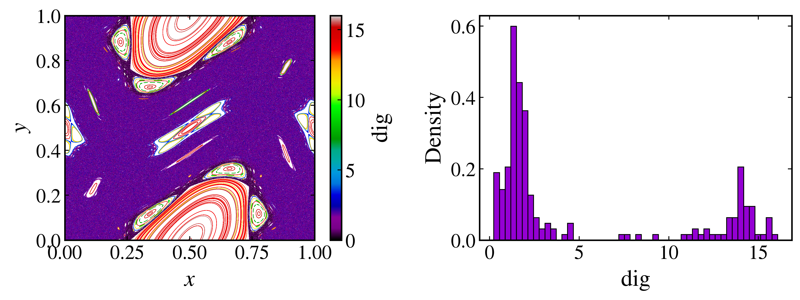

Weighted Birkhoff average
~~~~~~~~~~~~~~~~~~~~~~~~~

The weighted Birkhoff average (WBA) was introduced by `Das et al. (2016) <https://doi.org/10.1209/0295-5075/114/40005>`_ to accelerate the convergence of time averages on quasiperiodic trajectories. Its numerical properties and applications were developed further by `Das et al. (2017) <https://doi.org/10.1088/1361-6544/aa84c2>`_, while the superconvergence result was established by `Das and Yorke (2018) <https://doi.org/10.1088/1361-6544/aa99a0>`_.

For a discrete dynamical system :math:`\mathbf{x}_{n+1}=\mathbf{M}(\mathbf{x}_n)` and a smooth observable :math:`h`, the ordinary Birkhoff average over :math:`N` iterations is

.. math::

    B_N(h)(\mathbf{x}_0)=\frac{1}{N}\sum_{n=0}^{N-1}h\!\left(\mathbf{M}^n(\mathbf{x}_0)\right).

The WBA replaces the uniform weights by a smooth bump that suppresses contributions near both ends of the trajectory:

.. math::

    \mathrm{WB}_N(h)(\mathbf{x}_0)=\sum_{n=0}^{N-1}w_{n,N}h\!\left(\mathbf{M}^n(\mathbf{x}_0)\right),

where

.. math::

    w_{n,N}=\frac{g(n/N)}{\displaystyle\sum_{j=0}^{N-1}g(j/N)},

and

.. math::

    g(t)=
    \begin{cases}
        \exp\!\left[-\dfrac{1}{t(1-t)}\right], & 0<t<1, \\
        0, & \text{otherwise}.
    \end{cases}

For a sufficiently smooth quasiperiodic trajectory with a Diophantine rotation vector, a smooth map, and a smooth observable, the error decreases faster than any inverse power of :math:`N`. More precisely, for every positive integer :math:`m`, there is a constant :math:`C_m` such that

.. math::

    \left|\mathrm{WB}_N(h)(\mathbf{x}_0)-\int h\,\mathrm{d}\mu\right|\leq C_mN^{-m}.

This accelerated convergence does not generally occur for chaotic trajectories. The difference between two consecutive WBA windows can therefore be used to distinguish quasiperiodic and chaotic dynamics.

The dig indicator
^^^^^^^^^^^^^^^^^

The :math:`\mathrm{dig}` indicator compares two consecutive windows of length :math:`N`, as proposed for orbit classification by `Sander and Meiss (2020) <https://doi.org/10.1016/j.physd.2020.132569>`_:

.. math::

    \mathrm{dig}=-\log_{10}\left|\mathrm{WB}_N(h)(\mathbf{x}_0)-\mathrm{WB}_N(h)(\mathbf{x}_N)\right|.

A large value means that the two averages agree to many decimal digits and is characteristic of a well-resolved quasiperiodic trajectory. A small value indicates slow convergence and is characteristic of a chaotic trajectory, although sticky chaotic trajectories may require much longer windows before they are identified. Small values should not be interpreted as a ranking of how chaotic different trajectories are.

The separation between regular and chaotic values depends on the system, observable, window length, and numerical precision. For example, `Sales et al. (2022) <https://doi.org/10.1016/j.physleta.2022.127991>`_ found two modes near :math:`\mathrm{dig}=14` and :math:`\mathrm{dig}=3.5` for a particular standard-map computation and used :math:`11.25` as an empirical threshold. That value is specific to that calculation and is not a universal cutoff.

In :py:meth:`dig <pynamicalsys.core.discrete_dynamical_systems.DiscreteDynamicalSystem.dig>`, ``total_time`` covers both consecutive windows. Without a transient, each window has length ``total_time // 2``. If ``transient_time`` is supplied, it is discarded first and the remaining iterations are divided between the two windows. An odd ``total_time`` is increased by one internally.

Classifying the standard map
^^^^^^^^^^^^^^^^^^^^^^^^^^^^

The following example samples initial conditions for the standard map and evaluates :math:`\mathrm{dig}` with the default observable :math:`h(x,y)=\cos(2\pi x)`:

.. code-block:: python

    import numpy as np
    import matplotlib.pyplot as plt
    from pynamicalsys import DiscreteDynamicalSystem as dds, PlotStyler

    system = dds(model="standard map")
    system.set_parameters([1.5])

    rng = np.random.default_rng(1312)
    num_initial_conditions = 200
    initial_states = rng.uniform(0.0, 1.0, size=(num_initial_conditions, 2))
    total_time = 20_000

    digs = np.array(
        [
            system.dig(
                u=initial_state,
                total_time=total_time,
            )
            for initial_state in initial_states
        ]
    )

    trajectory_time = 10_000
    trajectories = system.trajectory(
        u=initial_states,
        total_time=trajectory_time,
    ).reshape(num_initial_conditions, trajectory_time, 2)

Plot every trajectory with the color assigned by the :math:`\mathrm{dig}` value of its initial condition, together with the distribution of finite values. The shorter ``trajectory_time`` controls only the phase-space visualization and does not change the WBA windows used for the classification:

.. code-block:: python

    finite_digs = digs[np.isfinite(digs)]
    trajectory_digs = np.repeat(digs, trajectory_time)

    ps = PlotStyler()
    ps.apply_style()
    fig, ax = plt.subplots(1, 2, figsize=(10, 4))
    points = ax[0].scatter(
        trajectories[:, :, 0].ravel(),
        trajectories[:, :, 1].ravel(),
        c=trajectory_digs,
        s=0.1,
        edgecolor="none",
        cmap="nipy_spectral",
        vmin=0,
        vmax=16,
    )
    ax[0].set_xlim(0.0, 1.0)
    ax[0].set_ylim(0.0, 1.0)
    ax[0].set_xlabel("$x$")
    ax[0].set_ylabel("$y$")
    fig.colorbar(points, ax=ax[0], label=r"$\mathrm{dig}$")
    ax[1].hist(
        finite_digs,
        bins=50,
        density=True,
        color="darkviolet",
        edgecolor="black",
        linewidth=0.75,
    )
    ax[1].set_xlabel(r"$\mathrm{dig}$")
    ax[1].set_ylabel("Density")
    fig.tight_layout()
    plt.show()

    Standard-map trajectories colored by their weighted-Birkhoff classification and the corresponding distribution of :math:`\mathrm{dig}` values.

The high-value mode is associated with regular islands, while the low-value mode is associated with the chaotic sea. Points near island boundaries may be sticky, so increasing ``total_time`` is an important robustness check.

Choosing an observable
^^^^^^^^^^^^^^^^^^^^^^

The observable must accept a two-dimensional trajectory array and return a one-dimensional NumPy array containing one value for each state. It should be smooth and nonconstant on the region being studied. For example, the default observable can be replaced by :math:`h(x,y)=\sin[2\pi(x+y)]`:

.. code-block:: python

    observable = lambda trajectory: np.sin(
        2.0 * np.pi * (trajectory[:, 0] + trajectory[:, 1])
    )

    custom_dig = system.dig(
        u=initial_states[0],
        total_time=total_time,
        func=observable,
    )

The observable is not unique, but a nearly constant or symmetry-degenerate choice can conceal the distinction of interest. When the classification is important, compare more than one smooth observable and increase the window length to confirm that the conclusion is stable.
