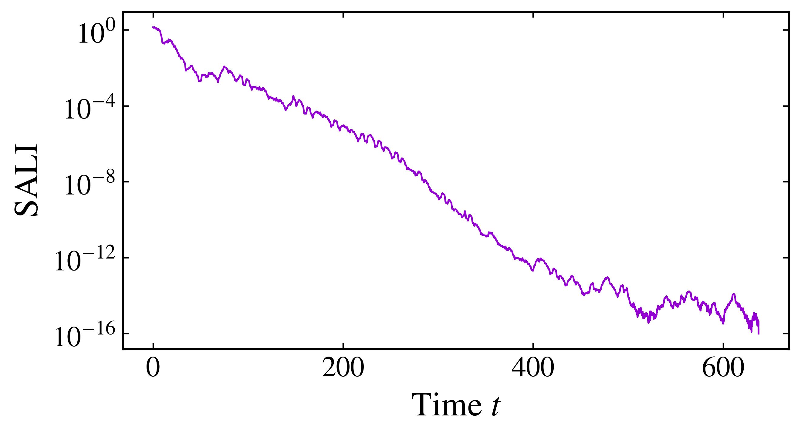
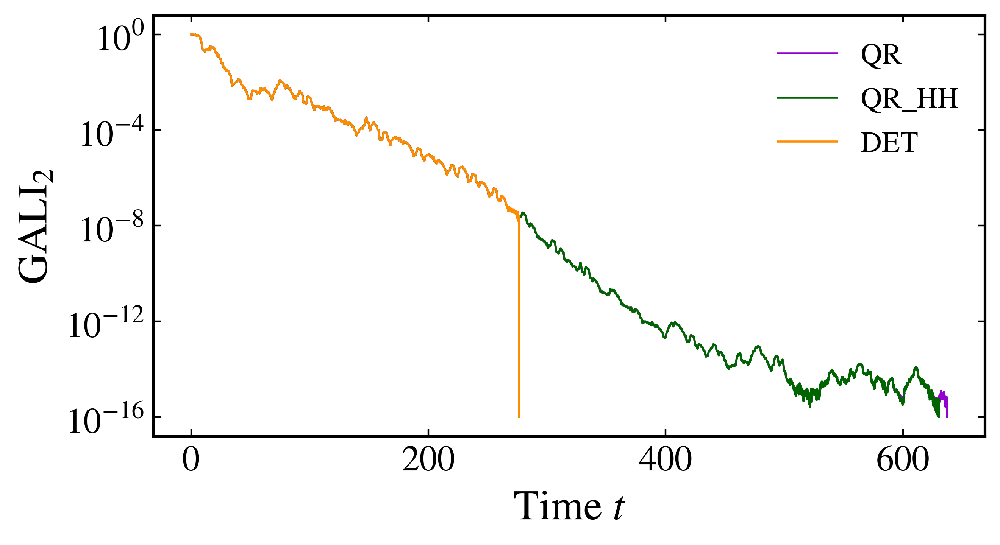
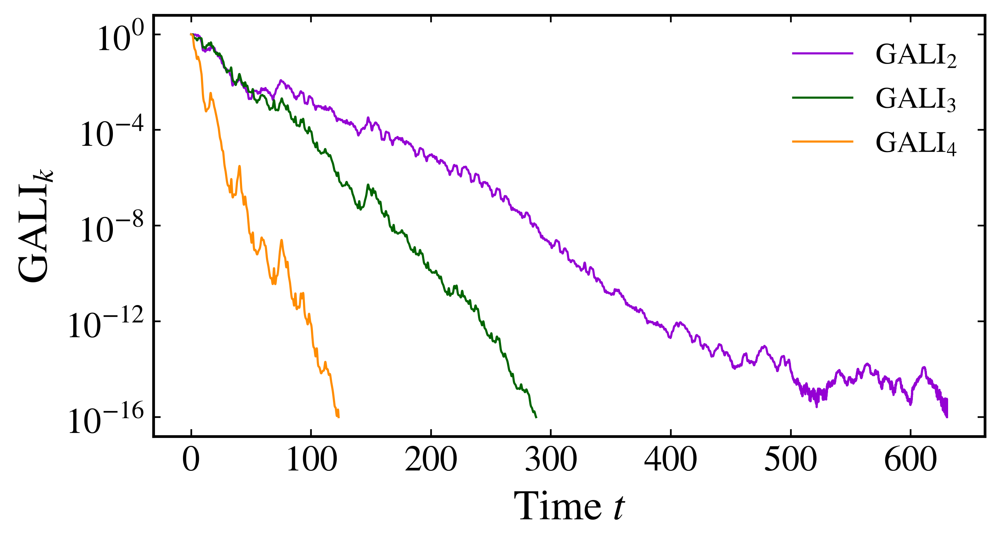
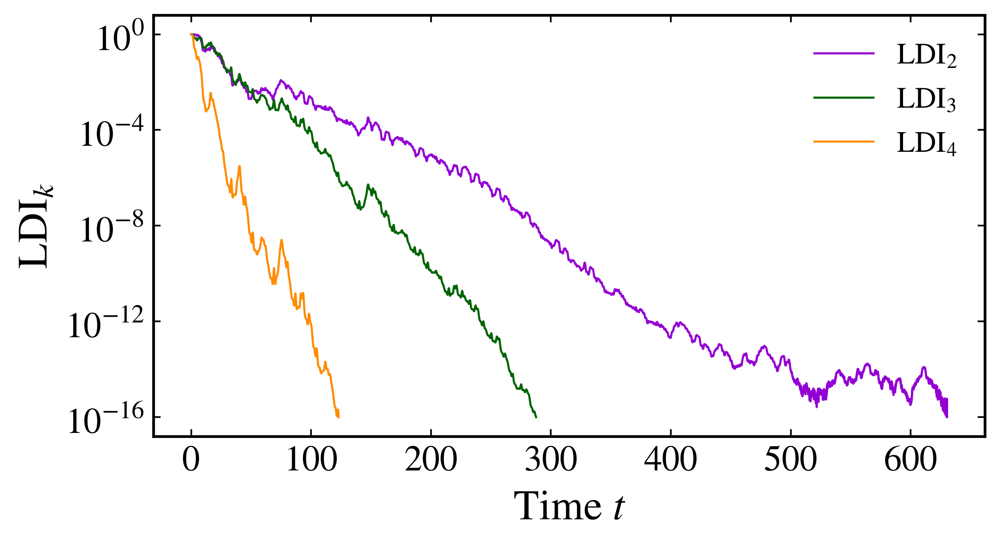
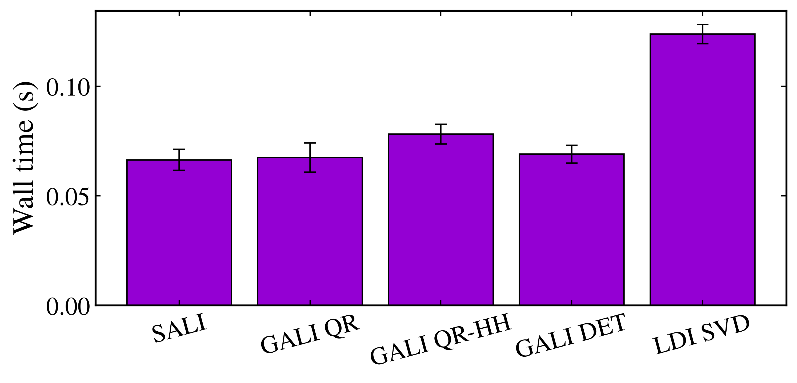

Alignment indices
-----------------

The Smaller Alignment Index (SALI), Generalized Alignment Index (GALI), and Linear Dependence Index (LDI) follow normalized deviation vectors as they evolve under the tangent dynamics. They provide closely related ways to distinguish regular and chaotic motion. SALI was introduced by `Skokos (2001) <https://doi.org/10.1088/0305-4470/34/47/309>`_, GALI by `Skokos et al. (2007) <https://doi.org/10.1016/j.physd.2007.04.004>`_, and LDI by `Antonopoulos and Bountis (2006) <https://arxiv.org/abs/0711.0360>`_.

Consider a chaotic orbit of the Hénon-Heiles system at energy :math:`E=1/8`. Take :math:`x=0`, :math:`y=-0.15`, :math:`p_y=0`, and :math:`p_x>0` from the energy. The tangent dynamics require the Hessians of the Hamiltonian, which the built-in model provides, and the symplectic integrator samples all three indicators at the same time interval:

.. code-block:: python

    import numpy as np
    import matplotlib.pyplot as plt
    from pynamicalsys import HamiltonianSystem, PlotStyler

    system = HamiltonianSystem(model="henon heiles")
    system.integrator("svy4", time_step=0.01)

    energy = 1 / 8
    x, y, py = 0.0, -0.15, 0.0
    potential = (x**2 + y**2) / 2 + x**2 * y - y**3 / 3
    px = np.sqrt(2 * (energy - potential) - py**2)

    q = [x, y]
    p = [px, py]
    total_time = 10_000.0
    threshold = 1e-16
    seed = 1312

Smaller Alignment Index
~~~~~~~~~~~~~~~~~~~~~~~~

Let :math:`\hat{\mathbf{v}}_1(t)` and :math:`\hat{\mathbf{v}}_2(t)` be two normalized deviation vectors. SALI is defined as

.. math::

    \mathrm{SALI}(t)=\min\left\{\left\|\hat{\mathbf{v}}_1(t)+\hat{\mathbf{v}}_2(t)\right\|,\left\|\hat{\mathbf{v}}_1(t)-\hat{\mathbf{v}}_2(t)\right\|\right\}.

The two norms detect alignment in the same or opposite directions. Along a chaotic trajectory, both vectors approach the most unstable tangent direction. For Lyapunov exponents :math:`\lambda_1\geq\lambda_2\geq\cdots`, the asymptotic decay is

.. math::

    \mathrm{SALI}(t)\propto\exp\left[-(\lambda_1-\lambda_2)t\right].

For the Hénon-Heiles system the second-largest exponent is the neutral one, :math:`\lambda_2=0`, so the decay rate is set by :math:`\lambda_1`. For regular trajectories, SALI generally remains bounded away from zero when the invariant object has at least two independent tangent directions.

Compute the history with :py:meth:`SALI <pynamicalsys.core.hamiltonian_systems.HamiltonianSystem.SALI>`:

.. code-block:: python

    sali_history = system.SALI(
        q,
        p,
        total_time,
        return_history=True,
        threshold=threshold,
        seed=seed,
    )

With ``return_history=True``, the first column contains time and the second contains SALI. The calculation stops when the indicator falls below ``threshold``.

.. code-block:: python

    ps = PlotStyler()
    ps.apply_style()
    fig, ax = plt.subplots(figsize=(7, 4))
    ax.semilogy(
        sali_history[:, 0],
        np.maximum(sali_history[:, 1], threshold),
        color="darkviolet",
    )
    ax.set_xlabel("Time $t$")
    ax.set_ylabel(r"$\mathrm{SALI}$")
    fig.tight_layout()
    plt.show()

    Evolution of SALI for a chaotic Hénon-Heiles orbit at :math:`E=1/8`.

Generalized Alignment Index
~~~~~~~~~~~~~~~~~~~~~~~~~~~~

GALI extends the alignment idea to :math:`k` normalized deviation vectors. If :math:`\mathbf{V}(t)\in\mathbb{R}^{d\times k}` contains these vectors as columns, the index is the volume of the :math:`k`-dimensional parallelepiped that they span:

.. math::

    \mathrm{GALI}_k(t)=\left\|\hat{\mathbf{v}}_1(t)\wedge\hat{\mathbf{v}}_2(t)\wedge\cdots\wedge\hat{\mathbf{v}}_k(t)\right\|.

For a chaotic trajectory, the decay is governed by the first :math:`k` Lyapunov exponents:

.. math::

    \mathrm{GALI}_k(t)\propto\exp\left\{-\left[(k-1)\lambda_1-\sum_{i=2}^{k}\lambda_i\right]t\right\}.

For regular trajectories, whether :math:`\mathrm{GALI}_k` remains nonzero or decays algebraically depends on :math:`k` and the dimension of the invariant torus. This behavior and the decay laws were established by `Skokos et al. (2007) <https://doi.org/10.1016/j.physd.2007.04.004>`_.

The :py:meth:`GALI <pynamicalsys.core.hamiltonian_systems.HamiltonianSystem.GALI>` method provides three ways to compute the spanned volume:

``method="DET"``
    Forms the Gram matrix :math:`\mathbf{G}=\mathbf{V}^T\mathbf{V}` and computes :math:`\mathrm{GALI}_k=\sqrt{\det(\mathbf{G})}`. This is the most direct expression, but it becomes sensitive to rounding when the vectors are nearly aligned.

``method="QR"``
    Uses the project's modified Gram-Schmidt decomposition :math:`\mathbf{V}=\mathbf{Q}\mathbf{R}` and computes :math:`\mathrm{GALI}_k=\prod_i|R_{ii}|`. This is the default method.

``method="QR_HH"``
    Uses a Householder QR decomposition and the same product :math:`\prod_i|R_{ii}|`. It is generally the most numerically stable option, with a higher computational cost.

Compare the three methods for :math:`k=2` using the same initial deviation vectors:

.. code-block:: python

    gali_methods = ["QR", "QR_HH", "DET"]
    gali_method_histories = []
    for method in gali_methods:
        gali_method_histories.append(
            system.GALI(
                q,
                p,
                total_time,
                k=2,
                return_history=True,
                method=method,
                threshold=threshold,
                seed=seed,
            )
        )

    colors = ["darkviolet", "darkgreen", "darkorange"]

    ps = PlotStyler()
    ps.apply_style()
    fig, ax = plt.subplots(figsize=(7, 4))
    for history, method, color in zip(gali_method_histories, gali_methods, colors):
        ax.semilogy(
            history[:, 0],
            np.maximum(history[:, 1], threshold),
            color=color,
            label=method,
        )
    ax.set_xlabel("Time $t$")
    ax.set_ylabel(r"$\mathrm{GALI}_2$")
    ax.legend(frameon=False)
    fig.tight_layout()
    plt.show()

    Comparison of the modified Gram-Schmidt QR, Householder QR, and Gram determinant formulations of :math:`\mathrm{GALI}_2`.

The determinant formulation commonly loses resolution first because :math:`\det(\mathbf{V}^T\mathbf{V})=\mathrm{GALI}_2^2`. When :math:`\mathrm{GALI}_2` is approximately :math:`10^{-8}`, the determinant is already approximately :math:`10^{-16}` and rounding errors can dominate. The QR formulations operate directly on the volume through the diagonal entries of :math:`\mathbf{R}`.

GALI for different values of k
~~~~~~~~~~~~~~~~~~~~~~~~~~~~~~~~

Compute :math:`\mathrm{GALI}_2`, :math:`\mathrm{GALI}_3`, and :math:`\mathrm{GALI}_4` for the same trajectory:

.. code-block:: python

    k_values = np.array([2, 3, 4])
    gali_histories = []
    for k in k_values:
        gali_histories.append(
            system.GALI(
                q,
                p,
                total_time,
                k=k,
                return_history=True,
                method="QR_HH",
                threshold=threshold,
                seed=seed,
            )
        )

    ps = PlotStyler()
    ps.apply_style()
    fig, ax = plt.subplots(figsize=(7, 4))
    for history, k, color in zip(gali_histories, k_values, colors):
        ax.semilogy(
            history[:, 0],
            np.maximum(history[:, 1], threshold),
            color=color,
            label=rf"$\mathrm{{GALI}}_{k}$",
        )
    ax.set_xlabel("Time $t$")
    ax.set_ylabel(r"$\mathrm{GALI}_k$")
    ax.legend(frameon=False)
    fig.tight_layout()
    plt.show()

    Evolution of :math:`\mathrm{GALI}_2`, :math:`\mathrm{GALI}_3`, and :math:`\mathrm{GALI}_4` for the chaotic Hénon-Heiles orbit. Larger :math:`k` decays faster.

Linear Dependence Index
~~~~~~~~~~~~~~~~~~~~~~~~

LDI computes the same volume from the singular values of the normalized deviation matrix. If

.. math::

    \mathbf{V}(t)=\mathbf{U}(t)\mathbf{\Sigma}(t)\mathbf{W}^T(t),

then the definition introduced by `Antonopoulos and Bountis (2006) <https://arxiv.org/abs/0711.0360>`_ is

.. math::

    \mathrm{LDI}_k(t)=\prod_{i=1}^{k}\sigma_i(t).

Compute :math:`\mathrm{LDI}_2`, :math:`\mathrm{LDI}_3`, and :math:`\mathrm{LDI}_4` with :py:meth:`LDI <pynamicalsys.core.hamiltonian_systems.HamiltonianSystem.LDI>`:

.. code-block:: python

    ldi_histories = []
    for k in k_values:
        ldi_histories.append(
            system.LDI(
                q,
                p,
                total_time,
                k=k,
                return_history=True,
                threshold=threshold,
                seed=seed,
            )
        )

    ps = PlotStyler()
    ps.apply_style()
    fig, ax = plt.subplots(figsize=(7, 4))
    for history, k, color in zip(ldi_histories, k_values, colors):
        ax.semilogy(
            history[:, 0],
            np.maximum(history[:, 1], threshold),
            color=color,
            label=rf"$\mathrm{{LDI}}_{k}$",
        )
    ax.set_xlabel("Time $t$")
    ax.set_ylabel(r"$\mathrm{LDI}_k$")
    ax.legend(frameon=False)
    fig.tight_layout()
    plt.show()

    Evolution of :math:`\mathrm{LDI}_2`, :math:`\mathrm{LDI}_3`, and :math:`\mathrm{LDI}_4` for the chaotic Hénon-Heiles orbit.

Correspondence between GALI and LDI
~~~~~~~~~~~~~~~~~~~~~~~~~~~~~~~~~~~~

GALI and LDI measure the same volume. Since

.. math::

    \mathbf{V}^T\mathbf{V}=\mathbf{W}\mathbf{\Sigma}^T\mathbf{\Sigma}\mathbf{W}^T,

the determinant of the Gram matrix is :math:`\prod_{i=1}^{k}\sigma_i^2`. Therefore

.. math::

    \mathrm{GALI}_k(t)=\sqrt{\det\left(\mathbf{V}^T(t)\mathbf{V}(t)\right)}=\prod_{i=1}^{k}\sigma_i(t)=\mathrm{LDI}_k(t).

This exact identity and the common decay rate for discrete and continuous chaotic systems are derived by `Sales et al. (2026) <https://doi.org/10.1016/j.chaos.2026.117884>`_. The indicators are mathematically identical when they use the same normalized deviation vectors, while their numerical implementations differ. GALI uses a determinant or QR factorization and LDI uses a singular value decomposition.

Benchmarking the formulations
~~~~~~~~~~~~~~~~~~~~~~~~~~~~~~~

Compare SALI, the three formulations of :math:`\mathrm{GALI}_2`, and :math:`\mathrm{LDI}_2` along a regular Hénon-Heiles orbit over the same fixed integration time. Take the regular orbit at :math:`y=0.1`, which lies on an invariant torus. Setting ``threshold=0.0`` disables early stopping so every formulation performs the complete workload. A short preliminary call excludes just-in-time compilation from the measurements. Absolute times depend on the processor and software environment, so the benchmark should be run on the machine where the methods will be used:

.. code-block:: python

    from time import perf_counter

    regular_y = 0.1
    regular_potential = regular_y**2 / 2 - regular_y**3 / 3
    regular_px = np.sqrt(2 * (energy - regular_potential))
    regular_q = [0.0, regular_y]
    regular_p = [regular_px, 0.0]

    benchmark_time = 200.0
    benchmark_repeats = 20
    benchmark_labels = ["SALI"] + [f"GALI {method.replace('_', '-')}" for method in gali_methods] + ["LDI SVD"]
    benchmark_times = np.empty((len(benchmark_labels), benchmark_repeats))

    system.SALI(regular_q, regular_p, 1.0, threshold=0.0, seed=seed)
    for method in gali_methods:
        system.GALI(regular_q, regular_p, 1.0, k=2, method=method, threshold=0.0, seed=seed)
    system.LDI(regular_q, regular_p, 1.0, k=2, threshold=0.0, seed=seed)

    for repeat in range(benchmark_repeats):
        start = perf_counter()
        system.SALI(regular_q, regular_p, benchmark_time, threshold=0.0, seed=seed)
        benchmark_times[0, repeat] = perf_counter() - start

        for index, method in enumerate(gali_methods):
            start = perf_counter()
            system.GALI(regular_q, regular_p, benchmark_time, k=2, method=method, threshold=0.0, seed=seed)
            benchmark_times[index + 1, repeat] = perf_counter() - start

        start = perf_counter()
        system.LDI(regular_q, regular_p, benchmark_time, k=2, threshold=0.0, seed=seed)
        benchmark_times[-1, repeat] = perf_counter() - start

    mean_times = np.mean(benchmark_times, axis=1)
    std_times = np.std(benchmark_times, axis=1, ddof=1)

    ps = PlotStyler()
    ps.apply_style()
    fig, ax = plt.subplots(figsize=(8, 4))
    ax.bar(
        benchmark_labels,
        mean_times,
        yerr=std_times,
        color="darkviolet",
        edgecolor="black",
        linewidth=1.0,
        capsize=4,
    )
    ax.set_ylabel("Wall time (s)")
    ax.tick_params(axis="x", labelrotation=15)
    fig.tight_layout()
    plt.show()

    Wall times for SALI, the three formulations of :math:`\mathrm{GALI}_2`, and SVD-based :math:`\mathrm{LDI}_2` along a regular Hénon-Heiles orbit. Bars show the mean of 20 fixed-workload runs and error bars show one standard deviation.

All three public methods return a two-element array containing the final time and indicator value by default. With ``return_history=True``, they return a two-dimensional array whose columns contain time and the indicator history. The ``parameters``, ``seed``, and ``threshold`` arguments follow the same pattern for SALI, GALI, and LDI.

References
~~~~~~~~~~

.. container:: references-list

    - C\. Skokos, `Alignment indices: a new, simple method for determining the ordered or chaotic nature of orbits <https://doi.org/10.1088/0305-4470/34/47/309>`_, Journal of Physics A: Mathematical and General 34, 10029-10043 (2001).
    - C\. Skokos, T\. C\. Bountis, and C\. Antonopoulos, `Geometrical properties of local dynamics in Hamiltonian systems: The Generalized Alignment Index (GALI) method <https://doi.org/10.1016/j.physd.2007.04.004>`_, Physica D 231, 30-54 (2007).
    - C\. Antonopoulos and T\. Bountis, `Detecting order and chaos by the Linear Dependence Index (LDI) method <https://arxiv.org/abs/0711.0360>`_, ROMAI Journal 2, 1-13 (2006).
    - M\. R\. Sales, E\. D\. Leonel, and C\. G\. Antonopoulos, `On the behavior of Linear Dependence, Smaller, and Generalized Alignment Indices in discrete and continuous chaotic systems <https://doi.org/10.1016/j.chaos.2026.117884>`_, Chaos, Solitons and Fractals 205, 117884 (2026).
