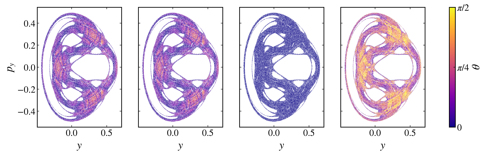

Covariant Lyapunov vectors
--------------------------

Lyapunov exponents quantify average rates of expansion and contraction, but they do not identify the intrinsic tangent directions associated with those rates. Covariant Lyapunov vectors (CLVs) provide these local directions. Practical algorithms for computing them were introduced independently by `Ginelli et al. (2007) <https://doi.org/10.1103/PhysRevLett.99.130601>`_ and `Wolfe and Samelson (2007) <https://doi.org/10.1111/j.1600-0870.2007.00234.x>`_.

For a continuous flow with tangent propagator :math:`\mathbf{M}(t_2,t_1)` from :math:`t_1` to :math:`t_2`, the :math:`i`-th CLV satisfies the covariance relation

.. math::

    \mathbf{M}(t_2,t_1)\mathbf{v}_i(t_1)=\alpha_i(t_2,t_1)\mathbf{v}_i(t_2),

where :math:`\alpha_i` is the local expansion or contraction factor. The vectors are ordered by their associated Lyapunov exponents, from :math:`\lambda_1` down to the smallest. Unlike the orthonormal vectors generated during the QR calculation of the Lyapunov spectrum, CLVs are generally not orthogonal and transform covariantly with the tangent dynamics. This makes them suitable for studying the geometry of stable, unstable, and center subspaces.

The :py:meth:`CLV <pynamicalsys.core.hamiltonian_systems.HamiltonianSystem.CLV>` method implements a Ginelli-style forward and backward algorithm. The tangent dynamics require the Hessians of the Hamiltonian, which the built-in Hénon-Heiles model provides. Because the flow is symplectic, the exponents occur in pairs :math:`\pm\lambda` and the vectors associated with :math:`\lambda_i` and :math:`-\lambda_i` are dynamically related.

Computing the CLVs of the Hénon-Heiles system
~~~~~~~~~~~~~~~~~~~~~~~~~~~~~~~~~~~~~~~~~~~~~~~

Follow a chaotic orbit at energy :math:`E=1/8`, taking :math:`x=0`, :math:`y=-0.2`, :math:`p_y=0`, and :math:`p_x>0` from the energy:

.. code-block:: python

    import numpy as np
    import matplotlib.pyplot as plt
    from pynamicalsys import HamiltonianSystem, PlotStyler

    system = HamiltonianSystem(model="henon heiles")
    system.integrator("svy4", time_step=0.01)

    energy = 1 / 8
    x, y, py = 0.0, -0.2, 0.0
    potential = (x**2 + y**2) / 2 + x**2 * y - y**3 / 3
    px = np.sqrt(2 * (energy - potential) - py**2)

    q = [x, y]
    p = [px, py]

    clvs, clv_trajectory = system.CLV(
        q,
        p,
        2_000.0,
        num_clvs=4,
        tail_time=100.0,
        qr_time_step=0.01,
    )

The array ``clvs`` has shape ``(num_samples, 2d, num_clvs)``, where :math:`2d=4` for the two-degree-of-freedom Hénon-Heiles system. At each stored sample, ``clvs[n, :, i]`` is the :math:`i`-th covariant Lyapunov vector, ordered from the direction of the largest Lyapunov exponent to the smallest, and the matching row of ``clv_trajectory`` is ``[time, x, y, px, py]``. Set ``num_clvs`` when only the leading vectors are needed.

The time arguments serve different purposes. ``warmup_time`` lets the forward orthonormal basis converge before storage begins, and ``tail_time`` advances beyond the stored interval to improve the initialization of the backward recursion. The reliability of the vectors near the ends of the stored interval should be checked by increasing ``warmup_time`` and ``tail_time``. The ``seed`` argument controls the random upper-triangular matrix used to initialize the backward stage.

Angles between covariant directions
~~~~~~~~~~~~~~~~~~~~~~~~~~~~~~~~~~~~~

The :py:meth:`CLV_angles <pynamicalsys.core.hamiltonian_systems.HamiltonianSystem.CLV_angles>` method computes minimum principal angles between subspaces spanned by selected CLVs, requested through ``subspaces``, and direct angles between individual vectors, requested through ``pairs``. For subspaces with orthonormal bases :math:`\mathbf{Q}_A` and :math:`\mathbf{Q}_B`, the minimum principal angle is

.. math::

    \theta_{A,B}(t)=\arccos\left[\sigma_{\max}\left(\mathbf{Q}_A^T\mathbf{Q}_B\right)\right].

With the default ``use_abs=True``, vector orientation is ignored and the angles lie between :math:`0` and :math:`\pi/2`.

In a Hamiltonian system it is natural to record these angles on a Poincaré section rather than at fixed time steps, which the method does with ``poincare_section=True``. For the chaotic orbit above, sample on the crossings of the :math:`x=0` section and request the angles, using zero-based indices,

.. math::

    \theta_1 &= \angle\left(\operatorname{span}(\mathbf{v}_1,\mathbf{v}_2,\mathbf{v}_3),\operatorname{span}(\mathbf{v}_4)\right),\\
    \theta_2 &= \angle\left(\operatorname{span}(\mathbf{v}_1),\operatorname{span}(\mathbf{v}_2,\mathbf{v}_3,\mathbf{v}_4)\right),\\
    \theta_3 &= \angle\left(\operatorname{span}(\mathbf{v}_1,\mathbf{v}_2),\operatorname{span}(\mathbf{v}_3,\mathbf{v}_4)\right),\\
    \theta_4 &= \angle\left(\operatorname{span}(\mathbf{v}_1),\operatorname{span}(\mathbf{v}_4)\right),

the first three as subspace angles and the last as a direct pair:

.. code-block:: python

    total_time = 1_000_000.0

    angles, section = system.CLV_angles(
        q,
        p,
        total_time,
        subspaces=[([0, 1, 2], [3]), ([0], [1, 2, 3]), ([0, 1], [2, 3])],
        pairs=(0, 3),
        warmup_time=1e4,
        tail_time=1e4,
        poincare_section=True,
        section_index=0,
        section_value=0.0,
        crossing=1,
    )

The columns of ``angles`` follow the arguments: the three subspace angles :math:`\theta_1`, :math:`\theta_2`, :math:`\theta_3`, then the pair angle :math:`\theta_4`. Each row of ``section`` is a section point ``[time, x, y, px, py]``. Color the section in the :math:`(y, p_y)` plane by each angle:

.. code-block:: python

    ps = PlotStyler()
    ps.apply_style()
    fig, ax = plt.subplots(1, 4, sharex=True, sharey=True, figsize=(16, 4))
    for index in range(4):
        points = ax[index].scatter(
            section[:, 2],
            section[:, 4],
            c=angles[:, index],
            cmap="plasma",
            vmin=0.0,
            vmax=np.pi / 2,
            s=1,
            edgecolor="none",
        )
        ax[index].set_xlabel("$y$")
    ax[0].set_ylabel("$p_y$")
    colorbar = fig.colorbar(points, ax=ax, ticks=[0.0, np.pi / 4, np.pi / 2])
    colorbar.set_label(r"$\theta$")
    colorbar.set_ticklabels(["$0$", r"$\pi/4$", r"$\pi/2$"])
    plt.show()

    Crossings of the :math:`x=0` section of a chaotic Hénon-Heiles orbit at :math:`E=1/8`, colored by the covariant-vector angles :math:`\theta_1`, :math:`\theta_2`, :math:`\theta_3`, and :math:`\theta_4` from left to right.

Angles approaching zero indicate near-tangencies between the selected directions or subspaces, while values bounded away from zero support a transversal splitting along the sampled trajectory. The chaotic orbit visits only the connected chaotic region of the section, leaving the regular islands empty. A finite trajectory cannot by itself prove uniform hyperbolicity, so the minimum angles should be examined over longer intervals and against changes in ``warmup_time`` and ``tail_time``. The use of CLV angles as a hyperbolicity diagnostic is discussed by `Ginelli et al. (2007) <https://doi.org/10.1103/PhysRevLett.99.130601>`_ and developed in detail by `Kuptsov and Parlitz (2012) <https://doi.org/10.1007/s00332-012-9126-5>`_.

References
~~~~~~~~~~

.. container:: references-list

    - F\. Ginelli, P\. Poggi, A\. Turchi, H\. Chaté, R\. Livi, and A\. Politi, `Characterizing dynamics with covariant Lyapunov vectors <https://doi.org/10.1103/PhysRevLett.99.130601>`_, Physical Review Letters 99, 130601 (2007).
    - C\. L\. Wolfe and R\. M\. Samelson, `An efficient method for recovering Lyapunov vectors from singular vectors <https://doi.org/10.1111/j.1600-0870.2007.00234.x>`_, Tellus A 59, 355-366 (2007).
    - P\. V\. Kuptsov and U\. Parlitz, `Theory and computation of covariant Lyapunov vectors <https://doi.org/10.1007/s00332-012-9126-5>`_, Journal of Nonlinear Science 22, 727-762 (2012).
    - P\. V\. Kuptsov and S\. P\. Kuznetsov, `Lyapunov analysis of strange pseudohyperbolic attractors: angles between tangent subspaces, local volume expansion and contraction <https://doi.org/10.1134/S1560354718070079>`_, Regular and Chaotic Dynamics 23, 908-932 (2018).
