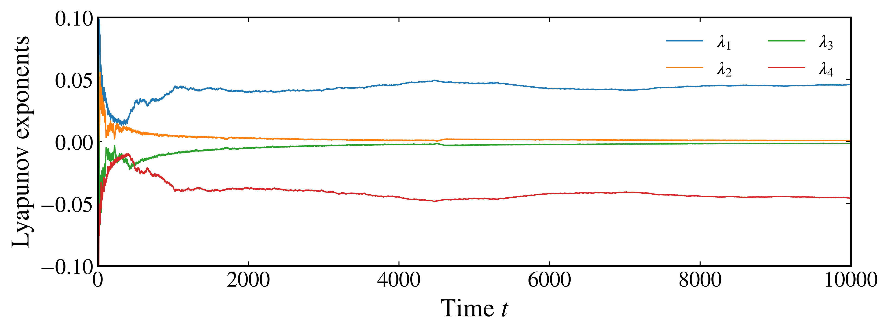

Lyapunov exponents
------------------

Lyapunov exponents quantify the average exponential growth or contraction of infinitesimal perturbations along a trajectory. For a Hamiltonian system a deviation vector :math:`\delta\mathbf{z}` in the phase space :math:`\mathbf{z}=(\mathbf{q},\mathbf{p})` evolves under the variational equation

.. math::

    \dot{\delta\mathbf{z}} = \mathbb{J}\,\nabla^2 H(\mathbf{z})\,\delta\mathbf{z},

where :math:`\nabla^2 H` is the Hessian of the Hamiltonian and :math:`\mathbb{J}` is the symplectic matrix. Because the linearized flow is symplectic, the Lyapunov exponents come in pairs :math:`\pm\lambda` and the full spectrum sums to zero. A system with :math:`f` degrees of freedom has :math:`2f` exponents; a regular orbit on an invariant torus has all of them equal to zero, while a chaotic orbit has at least one positive exponent balanced by its negative partner.

The :py:meth:`lyapunov <pynamicalsys.core.hamiltonian_systems.HamiltonianSystem.lyapunov>` method integrates the state together with its deviation vectors, repeatedly orthonormalizes them, and accumulates the logarithmic growth factors to estimate

.. math::

    \lambda_i=\lim_{t\rightarrow\infty}\frac{1}{t}\sum_j\log\left|R_{ii}^{(j)}\right|,

where :math:`R_{ii}^{(j)}` is a diagonal element of the triangular factor obtained at the :math:`j`-th QR decomposition. This is the standard algorithm introduced for numerical Lyapunov-spectrum calculations by Shimada and Nagashima and by Benettin et al.

The tangent dynamics require the Hessians of the Hamiltonian. The built-in Hénon-Heiles model provides them; a custom system must supply ``hess_T`` and ``hess_V`` for a separable Hamiltonian or ``hess_H`` for a general one, as described in the :doc:`creation guide <hs_creating_hs>`.

The Lyapunov spectrum of the Hénon-Heiles system
~~~~~~~~~~~~~~~~~~~~~~~~~~~~~~~~~~~~~~~~~~~~~~~~~

Fix the energy at :math:`E=1/8` and follow a chaotic orbit, taking :math:`x=0`, :math:`y=-0.1`, :math:`p_y=0`, and :math:`p_x>0` from the energy. Request the full spectrum by leaving ``num_exponents`` at its default, which is :math:`2f`, and retain its convergence history:

.. code-block:: python

    import numpy as np
    import matplotlib.pyplot as plt
    from pynamicalsys import HamiltonianSystem, PlotStyler

    system = HamiltonianSystem(model="henon heiles")
    system.integrator("svy4", time_step=0.01)

    energy = 1 / 8
    x, y, py = 0.0, -0.1, 0.0
    potential = (x**2 + y**2) / 2 + x**2 * y - y**3 / 3
    px = np.sqrt(2 * (energy - potential) - py**2)

    q = [x, y]
    p = [px, py]
    total_time = 10_000.0

    lyapunov_history = system.lyapunov(q, p, total_time, return_history=True)

With ``return_history=True``, the first column contains time and the remaining columns contain the four exponents :math:`\lambda_1\geq\lambda_2\geq\lambda_3\geq\lambda_4`. Plot their convergence:

.. code-block:: python

    time = lyapunov_history[:, 0]
    exponents = lyapunov_history[:, 1:]

    ps = PlotStyler()
    ps.apply_style()
    fig, ax = plt.subplots(figsize=(10, 4))
    for index in range(exponents.shape[1]):
        ax.plot(time, exponents[:, index], label=rf"$\lambda_{index + 1}$")
    ax.set_xlabel("Time $t$")
    ax.set_ylabel("Lyapunov exponents")
    ax.set_xlim(0, total_time)
    ax.set_ylim(-0.1, 0.1)
    ax.legend(loc="center right", frameon=False, ncol=2)
    fig.tight_layout()
    plt.show()

    Convergence of the four Lyapunov exponents of a chaotic Hénon-Heiles orbit at :math:`E=1/8`.

The largest exponent converges to a positive value and the smallest to its negative, while the two middle exponents approach zero. The pairing :math:`\lambda_1=-\lambda_4` and :math:`\lambda_2=-\lambda_3` and the vanishing sum are the signature of the symplectic tangent dynamics, and they provide a useful internal check on the calculation.

The largest exponent as a diagnostic
~~~~~~~~~~~~~~~~~~~~~~~~~~~~~~~~~~~~~

When only the sign of the largest exponent is needed to classify an orbit, set ``num_exponents=1``, which uses the dedicated single-vector calculation and returns a scalar. Compare the chaotic orbit above with the regular orbit at the mirror initial condition :math:`y=+0.1`, which lies on an invariant torus:

.. code-block:: python

    def px_from_energy(x, y, py, energy):
        potential = (x**2 + y**2) / 2 + x**2 * y - y**3 / 3
        return np.sqrt(2 * (energy - potential) - py**2)

    q_chaotic = [0.0, -0.1]
    p_chaotic = [px_from_energy(0.0, -0.1, 0.0, energy), 0.0]
    q_regular = [0.0, 0.1]
    p_regular = [px_from_energy(0.0, 0.1, 0.0, energy), 0.0]

    largest_chaotic = system.lyapunov(q_chaotic, p_chaotic, total_time, num_exponents=1)
    largest_regular = system.lyapunov(q_regular, p_regular, total_time, num_exponents=1)

The chaotic orbit gives a largest exponent of about :math:`0.05`, while the regular orbit gives a value near zero that continues to decrease as :math:`1/t`. A positive limit marks sensitive dependence on initial conditions; a value consistent with zero marks regular motion. Small positive values should be checked against a longer integration time before an orbit is called chaotic, because a slowly diffusing sticky orbit can imitate a regular one over short intervals.

Numerical options
~~~~~~~~~~~~~~~~~

``num_exponents``
    The number of exponents to compute, between one and :math:`2f`. If omitted, the full spectrum is returned. A request for more than one exponent returns a one-dimensional array, or the convergence history when ``return_history=True``.

``method``
    ``"QR"`` uses the package's modified Gram-Schmidt implementation and is the default. ``"QR_HH"`` uses ``numpy.linalg.qr`` with Householder reflections. This option applies when more than one exponent is calculated.

``qr_interval``
    The number of integration steps between successive orthonormalizations. The default is ``1``, which reorthonormalizes at every step.

``log_base``
    The default is :math:`e`, so the exponents use natural logarithms. Set ``log_base=2`` to express the rates in bits per unit time. Changing the base rescales the values but not their signs.

``seed``
    Initializes the deviation vectors. For a converged calculation the estimated exponents should not depend materially on this initial orientation.

References
~~~~~~~~~~

.. container:: references-list

    - I\. Shimada and T\. Nagashima, `A Numerical Approach to Ergodic Problem of Dissipative Dynamical Systems <https://doi.org/10.1143/PTP.61.1605>`_, Progress of Theoretical Physics 61, 1605-1616 (1979).
    - G\. Benettin, L\. Galgani, A\. Giorgilli, and J\.-M\. Strelcyn, `Lyapunov Characteristic Exponents for Smooth Dynamical Systems and for Hamiltonian Systems, Part 1: Theory <https://doi.org/10.1007/BF02128236>`_, Meccanica 15, 9-20 (1980).
