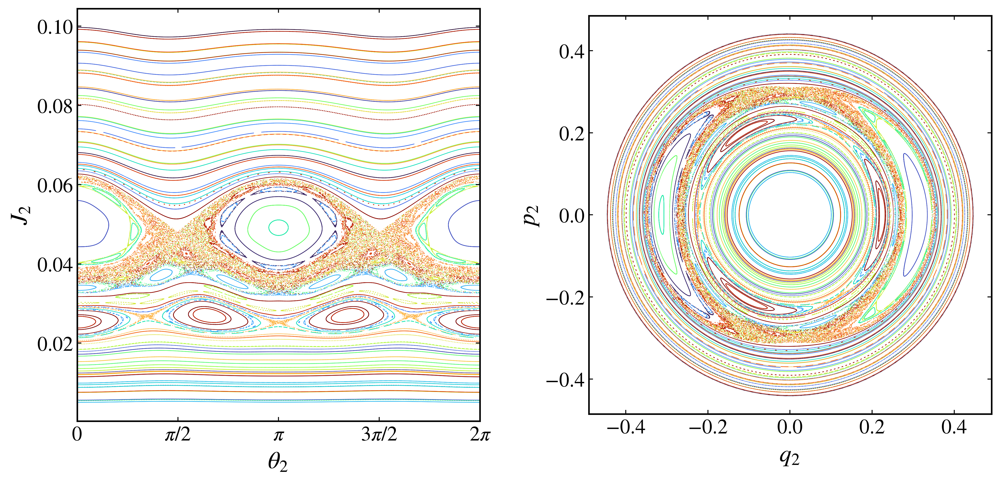

Poincaré sections
-----------------

The :py:meth:`poincare_section <pynamicalsys.core.hamiltonian_systems.HamiltonianSystem.poincare_section>` method reduces a continuous Hamiltonian flow to a map by recording the successive crossings of a chosen surface in phase space. For a system with two degrees of freedom at fixed energy, the motion lies on a three-dimensional energy surface, and a section through it produces a two-dimensional picture in which regular and chaotic motion are directly distinguishable. This is the construction used in the numerical experiments of `Hénon and Heiles (1964) <https://doi.org/10.1086/109234>`_.

The section and its output
~~~~~~~~~~~~~~~~~~~~~~~~~~

The section is defined by ``section_index``, the coordinate whose crossings are recorded, and ``section_value``, the value it takes on the surface. The ``crossing`` argument selects the direction: ``1`` for upward crossings, ``-1`` for downward, and ``0`` for both. For an angle variable, set ``periodic_section_coordinate=True`` and give its ``period`` so that crossings are detected with modulo arithmetic.

For a single initial condition, the method returns an array of shape ``(num_intersections, 2d + 1)``, where ``d`` is the number of degrees of freedom. The first column is the crossing time, the next ``d`` columns are the coordinates, and the final ``d`` columns are the momenta. Passing a two-dimensional ``q`` and ``p`` of shape ``(num_ic, d)`` evolves an ensemble and returns an array of shape ``(num_ic, num_intersections, 2d + 1)``.

A section of the Hénon-Heiles system
~~~~~~~~~~~~~~~~~~~~~~~~~~~~~~~~~~~~~

Take the section at :math:`x=0`, so ``section_index=0`` and ``section_value=0.0``, and record upward crossings. Each point of the section is then a pair :math:`(y, p_y)`. Fix the energy at :math:`E=1/8` and build an ensemble of initial conditions on the section: choose :math:`x=0` and values of :math:`y` and :math:`p_y` inside the accessible region, then fix :math:`p_x>0` from the energy, using :math:`V(0,y)=y^2/2-y^3/3`:

.. code-block:: python

    import numpy as np
    import matplotlib.pyplot as plt
    from pynamicalsys import HamiltonianSystem, PlotStyler

    system = HamiltonianSystem(model="henon heiles")
    system.integrator("svy4", time_step=0.01)

    energy = 1 / 8
    num_intersections = 2_000
    num_ic = 250
    rng = np.random.default_rng(13121989)

    q0 = []
    p0 = []
    while len(q0) < num_ic:
        y = rng.uniform(-0.5, 0.75)
        py = rng.uniform(-0.6, 0.6)
        potential = y**2 / 2 - y**3 / 3
        discriminant = 2 * (energy - potential) - py**2
        if discriminant > 0:
            q0.append([0.0, y])
            p0.append([np.sqrt(discriminant), py])
    q0 = np.array(q0)
    p0 = np.array(p0)

    sections = system.poincare_section(
        q0,
        p0,
        num_intersections,
        section_index=0,
        section_value=0.0,
        crossing=1,
    )

The result has shape ``(num_ic, num_intersections, 5)``, with columns time, :math:`x`, :math:`y`, :math:`p_x`, and :math:`p_y`. Plot :math:`p_y` against :math:`y`, coloring each initial condition separately so that individual orbits are distinguishable:

.. code-block:: python

    ps = PlotStyler()
    ps.apply_style()
    fig, ax = plt.subplots(figsize=(6, 6))
    colors = plt.cm.turbo(np.linspace(0, 1, len(sections)))
    for section, color in zip(sections, colors):
        ax.scatter(section[:, 2], section[:, 4], s=0.3, color=color, edgecolor="none")
    ax.set_xlabel("$y$")
    ax.set_ylabel("$p_y$")
    fig.tight_layout()
    plt.show()

.. figure:: images/henon_heiles_poincare_section.png
    :align: center
    :width: 80%

    Poincaré section of the Hénon-Heiles system at :math:`x=0` for energy :math:`E=1/8`. Each color is a different initial condition.

Orbits that fall on nested closed curves lie on invariant tori and correspond to regular motion, while an initial condition whose crossings scatter over an area explores a chaotic region. At :math:`E=1/8` the section is dominated by regular curves separated by thin chaotic layers near the separatrices. Raising the energy toward the escape value :math:`E=1/6` enlarges the chaotic component at the expense of the regular islands.

Sectioning on an angle
~~~~~~~~~~~~~~~~~~~~~~

The section coordinate need not be a position. In an action-angle system the natural surface of section is an angle, which winds continuously rather than oscillating and must be treated as periodic. Setting ``periodic_section_coordinate=True`` makes the crossing test use differences reduced modulo ``period`` (:math:`2\pi` by default), so each pass of the angle through ``section_value`` counts as one crossing and the wrap from :math:`2\pi` back to :math:`0` does not register a spurious one.

Consider the two-resonance Hamiltonian of `Walker and Ford (1969) <https://doi.org/10.1103/PhysRev.188.416>`_, defined in the :doc:`creation guide <hs_creating_hs>`, with angles :math:`\mathbf{q}=(\theta_1,\theta_2)`, actions :math:`\mathbf{p}=(J_1,J_2)`, and parameters :math:`\alpha=\beta=0.02`. Section on :math:`\theta_1=3\pi/2` at energy :math:`E=0.2`. On the section the energy condition :math:`H=E` is quadratic in :math:`J_1`, so it is solved in closed form, taking the positive branch:

.. code-block:: python

    import numpy as np

    def walker_ford_J1_from_E(q, p, energy, parameters):
        theta1, theta2 = q
        J2 = p[1]
        alpha, beta = parameters

        phase_22 = 2.0 * theta1 - 2.0 * theta2
        phase_23 = 2.0 * theta1 - 3.0 * theta2

        a = -1.0
        b = 1.0 - 3.0 * J2 + alpha * J2 * np.cos(phase_22) + beta * J2**1.5 * np.cos(phase_23)
        c = J2**2 + J2 - energy

        discriminant = b**2 - 4.0 * a * c
        if discriminant < 0.0:
            return np.nan
        J1 = (-b + np.sqrt(discriminant)) / (2.0 * a)
        return J1 if J1 >= 0.0 else np.nan

Recreate the general system with the ``walker_ford_eom`` and ``walker_ford_hess_H`` functions from the :doc:`creation guide <hs_creating_hs>`, and select the implicit midpoint integrator, which is required for a non-separable Hamiltonian:

.. code-block:: python

    from pynamicalsys import HamiltonianSystem, PlotStyler

    system = HamiltonianSystem(
        eom=walker_ford_eom,
        hess_H=walker_ford_hess_H,
        degrees_of_freedom=2,
        parameters=[0.02, 0.02],
    )
    parameters = system.get_parameters()
    system.integrator("imp", tol=1e-9, max_iter=1000)

Seed an ensemble on the section by fixing :math:`\theta_1=3\pi/2`, sampling :math:`\theta_2` and :math:`J_2`, and solving for :math:`J_1`:

.. code-block:: python

    import matplotlib.pyplot as plt

    energy = 0.2
    section_value = 3 * np.pi / 2
    num_ic = 100
    num_intersections = 2_000
    rng = np.random.default_rng(13121989)

    theta = np.zeros((num_ic, 2))
    J = np.zeros((num_ic, 2))
    for i in range(num_ic):
        while True:
            theta2 = rng.uniform(0.0, 2 * np.pi)
            J2 = rng.uniform(0.005, 0.1)
            J1 = walker_ford_J1_from_E([section_value, theta2], [0.0, J2], energy, parameters)
            if not np.isnan(J1):
                theta[i] = [section_value, theta2]
                J[i] = [J1, J2]
                break

Record the crossings with ``periodic_section_coordinate=True``, keeping both directions with ``crossing=0``:

.. code-block:: python

    sections = system.poincare_section(
        theta,
        J,
        num_intersections,
        section_index=0,
        section_value=section_value,
        crossing=0,
        periodic_section_coordinate=True,
    )

Each point is a pair :math:`(\theta_2, J_2)`. Walker and Ford also display the section in the canonical coordinates :math:`(q_2, p_2)` obtained from the action-angle pair by

.. math::

    q_2 = \sqrt{2J_2}\cos\theta_2, \qquad p_2 = -\sqrt{2J_2}\sin\theta_2.

Plot both representations side by side, reducing :math:`\theta_2` modulo :math:`2\pi` in the first panel:

.. code-block:: python

    ps = PlotStyler()
    ps.apply_style()
    fig, ax = plt.subplots(1, 2, figsize=(12, 6))
    colors = plt.cm.turbo(np.linspace(0, 1, num_ic))
    for section, color in zip(sections, colors):
        theta2 = section[:, 2]
        J2 = section[:, 4]
        ax[0].scatter(theta2 % (2 * np.pi), J2, s=0.3, color=color, edgecolor="none")
        q2 = np.sqrt(2 * J2) * np.cos(theta2)
        p2 = -np.sqrt(2 * J2) * np.sin(theta2)
        ax[1].scatter(q2, p2, s=0.3, color=color, edgecolor="none")
    ax[0].set_xlabel(r"$\theta_2$")
    ax[0].set_ylabel(r"$J_2$")
    ax[0].set_xlim(0, 2 * np.pi)
    ax[0].set_xticks([0, np.pi / 2, np.pi, 3 * np.pi / 2, 2 * np.pi])
    ax[0].set_xticklabels(["$0$", r"$\pi/2$", r"$\pi$", r"$3\pi/2$", r"$2\pi$"])
    ax[1].set_xlabel("$q_2$")
    ax[1].set_ylabel("$p_2$")
    ax[1].set_aspect("equal")
    fig.tight_layout()
    plt.show()

    Angular Poincaré section of the Walker-Ford Hamiltonian at :math:`\theta_1=3\pi/2` for energy :math:`E=0.2` and :math:`\alpha=\beta=0.02`. The left panel shows the :math:`(\theta_2, J_2)` plane and the right panel the canonical :math:`(q_2, p_2)` plane. Each color is a different initial condition.

Closed curves mark regular motion and points scattered over an area mark chaotic motion. The energy sets the overlap of the two resonances, so raising it increases the chaotic fraction of the section. In the canonical plane the angle becomes the azimuth and :math:`J_2=(q_2^2+p_2^2)/2` the squared radius, so the section is free of the artificial cut at :math:`\theta_2=0` and :math:`2\pi` and the resonance islands appear in their natural geometry. Without ``periodic_section_coordinate=True`` the winding of :math:`\theta_1` would be read as a large jump at every :math:`2\pi` wrap, and the crossings would not be detected correctly.

References
~~~~~~~~~~

.. container:: references-list

    - M\. Hénon and C\. Heiles, `The applicability of the third integral of motion: Some numerical experiments <https://doi.org/10.1086/109234>`_, The Astronomical Journal 69, 73 (1964).
    - G\. H\. Walker and J\. Ford, `Amplitude instability and ergodic behavior for conservative nonlinear oscillator systems <https://doi.org/10.1103/PhysRev.188.416>`_, Physical Review 188, 416-432 (1969).
