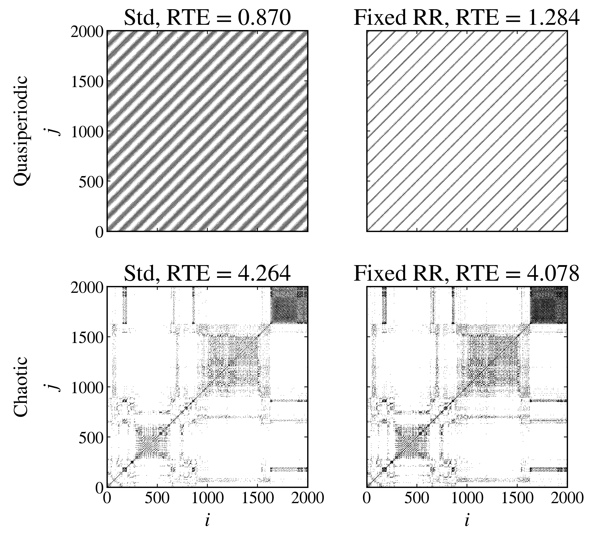

Recurrence time entropy
-----------------------

The :py:meth:`recurrence_time_entropy <pynamicalsys.core.hamiltonian_systems.HamiltonianSystem.recurrence_time_entropy>` method measures the diversity of recurrence times in a reduced map, here the Poincaré section of the flow. It identifies nearby pairs of points using a distance threshold :math:`\varepsilon`, then calculates the Shannon entropy of white vertical-line lengths in the recurrence matrix. Recurrence plots were introduced by `Eckmann et al. (1987) <https://doi.org/10.1209/0295-5075/4/9/004>`_. The entropy of a recurrence-period distribution was introduced by `Little et al. (2007) <https://doi.org/10.1186/1475-925X-6-23>`_. `Zou et al. (2007) <https://doi.org/10.1063/1.2785159>`_ estimated recurrence times from the white vertical lines of recurrence plots, and `Sales et al. (2023) <https://doi.org/10.1063/5.0140613>`_ used the resulting entropy to detect stickiness and weak chaos.

This tutorial uses a quasiperiodic and a chaotic Hénon-Heiles trajectory to show two practical ways to choose :math:`\varepsilon`. Each explicit call returns both the recurrence matrix and the RTE calculated from that matrix. All four calls use the same Poincaré-section definition and analysis settings.

Set up the two trajectories
~~~~~~~~~~~~~~~~~~~~~~~~~~~~

Use the Hénon-Heiles system introduced by `Hénon and Heiles (1964) <https://doi.org/10.1086/109234>`_ at energy :math:`E=1/8`. On the :math:`x=0` section, with :math:`p_y=0` and :math:`p_x>0` from the energy, the initial value of :math:`y` selects the orbit. The choice :math:`y=0.1` lies on an invariant torus and gives a quasiperiodic trajectory, while :math:`y=-0.15` lies in the chaotic region:

.. code-block:: python

    import numpy as np
    import matplotlib.pyplot as plt
    from pynamicalsys import HamiltonianSystem, PlotStyler

    system = HamiltonianSystem(model="henon heiles")
    system.integrator("svy4", time_step=0.01)

    energy = 1 / 8

    def state_on_section(y):
        potential = y**2 / 2 - y**3 / 3
        px = np.sqrt(2 * (energy - potential))
        return [0.0, y], [px, 0.0]

    quasiperiodic_q, quasiperiodic_p = state_on_section(0.1)
    chaotic_q, chaotic_p = state_on_section(-0.15)
    num_intersections = 2_000

The Poincaré section records successive upward crossings of :math:`x=0`. The same section, number of crossings, and supremum distance metric are used for each calculation.

Standard-deviation threshold
~~~~~~~~~~~~~~~~~~~~~~~~~~~~~

With ``threshold_mode="std"``, ``threshold=0.1`` sets :math:`\varepsilon` to ten percent of the largest coordinate standard deviation in each section. Calculate the quasiperiodic and chaotic cases separately:

Quasiperiodic trajectory
^^^^^^^^^^^^^^^^^^^^^^^^^

.. code-block:: python

    rte_std_quasiperiodic, matrix_std_quasiperiodic = system.recurrence_time_entropy(
        quasiperiodic_q,
        quasiperiodic_p,
        num_intersections,
        section_index=0,
        section_value=0.0,
        crossing=1,
        threshold_mode="std",
        threshold=0.1,
        metric="supremum",
        std_metric="supremum",
        return_recmat=True,
    )

Chaotic trajectory
^^^^^^^^^^^^^^^^^^

.. code-block:: python

    rte_std_chaotic, matrix_std_chaotic = system.recurrence_time_entropy(
        chaotic_q,
        chaotic_p,
        num_intersections,
        section_index=0,
        section_value=0.0,
        crossing=1,
        threshold_mode="std",
        threshold=0.1,
        metric="supremum",
        std_metric="supremum",
        return_recmat=True,
    )

Fixed recurrence rate
~~~~~~~~~~~~~~~~~~~~~~

With ``threshold_mode="rr"``, ``threshold=0.05`` chooses :math:`\varepsilon` separately for each trajectory to target an off-diagonal recurrence rate of five percent. Calculate the quasiperiodic and chaotic cases separately:

Quasiperiodic trajectory
^^^^^^^^^^^^^^^^^^^^^^^^^

.. code-block:: python

    rte_rr_quasiperiodic, matrix_rr_quasiperiodic = system.recurrence_time_entropy(
        quasiperiodic_q,
        quasiperiodic_p,
        num_intersections,
        section_index=0,
        section_value=0.0,
        crossing=1,
        threshold_mode="rr",
        threshold=0.01,
        metric="supremum",
        return_recmat=True,
    )

Chaotic trajectory
^^^^^^^^^^^^^^^^^^

.. code-block:: python

    rte_rr_chaotic, matrix_rr_chaotic = system.recurrence_time_entropy(
        chaotic_q,
        chaotic_p,
        num_intersections,
        section_index=0,
        section_value=0.0,
        crossing=1,
        threshold_mode="rr",
        threshold=0.01,
        metric="supremum",
        return_recmat=True,
    )

Compare each matrix with its RTE
~~~~~~~~~~~~~~~~~~~~~~~~~~~~~~~~~

The top row shows the quasiperiodic trajectory and the bottom row shows the chaotic trajectory. The columns show the standard-deviation and fixed-RR thresholds. Plot only matrix entries with :math:`R_{ij}=1` as points. Each panel title reports the RTE of that matrix:

.. code-block:: python

    ps = PlotStyler()
    ps.apply_style()
    plt.close()

    fig, ax = plt.subplots(2, 2, figsize=(9, 8), sharex=True, sharey=True)
    j, i = np.where(matrix_std_quasiperiodic == 1)
    ax[0, 0].scatter(i, j, s=0.05, c="black", marker="s", linewidths=0)
    j, i = np.where(matrix_rr_quasiperiodic == 1)
    ax[0, 1].scatter(i, j, s=0.05, c="black", marker="s", linewidths=0)
    j, i = np.where(matrix_std_chaotic == 1)
    ax[1, 0].scatter(i, j, s=0.05, c="black", marker="s", linewidths=0)
    j, i = np.where(matrix_rr_chaotic == 1)
    ax[1, 1].scatter(i, j, s=0.05, c="black", marker="s", linewidths=0)
    ax[0, 0].set_xlim(0, num_intersections)
    ax[0, 0].set_ylim(0, num_intersections)
    ax[0, 0].set_aspect("equal")
    ax[0, 1].set_aspect("equal")
    ax[1, 0].set_aspect("equal")
    ax[1, 1].set_aspect("equal")
    ax[0, 0].set_title(f"Std, RTE = {rte_std_quasiperiodic:.3f}")
    ax[0, 1].set_title(f"Fixed RR, RTE = {rte_rr_quasiperiodic:.3f}")
    ax[1, 0].set_title(f"Std, RTE = {rte_std_chaotic:.3f}")
    ax[1, 1].set_title(f"Fixed RR, RTE = {rte_rr_chaotic:.3f}")
    ax[0, 0].set_ylabel("Quasiperiodic\n$j$")
    ax[1, 0].set_ylabel("Chaotic\n$j$")
    ax[1, 0].set_xlabel("$i$")
    ax[1, 1].set_xlabel("$i$")
    fig.tight_layout()
    plt.show()

    Recurrence matrices and corresponding RTE values for the quasiperiodic and chaotic Hénon-Heiles trajectories. Rows identify the trajectories, while columns identify the threshold modes.

Compare the two trajectories within a column. The fixed-RR column is particularly useful for visual comparison because it targets the same recurrence density in both matrices. The standard-deviation threshold does not enforce a common recurrence rate, so recurrence density can also contribute to differences between those two panels.

Other section and output options
~~~~~~~~~~~~~~~~~~~~~~~~~~~~~~~~~~

The Poincaré section is selected with ``section_index``, ``section_value``, and ``crossing``, and ``periodic_section_coordinate=True`` treats the section coordinate as an angle. Changing the section changes the sequence being analyzed, so compare RTE values only when the section and threshold settings match.

The method also accepts ``threshold_mode="direct"`` when an absolute distance threshold is specifically needed, but it is not recommended for this comparison because a fixed distance can produce very different recurrence densities in the two trajectories. The ``lmin`` argument controls the shortest accepted white-line length. Set ``return_final_state=True`` or ``return_p=True`` to additionally request the final section point or normalized white-line distribution. Requested outputs follow the RTE in the order final point, recurrence matrix, and distribution. The deprecated ``threshold_std`` argument should not be used in new code.

A recurrence matrix for :math:`N` section points contains :math:`N^2` entries. Request it only when the matrix itself is needed.

References
~~~~~~~~~~

.. container:: references-list

    - M\. Hénon and C\. Heiles, `The applicability of the third integral of motion: Some numerical experiments <https://doi.org/10.1086/109234>`_, The Astronomical Journal 69, 73 (1964).
    - J\.-P\. Eckmann, S\. O\. Kamphorst, and D\. Ruelle, `Recurrence plots of dynamical systems <https://doi.org/10.1209/0295-5075/4/9/004>`_, Europhysics Letters 4, 973-977 (1987).
    - M\. A\. Little, P\. E\. McSharry, S\. J\. Roberts, D\. A\. E\. Costello, and I\. M\. Moroz, `Exploiting nonlinear recurrence and fractal scaling properties for voice disorder detection <https://doi.org/10.1186/1475-925X-6-23>`_, BioMedical Engineering OnLine 6, 23 (2007).
    - Y\. Zou, M\. Thiel, M\. C\. Romano, and J\. Kurths, `Characterization of stickiness by means of recurrence <https://doi.org/10.1063/1.2785159>`_, Chaos 17, 043101 (2007).
    - M\. R\. Sales, M\. Mugnaine, J\. D\. Szezech Jr., R\. L\. Viana, I\. L\. Caldas, N\. Marwan, and J\. Kurths, `Stickiness and recurrence plots: An entropy-based approach <https://doi.org/10.1063/5.0140613>`_, Chaos 33, 033140 (2023).
