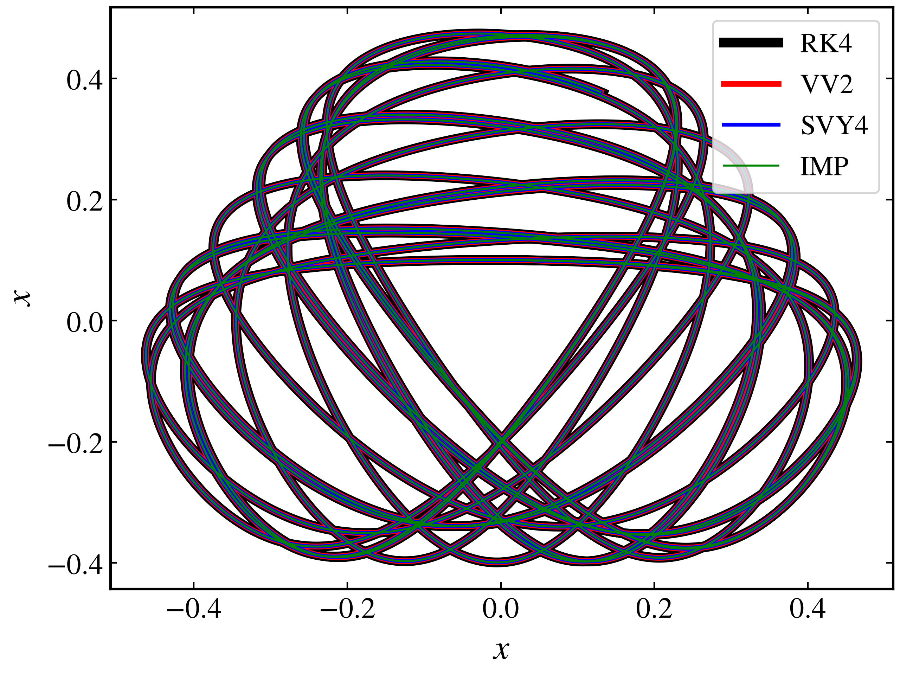
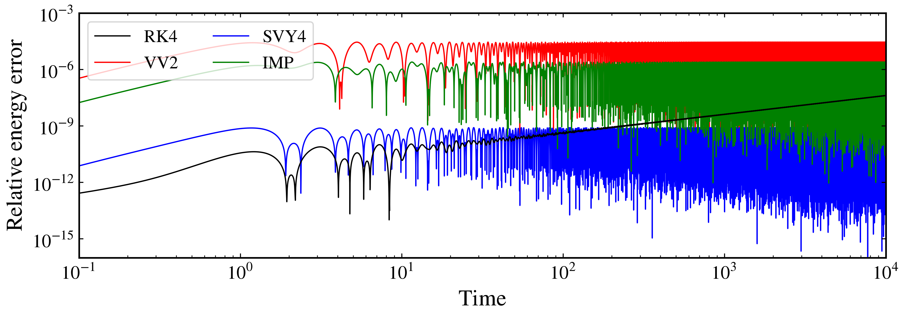

Generating trajectories
-----------------------

To generate trajectories for a continuous dynamical system, we use the :py:meth:`trajectory <pynamicalsys.core.hamiltonian_systems.HamiltonianSystem.trajectory>` method of the :py:class:`HamiltonianSystem <pynamicalsys.core.hamiltonian_systems.HamiltonianSystem>` class. This method allows us to specify the initial condition, parameter values, and total time for the simulation. It is possible to choose between three different integrators: the 2nd order velocity Verlet (VV2), the 4th order Yoshida (SVY4), and the implicit midpoint method (IMP). The first two can only be used for separable Hamiltonians.

Choosing the integrator
~~~~~~~~~~~~~~~~~~~~~~~

To choose the integrator, we use the :py:meth:`integrator <pynamicalsys.core.hamiltonian_systems.HamiltonianSystem.integrator>` method of the :py:class:`HamiltonianSystem <pynamicalsys.core.hamiltonian_systems.HamiltonianSystem>` class. Both VV2 and SVY4 integrators only need the time step, which is set to :math:`10^{-2}` by default:

.. code-block:: python

    from pynamicalsys import HamiltonianSystem

    ds = HamiltonianSystem(model="henon heiles")
    ds.integrator("svy4", time_step=0.005)

For the IMP method, it is also possible to specify the tolerance and maximum iterations for the internal root finder:

.. code-block:: python

    ds.integrator("imp", time_step=0.005, tol=1e-9, max_iter=10000)

Trajectories and energy conservation
~~~~~~~~~~~~~~~~~~~~~~~~~~~~~~~~~~~~

Let's now generate a trajectory for the Hénon-Heiles system using these tree integrators. We first import all the necessary modules to simulate and visualize the trajectories and instanciante the :py:class:`HamiltonianSystem <pynamicalsys.core.hamiltonian_systems.HamiltonianSystem>` class:

.. code-block:: python

    from pynamicalsys import HamiltonianSystem, PlotStyler
    import numpy as np
    import matplotlib.pyplot as plt
    import seaborn as sns

    ds = HamiltonianSystem(model="henon heiles")

Next, we can generate a trajectory by specifying the initial condition, parameters, and total time. The :py:meth:`trajectory <pynamicalsys.core.hamiltonian_systems.HamiltonianSystem.trajectory>` method returns a Numpy array with shape `(N, d + 1)`, where `N` is the number of iterations and `d` is the dimension of the system. The first column corresponds to the time samples at which the trajectory was calculated and the remaing columns correspond to a state variable.

.. code-block:: python

    # Total energy of the system
    E = 1 / 8 

    # Total integration time
    total_time = 10000

    # Initial condition
    x = 0
    y = 0.1
    py = 0
    px = np.sqrt(2 * (E - x**2 * y + y**3 / 3) - x**2 - y**2 - py**2)
    q = np.array([x, y])
    p = np.array([px, py])

    # Using VV2 integrator
    ds.integrator("vv2", time_step=0.01)

    # Generate the trajectory
    traj_vv2 = ds.trajectory(q, p, total_time)

    # Using SVY4 integrator
    ds.integrator("svy4", time_step=0.01)

    # Generate the trajectory
    traj_svy4 = ds.trajectory(q, p, total_time)

    # Using IMP integrator
    ds.integrator("imp", time_step=0.01, tol=1e-9, max_iter=1000)

    # Generate the trajectory
    traj_imp = ds.trajectory(q, p, total_time)

Then we can plot the trajectory:

.. code-block:: python
    ps = PlotStyler(fontsize=18)
    ps.apply_style()

    points_to_plot = 10000
    plt.plot(traj_rk4[:points_to_plot, 1], traj_rk4[:points_to_plot, 2], "k", lw=5)
    plt.plot(traj_vv2[:points_to_plot, 1], traj_vv2[:points_to_plot, 2], "r", lw=3)
    plt.plot(traj_svy4[:points_to_plot, 1], traj_svy4[:points_to_plot, 2], "b", lw=2)
    plt.plot(traj_imp[:points_to_plot, 1], traj_imp[:points_to_plot, 2], "g", lw=1)

    plt.xlabel("$x$")
    plt.ylabel("$x$")

    plt.show()

   
   A regular trajectory of the Hénon-Heiles system using four different integrators.

To check the energy drift of each integrator, we calculate the relative energy error:

.. math::

    \begin{equation*}
        E_r = \frac{\left|E(t) - E_0\right|}{E_0}.
    \end{equation*}

   
   Relative energy error as a function of time of four different integrators.
