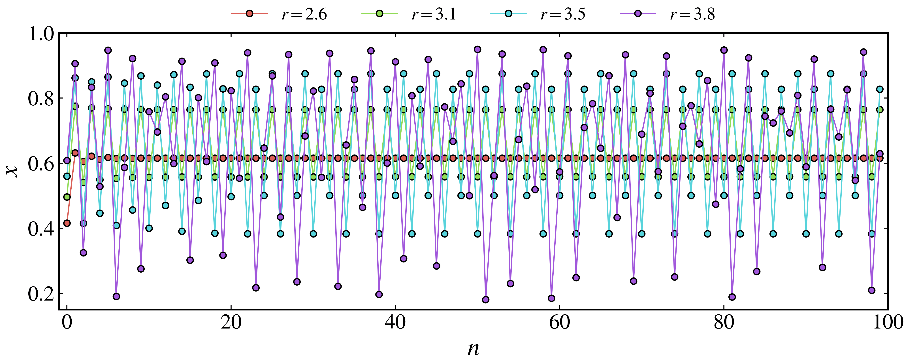

Quickstart
==========

This guide walks you through the basics of using **pynamicalsys**.

Creating a discrete dynamical system object
-------------------------------------------

To get started, you need to create a discrete dynamical system object. This is done using the :py:class:`DiscreteDynamicalSystem <pynamicalsys.core.discrete_dynamical_systems.DiscreteDynamicalSystem>` class. For this example, we will use the logistic map, defined as:

.. math::
    
    x_{n+1} = r x_n (1 - x_n).

This map is a discrete dynamical system that exhibits a wide range of behaviors depending on the parameter :math:`r`. It is often used as a classic example in chaos theory.

.. code-block:: python

    from pynamicalsys import DiscreteDynamicalSystem as dds
    ds = dds(model="logistc map")

Generating a time series
------------------------

We are going to generate a time series for this system using four different parameters values. Each one of these values produces a different dynamical behavior.

.. code-block:: python

    x0 = 0.2 # Initial condition
    r = [2.6, 3.1, 3.5, 3.8] # Parameter values
    # Generate trajectories for each parameter value
    trajectories = [ds.trajectory(x0, 100, parameters=r[i]) for i in range(len(r))]

Visualizing the results
-----------------------

To visualize the results, we can use the :py:class:`PlotStyler <pynamicalsys.core.plot_styler.PlotStyler>` class to customize our plots.

.. code-block:: python

    from pynamicalsys import PlotStyler
    import seaborn as sns
    import matplotlib.pyplot as plt
    
    # Apply the plot style
    ps = PlotStyler()
    ps.apply_style()
    
    # Now we can plot the trajectories
    fig, ax = plt.subplots(figsize=(10, 4))
    
    # Plot each trajectory with a different color
    colors = sns.color_palette("hls", n_colors=len(r))
    for i, traj in enumerate(trajectories):
        ax.plot(traj, "-o", color=colors[i], label=f"$r = {r[i]}$")
    
    # Customize the plot
    plt.xlabel("$n$")
    plt.ylabel("$x$")
    plt.legend(loc="upper center", frameon=False, ncol=4, bbox_to_anchor=(0.5, 1.15))
    plt.ylim(0.15, 1)
    plt.xlim(-1, 100)
    plt.tight_layout(pad=0)
    # Save the plot
    plt.savefig("logistic_map_trajectories.png", dpi=500)

.. _logistic_map_trajectories-figure:

   
   Logistic map trajectories for different parameter values.

Further reading
---------------

- For more examples and detailed explanations, check out the :doc:`DiscreteDynamicalSystem tutorial page <tutorial>`.
- For detailed API docs, see the :doc:`api/dds` page.
- For installation instructions, see the :doc:`installation` page.
- To contribute or get support, visit the :doc:`contact` page.

Happy coding!
