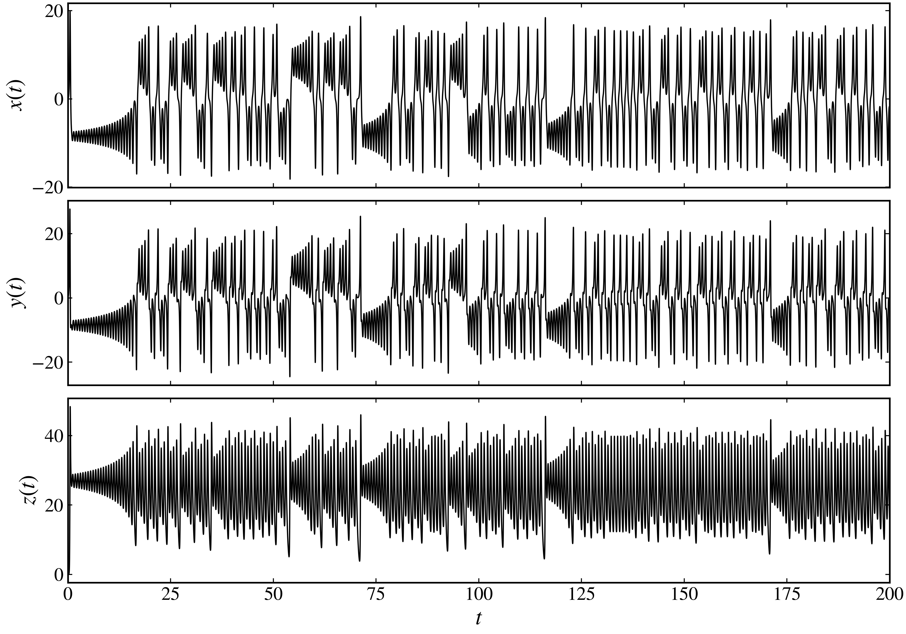
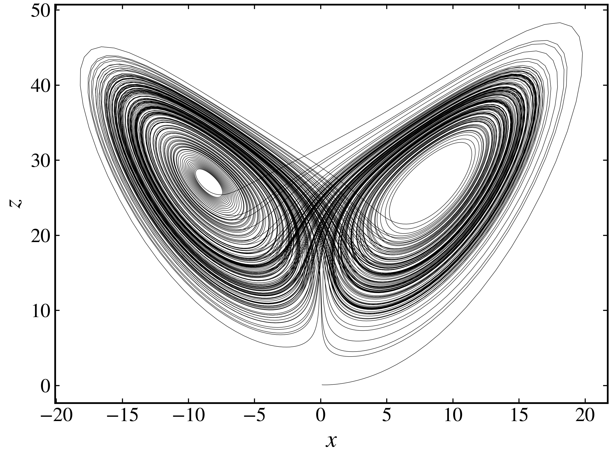

Quickstart
==========

This guide walks you through the basics of using **pynamicalsys**.

Discrete-time dynamical system
------------------------------

Creating a discrete-time dynamical system object
~~~~~~~~~~~~~~~~~~~~~~~~~~~~~~~~~~~~~~~~~~~~~~~~

To get started, you need to create a discrete dynamical system object. This is done using the :py:class:`DiscreteDynamicalSystem <pynamicalsys.core.discrete_dynamical_systems.DiscreteDynamicalSystem>` class. For this example, we will use the logistic map, defined as:

.. math::
    
    x_{n+1} = r x_n (1 - x_n).

This map is a discrete dynamical system that exhibits a wide range of behaviors depending on the parameter :math:`r`. It is often used as a classic example in chaos theory. To create the discrete-time dynamical system object, we need to instanciate the :py:class:`DiscreteDynamicalSystem <pynamicalsys.core.discrete_dynamical_systems.DiscreteDynamicalSystem>` class using the `model` parameter, since the Lorenz system is built-in within this class:

.. code-block:: python

    from pynamicalsys import DiscreteDynamicalSystem as dds
    ds = dds(model="logistc map")

Generating a trajectory
~~~~~~~~~~~~~~~~~~~~~~~

We are going to generate a trajectory for this system using four different parameters values. Each one of these values produces a different dynamical behavior.

.. code-block:: python

    x0 = 0.2  # Initial condition
    r = [2.6, 3.1, 3.5, 3.8]  # Parameter values
    # Generate trajectories for each parameter value
    trajectories = [ds.trajectory(x0, 100, parameters=r[i]) for i in range(len(r))]

Visualizing the trajectory
~~~~~~~~~~~~~~~~~~~~~~~~~~

To visualize the trajectory, we can use the :py:class:`PlotStyler <pynamicalsys.core.plot_styler.PlotStyler>` class to customize our plots.

.. code-block:: python

    from pynamicalsys import PlotStyler
    import seaborn as sns
    import matplotlib.pyplot as plt
    
    # Apply the plot style
    ps = PlotStyler()
    ps.apply_style()
    
    # Now we can plot the trajectories
    fig, ax = plt.subplots(figsize=(10, 4))
    
    # Plot each trajectory with a different color
    colors = sns.color_palette("hls", n_colors=len(r))
    for i, traj in enumerate(trajectories):
        ax.plot(traj, "-o", color=colors[i], label=f"$r = {r[i]}$")
    
    # Customize the plot
    plt.xlabel("$n$")
    plt.ylabel("$x$")
    plt.legend(loc="upper center", frameon=False, ncol=4, bbox_to_anchor=(0.5, 1.15))
    plt.ylim(0.15, 1)
    plt.xlim(-1, 100)
    
    plt.show()

.. _logistic_map_trajectories-figure:

.. figure:: images/logistic_map_trajectories.png
   :align: center
   :width: 100%
   
   Logistic map trajectories for different parameter values.

Continuous-time dynamical system
--------------------------------

Creating a continuous-time dynamical system object
~~~~~~~~~~~~~~~~~~~~~~~~~~~~~~~~~~~~~~~~~~~~~~~~~~

The continuous-time analysis is similar to the discrete-time analysis. To get started, you need to create a continuous-time dynamical system object. This is done using the :py:class:`ContinuousDynamicalSystem <pynamicalsys.core.continuous_dynamical_systems.ContinuousDynamicalSystem>` class. For this example, we will use the Lorenz system, defined as:

.. math::

    \begin{align*}
        \dot{x} &= \sigma(y - x),\\
        \dot{y} &= x(\rho - z) - y,\\
        \dot{z} &= xy - \beta z.
    \end{align*}

For this example, we are going to use the same parameters Lorenz used in his original paper in 1986: :math:`\sigma = 10`, :math:`\sigma = 28`, and :math:`\beta = 8/3`. The system exhibit chaotic behavior for this set of parameters.

To create the continuous-time dynamical system object, we need to instanciate the :py:class:`ContinuousDynamicalSystem <pynamicalsys.core.continuous_dynamical_systems.ContinuousDynamicalSystem>` class using the `model` parameter, since the Lorenz system is built-in within this class:

.. code-block:: python

    from pynamicalsys import ContinuousDynamicalSystem as cds
    ds = cds(model="lorenz system")

Generating a trajectory
~~~~~~~~~~~~~~~~~~~~~~~

We are going to generate a trajectory for this system using the mentioned parameters. The order in which the parameters must be given for the built-in system can be verified using the :py:attr:`info <pynamicalsys.core.continuous_dynamical_systems.ContinuousDynamicalSystem.info>` property.

.. code-block:: python

    # Initial condition: x, y, z
    u = [0.1, 0.1, 0.1]

    # Parameters of the system
    sigma, rho, beta = 10, 28, 8/3
    parameters = [sigma, rho, beta]

    # Total time
    total_time = 200

    # Calculate the trajectory
    trajectory = ds.trajectory(u, total_time, parameters)

Visualizing the trajectory
~~~~~~~~~~~~~~~~~~~~~~~~~~

The :py:meth:`trajectory <pynamicalsys.core.continuous_dynamical_systems.ContinuousDynamicalSystem.trajectory>` method returns the time samples and the coordinates of the system at the respective samples. If we don't specify the integrator, it uses the 4th order Runge-Kutta method with a fixed time step of 0.01. We can then visualize the evolution of each coordiate:

.. code-block:: python

    from pynamicalsys import PlotStyler

    # Apply the plot style
    ps = PlotStyler(fontsize=18)
    ps.apply_style()

    # Create the figure and the axes    
    fig, ax = plt.subplots(3, 1, sharex=True, figsize=(10, 7))

    # Plot x(t), y(t), and z(t) in different rows.
    for i in range(3):
        ax[i].plot(trajectory[:, 0], trajectory[:, i + 1], "k")
    
    # Set the labels and limits
    ax[0].set_ylabel("$x(t)$")
    ax[1].set_ylabel("$y(t)$")
    ax[2].set_ylabel("$z(t)$")
    ax[-1].set_xlabel("$t$")
    ax[0].set_xlim(0, total_time)
    
    plt.show()

   
   A chaotic trajectory of the Lorenz system.

We can also visualize the attractor (a projection onto the :math:`xz` plane):

.. code-block:: python

    ps = PlotStyler(fontsize=18, linewidth=0.3)
    ps.apply_style()

    plt.plot(trajectory[:, 1], trajectory[:, 3], "k-")

    plt.xlabel("$x$")
    plt.ylabel("$z$")

    plt.show()

   
   The Lorenz attractor.

Further reading
---------------

- For more examples and detailed explanations, check out the :doc:`DiscreteDynamicalSystem tutorial page <dds_tutorial>` and the :doc:`ContinuousDynamicalSystem tutorial page <cds_tutorial>`.
- For detailed API docs, see the :doc:`api/dds` and :doc:`api/cds` pages.
- For installation instructions, see the :doc:`installation` page.
- To contribute or get support, visit the :doc:`contact` page.

Happy coding!
