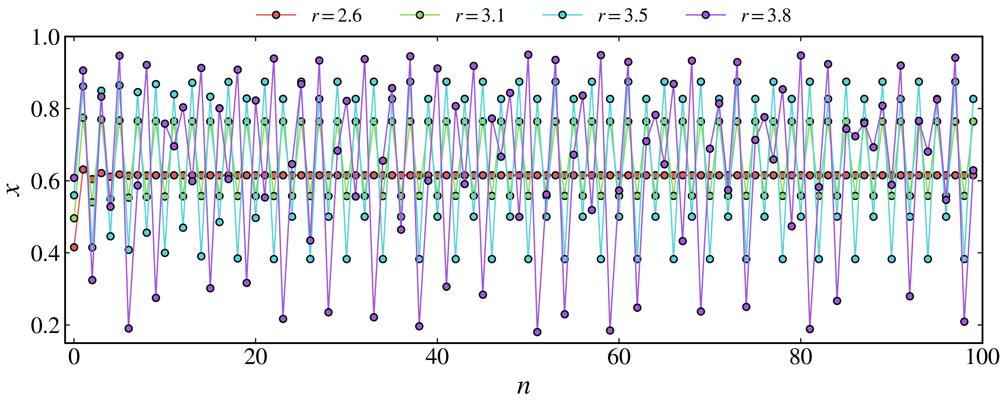
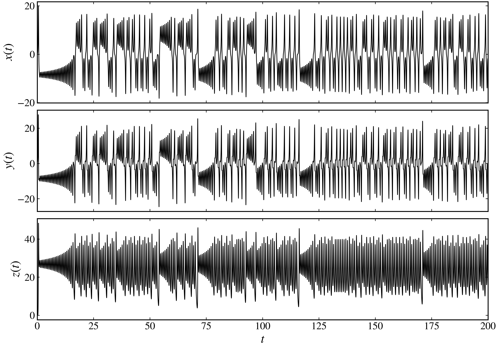
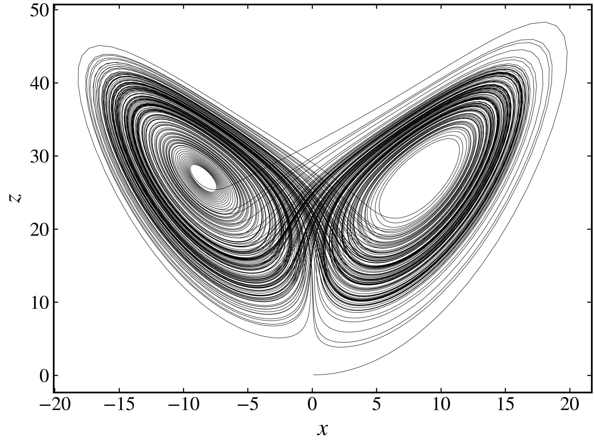
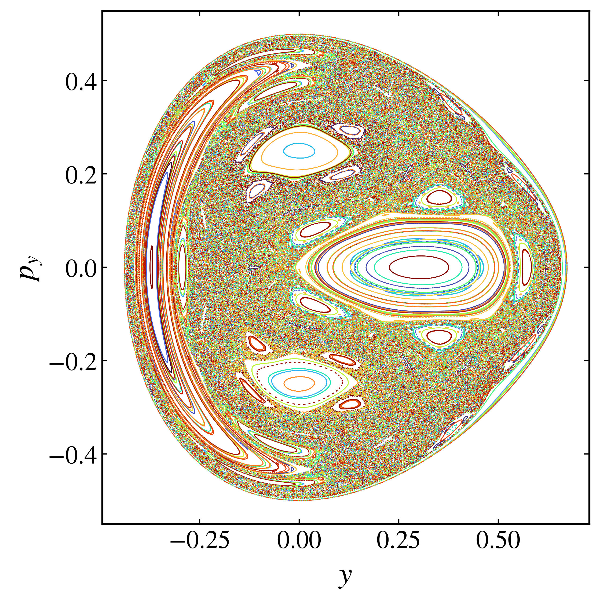

Quickstart
==========

This guide walks you through the basics of using **pynamicalsys**.

Discrete-time dynamical system
------------------------------

Creating a discrete-time dynamical system object
~~~~~~~~~~~~~~~~~~~~~~~~~~~~~~~~~~~~~~~~~~~~~~~~

To get started, you need to create a discrete dynamical system object. This is done using the :py:class:`DiscreteDynamicalSystem <pynamicalsys.core.discrete_dynamical_systems.DiscreteDynamicalSystem>` class. For this example, we will use the logistic map, defined as:

.. math::
    
    \begin{equation*}
        x_{n+1} = r x_n (1 - x_n).
    \end{equation*}

This map is a discrete dynamical system that exhibits a wide range of behaviors depending on the parameter :math:`r`. It is often used as a classic example in chaos theory. To create the discrete-time dynamical system object, we need to instanciate the :py:class:`DiscreteDynamicalSystem <pynamicalsys.core.discrete_dynamical_systems.DiscreteDynamicalSystem>` class using the `model` parameter, since the logistic map is built-in within this class:

.. code-block:: python

    from pynamicalsys import DiscreteDynamicalSystem as dds  # Import the discrete-time system class
    ds = dds(model="logistic map")  # Create the logistic map discrete system object

Generating a trajectory
~~~~~~~~~~~~~~~~~~~~~~~

We are going to generate a trajectory for this system using four different parameters values. Each one of these values produces a different dynamical behavior.

.. code-block:: python

    x0 = 0.2  # Initial condition for x
    r = [2.6, 3.1, 3.5, 3.8]  # List of parameter values

    # Generate trajectories for each parameter value (100 iterations each)
    trajectories = [ds.trajectory(x0, 100, parameters=r[i]) for i in range(len(r))]

Visualizing the trajectory
~~~~~~~~~~~~~~~~~~~~~~~~~~

To visualize the trajectory, we can use the :py:class:`PlotStyler <pynamicalsys.core.plot_styler.PlotStyler>` class to customize our plots.

.. code-block:: python

    from pynamicalsys import PlotStyler  # For consistent plot styling
    import seaborn as sns  # For color palettes
    import matplotlib.pyplot as plt  # For plotting

    # Apply the plot style
    ps = PlotStyler()
    ps.apply_style()

    # Create the figure and axes
    fig, ax = plt.subplots(figsize=(10, 4))

    # Define colors for each trajectory
    colors = sns.color_palette("hls", n_colors=len(r))

    # Plot each trajectory with a different color and label
    for i, traj in enumerate(trajectories):
        ax.plot(traj, "-o", color=colors[i], label=f"$r = {r[i]}$")

    # Customize the plot labels and limits
    plt.xlabel("$n$")  # Iteration index
    plt.ylabel("$x$")  # State variable
    plt.legend(loc="upper center", frameon=False, ncol=4, bbox_to_anchor=(0.5, 1.15))
    plt.ylim(0.15, 1)
    plt.xlim(-1, 100)

    plt.show()  # Display the plot

.. _logistic_map_trajectories-figure:

   
   Logistic map trajectories for different parameter values.

Continuous-time dynamical system
--------------------------------

Creating a continuous-time dynamical system object
~~~~~~~~~~~~~~~~~~~~~~~~~~~~~~~~~~~~~~~~~~~~~~~~~~

The continuous-time analysis is similar to the discrete-time analysis. To get started, you need to create a continuous-time dynamical system object. This is done using the :py:class:`ContinuousDynamicalSystem <pynamicalsys.core.continuous_dynamical_systems.ContinuousDynamicalSystem>` class. For this example, we will use the Lorenz system, defined as:

.. math::

    \begin{align*}
        \dot{x} &= \sigma(y - x),\\
        \dot{y} &= x(\rho - z) - y,\\
        \dot{z} &= xy - \beta z.
    \end{align*}

For this example, we are going to use the same parameters Lorenz used in his original paper in 1963: :math:`\sigma = 10`, :math:`\sigma = 28`, and :math:`\beta = 8/3`. The system exhibits chaotic behavior for this set of parameters.

To create the continuous-time dynamical system object, we need to instanciate the :py:class:`ContinuousDynamicalSystem <pynamicalsys.core.continuous_dynamical_systems.ContinuousDynamicalSystem>` class using the `model` parameter, since the Lorenz system is built-in within this class:

.. code-block:: python

    from pynamicalsys import ContinuousDynamicalSystem as cds  # Import the continuous-time system class
    ds = cds(model="lorenz system")  # Create the Lorenz system object

Generating a trajectory
~~~~~~~~~~~~~~~~~~~~~~~

We are going to generate a trajectory for this system using the mentioned parameters. The order in which the parameters must be given for the built-in system can be verified using the :py:attr:`info <pynamicalsys.core.continuous_dynamical_systems.ContinuousDynamicalSystem.info>` property.

.. code-block:: python

    # Initial condition for (x, y, z)
    u = [0.1, 0.1, 0.1]

    # Parameters of the Lorenz system (σ, ρ, β)
    sigma, rho, beta = 10, 28, 8/3
    parameters = [sigma, rho, beta]

    # Total integration time
    total_time = 200

    # Calculate the trajectory of the system
    trajectory = ds.trajectory(u, total_time, parameters)

Visualizing the trajectory
~~~~~~~~~~~~~~~~~~~~~~~~~~

The :py:meth:`trajectory <pynamicalsys.core.continuous_dynamical_systems.ContinuousDynamicalSystem.trajectory>` method returns the time samples and the coordinates of the system at the respective samples. If we don't specify the integrator, it uses the 4th order Runge-Kutta method with a fixed time step of 0.01. We can then visualize the evolution of each coordiate:

.. code-block:: python

    from pynamicalsys import PlotStyler  # For consistent plot styling

    # Apply the plot style
    ps = PlotStyler(fontsize=18)
    ps.apply_style()

    # Create the figure and axes for x(t), y(t), z(t)
    fig, ax = plt.subplots(3, 1, sharex=True, figsize=(10, 7))

    # Plot x(t), y(t), z(t) separately
    for i in range(3):
        ax[i].plot(trajectory[:, 0], trajectory[:, i + 1], "k")  # time vs coordinate

    # Add axis labels and limits
    ax[0].set_ylabel("$x(t)$")
    ax[1].set_ylabel("$y(t)$")
    ax[2].set_ylabel("$z(t)$")
    ax[-1].set_xlabel("$t$")
    ax[0].set_xlim(0, total_time)

    plt.show()  # Display the plot

   
   A chaotic trajectory of the Lorenz system.

We can also visualize the attractor (a projection onto the :math:`xz` plane):

.. code-block:: python

    ps = PlotStyler(fontsize=18, linewidth=0.3)  # Style for attractor plot
    ps.apply_style()

    # Plot the Lorenz attractor projection on the x-z plane
    plt.plot(trajectory[:, 1], trajectory[:, 3], "k-")

    plt.xlabel("$x$")
    plt.ylabel("$z$")

    plt.show()  # Display the attractor plot

   
   The Lorenz attractor.

Hamiltonian systems
-------------------

Creating a Hamiltonian system object
~~~~~~~~~~~~~~~~~~~~~~~~~~~~~~~~~~~~

To get started, you need to create a Hamiltonian system object. This is done using the :py:class:`HamiltonianSystem <pynamicalsys.core.hamiltonian_systems.HamiltonianSystem>` class. For this example, we will use the two degrees of freedom Hénon-Hailes system, defined by the Hamiltonian function:

.. math::

    \begin{align*}
        H(x, y, p_x, p_y) = \frac{1}{2}(p_x^2 + p_y^2) + \frac{1}{2}(x^2 + y^2) + x^2y - \frac{y^3}{3}.
    \end{align*}

This system is a paradigmatic example of a Hamiltonian system that exhibits both regular and chaotic solutions. The create the Hamiltonian system object, we need to instanciante the :py:class:`HamiltonianSystem <pynamicalsys.core.hamiltonian_systems.HamiltonianSystem>` class using the `model` parameter, since the Hénon-Heiles system is built in within this class:

.. code-block:: python

    from pynamicalsys import HamiltonianSystem as HS  # Import the Hamiltonian system class
    hs = HS(model="henon heiles")  # Create the Hénon-Heiles Hamiltonian system object

Generating Poincaré section
~~~~~~~~~~~~~~~~~~~~~~~~~~~

To visualize the different behaviors of this system, we are going to generate the Poincaré section for an ensemble of randomly chosen initial conditions:

.. code-block:: python

    num_ic = 100  # Number of initial conditions
    dof = 2  # Degrees of freedom of the system

    # Allocate arrays for initial positions q and momenta p
    q = np.zeros((num_ic, dof))
    p = np.zeros((num_ic, dof))

    E_ref = 1 / 8  # Total energy of the system
    x = 0  # Fixed x = 0 for the Poincaré section

    # Ranges for y and py sampling
    y_range = (-0.5, 0.5)
    py_range = (-0.5, 0.5)

    # Randomly generate initial conditions consistent with energy
    np.random.seed(13)
    for i in range(num_ic):
        while True:
            py = np.random.uniform(*py_range)
            y = np.random.uniform(*y_range)
            # Energy constraint to solve for px
            px_squared = 2 * (E_ref - x**2 * y + y**3 / 3) - x**2 - y**2 - py**2
            if px_squared > 0:  # Ensure positive px_squared
                q[i] = [x, y]
                p[i] = [np.sqrt(px_squared), py]
                break

    num_intersections = 10000  # Number of Poincaré section intersections to compute

We choose as our section the :math:`x = 0` plane with :math:`\dot{x} > 0` and integrate the system using two symplectic integrators: the second-order velocity-Verlet integrator (VV2) and the fourth-order Yoshida method (SVY4):

.. code-block:: python

    time_step = 0.01  # Time step for the integrators

    # Compute Poincaré section using the VV2 integrator
    hs.integrator("vv2", time_step=time_step)
    PS_vv2 = hs.poincare_section(q.copy(), p.copy(), num_intersections)

    # Compute Poincaré section using the SVY4 integrator
    hs.integrator("svy4", time_step=time_step)
    PS_svy4 = hs.poincare_section(q.copy(), p.copy(), num_intersections)

Visualizing the Poincaré section
~~~~~~~~~~~~~~~~~~~~~~~~~~~~~~~~

To visualize the trajectory, we can use the :py:class:`PlotStyler <pynamicalsys.core.plot_styler.PlotStyler>` class to customize our plots. We plot the Poincaré section of each trajectory in different colors to highlight the different behaviors present in the system:

.. code-block:: python

    from pynamicalsys import PlotStyler  # For consistent plot styling
    import seaborn as sns  # For color palettes
    import matplotlib.pyplot as plt  # For plotting

    # Apply plot style for scatter plots
    ps = PlotStyler(fontsize=18, markersize=0.25, markeredgewidth=0)
    ps.apply_style()

    # Define colors for each initial condition
    colors = sns.color_palette("tab10", num_ic)

    # Create side-by-side figures for VV2 and SVY4
    fig, ax = plt.subplots(1, 2, sharex=True, sharey=True, figsize=(10, 4))

    # Plot each Poincaré section point for VV2 and SVY4
    for i in range(num_ic):
        ax[0].plot(PS_vv2[i, :, 2], PS_vv2[i, :, 4], "o", c=colors[i])  # VV2 plot
        ax[1].plot(PS_svy4[i, :, 2], PS_svy4[i, :, 4], "o", c=colors[i])  # SVY4 plot

    # Add axis labels
    ax[0].set_xlabel("$y$")
    ax[1].set_xlabel("$y$")
    ax[0].set_ylabel("$p_y$")

    plt.tight_layout(pad=0.2)  # Improve layout spacing
    plt.show()  # Display the figure

   
   The Poincaré section for the Hénon-Heiles system using the (left) VV2 integrator and the (right) SVY4 integrator. Each color corresponds to a different initial condition.

Further reading
---------------

- For more examples and detailed explanations, check out the :doc:`DiscreteDynamicalSystem tutorial page <dds_tutorial>`, :doc:`ContinuousDynamicalSystem tutorial page <cds_tutorial>`, and :doc:`HamiltonianSystem tutorial page <hs_tutorial>`.
- For detailed API docs, see the :doc:`api/dds`, :doc:`api/cds`, and :doc:`api/hs` pages.
- For installation instructions, see the :doc:`installation` page.
- To contribute or get support, visit the :doc:`contact` page.

Happy coding!
