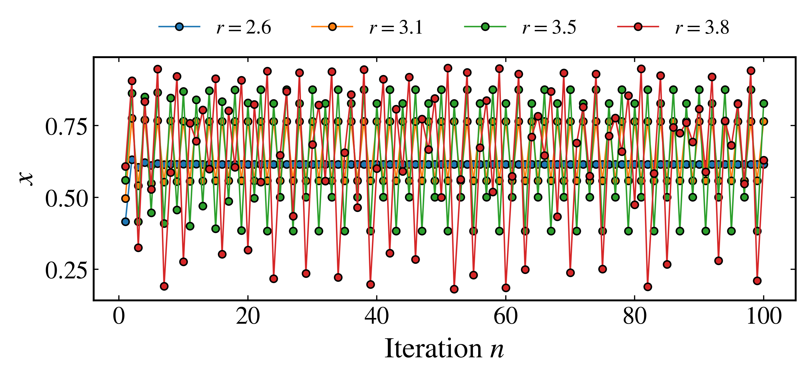
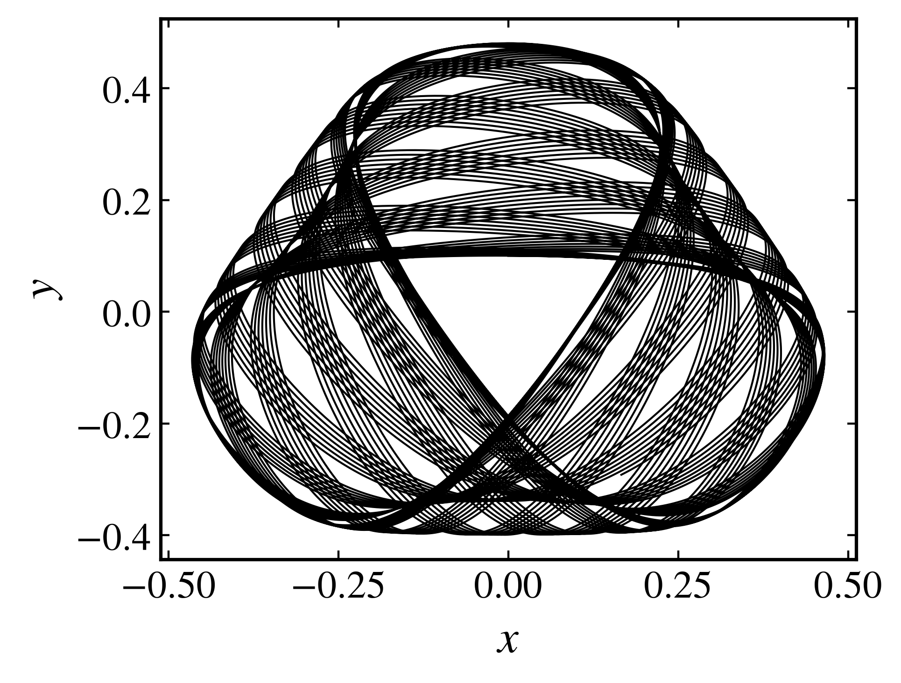

Quickstart
==========

This guide introduces the three system classes through small simulations you can run in Python or a notebook. Each example includes its own imports and produces a plot. If you have not installed **pynamicalsys**, start with :doc:`installation`.

The workflow is the same in each case: choose a model, specify its parameters and initial state, then calculate and visualize a trajectory. For a discrete map, ``total_time`` counts iterations. For continuous and Hamiltonian systems, it specifies the duration in the system's time units.

Discrete maps: compare parameter values
---------------------------------------

A discrete map advances the state one iteration at a time. The logistic map has one state variable, :math:`x`, and one parameter, :math:`r`:

.. math::

    x_{n+1} = r x_n(1-x_n).

Use ``DiscreteDynamicalSystem`` to compare four parameter values, starting from the same initial condition :math:`x_0 = 0.2`:

.. code-block:: python

    import matplotlib.pyplot as plt
    from pynamicalsys import DiscreteDynamicalSystem as dds, PlotStyler

    system = dds(model="logistic map")
    parameter_values = [2.6, 3.1, 3.5, 3.8]
    total_time = 100

    ps = PlotStyler()
    ps.apply_style()
    fig, ax = plt.subplots(figsize=(8, 4))
    for r in parameter_values:
        trajectory = system.trajectory(0.2, total_time, parameters=[r])
        ax.plot(range(1, total_time + 1), trajectory, "o-", label=f"$r = {r}$")

    ax.set_xlabel("Iteration $n$")
    ax.set_ylabel("$x$")
    ax.legend(ncol=4, loc="lower center", bbox_to_anchor=(0.5, 1.0), frameon=False)
    fig.tight_layout()
    plt.show()

    Changing the parameter changes the long-term behavior of the logistic map.

At :math:`r = 2.6`, the trajectory approaches a fixed point. At :math:`r = 3.1` and :math:`r = 3.5`, it settles into cycles of two and four points. The :math:`r = 3.8` example illustrates irregular motion in a chaotic regime.

For this one-dimensional map, each call returns an array of shape ``(100,)``. The first entry is :math:`x_1`, after one iteration, rather than the initial condition :math:`x_0`. Passing ``parameters=[r]`` applies that value to the current call. To reuse a parameter value across calls, store it with ``system.set_parameters([r])``.

Inspect a built-in model
~~~~~~~~~~~~~~~~~~~~~~~~

The ``info`` property helps you check a built-in model's equation and the order of its parameters. For the logistic-map object above:

.. code-block:: python

    print(system.info["parameters"])
    print(system.info["equation_readable"])

.. code-block:: text

    ['r']
    xₙ₊₁ = rxₙ(1−xₙ)

In a notebook, put ``system.info["equation"]`` on the last line of a cell to display the equation as typeset mathematics when IPython is available. See :doc:`installation` for notebook support. The full ``system.info`` dictionary also contains the model's description and other metadata.

Continue with the :doc:`discrete-system tutorial <dds_tutorial>` for custom maps, ensembles, bifurcation diagrams, and chaos indicators.

Continuous systems: integrate an equation of motion
---------------------------------------------------

A continuous system specifies how the state changes with time through differential equations. For example, the Lorenz system is

.. math::

    \begin{aligned}
        \dot{x} &= \sigma(y-x), \\
        \dot{y} &= x(\rho-z)-y, \\
        \dot{z} &= xy-\beta z.
    \end{aligned}

Use ``ContinuousDynamicalSystem`` with :math:`\sigma = 10`, :math:`\rho = 28`, and :math:`\beta = 8/3`. Here we explicitly choose the fourth-order Runge-Kutta integrator, ``rk4``, with a fixed step of :math:`0.01` time units:

.. code-block:: python

    import matplotlib.pyplot as plt
    from pynamicalsys import ContinuousDynamicalSystem as cds, PlotStyler

    system = cds(model="lorenz system")
    system.set_parameters([10.0, 28.0, 8.0 / 3.0])  # sigma, rho, beta
    system.integrator("rk4", time_step=0.01)

    initial_state = [0.1, 0.1, 0.1]  # x, y, z
    trajectory = system.trajectory(initial_state, total_time=100.0)

    time = trajectory[:, 0]
    x = trajectory[:, 1]
    z = trajectory[:, 3]

    ps = PlotStyler()
    ps.apply_style()
    fig, ax = plt.subplots(1, 2, figsize=(10, 4))
    ax[0].plot(time, x, "k")
    ax[0].set_xlabel("Time $t$")
    ax[0].set_ylabel("$x(t)$")
    ax[1].plot(x, z, "k", lw=0.5)
    ax[1].set_xlabel("$x$")
    ax[1].set_ylabel("$z$")
    fig.tight_layout()
    plt.show()

.. figure:: images/quickstart_lorenz.png
    :align: center
    :width: 100%

    The same Lorenz trajectory shown as a time series and a projection onto the x-z plane.

Each row of the output contains ``[time, x, y, z]``. With these settings, the array has shape ``(10001, 4)``, including the initial state at time zero. The left plot shows when changes occur, while the right plot shows the trajectory's structure in state space.

The parameter order can be checked with ``system.info["parameters"]``. A smaller integration step can help assess numerical convergence, but it also requires more work. See the :doc:`continuous-system tutorial <cds_tutorial>` for adaptive integration, multiple initial conditions, and further analysis.

Hamiltonian systems: evolve positions and momenta
-------------------------------------------------

Use ``HamiltonianSystem`` when your model is expressed in terms of generalized coordinates :math:`\mathbf{q}` and momenta :math:`\mathbf{p}`. The built-in Hénon-Heiles model has two degrees of freedom and Hamiltonian

.. math::

    H(x,y,p_x,p_y) = \frac{p_x^2+p_y^2}{2}
        + \frac{x^2+y^2}{2} + x^2y - \frac{y^3}{3}.

Its equations of motion are

.. math::

    \begin{aligned}
        \dot{x} &= p_x, & \dot{y} &= p_y, \\
        \dot{p}_x &= -x-2xy, & \dot{p}_y &= -y-x^2+y^2.
    \end{aligned}

The example below chooses :math:`x=0`, :math:`y=0.1`, and :math:`p_y=0`, then calculates the positive :math:`p_x` consistent with energy :math:`E=1/8`. We use the fourth-order Yoshida symplectic integrator, ``svy4``:

.. code-block:: python

    import numpy as np
    import matplotlib.pyplot as plt
    from pynamicalsys import HamiltonianSystem as hs, PlotStyler

    system = hs(model="henon heiles")
    system.integrator("svy4", time_step=0.01)

    energy = 1.0 / 8.0
    x, y, py = 0.0, 0.1, 0.0
    potential = (x**2 + y**2) / 2.0 + x**2 * y - y**3 / 3.0
    px = np.sqrt(2.0 * (energy - potential) - py**2)
    q = [x, y]
    p = [px, py]

    trajectory = system.trajectory(q, p, total_time=500.0)

    ps = PlotStyler(fontsize=18)
    ps.apply_style()
    fig, ax = plt.subplots(figsize=(5, 4))
    ax.plot(trajectory[:, 1], trajectory[:, 2], "k", lw=0.75)
    ax.set_xlabel("$x$")
    ax.set_ylabel("$y$")
    fig.tight_layout()
    plt.show()

    A Hénon-Heiles trajectory projected onto the coordinate plane.

Positions and momenta are passed separately. The output combines them into rows of ``[time, x, y, px, py]``, including the initial state. Here its shape is ``(50001, 5)``. This built-in model has no adjustable parameters, so no parameter list is needed.

The Yoshida method applies to separable Hamiltonians of the form :math:`H(\mathbf{q},\mathbf{p}) = T(\mathbf{p}) + V(\mathbf{q})`. The :doc:`Hamiltonian-system tutorial <hs_tutorial>` explains the available integrators, custom Hamiltonians, and how to check energy error. The :py:meth:`poincare_section <pynamicalsys.core.hamiltonian_systems.HamiltonianSystem.poincare_section>` method provides another way to examine phase-space structure.

Next steps
----------

- Use the tutorials linked above to explore the system type relevant to your work.
- Consult the :doc:`discrete <api/dds>`, :doc:`continuous <api/cds>`, and :doc:`Hamiltonian <api/hs>` API references for method arguments and return values.
- Explore :doc:`PlotStyler <api/plot_styler>` for consistent plot formatting. The examples above apply its default style before creating their figures.
